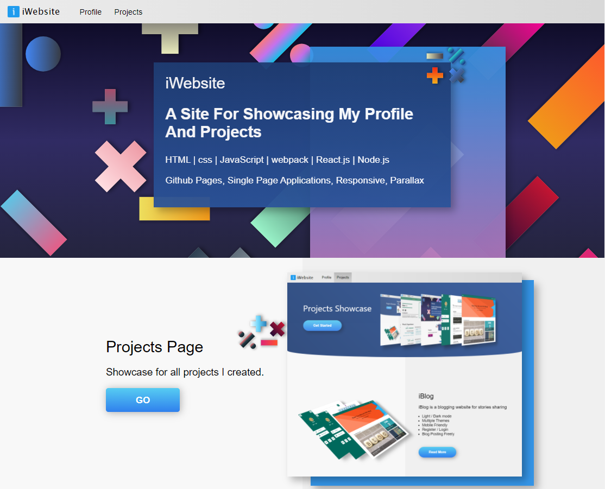

# iWebsite
### A website to showcase my profile and projects
---

## 

## Features
- Responsive 
  With responsive feature, views differ for devices among browser, mobile, tablet, making user friendly. 
   
- Parallax 
  You can have an awesome experience of parallax design. 
   
- Auto Position Trace 
  (Profile Page) The navigation bar could show the real time position of the section you are browsing. 
   
- Click and Jump 
  (Profile Page) The navigation bar could also help you to navigate to the section you want to browse. 
   
- Showing Animation 
  (Profile Page) It shows displaying animation for the sections when scrolling down. 
   
- Easy to Top Button 
  (Profile and Project Detail Page) With navigate to top button, it saves your time to navigate back to top. 
   

## Stack
- Use `React.js` as front-end framework
- Use `webpack.js` as module bundler
- Use `media query` for responsive design
- Use `scss` for css extension
- Use `Github Pages` for website hosting