In our previous article, we introduced symmetric encryption and gave AES a brief mention. But AES isn't just a single algorithm — it has multiple **modes of operation**, each with different security properties and use cases.

Today, we'll systematically explore all major AES modes, understand why ECB is dangerous, how CBC solves its problems, why CTR turns block ciphers into stream ciphers, and finally dive deep into **GCM** — the gold standard for authenticated encryption.

---

## Quick Recap: What is AES?

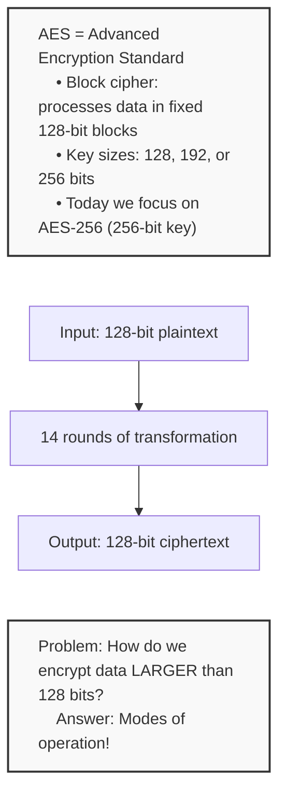

---

## All AES Modes Overview

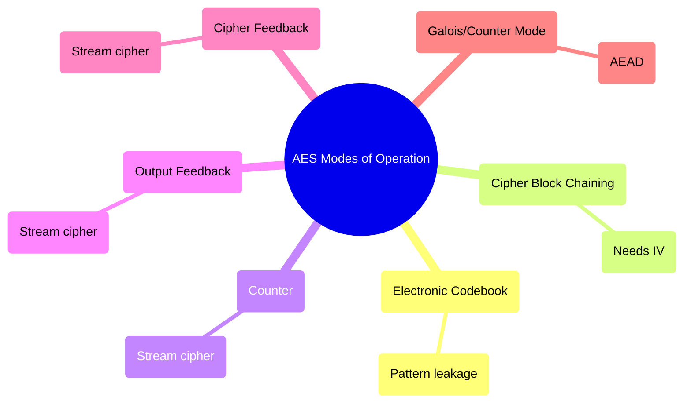

---

## Mode 1: ECB (Electronic Codebook) — The Danger Zone

### How ECB Works

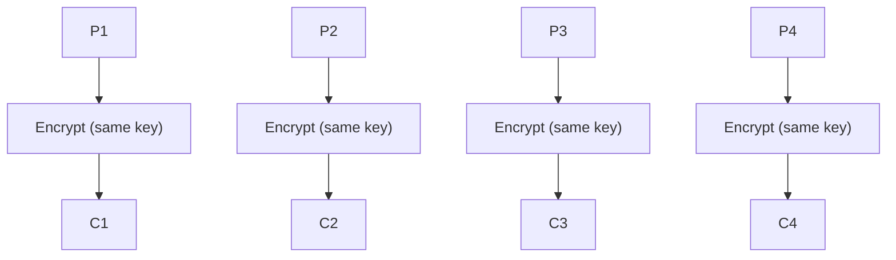

### The Critical Flaw: Pattern Leakage

ECB's problem is simple: **identical plaintext blocks produce identical ciphertext blocks**.

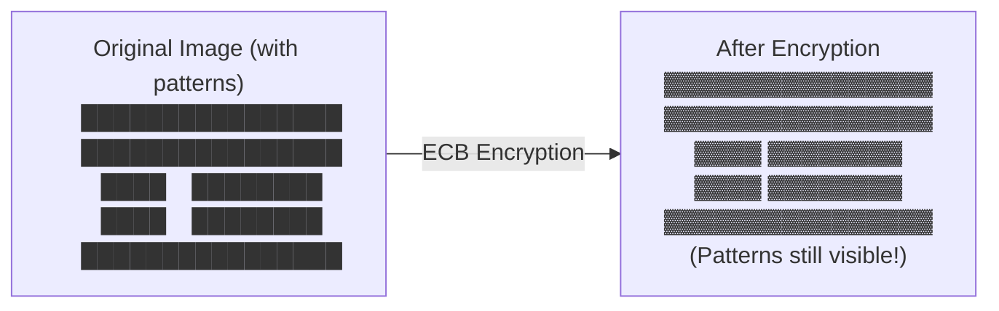

### When ECB Might Be Acceptable

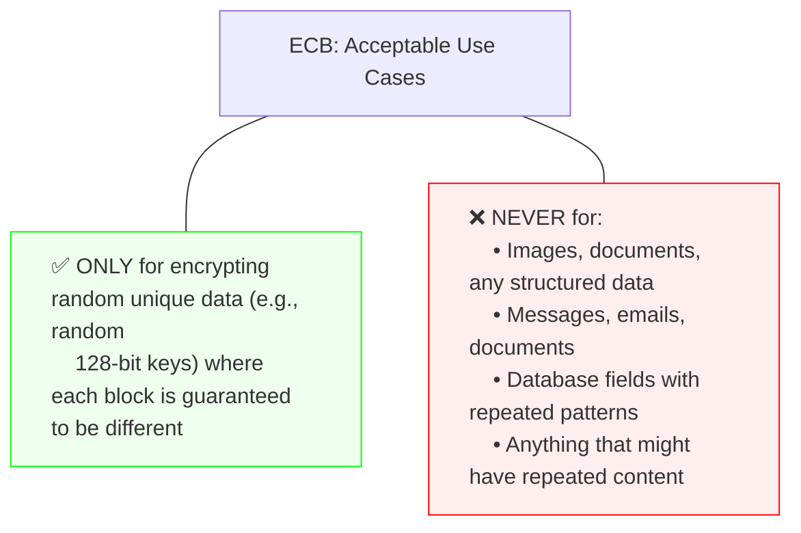

---

## Mode 2: CBC (Cipher Block Chaining) — Chaining Blocks Together

### How CBC Works

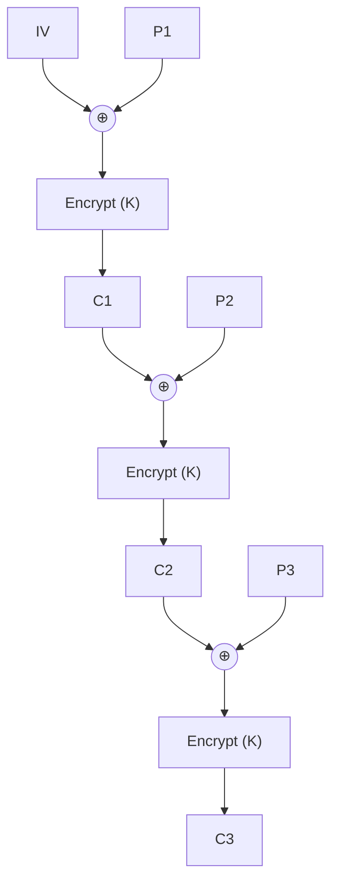

### CBC Encryption Formula

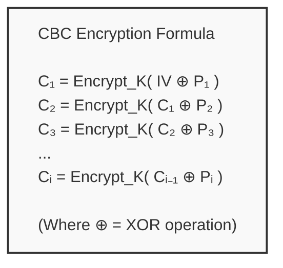

### CBC Decryption (The Reverse Process)

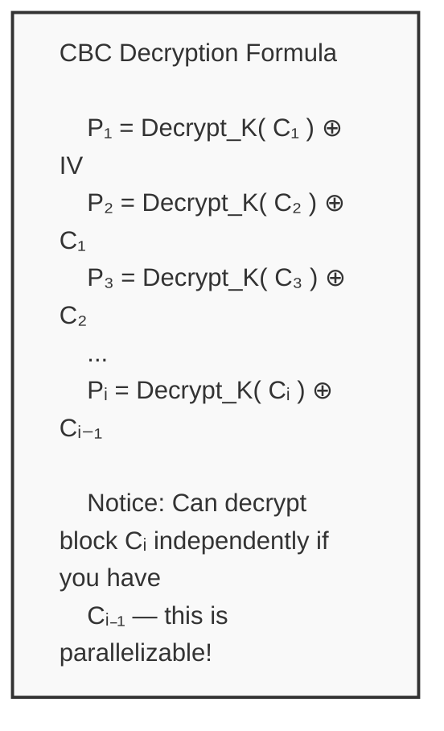

### CBC Properties

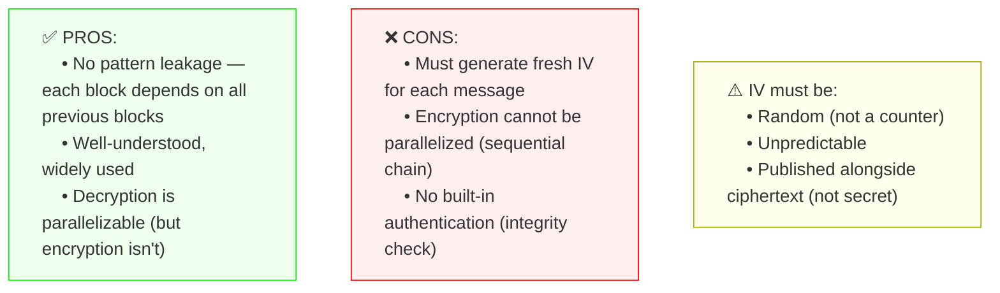

### CBC Padding (PKCS#7)

Since AES works on 128-bit blocks, plaintext that's not a multiple of 128 bits needs padding:

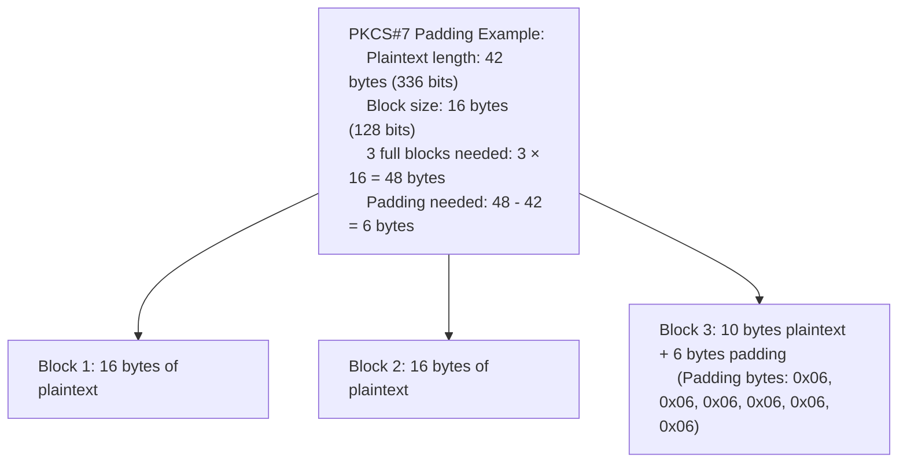

---

## Mode 3: CTR (Counter) — Turning Block Cipher into Stream Cipher

### The Key Insight

Instead of chaining blocks, CTR uses a **counter** to generate a pseudorandom keystream:

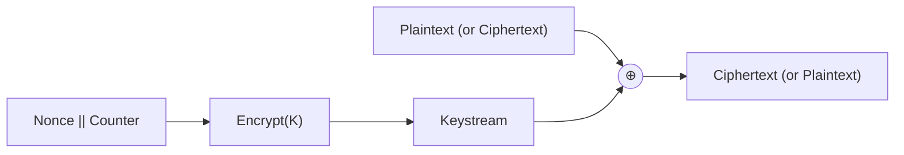

### How CTR Works

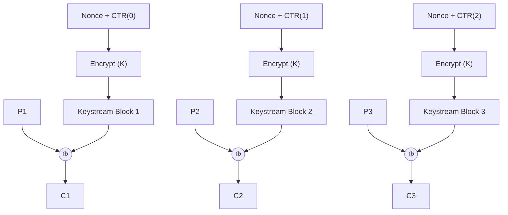

### CTR Decryption (Same Operation!)

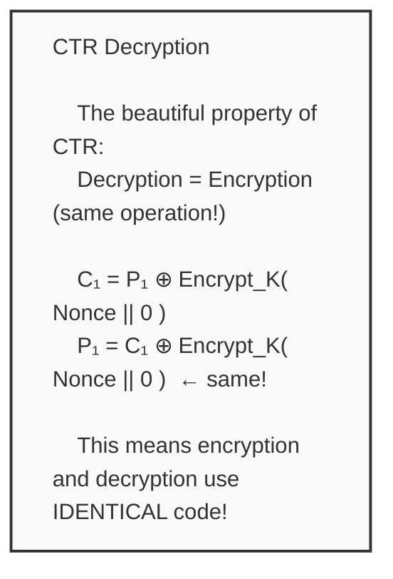

### CTR Properties

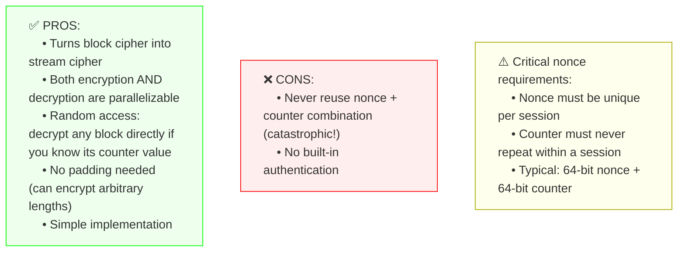

---

## Mode 4: GCM (Galois/Counter Mode) — The Gold Standard

Now we arrive at **GCM** — the mode you'll encounter most in modern secure systems: TLS 1.3, SSH, IPsec, and more.

### What Makes GCM Special?

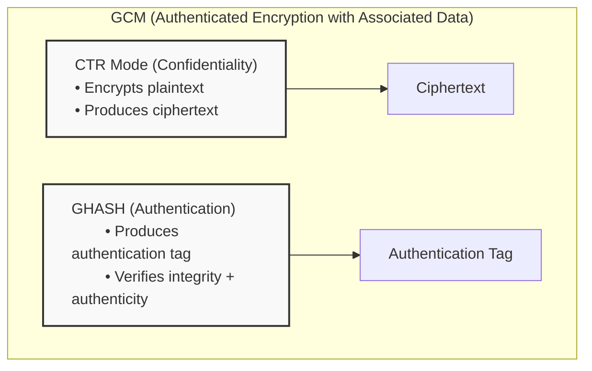

### GCM Components Overview

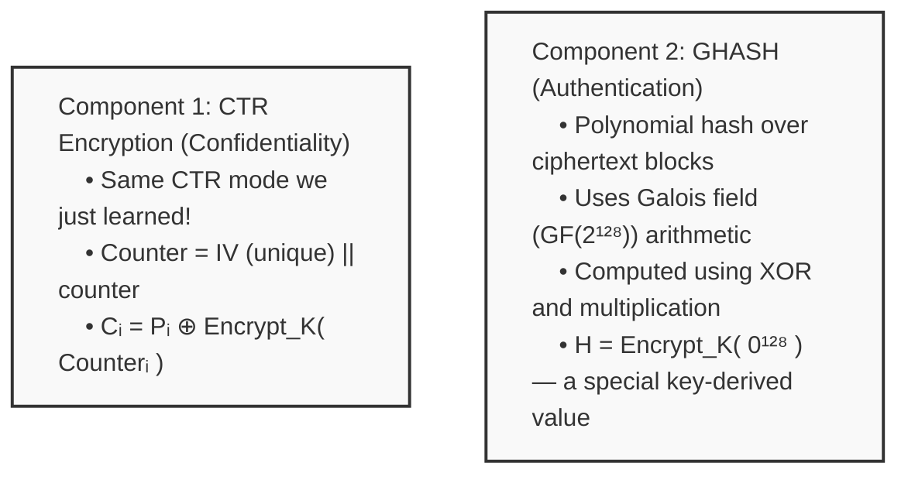

---

## Deep Dive: GHASH

### The Galois Field GF(2¹²⁸)

GHASH uses special arithmetic in GF(2¹²⁸) — a finite field where:

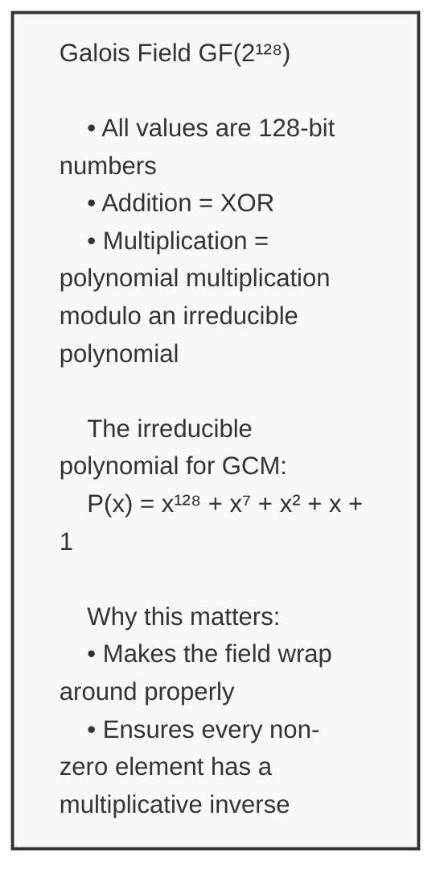

### GHASH Formula

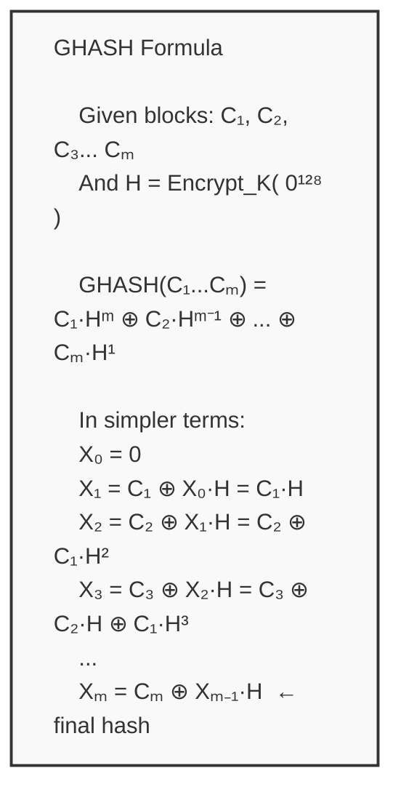

### Visualizing GHASH

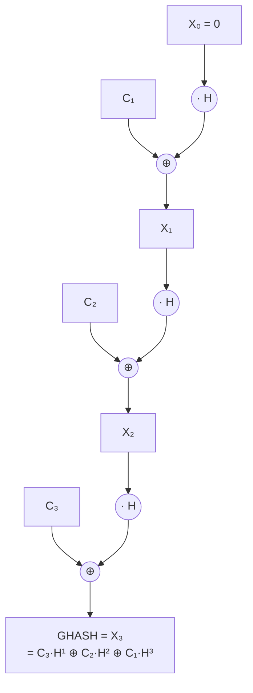

---

## GCM Encryption & Authentication Flow

### Complete GCM Process

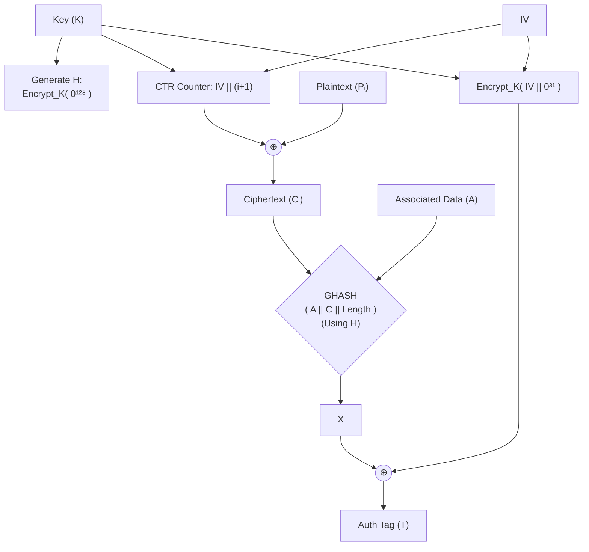

### GCM Decryption & Verification

```mermaid
flowchart TD
    subgraph Verify[1. Verify Authentication]
        C["Ciphertext (C)"] --> GH{"Recompute GHASH
        (Using A & C)"}
        AAD["Associated Data (A)"] --> GH
        GH --> X["Expected X"]
        X --> XOR2((⊕))
        TAG_ENC["Encrypt_K( IV || 0³¹ )"] --> XOR2
        XOR2 --> EXPECT["Expected Tag"]
        T["Received Tag (T)"] --> COMP{T == Expected Tag?}
        EXPECT --> COMP
    end
    COMP -- YES --> Decrypt["2. Decrypt with CTR"]
    COMP -- NO --> Reject["2. REJECT immediately
Don't decrypt!"]
    
    style Reject fill:#fee,stroke:#f00
    style Decrypt fill:#efe,stroke:#0f0
```

### The Critical Property: Hash Subkey H

```mermaid
flowchart TD
    classDef box fill:#f9f9f9,stroke:#333,stroke-width:2px,text-align:left;
    A["Hash Subkey H = Encrypt_K(0¹²⁸)
    
    Input: 128-bit block of all zeros
    ↓ (AES-256 encryption using K)
    Output: H (random-looking 128-bit value)
    
    Properties:
    • Used for ALL GHASH operations in a session
    • GCM spec REQUIRES H ≠ 0 (if H=0, GHASH is trivial/vulnerable)
    • H should be unpredictable"]:::box
```

---

## Associated Data (AAD) in GCM

### What is AAD?

One powerful feature of GCM is **Associated Data** — data that is authenticated but NOT encrypted:

```mermaid
flowchart TD
    A["Associated Data (A)
    Header, Sequence #, Timestamps..."] --> GH["GHASH( A || C )"]
    C["Ciphertext (C)
    Encrypted Payload (visible to eavesdropper)"] --> GH
    GH --> T["Tag (T)"]
```

### Practical AAD Use Cases

```mermaid
mindmap
  root((AAD Use Cases))
    TLS Records
      AAD = sequence number, protocol version
      C = encrypted payload
      Prevents reorder/replay
    SSH Channels
      AAD = channel ID, session ID
      C = encrypted message
      Ensures message correct session
    File Encryption
      AAD = file header/metadata
      C = encrypted file content
      Metadata tamper detection
```

---

## GCM Security Properties

```mermaid
flowchart TB
    classDef box fill:#f9f9f9,stroke:#333,stroke-width:2px,text-align:left;
    classDef warnBox fill:#ffe,stroke:#aa0,text-align:left;

    A["✅ CONFIDENTIALITY
    • CTR mode provides semantic security
    • Same plaintext → different ciphertext (with new IV)"]:::box

    B["✅ AUTHENTICATION
    • GHASH provides integrity + authenticity
    • Tag verification required before decryption
    • Prevents forgeries"]:::box

    C["✅ AEAD
    • Encrypts data while authenticating both ciphertext AND unencrypted associated data"]:::box

    D["⚠️ IMPORTANT CONSTRAINTS:
    IV (Nonce):
    • MUST be unique per key
    • Recommended: 96 bits (12 bytes)
    • NEVER reuse IV with same key! (Max 2³² invocations)
    
    Tag Length:
    • Default: 128 bits (16 bytes)
    • Truncation weakens authentication strength"]:::warnBox
```

---

## IV Reuse: The Catastrophic Failure

```mermaid
flowchart TD
    A["IV Reuse in GCM: The Forbidden Mistake"]
    B["Message 1: C₁ = P₁ ⊕ KS"]
    C["Message 2: C₂ = P₂ ⊕ KS"]
    A --> B
    A --> C
    B & C --> D["Attacker Computes:
    C₁ ⊕ C₂ = P₁ ⊕ P₂"]
    D --> E["Disaster!
    Attacker can XOR known plaintext against recovered keystream
    and decrypt ALL messages encrypted with this IV!"]
    style E fill:#fee,stroke:#f00
```

---

## Complete Mode Comparison

```mermaid
mindmap
  root((AES Modes))
    ECB
      Parallel Encrypt: ✅
      Built-in Auth: ❌
      Padding Needed: ✅
      Status: ❌ Never use
    CBC
      Parallel Encrypt: ❌
      Built-in Auth: ❌
      Padding Needed: ✅
      Status: ✅ Legacy systems
    CTR
      Parallel Encrypt: ✅
      Built-in Auth: ❌
      Padding Needed: ❌
      Status: ✅ Streaming
    OFB / CFB
      Parallel Encrypt: ❌
      Built-in Auth: ❌
      Padding Needed: ❌
      Status: ⚠️ Rarely used
    GCM
      Parallel Encrypt: ✅
      Built-in Auth: ✅ AEAD
      Padding Needed: ❌
      Status: ✅ RECOMMENDED Standard
    CCM
      Parallel Encrypt: ❌
      Built-in Auth: ✅ AEAD
      Padding Needed: ✅
      Status: ⚠️ Complex
```

### When to Use What

```mermaid
mindmap
  root((Mode Selection Guide))
    GCM (AES-256-GCM)
      TLS 1.3, SSH, IPsec, WireGuard
      Need both encryption + authentication
      Modern applications
    CTR (AES-256-CTR)
      Only need encryption (no auth)
      Combine with separate HMAC if needed
    CBC (AES-256-CBC)
      Legacy systems only
      Legacy TLS
    ECB
      NEVER for real data
```

---

## Summary

```mermaid
mindmap
  root((Key Takeaways))
    1. AES is a block cipher
    2. ECB ❌ NEVER use
    3. CBC ✅ Legacy encrypts well
    4. CTR ✅ Stream-like, parallel
    5. GCM ✅ THE standard
      Confidentiality
      Authentication
      Integrity
      Associated Data
    6. NEVER reuse IV!
```

Understanding these modes helps you make informed decisions about encryption in your applications — and knowing why GCM is the preferred choice in modern protocols like TLS 1.3.

---

- - -

喺上篇文我哋介紹咗對稱加密同埋簡單提到 AES。但係 AES 唔係單一嘅算法——佢有多種**操作模式**，每一種都有唔同嘅安全特性同應用場景。

今日，我哋會系統地探索所有主要嘅 AES 模式，理解點解 ECB 係危險嘅、CBC 點樣解決佢嘅問題、 CTR 點樣將區塊加密變成流加密、然後深入探討 **GCM** —— 認證加密嘅黃金標準。

---

## 快速回顧：咩係 AES？

```mermaid
flowchart TD
    classDef infoBox fill:#f9f9f9,stroke:#333,stroke-width:2px,text-align:left;
    Info["AES = Advanced Encryption Standard (進階加密標準)
    • 區塊加密：固定以 128 bits 區塊處理數據
    • 密鑰大小：128、192 或 256 bits
    • 今篇集中講 AES-256（256-bit 密鑰）"]:::infoBox

    P["輸入：128-bit 明文"]
    T["14 輪轉換"]
    C["輸出：128-bit 密文"]

    Q["問題：大過 128 bits 嘅數據點樣加密？
    答案：操作模式！"]:::infoBox

    Info ~~~ P
    P --> T
    T --> C
    C ~~~ Q
```

---

## 所有 AES 模式概覽

```mermaid
mindmap
  root((AES 操作模式))
    ECB (電子密碼本)
      ❌ 不安全 (模式洩漏)
    CBC (密碼塊鏈)
      ✅ 安全 (需要 IV)
    CTR (計數器)
      ✅ 安全 (流加密)
    OFB (輸出反饋)
      ✅ 安全 (流加密)
    CFB (密碼反饋)
      ✅ 安全 (流加密)
    GCM (Galois/Counter Mode)
      ✅ 安全 + ✅ 認證 (AEAD)
```

---

## 模式 1：ECB（電子密碼本）— 危險地帶

### ECB 點運作

```mermaid
flowchart TD
    P1["P1"] --> E1["加密 (同一密鑰)"] --> C1["C1"]
    P2["P2"] --> E2["加密 (同一密鑰)"] --> C2["C2"]
    P3["P3"] --> E3["加密 (同一密鑰)"] --> C3["C3"]
    P4["P4"] --> E4["加密 (同一密鑰)"] --> C4["C4"]
```

### 關鍵缺陷：模式洩漏

ECB 的問題好簡單：**相同嘅明文區塊會產生相同嘅密文區塊**。

```mermaid
flowchart LR
    A["原始圖片（有圖案）
    ████████████████
    ████████████████
    ████    ████████
    ████    ████████
    ████████████████"] -->|ECB 加密| B["加密後
    ▓▓▓▓▓▓▓▓▓▓▓▓▓▓▓▓
    ▓▓▓▓▓▓▓▓▓▓▓▓▓▓▓▓
    ▓▓▓▓    ▓▓▓▓▓▓▓▓
    ▓▓▓▓    ▓▓▓▓▓▓▓▓
    ▓▓▓▓▓▓▓▓▓▓▓▓▓▓▓▓
    (圖案仍然可見！)"]
```

### 幾時可以接受使用 ECB

```mermaid
flowchart TD
    classDef redBox fill:#fee,stroke:#f00,text-align:left;
    classDef greenBox fill:#efe,stroke:#0f0,text-align:left;

    A["ECB：可接受嘅使用場景"]
    A --- B["✅ 只係用於加密隨機唯一嘅數據（例如隨機 128-bit 密鑰）
    （每個區塊都保證唔同）"]:::greenBox
    A --- C["❌ 永遠唔好用於：
    • 圖片、文檔、任何結構化數據
    • 訊息、電郵、文檔
    • 有重複模式嘅數據庫欄位
    • 任何可能有重複內容嘅嘢"]:::redBox
```

---

## 模式 2：CBC（密碼塊鏈）— 將區塊鏈埋一齊

### CBC 點運作

```mermaid
flowchart TD
    IV["IV"] --> XOR1((⊕))
    P1["P1"] --> XOR1
    XOR1 --> E1["加密 (K)"]
    E1 --> C1["C1"]

    C1 --> XOR2((⊕))
    P2["P2"] --> XOR2
    XOR2 --> E2["加密 (K)"]
    E2 --> C2["C2"]

    C2 --> XOR3((⊕))
    P3["P3"] --> XOR3
    XOR3 --> E3["加密 (K)"]
    E3 --> C3["C3"]
```

### CBC 加密公式

```mermaid
flowchart TD
    classDef infoBox fill:#f9f9f9,stroke:#333,stroke-width:2px,text-align:left;
    A["CBC 加密公式
    
    C₁ = Encrypt_K( IV ⊕ P₁ )
    C₂ = Encrypt_K( C₁ ⊕ P₂ )
    C₃ = Encrypt_K( C₂ ⊕ P₃ )
    ...
    Cᵢ = Encrypt_K( Cᵢ₋₁ ⊕ Pᵢ )
    
    （其中 ⊕ = XOR 運算）"]:::infoBox
```

### CBC 解密（反向過程）

```mermaid
flowchart TD
    classDef infoBox fill:#f9f9f9,stroke:#333,stroke-width:2px,text-align:left;
    A["CBC 解密公式
    
    P₁ = Decrypt_K( C₁ ) ⊕ IV
    P₂ = Decrypt_K( C₂ ) ⊕ C₁
    P₃ = Decrypt_K( C₃ ) ⊕ C₂
    ...
    Pᵢ = Decrypt_K( Cᵢ ) ⊕ Cᵢ₋₁
    
    注意：如果你有 Cᵢ₋₁，可以獨立解密 Cᵢ ——
    呢個係可以並行化嘅！"]:::infoBox
```

### CBC 特性

```mermaid
flowchart TB
    classDef redBox fill:#fee,stroke:#f00,text-align:left;
    classDef greenBox fill:#efe,stroke:#0f0,text-align:left;
    classDef warnBox fill:#ffe,stroke:#aa0,text-align:left;

    A["✅ 優點：
    • 冇模式洩漏 —— 每個區塊依賴所有之前嘅區塊
    • 廣泛理解，廣泛使用
    • 解密可以並行化（但加密唔可以）"]:::greenBox

    B["❌ 缺點：
    • 每個訊息必須生成新 IV
    • 加密無法並行化（順序鏈）
    • 冇內置認證（完整性檢查）"]:::redBox

    C["⚠️ IV 必須：
    • 隨機（唔係計數器）
    • 不可預測
    • 與密文一起發布（唔係秘密）"]:::warnBox
```

### CBC 填充（PKCS#7）

因為 AES 以 128-bit 區塊運作，唔係 128 倍數嘅明文需要填充：

```mermaid
flowchart TD
    classDef default text-align:left;
    A["PKCS#7 填充例子：
    明文長度：42 bytes (336 bits)
    區塊大小：16 bytes (128 bits)
    需要 3 個完整區塊：3 × 16 = 48 bytes
    需要填充：48 - 42 = 6 bytes"]
    
    A --> B["區塊 1：16 bytes 明文"]
    A --> C["區塊 2：16 bytes 明文"]
    A --> D["區塊 3：10 bytes 明文 + 6 bytes 填充
    (填充字節：0x06, 0x06, 0x06, 0x06, 0x06, 0x06)"]
```

---

## 模式 3：CTR（計數器）— 將區塊加密變成流加密

### 關鍵洞察

CTR 唔係鏈接區塊，而係用**計數器**來生成偽隨機密鑰流：

```mermaid
flowchart LR
    A["Nonce || 計數器"] --> B["加密(K)"]
    B --> C["Keystream"]
    P["明文（或密文）"] --> XOR((⊕))
    C --> XOR
    XOR --> D["密文（或明文）"]
```

### CTR 點運作

```mermaid
flowchart TD
    N1["Nonce + CTR(0)"] --> E1["加密 (K)"] --> KS1["Keystream 區塊 1"]
    P1["P1"] --> XOR1((⊕))
    KS1 --> XOR1 --> C1["C1"]

    N2["Nonce + CTR(1)"] --> E2["加密 (K)"] --> KS2["Keystream 區塊 2"]
    P2["P2"] --> XOR2((⊕))
    KS2 --> XOR2 --> C2["C2"]

    N3["Nonce + CTR(2)"] --> E3["加密 (K)"] --> KS3["Keystream 區塊 3"]
    P3["P3"] --> XOR3((⊕))
    KS3 --> XOR3 --> C3["C3"]
```

### CTR 解密（相同操作！）

```mermaid
flowchart TD
    classDef infoBox fill:#f9f9f9,stroke:#333,stroke-width:2px,text-align:left;
    A["CTR 解密
    
    CTR 嘅漂亮特性：
    解密 = 加密（相同操作！）

    C₁ = P₁ ⊕ Encrypt_K( Nonce || 0 )
    P₁ = C₁ ⊕ Encrypt_K( Nonce || 0 )  ← 一樣！

    呢個意味住加密同解密使用完全相同嘅代碼！"]:::infoBox
```

### CTR 特性

```mermaid
flowchart TB
    classDef redBox fill:#fee,stroke:#f00,text-align:left;
    classDef greenBox fill:#efe,stroke:#0f0,text-align:left;
    classDef warnBox fill:#ffe,stroke:#aa0,text-align:left;

    A["✅ 優點：
    • 將區塊加密變成流加密
    • 加密同解密都可以並行化
    • 隨機訪問：如果知計數器值可以直接解密任何區塊
    • 唔需要填充（可以加密任意長度）
    • 實現簡單"]:::greenBox

    B["❌ 缺點：
    • 永遠唔好重用 nonce + 計數器組合（災難性！）
    • 冇內置認證"]:::redBox

    C["⚠️ 關鍵 nonce 要求：
    • Nonce 每個 session 必須唯一
    • 計數器喺每個 session 內永遠唔可以重複
    • 通常：64-bit nonce + 64-bit 計數器"]:::warnBox
```

---

## 模式 4：GCM（Galois/Counter Mode）— 黃金標準

而家到我哋嘅 **GCM** —— 你喺現代安全系統中最常遇到嘅模式：TLS 1.3、SSH、IPsec 等等。

### 咩係 GCM 咁特別？

```mermaid
flowchart TD
    classDef box fill:#f9f9f9,stroke:#333,stroke-width:2px,text-align:left;
    subgraph "GCM (帶關聯數據嘅認證加密)"
        direction LR
        CTR["CTR 模式（保密性）
        • 加密明文
        • 產生密文"]:::box
        GHASH["GHASH（認證）
        • 產生認證標籤
        • 驗證完整性 + 真實性"]:::box
        
        CTR --> Out1["密文"]
        GHASH --> Out2["認證標籤"]
    end
```

### GCM 組件概覽

```mermaid
flowchart TD
    classDef box fill:#f9f9f9,stroke:#333,stroke-width:2px,text-align:left;
    A["組件 1：CTR 加密（保密性）
    • 同我哋之前學嘅 CTR 模式一樣！
    • 計數器 = IV (unique) || counter
    • Cᵢ = Pᵢ ⊕ Encrypt_K( Counterᵢ )"]:::box
    
    B["組件 2：GHASH（認證）
    • 喺密文區塊上做多項式雜湊
    • 使用 Galois field (GF(2¹²⁸)) 算術
    • 用 XOR 同乘法計算
    • H = Encrypt_K( 0¹²⁸ ) — 一個由密鑰派生嘅特殊值"]:::box
```

---

## 深入研究：GHASH

### Galois Field GF(2¹²⁸)

GHASH 使用 GF(2¹²⁸) 中嘅特殊算術——一個有限域，其中：

```mermaid
flowchart TD
    classDef box fill:#f9f9f9,stroke:#333,stroke-width:2px,text-align:left;
    A["Galois Field GF(2¹²⁸)
    
    • 所有值都係 128-bit 數字
    • 加法 = XOR
    • 乘法 = 多項式乘法 modulo 一個不可約多項式
    
    GCM 嘅不可約多項式：
    P(x) = x¹²⁸ + x⁷ + x² + x + 1
    
    點解咁重要：
    • 令個域正確咁「環繞」
    • 確保每個非零元素都有乘法逆元"]:::box
```

### GHASH 公式

```mermaid
flowchart TD
    classDef box fill:#f9f9f9,stroke:#333,stroke-width:2px,text-align:left;
    A["GHASH 公式
    
    給定區塊：C₁, C₂, C₃... Cₘ
    同 H = Encrypt_K( 0¹²⁸ )
    
    GHASH(C₁...Cₘ) = C₁·Hᵐ ⊕ C₂·Hᵐ⁻¹ ⊕ ... ⊕ Cₘ·H¹
    
    簡單啲嚟講：
    X₀ = 0
    X₁ = C₁ ⊕ X₀·H = C₁·H
    X₂ = C₂ ⊕ X₁·H = C₂ ⊕ C₁·H²
    X₃ = C₃ ⊕ X₂·H = C₃ ⊕ C₂·H ⊕ C₁·H³
    ...
    Xₘ = Cₘ ⊕ Xₘ₋₁·H  ← 最終雜湊"]:::box
```

### 可視化 GHASH

```mermaid
flowchart TD
    X0["X₀ = 0"] --> M1(("· H"))
    C1["C₁"] --> XOR1((⊕))
    M1 --> XOR1
    XOR1 --> X1["X₁"]

    X1 --> M2(("· H"))
    C2["C₂"] --> XOR2((⊕))
    M2 --> XOR2
    XOR2 --> X2["X₂"]

    X2 --> M3(("· H"))
    C3["C₃"] --> XOR3((⊕))
    M3 --> XOR3
    XOR3 --> X3["GHASH = X₃
= C₃·H¹ ⊕ C₂·H² ⊕ C₁·H³"]
```

---

## GCM 加密同認證流程

### 完整 GCM 過程

```mermaid
flowchart TD
    K["密鑰 (K)"] --> H["計算 H: 
    Encrypt_K( 0¹²⁸ )"]
    
    IV["IV"] --> CTR["CTR 計數器: IV || (i+1)"]
    K --> CTR
    P["明文 (Pᵢ)"] --> XOR1((⊕))
    CTR --> XOR1
    XOR1 --> C["密文 (Cᵢ)"]
    
    AAD["關聯數據 (A)"] --> GH{"GHASH
    ( A || C || Length )
    (使用 H)"}
    C --> GH
    
    GH --> X["X"]
    IV --> TAG_ENC["Encrypt_K( IV || 0³¹ )"]
    K --> TAG_ENC
    TAG_ENC --> XOR2((⊕))
    X --> XOR2
    XOR2 --> T["認證標籤 (T)"]
```

### GCM 解密同驗證

```mermaid
flowchart TD
    subgraph Verify[1. 驗證認證]
        C["密文 (C)"] --> GH{"重新計算 GHASH
        (使用 A & C)"}
        AAD["關聯數據 (A)"] --> GH
        GH --> X["預期 X"]
        X --> XOR2((⊕))
        TAG_ENC["Encrypt_K( IV || 0³¹ )"] --> XOR2
        XOR2 --> EXPECT["預期標籤"]
        T["接收嘅標籤 (T)"] --> COMP{T == 預期標籤?}
        EXPECT --> COMP
    end
    COMP -- YES --> Decrypt["2. 用 CTR 模式解密"]
    COMP -- NO --> Reject["2. 立即拒絕
唔好解密！"]
    
    style Reject fill:#fee,stroke:#f00
    style Decrypt fill:#efe,stroke:#0f0
```

### 關鍵特性：雜湊子密鑰 H

```mermaid
flowchart TD
    classDef box fill:#f9f9f9,stroke:#333,stroke-width:2px,text-align:left;
    A["雜湊子密鑰 H = Encrypt_K(0¹²⁸)
    
    輸入：128-bit 全零區塊
    ↓ (使用 K 進行 AES-256 加密)
    輸出：H (128-bit 隨機值)
    
    特性：
    • 用於 session 中所有 GHASH 操作
    • GCM 規範要求 H ≠ 0 (若 H=0，GHASH 將變得脆弱)
    • H 應該不可預測"]:::box
```

---

## GCM 中嘅關聯數據（AAD）

### 咩係 AAD？

GCM 嘅一個強大特性係**關聯數據**——被認證但唔被加密嘅數據：

```mermaid
flowchart TD
    A["關聯數據 (A)
    Header, Sequence #, Timestamps..."] --> GH["GHASH( A || C )"]
    C["密文 (C)
    加密 Payload (對竊聽者可見)"] --> GH
    GH --> T["標籤 (T)"]
```

### 實際 AAD 使用場景

```mermaid
mindmap
  root((AAD 使用場景))
    TLS 記錄
      AAD = 序列號、協議版本
      C = 加密嘅 payload
      防止重放攻擊
    SSH 通道
      AAD = 通道 ID、session ID
      C = 加密嘅訊息
      確保訊息屬於正確 session
    文件加密
      AAD = 文件頭/元數據
      C = 加密嘅文件內容
      元數據防篡改
```

---

## GCM 安全特性

```mermaid
flowchart TB
    classDef box fill:#f9f9f9,stroke:#333,stroke-width:2px,text-align:left;
    classDef warnBox fill:#ffe,stroke:#aa0,text-align:left;

    A["✅ 保密性
    • CTR 模式提供語義安全
    • 相同明文 → 不同密文（用新 IV）"]:::box

    B["✅ 認證
    • GHASH 提供完整性 + 真實性
    • 解密前必須驗證標籤
    • 防止偽造"]:::box

    C["✅ AEAD
    • 加密數據同時認證密文 AND 未加密嘅關聯數據"]:::box

    D["⚠️ 重要約束：
    IV (Nonce)：
    • 每個密鑰必須唯一
    • 推薦：96 bits（12 bytes）
    • 永遠唔好與相同密鑰重用 IV！（最大 2³² 次）
    
    標籤長度：
    • 預設：128 bits（16 bytes）
    • 截斷會削弱認證強度"]:::warnBox
```

---

## IV 重用：災難性失敗

```mermaid
flowchart TD
    A["GCM 中 IV 重用：禁忌嘅錯誤"]
    B["訊息 1：C₁ = P₁ ⊕ KS"]
    C["訊息 2：C₂ = P₂ ⊕ KS"]
    A --> B
    A --> C
    B & C --> D["攻擊者計算：
    C₁ ⊕ C₂ = P₁ ⊕ P₂"]
    D --> E["災難！
    攻擊者可以將已知明文與恢復嘅 keystream 做 XOR
    並解密所有用呢個 IV 加密嘅訊息！"]
    style E fill:#fee,stroke:#f00
```

---

## 完整模式比較

```mermaid
mindmap
  root((AES 模式))
    ECB
      並行加密：✅
      內置認證：❌
      需要填充：✅
      狀態：❌ 永遠唔用
    CBC
      並行加密：❌
      內置認證：❌
      需要填充：✅
      狀態：✅ 舊系統
    CTR
      並行加密：✅
      內置認證：❌
      需要填充：❌
      狀態：✅ 流式
    OFB / CFB
      並行加密：❌
      內置認證：❌
      需要填充：❌
      狀態：⚠️ 很少用
    GCM
      並行加密：✅
      內置認證：✅ AEAD
      需要填充：❌
      狀態：✅ 推薦標準
    CCM
      並行加密：❌
      內置認證：✅ AEAD
      需要填充：✅
      狀態：⚠️ 複雜
```

### 幾時用咩

```mermaid
mindmap
  root((模式選擇指南))
    GCM (AES-256-GCM)
      TLS 1.3、SSH、IPsec、WireGuard
      需要加密 + 認證
      現代應用
    CTR (AES-256-CTR)
      只需加密 (唔需認證)
      可配合獨立 HMAC
    CBC (AES-256-CBC)
      舊系統專用
      舊版 TLS
    ECB
      永遠唔好用於真實數據
```

---

## 總結

```mermaid
mindmap
  root((重點整理))
    1. AES 係區塊加密
    2. ECB ❌ 永遠唔好用
    3. CBC ✅ 舊式加密無認證
    4. CTR ✅ 快速並行流加密
    5. GCM ✅ 現代標準
      保密性
      認證
      完整性
      關聯數據
    6. 永遠唔好重用 IV！
```

理解呢啲模式幫助你喺應用中做出明智嘅加密決策——同埋理解點解 GCM 係 TLS 1.3 等現代協議中嘅首選。
