## Background: Why Do We Need Layout Components?

When building React applications with Material-UI (MUI), one of the first challenges you'll face is: **how do I arrange elements on the page?** Do I use CSS Flexbox? CSS Grid? Or rely on MUI's built-in layout system?

The answer is: **MUI provides three powerful layout components that handle most of your needs.** Understanding when to use each one will make your code cleaner and your development faster.

Today, we'll systematically explore MUI's three musketeers of layout:
- **Box**: The swiss army knife
- **Stack**: The one-dimensional layout expert
- **Grid**: The two-dimensional master

---

## The Layout Philosophy

Before diving into each component, let's understand MUI's overall approach:

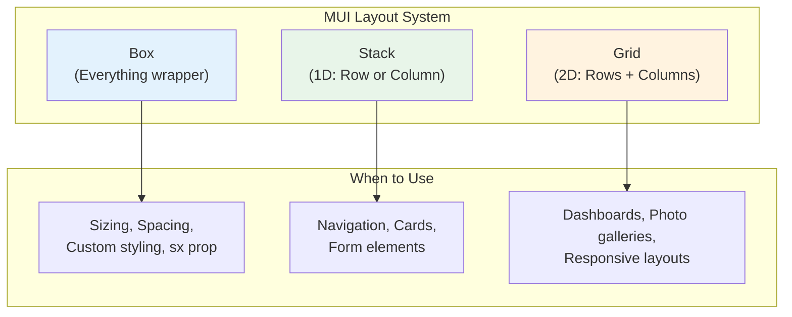

---

## Part 1: Box — The Swiss Army Knife

**Box** is MUI's most versatile component. It's essentially a thin wrapper around React's `div` element that provides access to MUI's styling system via the `sx` prop.

### Core Concept

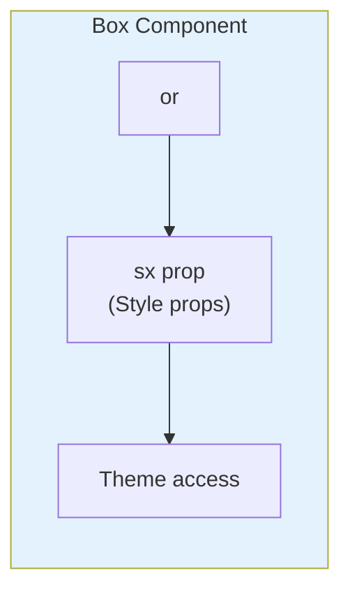

### What Can Box Do?


```jsx
// Basic usage
<Box>Content</Box>

// With styling
<Box
  sx={{
    width: 300,
    height: 200,
    bgcolor: 'primary.main',
    p: 2,
    borderRadius: 1,
    boxShadow: 3
  }}
>
  Styled Content
</Box>
```


### The `sx` Prop — Your Best Friend

The `sx` prop is a shortcut for defining custom styles. It provides:
- **Direct access to theme values** (colors, spacing, breakpoints)
- **Responsive values** (array or object syntax)
- **Pseudo-selector support** (`:hover`, `:focus`)
- **Nested selector support** (`& .child`)

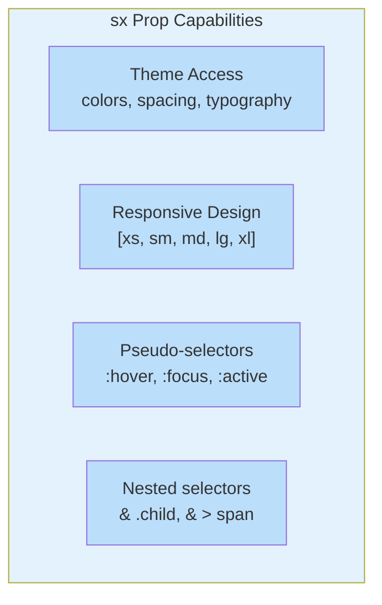

### Common Use Cases for Box

#### 1. Creating a Card Container


```jsx
<Box
  sx={{
    p: 3,
    bgcolor: 'background.paper',
    borderRadius: 2,
    boxShadow: 2,
    '&:hover': {
      boxShadow: 4,
      transform: 'translateY(-2px)',
      transition: 'all 0.3s'
    }
  }}
>
  <Typography variant="h6">Card Title</Typography>
  <Typography>Card content here</Typography>
</Box>
```


#### 2. Centering Content


```jsx
<Box
  display="flex"
  justifyContent="center"
  alignItems="center"
  minHeight="100vh"
>
  <CircularProgress />
</Box>
```


#### 3. Responsive Sizing


```jsx
<Box
  sx={{
    width: {
      xs: '100%',    // 0-599px
      sm: '80%',     // 600-899px
      md: '60%',     // 900-1199px
      lg: '40%'      // 1200px+
    },
    mx: 'auto'       // horizontal centering
  }}
>
  Responsive Content
</Box>
```


#### 4. Overlay/Masked Background


```jsx
<Box
  sx={{
    position: 'relative',
    bgcolor: 'grey.800',
    color: 'white'
  }}
>
  <Box
    sx={{
      position: 'absolute',
      top: 0,
      left: 0,
      right: 0,
      bottom: 0,
      bgcolor: 'rgba(0,0,0,0.5)'
    }}
  />
  <Box sx={{ position: 'relative', zIndex: 1 }}>
    Content with overlay
  </Box>
</Box>
```


### Box Summary

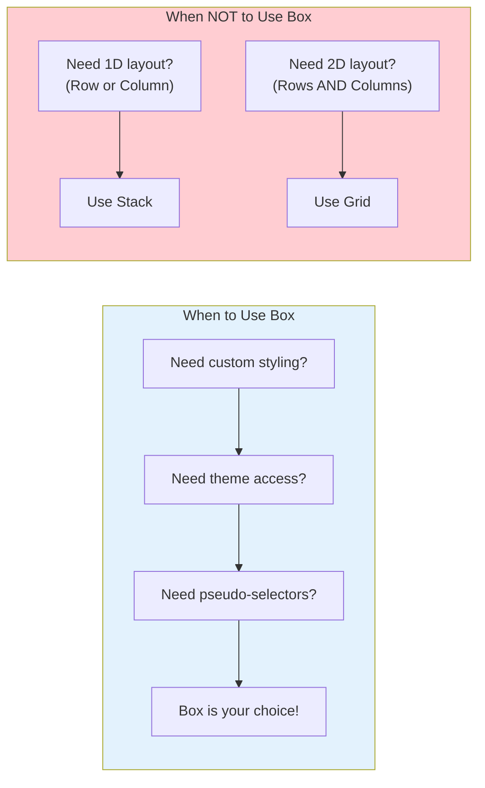

---

## Part 2: Stack — The One-Dimensional Layout Expert

**Stack** is designed specifically for **one-dimensional layouts** — either a horizontal row or a vertical column. It's MUI's answer to CSS Flexbox with a simpler, more declarative API.

### Core Concept

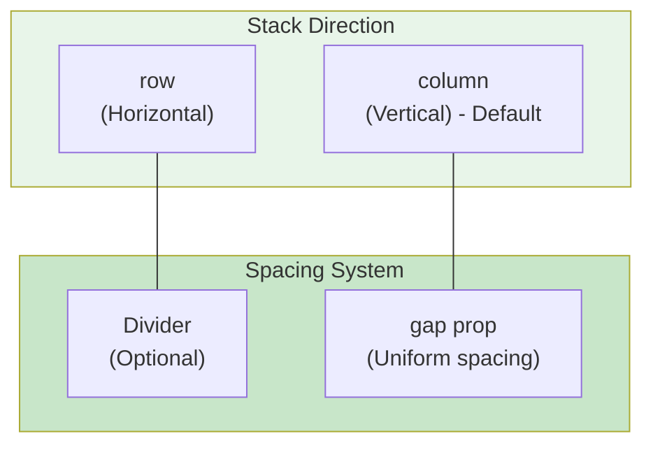

### Basic Usage

```jsx
// Vertical stack (default)
<Stack spacing={2}>
  <Item>Item 1</Item>
  <Item>Item 2</Item>
  <Item>Item 3</Item>
</Stack>

// Horizontal stack
<Stack direction="row" spacing={2}>
  <Item>Item A</Item>
  <Item>Item B</Item>
  <Item>Item C</Item>
</Stack>
```

### Key Props Explained

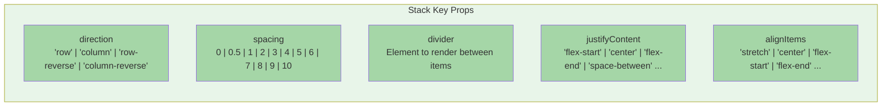

### Common Use Cases for Stack

#### 1. Navigation Bar


```jsx
<Stack
  direction="row"
  spacing={4}
  justifyContent="space-between"
  alignItems="center"
  sx={{ px: 4, py: 2, bgcolor: 'primary.main' }}
>
  <Typography variant="h6" sx={{ color: 'white' }}>
    My App
  </Typography>
  <Stack direction="row" spacing={2}>
    <Button color="inherit">Home</Button>
    <Button color="inherit">About</Button>
    <Button color="inherit">Contact</Button>
  </Stack>
</Stack>
```


#### 2. Form Layout


```jsx
<Stack spacing={3} sx={{ maxWidth: 400 }}>
  <TextField label="Email" type="email" />
  <TextField label="Password" type="password" />
  <Button variant="contained" size="large">
    Sign In
  </Button>
</Stack>
```


#### 3. Card with Actions


```jsx
<Card>
  <CardContent>
    <Stack spacing={2}>
      <Typography variant="h5">Card Title</Typography>
      <Typography color="text.secondary">
        Card description text goes here.
      </Typography>
    </Stack>
  </CardContent>
  <CardActions>
    <Stack
      direction="row"
      spacing={1}
      justifyContent="flex-end"
    >
      <Button size="small">Cancel</Button>
      <Button variant="contained" size="small">Confirm</Button>
    </Stack>
  </CardActions>
</Card>
```


#### 4. Profile Header


```jsx
<Stack
  direction="row"
  spacing={3}
  alignItems="center"
>
  <Avatar src="/avatar.jpg" sx={{ width: 80, height: 80 }} />
  <Stack spacing={0.5}>
    <Typography variant="h6">John Doe</Typography>
    <Typography color="text.secondary">
      Software Engineer
    </Typography>
    <Typography variant="body2">
      San Francisco, CA
    </Typography>
  </Stack>
</Stack>
```


#### 5. Using Divider


```jsx
<Stack
  direction="row"
  spacing={2}
  divider={<Divider orientation="vertical" flexItem />}
>
  <Typography>Home</Typography>
  <Typography>About</Typography>
  <Typography>Contact</Typography>
</Stack>
```


### Stack vs Box: When to Choose

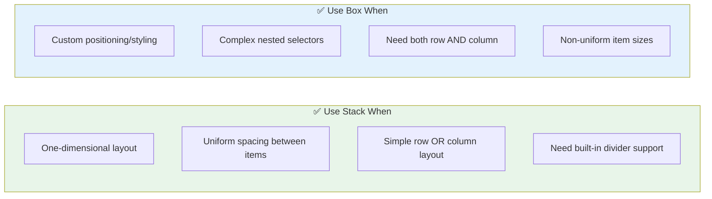

---

## Part 3: Grid — The Two-Dimensional Master

**Grid** is MUI's component for **two-dimensional layouts** — managing both rows and columns simultaneously. It uses CSS Grid under the hood but provides a more MUI-friendly API.

### The Grid System

MUI Grid divides the layout into **12 columns** and supports **5 breakpoints**:

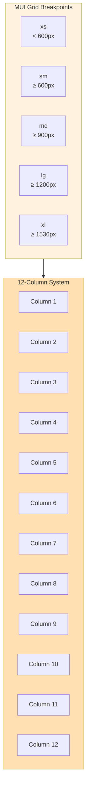

### Grid Version 2 vs Version 1

> MUI v5 introduced **Grid version 2** with improved features. If you're using MUI v5+, prefer Grid v2!


| Feature | Grid v1 | Grid v2 |
|---------|---------|---------|
| Import | `import Grid from '@mui/material/Grid'` | `import Grid from '@mui/material/Grid2'` |
| Container | `container` prop | `disableEqualOverflow` prop |
| Item | `item` prop | Not needed |
| Size props | `xs`, `sm`, `md`, `lg`, `xl` | Same |
| Stable | Stable | Stable (since v5.12) |

### Basic Usage (Grid v2)


```jsx
import Grid from '@mui/material/Grid2';

// Container
<Grid container spacing={3}>

  {/* Items - no 'item' prop needed in v2 */}
  <Grid size={{ xs: 12, md: 6 }}>
    <Item>Column 1</Item>
  </Grid>

  <Grid size={{ xs: 12, md: 6 }}>
    <Item>Column 2</Item>
  </Grid>

</Grid>
```


### Grid Props Explained

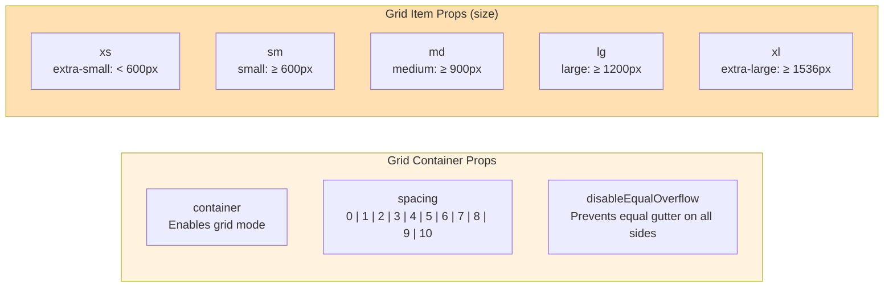

### Size Syntax Options

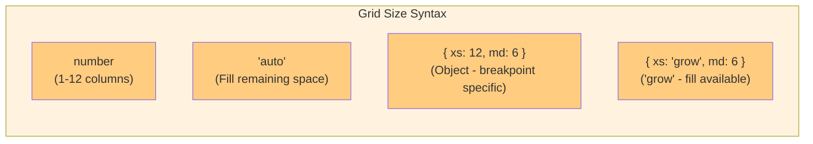

### Common Use Cases for Grid

#### 1. Dashboard Layout


```jsx
<Grid container spacing={3}>
  {/* Stats Cards */}
  <Grid size={{ xs: 12, sm: 6, md: 3 }}>
    <StatCard title="Revenue" value="$45,000" />
  </Grid>
  <Grid size={{ xs: 12, sm: 6, md: 3 }}>
    <StatCard title="Users" value="2,345" />
  </Grid>
  <Grid size={{ xs: 12, sm: 6, md: 3 }}>
    <StatCard title="Orders" value="567" />
  </Grid>
  <Grid size={{ xs: 12, sm: 6, md: 3 }}>
    <StatCard title="Growth" value="+12%" />
  </Grid>

  {/* Main Content */}
  <Grid size={{ xs: 12, md: 8 }}>
    <ChartComponent />
  </Grid>
  <Grid size={{ xs: 12, md: 4 }}>
    <RecentActivity />
  </Grid>
</Grid>
```


#### 2. Photo Gallery


```jsx
<Grid container spacing={2}>
  {/* Large featured image */}
  <Grid size={{ xs: 12, md: 8 }}>
    <Box
      component="img"
      src="/featured.jpg"
      sx={{ width: '100%', borderRadius: 2 }}
    />
  </Grid>

  {/* Smaller images */}
  <Grid size={{ xs: 12, md: 4 }}>
    <Stack spacing={2}>
      <Box
        component="img"
        src="/thumb1.jpg"
        sx={{ width: '100%', borderRadius: 2 }}
      />
      <Box
        component="img"
        src="/thumb2.jpg"
        sx={{ width: '100%', borderRadius: 2 }}
      />
    </Stack>
  </Grid>
</Grid>
```


#### 3. Product Grid


```jsx
<Grid container spacing={4}>
  {products.map((product) => (
    <Grid size={{ xs: 12, sm: 6, md: 4, lg: 3 }} key={product.id}>
      <ProductCard product={product} />
    </Grid>
  ))}
</Grid>
```


#### 4. Responsive Blog Layout


```jsx
<Grid container spacing={4}>
  {/* Main Article */}
  <Grid size={{ xs: 12, lg: 8 }}>
    <ArticleContent />
    <Comments />
  </Grid>

  {/* Sidebar */}
  <Grid size={{ xs: 12, lg: 4 }}>
    <Stack spacing={4}>
      <AuthorBio />
      <RelatedPosts />
      <Newsletter />
    </Stack>
  </Grid>
</Grid>
```


#### 5. Complex Form Layout


```jsx
<Grid container spacing={3}>
  <Grid size={{ xs: 12, md: 6 }}>
    <TextField fullWidth label="First Name" />
  </Grid>
  <Grid size={{ xs: 12, md: 6 }}>
    <TextField fullWidth label="Last Name" />
  </Grid>
  <Grid size={12}>
    <TextField fullWidth label="Email" type="email" />
  </Grid>
  <Grid size={{ xs: 12, md: 4 }}>
    <TextField fullWidth label="City" />
  </Grid>
  <Grid size={{ xs: 12, md: 4 }}>
    <TextField fullWidth label="State" />
  </Grid>
  <Grid size={{ xs: 12, md: 4 }}>
    <TextField fullWidth label="ZIP Code" />
  </Grid>
</Grid>
```


### Grid vs Stack: When to Choose

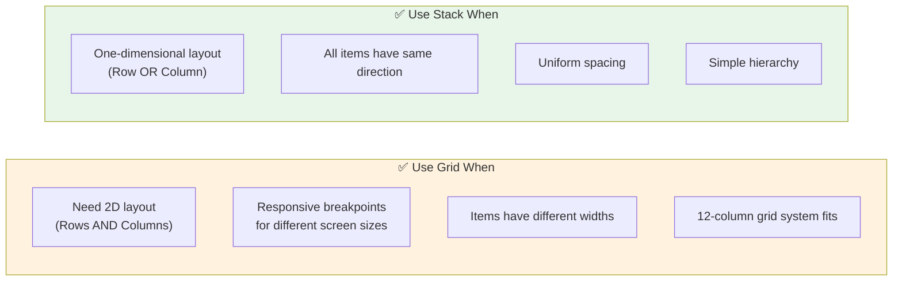

---

## Part 4: Combining Layout Components

This is where the magic happens! **Real-world applications use all three components together.**

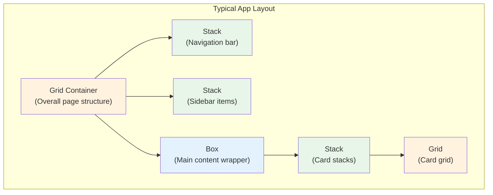

### Example: Complete Page Layout


```jsx
<Grid container spacing={0}>
  {/* Header */}
  <Grid size={12}>
    <Stack
      direction="row"
      justifyContent="space-between"
      alignItems="center"
      sx={{ px: 4, py: 2, bgcolor: 'primary.main' }}
    >
      <Typography variant="h6">Dashboard</Typography>
      <Stack direction="row" spacing={2}>
        <IconButton color="inherit">🔔</IconButton>
        <Avatar sx={{ bgcolor: 'secondary.main' }}>JD</Avatar>
      </Stack>
    </Stack>
  </Grid>

  {/* Main Content Area */}
  <Grid size={12}>
    <Box sx={{ p: 4 }}>
      {/* Page Title */}
      <Stack spacing={2} sx={{ mb: 4 }}>
        <Typography variant="h4">Welcome back, John</Typography>
        <Typography color="text.secondary">
          Here's what's happening today.
        </Typography>
      </Stack>

      {/* Stats Grid */}
      <Grid container spacing={3} sx={{ mb: 4 }}>
        <Grid size={{ xs: 12, sm: 6, md: 3 }}>
          <StatCard icon="💰" label="Revenue" value="$12,450" />
        </Grid>
        <Grid size={{ xs: 12, sm: 6, md: 3 }}>
          <StatCard icon="👥" label="Users" value="1,234" />
        </Grid>
        <Grid size={{ xs: 12, sm: 6, md: 3 }}>
          <StatCard icon="📦" label="Orders" value="89" />
        </Grid>
        <Grid size={{ xs: 12, sm: 6, md: 3 }}>
          <StatCard icon="⭐" label="Rating" value="4.8" />
        </Grid>
      </Grid>

      {/* Recent Orders */}
      <Typography variant="h6" sx={{ mb: 2 }}>
        Recent Orders
      </Typography>
      <Grid container spacing={2}>
        {orders.map((order) => (
          <Grid size={{ xs: 12, sm: 6, md: 4 }} key={order.id}>
            <OrderCard order={order} />
          </Grid>
        ))}
      </Grid>
    </Box>
  </Grid>
</Grid>
```


### Example: E-commerce Product Page


```jsx
<Grid container spacing={4} sx={{ py: 4 }}>
  {/* Product Images */}
  <Grid size={{ xs: 12, md: 6 }}>
    <Box
      component="img"
      src="/product.jpg"
      sx={{ width: '100%', borderRadius: 2 }}
    />
  </Grid>

  {/* Product Info */}
  <Grid size={{ xs: 12, md: 6 }}>
    <Stack spacing={3}>
      <Box>
        <Typography variant="h4" gutterBottom>
          Premium Wireless Headphones
        </Typography>
        <Typography variant="h5" color="primary">
          $299.99
        </Typography>
      </Box>

      <Typography color="text.secondary">
        Experience crystal-clear audio with our latest wireless headphones.
        Features active noise cancellation and 30-hour battery life.
      </Typography>

      {/* Color Selection */}
      <Stack spacing={2}>
        <Typography variant="subtitle2">Color</Typography>
        <Stack direction="row" spacing={1}>
          <IconButton>🔵</IconButton>
          <IconButton>⚫</IconButton>
          <IconButton>⚪</IconButton>
        </Stack>
      </Stack>

      {/* Quantity & Add to Cart */}
      <Stack direction="row" spacing={2}>
        <TextField
          type="number"
          defaultValue={1}
          inputProps={{ min: 1 }}
          sx={{ width: 80 }}
        />
        <Button variant="contained" size="large" fullWidth>
          Add to Cart
        </Button>
      </Stack>

      {/* Features */}
      <Stack spacing={1}>
        <Typography variant="subtitle2">Features:</Typography>
        {['30-hour battery', 'ANC', 'Bluetooth 5.2'].map((feature) => (
          <Stack key={feature} direction="row" spacing={1}>
            <Typography>•</Typography>
            <Typography>{feature}</Typography>
          </Stack>
        ))}
      </Stack>
    </Stack>
  </Grid>

  {/* Related Products */}
  <Grid size={12}>
    <Typography variant="h6" sx={{ mt: 4, mb: 2 }}>
      You May Also Like
    </Typography>
    <Grid container spacing={2}>
      {relatedProducts.map((product) => (
        <Grid size={{ xs: 6, sm: 4, md: 3 }} key={product.id}>
          <ProductCard product={product} />
        </Grid>
      ))}
    </Grid>
  </Grid>
</Grid>
```


### Example: Social Media Profile


```jsx
<Grid container spacing={4} sx={{ py: 4 }}>
  {/* Profile Header */}
  <Grid size={12}>
    <Stack
      direction="row"
      spacing={4}
      alignItems="flex-end"
      sx={{ bgcolor: 'grey.100', borderRadius: 2, p: 3 }}
    >
      <Avatar
        src="/profile.jpg"
        sx={{ width: 120, height: 120, border: 4, borderColor: 'white' }}
      />
      <Box sx={{ pb: 2 }}>
        <Typography variant="h5">Jane Smith</Typography>
        <Typography color="text.secondary">@janesmith</Typography>
        <Stack direction="row" spacing={4} sx={{ mt: 2 }}>
          <Typography><strong>1,234</strong> Posts</Typography>
          <Typography><strong>56.7K</strong> Followers</Typography>
          <Typography><strong>234</strong> Following</Typography>
        </Stack>
      </Box>
      <Box sx={{ pb: 2, ml: 'auto' }}>
        <Button variant="outlined">Edit Profile</Button>
      </Box>
    </Stack>
  </Grid>

  {/* Content Tabs */}
  <Grid size={12}>
    <Stack direction="row" spacing={2} sx={{ borderBottom: 1, borderColor: 'divider' }}>
      <Button>Posts</Button>
      <Button>Reels</Button>
      <Button>Tagged</Button>
    </Stack>
  </Grid>

  {/* Posts Grid */}
  <Grid container spacing={1}>
    {posts.map((post) => (
      <Grid size={{ xs: 4 }} key={post.id}>
        <Box
          component="img"
          src={post.image}
          sx={{ width: '100%', aspectRatio: 1, objectFit: 'cover' }}
        />
      </Grid>
    ))}
  </Grid>
</Grid>
```


---

## Part 5: Complete Comparison

### Side-by-Side Comparison

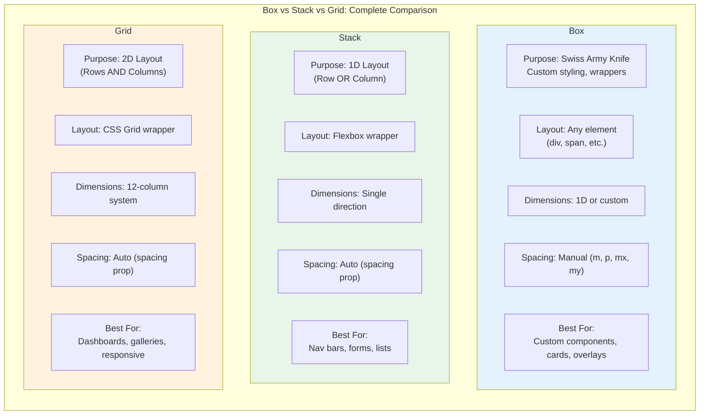

### Decision Tree

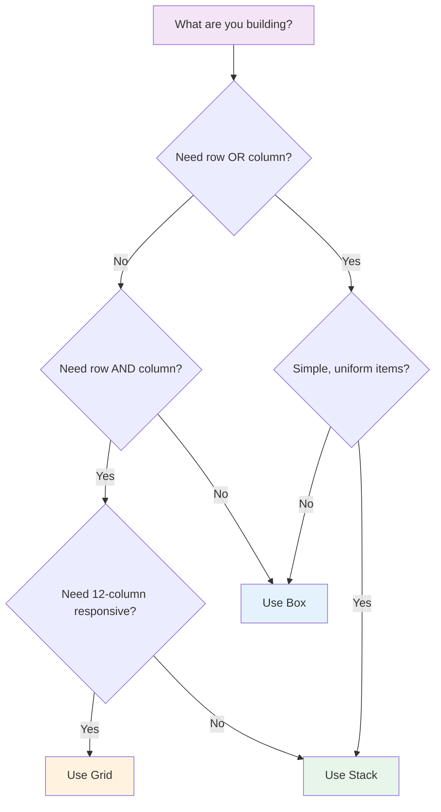

### Quick Reference Table

| Scenario | Component | Why |
|----------|-----------|-----|
| Card container with hover effect | `Box` | Need custom pseudo-selectors |
| Navigation menu | `Stack` | Simple row layout |
| Form with labels | `Stack` | Vertical column layout |
| Dashboard stats | `Grid` | Multiple columns + rows |
| Photo gallery | `Grid` | 12-column responsive grid |
| Centering content | `Box` (with flexbox) | Custom positioning |
| Profile header | `Stack` + `Box` | Row with mixed content |
| Product listing | `Grid` + `Stack` | Grid of stacked cards |

---

## Summary: The Layout Trifecta

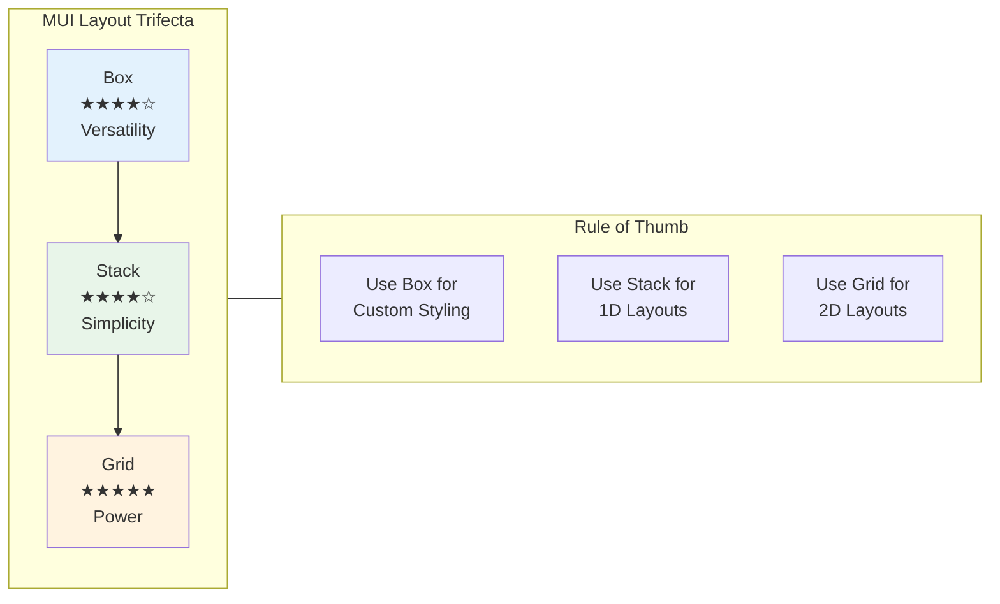

### Key Takeaways

1. **Box** is your foundation — use it for custom styling, wrappers, and when you need theme access via `sx`
2. **Stack** excels at one-dimensional layouts — rows or columns with uniform spacing
3. **Grid** dominates two-dimensional layouts — use the 12-column system for responsive designs
4. **Combine them freely** — real apps nest Stack inside Grid items, Box inside Stack items, etc.
5. **Start simple** — if Stack solves it, don't reach for Grid; if Box solves it, don't over-engineer

Master these three components, and you'll handle 90% of your MUI layout needs with clean, maintainable code.

---

- - -

## 背景：點解需要佈局組件？

當你用 Material-UI (MUI) 開發 React 應用程式，第一個挑戰就係：**點樣排列頁面元素？** 用 CSS Flexbox？CSS Grid？定係 MUI 內置嘅佈局系統？

答案係：**MUI 提供咗三個強大嘅佈局組件，可以滿足大部分需求。** 了解幾時用邊個，令你嘅代碼更整潔，開發更快速。

今日，我哋會系統地探索 MUI 嘅三個佈局神器：
- **Box**：瑞士軍刀
- **Stack**：一維佈局專家
- **Grid**：二維佈局大師

---

## 佈局哲學

喺深入每個組件之前，我哋先了解 MUI 嘅整體方針：

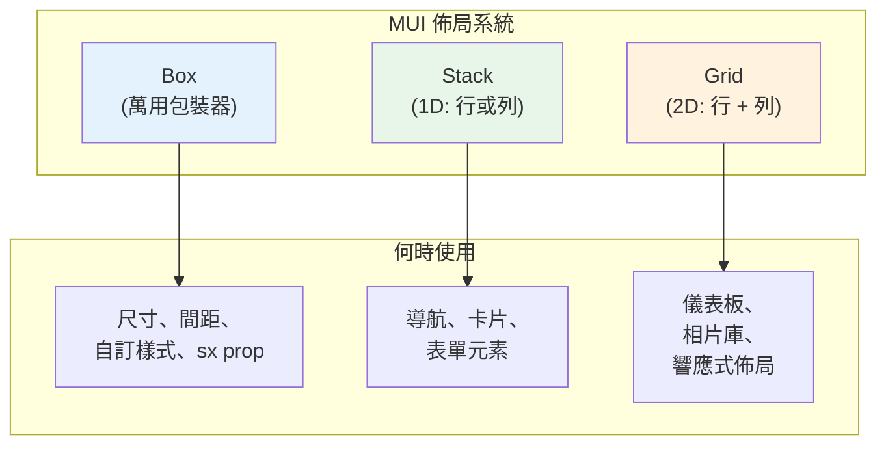

---

## 第一部分：Box — 瑞士軍刀

**Box** 係 MUI 最萬用嘅組件。本質上係 React `div` 元素嘅薄包裝，但透過 `sx` prop 提供 MUI 樣式系統嘅訪問權限。

### 核心概念

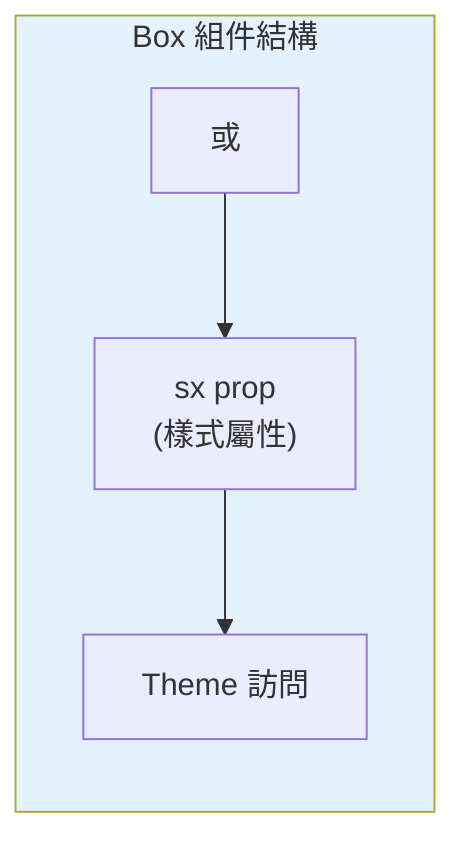

### Box 可以做咩？


```jsx
// 基本用法
<Box>內容</Box>

// 加入樣式
<Box
  sx={{
    width: 300,
    height: 200,
    bgcolor: 'primary.main',
    p: 2,
    borderRadius: 1,
    boxShadow: 3
  }}
>
  已美化嘅內容
</Box>
```


### `sx` Prop — 你最好嘅朋友

`sx` prop 係定義自訂樣式嘅捷徑，提供：
- **直接訪問 theme 值**（顏色、間距、字體）
- **響應式值**（array 或 object 語法）
- **偽選擇器支援**（`:hover`、`:focus`）
- **嵌套選擇器支援**（`& .child`）

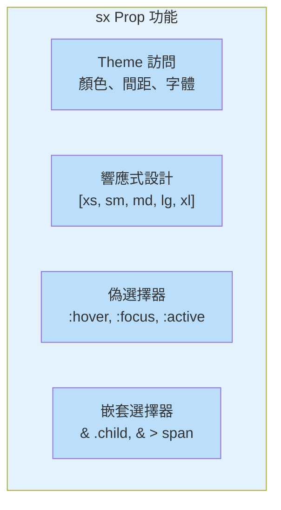

### Box 嘅常見用法

#### 1. 創建卡片容器


```jsx
<Box
  sx={{
    p: 3,
    bgcolor: 'background.paper',
    borderRadius: 2,
    boxShadow: 2,
    '&:hover': {
      boxShadow: 4,
      transform: 'translateY(-2px)',
      transition: 'all 0.3s'
    }
  }}
>
  <Typography variant="h6">卡片標題</Typography>
  <Typography>卡片內容</Typography>
</Box>
```


#### 2. 居中內容


```jsx
<Box
  display="flex"
  justifyContent="center"
  alignItems="center"
  minHeight="100vh"
>
  <CircularProgress />
</Box>
```


#### 3. 響應式尺寸


```jsx
<Box
  sx={{
    width: {
      xs: '100%',    // 0-599px
      sm: '80%',     // 600-899px
      md: '60%',     // 900-1199px
      lg: '40%'      // 1200px+
    },
    mx: 'auto'       // 水平居中
  }}
>
  響應式內容
</Box>
```


#### 4. 疊加層/遮罩背景


```jsx
<Box
  sx={{
    position: 'relative',
    bgcolor: 'grey.800',
    color: 'white'
  }}
>
  <Box
    sx={{
      position: 'absolute',
      top: 0,
      left: 0,
      right: 0,
      bottom: 0,
      bgcolor: 'rgba(0,0,0,0.5)'
    }}
  />
  <Box sx={{ position: 'relative', zIndex: 1 }}>
    帶遮罩嘅內容
  </Box>
</Box>
```


### Box 總結

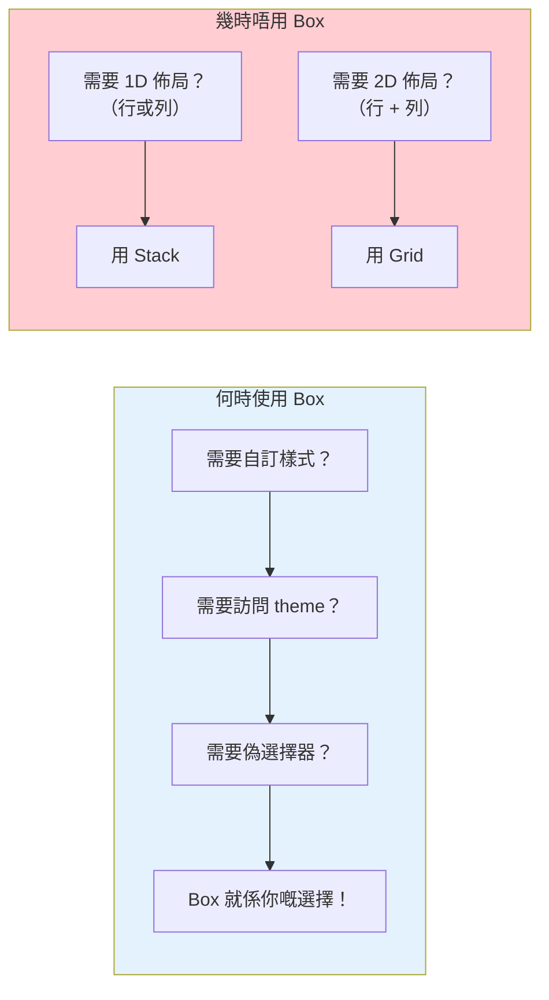

---

## 第二部分：Stack — 一維佈局專家

**Stack** 專門為**一維佈局**設計——橫向行或縱向列。用更簡單、更聲明式嘅 API 提供 CSS Flexbox 功能。

### 核心概念

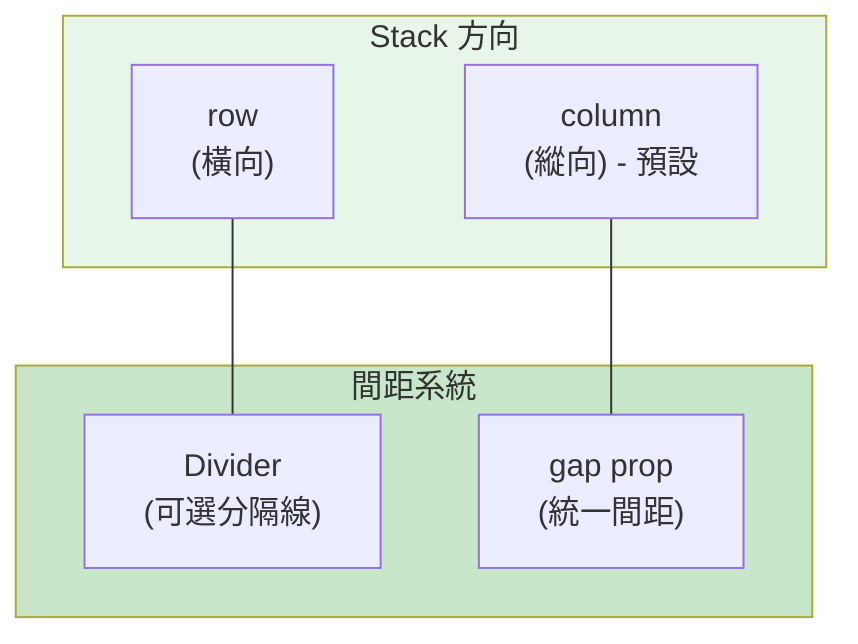

### 基本用法

```jsx
// 縱向 stack（預設）
<Stack spacing={2}>
  <Item>項目 1</Item>
  <Item>項目 2</Item>
  <Item>項目 3</Item>
</Stack>

// 橫向 stack
<Stack direction="row" spacing={2}>
  <Item>項目 A</Item>
  <Item>項目 B</Item>
  <Item>項目 C</Item>
</Stack>
```

### 主要 Props 詳解

```mermaid
flowchart TB
    subgraph Stack_Props["Stack 主要 Props"]
        direction TB
        Direction["direction<br/>'row' | 'column' | 'row-reverse' | 'column-reverse'"]
        Spacing["spacing<br/>0 | 0.5 | 1 | 2 | 3 | 4 | 5 | 6 | 7 | 8 | 9 | 10"]
        Divider_Prop["divider<br/>元素之間渲染"]
        Justify["justifyContent<br/>'flex-start' | 'center' | 'flex-end' | 'space-between' ..."]
        Align["alignItems<br/>'stretch' | 'center' | 'flex-start' | 'flex-end' ..."]
    end

    style Stack_Props fill:#e8f5e9
    style Direction fill:#a5d6a7
    style Spacing fill:#a5d6a7
    style Divider_Prop fill:#a5d6a7
    style Justify fill:#a5d6a7
    style Align fill:#a5d6a7
```

### Stack 嘅常見用法

#### 1. 導航欄


```jsx
<Stack
  direction="row"
  spacing={4}
  justifyContent="space-between"
  alignItems="center"
  sx={{ px: 4, py: 2, bgcolor: 'primary.main' }}
>
  <Typography variant="h6" sx={{ color: 'white' }}>
    我的應用
  </Typography>
  <Stack direction="row" spacing={2}>
    <Button color="inherit">首頁</Button>
    <Button color="inherit">關於</Button>
    <Button color="inherit">聯絡</Button>
  </Stack>
</Stack>
```


#### 2. 表單佈局


```jsx
<Stack spacing={3} sx={{ maxWidth: 400 }}>
  <TextField label="電郵" type="email" />
  <TextField label="密碼" type="password" />
  <Button variant="contained" size="large">
    登入
  </Button>
</Stack>
```


#### 3. 卡片配操作按鈕


```jsx
<Card>
  <CardContent>
    <Stack spacing={2}>
      <Typography variant="h5">卡片標題</Typography>
      <Typography color="text.secondary">
        卡片描述文字。
      </Typography>
    </Stack>
  </CardContent>
  <CardActions>
    <Stack
      direction="row"
      spacing={1}
      justifyContent="flex-end"
    >
      <Button size="small">取消</Button>
      <Button variant="contained" size="small">確認</Button>
    </Stack>
  </CardActions>
</Card>
```


#### 4. 個人資料頭像


```jsx
<Stack
  direction="row"
  spacing={3}
  alignItems="center"
>
  <Avatar src="/avatar.jpg" sx={{ width: 80, height: 80 }} />
  <Stack spacing={0.5}>
    <Typography variant="h6">陳大明</Typography>
    <Typography color="text.secondary">
      軟件工程師
    </Typography>
    <Typography variant="body2">
      香港
    </Typography>
  </Stack>
</Stack>
```


#### 5. 使用 Divider


```jsx
<Stack
  direction="row"
  spacing={2}
  divider={<Divider orientation="vertical" flexItem />}
>
  <Typography>首頁</Typography>
  <Typography>關於</Typography>
  <Typography>聯絡</Typography>
</Stack>
```


### Stack vs Box：幾時選擇邊個

```mermaid
flowchart LR
    subgraph Choose_Stack["✅ 使用 Stack 當"]
        direction TB
        A["一維佈局"]
        B["統一間距"]
        C["簡單行或列"]
        D["需要內置 divider"]
    end

    subgraph Choose_Box["✅ 使用 Box 當"]
        direction TB
        E["自訂定位/樣式"]
        F["複雜嵌套選擇器"]
        G["需要行和列"]
        H["不規則項目大小"]
    end

    style Choose_Stack fill:#e8f5e9
    style Choose_Box fill:#e3f2fd
```

---

## 第三部分：Grid — 二維佈局大師

**Grid** 係 MUI 用於**二維佈局**嘅組件——同時管理行同列。底層使用 CSS Grid，但提供更 MUI 友好嘅 API。

### Grid 系統

MUI Grid 將佈局劃分為**12 列**並支援**5 個斷點**：

```mermaid
flowchart TB
    subgraph Breakpoints["MUI Grid 斷點"]
        xs["xs<br/>< 600px"]
        sm["sm<br/>≥ 600px"]
        md["md<br/>≥ 900px"]
        lg["lg<br/>≥ 1200px"]
        xl["xl<br/>≥ 1536px"]
    end

    subgraph Columns["12列系統"]
        C1["第 1 列"]
        C2["第 2 列"]
        C3["第 3 列"]
        C4["第 4 列"]
        C5["第 5 列"]
        C6["第 6 列"]
        C7["第 7 列"]
        C8["第 8 列"]
        C9["第 9 列"]
        C10["第 10 列"]
        C11["第 11 列"]
        C12["第 12 列"]
    end

    Breakpoints --> Columns
    style Breakpoints fill:#fff3e0
    style Columns fill:#ffe0b2
```

### Grid v2 vs v1

> MUI v5 引入了 **Grid version 2**，功能更好。如果你在用 MUI v5+，請使用 Grid v2！

| 功能 | Grid v1 | Grid v2 |
|------|---------|---------|
| 引入 | `import Grid from '@mui/material/Grid'` | `import Grid from '@mui/material/Grid2'` |
| Container | `container` prop | `disableEqualOverflow` prop |
| Item | `item` prop | 不需要 |
| 尺寸 props | `xs`、`sm`、`md`、`lg`、`xl` | 相同 |
| 穩定性 | 穩定 | 穩定（自 v5.12） |

### 基本用法（Grid v2）


```jsx
import Grid from '@mui/material/Grid2';

// Container
<Grid container spacing={3}>

  {/* Items - v2 不需要 'item' prop */}
  <Grid size={{ xs: 12, md: 6 }}>
    <Item>第一欄</Item>
  </Grid>

  <Grid size={{ xs: 12, md: 6 }}>
    <Item>第二欄</Item>
  </Grid>

</Grid>
```


### Grid Props 詳解

```mermaid
flowchart LR
    subgraph Grid_Container["Grid Container Props"]
        direction TB
        C1["container<br/>啟用 grid 模式"]
        C2["spacing<br/>0 | 1 | 2 | 3 | 4 | 5 | 6 | 7 | 8 | 9 | 10"]
        C3["disableEqualOverflow<br/>防止所有邊相等間距"]
    end

    subgraph Grid_Item["Grid Item Props (size)"]
        direction TB
        I1["xs<br/>超小：< 600px"]
        I2["sm<br/>小：≥ 600px"]
        I3["md<br/>中：≥ 900px"]
        I4["lg<br/>大：≥ 1200px"]
        I5["xl<br/>超大：≥ 1536px"]
    end

    style Grid_Container fill:#fff3e0
    style Grid_Item fill:#ffe0b2
```

### 尺寸語法選項

```mermaid
flowchart LR
    subgraph Size_Syntax["Grid 尺寸語法"]
        direction TB
        A["number<br/>(1-12 列)"]
        B["'auto'<br/>(填剩餘空間)"]
        C["{ xs: 12, md: 6 }<br/>(Object - 斷點特定)"]
        D["{ xs: 'grow', md: 6 }<br/>('grow' - 填可用空間)"]
    end

    style Size_Syntax fill:#fff3e0
    style A fill:#ffcc80
    style B fill:#ffcc80
    style C fill:#ffcc80
    style D fill:#ffcc80
```

### Grid 嘅常見用法

#### 1. 儀表板佈局


```jsx
<Grid container spacing={3}>
  {/* 統計卡片 */}
  <Grid size={{ xs: 12, sm: 6, md: 3 }}>
    <StatCard title="收入" value="$45,000" />
  </Grid>
  <Grid size={{ xs: 12, sm: 6, md: 3 }}>
    <StatCard title="用戶" value="2,345" />
  </Grid>
  <Grid size={{ xs: 12, sm: 6, md: 3 }}>
    <StatCard title="訂單" value="567" />
  </Grid>
  <Grid size={{ xs: 12, sm: 6, md: 3 }}>
    <StatCard title="增長" value="+12%" />
  </Grid>

  {/* 主要內容 */}
  <Grid size={{ xs: 12, md: 8 }}>
    <ChartComponent />
  </Grid>
  <Grid size={{ xs: 12, md: 4 }}>
    <RecentActivity />
  </Grid>
</Grid>
```


#### 2. 相片庫


```jsx
<Grid container spacing={2}>
  {/* 大圖片 */}
  <Grid size={{ xs: 12, md: 8 }}>
    <Box
      component="img"
      src="/featured.jpg"
      sx={{ width: '100%', borderRadius: 2 }}
    />
  </Grid>

  {/* 小圖片 */}
  <Grid size={{ xs: 12, md: 4 }}>
    <Stack spacing={2}>
      <Box
        component="img"
        src="/thumb1.jpg"
        sx={{ width: '100%', borderRadius: 2 }}
      />
      <Box
        component="img"
        src="/thumb2.jpg"
        sx={{ width: '100%', borderRadius: 2 }}
      />
    </Stack>
  </Grid>
</Grid>
```


#### 3. 產品列表


```jsx
<Grid container spacing={4}>
  {products.map((product) => (
    <Grid size={{ xs: 12, sm: 6, md: 4, lg: 3 }} key={product.id}>
      <ProductCard product={product} />
    </Grid>
  ))}
</Grid>
```


#### 4. 響應式博客佈局


```jsx
<Grid container spacing={4}>
  {/* 主要文章 */}
  <Grid size={{ xs: 12, lg: 8 }}>
    <ArticleContent />
    <Comments />
  </Grid>

  {/* 側邊欄 */}
  <Grid size={{ xs: 12, lg: 4 }}>
    <Stack spacing={4}>
      <AuthorBio />
      <RelatedPosts />
      <Newsletter />
    </Stack>
  </Grid>
</Grid>
```


#### 5. 複雜表單佈局


```jsx
<Grid container spacing={3}>
  <Grid size={{ xs: 12, md: 6 }}>
    <TextField fullWidth label="名" />
  </Grid>
  <Grid size={{ xs: 12, md: 6 }}>
    <TextField fullWidth label="姓" />
  </Grid>
  <Grid size={12}>
    <TextField fullWidth label="電郵" type="email" />
  </Grid>
  <Grid size={{ xs: 12, md: 4 }}>
    <TextField fullWidth label="城市" />
  </Grid>
  <Grid size={{ xs: 12, md: 4 }}>
    <TextField fullWidth label="地區" />
  </Grid>
  <Grid size={{ xs: 12, md: 4 }}>
    <TextField fullWidth label="郵編" />
  </Grid>
</Grid>
```


### Grid vs Stack：幾時選擇邊個

```mermaid
flowchart LR
    subgraph Choose_Grid["✅ 使用 Grid 當"]
        direction TB
        A["需要 2D 佈局<br/>(行 + 列)"]
        B["響應式斷點<br/>不同螢幕尺寸"]
        C["項目有不同寬度"]
        D["12列系統適合"]
    end

    subgraph Choose_Stack["✅ 使用 Stack 當"]
        direction TB
        E["一維佈局<br/>(行 或 列)"]
        F["所有項目方向相同"]
        G["統一間距"]
        H["簡單層次結構"]
    end

    style Choose_Grid fill:#fff3e0
    style Choose_Stack fill:#e8f5e9
```

---

## 第四部分：組合使用佈局組件

呢度就係神奇嘅地方！**現實世界嘅應用係三個組件一齊用。**

```mermaid
flowchart TB
    subgraph App_Layout["典型應用佈局"]
        Grid_App["Grid Container<br/>(整體頁面結構)"]
        Stack_Header["Stack<br/>(導航欄)"]
        Stack_Sidebar["Stack<br/>(側邊欄項目)"]
        Box_Main["Box<br/>(主要內容包裝)"]
        Stack_Cards["Stack<br/>(卡片堆)"]
        Grid_Cards["Grid<br/>(卡片網格)"]
    end

    Grid_App --> Stack_Header
    Grid_App --> Stack_Sidebar
    Grid_App --> Box_Main
    Box_Main --> Stack_Cards
    Stack_Cards --> Grid_Cards

    style Grid_App fill:#fff3e0
    style Stack_Header fill:#e8f5e9
    style Stack_Sidebar fill:#e8f5e9
    style Box_Main fill:#e3f2fd
    style Stack_Cards fill:#e8f5e9
    style Grid_Cards fill:#fff3e0
```

### 示例：完整頁面佈局


```jsx
<Grid container spacing={0}>
  {/* Header */}
  <Grid size={12}>
    <Stack
      direction="row"
      justifyContent="space-between"
      alignItems="center"
      sx={{ px: 4, py: 2, bgcolor: 'primary.main' }}
    >
      <Typography variant="h6">儀表板</Typography>
      <Stack direction="row" spacing={2}>
        <IconButton color="inherit">🔔</IconButton>
        <Avatar sx={{ bgcolor: 'secondary.main' }}>JD</Avatar>
      </Stack>
    </Stack>
  </Grid>

  {/* 主要內容區域 */}
  <Grid size={12}>
    <Box sx={{ p: 4 }}>
      {/* 頁面標題 */}
      <Stack spacing={2} sx={{ mb: 4 }}>
        <Typography variant="h4">歡迎回來，小明</Typography>
        <Typography color="text.secondary">
          以下係今日嘅情況。
        </Typography>
      </Stack>

      {/* 統計網格 */}
      <Grid container spacing={3} sx={{ mb: 4 }}>
        <Grid size={{ xs: 12, sm: 6, md: 3 }}>
          <StatCard icon="💰" label="收入" value="$12,450" />
        </Grid>
        <Grid size={{ xs: 12, sm: 6, md: 3 }}>
          <StatCard icon="👥" label="用戶" value="1,234" />
        </Grid>
        <Grid size={{ xs: 12, sm: 6, md: 3 }}>
          <StatCard icon="📦" label="訂單" value="89" />
        </Grid>
        <Grid size={{ xs: 12, sm: 6, md: 3 }}>
          <StatCard icon="⭐" label="評分" value="4.8" />
        </Grid>
      </Grid>

      {/* 最近訂單 */}
      <Typography variant="h6" sx={{ mb: 2 }}>
        最近訂單
      </Typography>
      <Grid container spacing={2}>
        {orders.map((order) => (
          <Grid size={{ xs: 12, sm: 6, md: 4 }} key={order.id}>
            <OrderCard order={order} />
          </Grid>
        ))}
      </Grid>
    </Box>
  </Grid>
</Grid>
```


### 示例：電子商務產品頁面


```jsx
<Grid container spacing={4} sx={{ py: 4 }}>
  {/* 產品圖片 */}
  <Grid size={{ xs: 12, md: 6 }}>
    <Box
      component="img"
      src="/product.jpg"
      sx={{ width: '100%', borderRadius: 2 }}
    />
  </Grid>

  {/* 產品資訊 */}
  <Grid size={{ xs: 12, md: 6 }}>
    <Stack spacing={3}>
      <Box>
        <Typography variant="h4" gutterBottom>
          高級無線耳機
        </Typography>
        <Typography variant="h5" color="primary">
          $299.99
        </Typography>
      </Box>

      <Typography color="text.secondary">
        體驗清晰音色，配有主動降噪功能和30小時電池壽命。
      </Typography>

      {/* 顏色選擇 */}
      <Stack spacing={2}>
        <Typography variant="subtitle2">顏色</Typography>
        <Stack direction="row" spacing={1}>
          <IconButton>🔵</IconButton>
          <IconButton>⚫</IconButton>
          <IconButton>⚪</IconButton>
        </Stack>
      </Stack>

      {/* 數量同加入購物車 */}
      <Stack direction="row" spacing={2}>
        <TextField
          type="number"
          defaultValue={1}
          inputProps={{ min: 1 }}
          sx={{ width: 80 }}
        />
        <Button variant="contained" size="large" fullWidth>
          加入購物車
        </Button>
      </Stack>

      {/* 功能 */}
      <Stack spacing={1}>
        <Typography variant="subtitle2">功能：</Typography>
        {['30小時電池', '主動降噪', '藍牙5.2'].map((feature) => (
          <Stack key={feature} direction="row" spacing={1}>
            <Typography>•</Typography>
            <Typography>{feature}</Typography>
          </Stack>
        ))}
      </Stack>
    </Stack>
  </Grid>

  {/* 相關產品 */}
  <Grid size={12}>
    <Typography variant="h6" sx={{ mt: 4, mb: 2 }}>
      你可能仲會鍾意
    </Typography>
    <Grid container spacing={2}>
      {relatedProducts.map((product) => (
        <Grid size={{ xs: 6, sm: 4, md: 3 }} key={product.id}>
          <ProductCard product={product} />
        </Grid>
      ))}
    </Grid>
  </Grid>
</Grid>
```


### 示例：社交媒體個人資料


```jsx
<Grid container spacing={4} sx={{ py: 4 }}>
  {/* 個人資料頭部 */}
  <Grid size={12}>
    <Stack
      direction="row"
      spacing={4}
      alignItems="flex-end"
      sx={{ bgcolor: 'grey.100', borderRadius: 2, p: 3 }}
    >
      <Avatar
        src="/profile.jpg"
        sx={{ width: 120, height: 120, border: 4, borderColor: 'white' }}
      />
      <Box sx={{ pb: 2 }}>
        <Typography variant="h5">王小美</Typography>
        <Typography color="text.secondary">@sioemei</Typography>
        <Stack direction="row" spacing={4} sx={{ mt: 2 }}>
          <Typography><strong>1,234</strong> 帖子</Typography>
          <Typography><strong>56.7K</strong> 粉絲</Typography>
          <Typography><strong>234</strong> 關注</Typography>
        </Stack>
      </Box>
      <Box sx={{ pb: 2, ml: 'auto' }}>
        <Button variant="outlined">編輯個人資料</Button>
      </Box>
    </Stack>
  </Grid>

  {/* 內容標籤 */}
  <Grid size={12}>
    <Stack direction="row" spacing={2} sx={{ borderBottom: 1, borderColor: 'divider' }}>
      <Button>帖子</Button>
      <Button>短片</Button>
      <Button>標記</Button>
    </Stack>
  </Grid>

  {/* 帖子網格 */}
  <Grid container spacing={1}>
    {posts.map((post) => (
      <Grid size={{ xs: 4 }} key={post.id}>
        <Box
          component="img"
          src={post.image}
          sx={{ width: '100%', aspectRatio: 1, objectFit: 'cover' }}
        />
      </Grid>
    ))}
  </Grid>
</Grid>
```


---

## 第五部分：完整比較

### 並排比較

```mermaid
flowchart TB
    subgraph Comparison["Box vs Stack vs Grid：完整比較"]
        direction TB

        subgraph Box_Col["Box"]
            B1["用途：瑞士軍刀<br/>自訂樣式、包裝器"]
            B2["佈局：任何元素<br/>(div, span, etc.)"]
            B3["維度：1D 或自訂"]
            B4["間距：手動 (m, p, mx, my)"]
            B5["適用於：<br/>自訂組件、卡片、疊加層"]
        end

        subgraph Stack_Col["Stack"]
            S1["用途：1D 佈局<br/>(行 或 列)"]
            S2["佈局：Flexbox 包裝"]
            S3["維度：單一方向"]
            S4["間距：自動 (spacing prop)"]
            S5["適用於：<br/>導航、表單、列表"]
        end

        subgraph Grid_Col["Grid"]
            G1["用途：2D 佈局<br/>(行 + 列)"]
            G2["佈局：CSS Grid 包裝"]
            G3["維度：12列系統"]
            G4["間距：自動 (spacing prop)"]
            G5["適用於：<br/>儀表板、相簿庫、響應式"]
        end
    end

    style Box_Col fill:#e3f2fd
    style Stack_Col fill:#e8f5e9
    style Grid_Col fill:#fff3e0
```

### 決策樹

```mermaid
flowchart TD
    Start["你想建立咩？"]
    Q1{"需要 行 或 列？"}
    Q2{"需要 行 + 列？"}
    Q3{"需要 12列響應式？"}
    Q4{"簡單、統一項目？"}

    Box["用 Box"]
    Stack["用 Stack"]
    Grid["用 Grid"]

    Start --> Q1
    Q1 -->|"否"| Q2
    Q1 -->|"係"| Q4
    Q4 -->|"否"| Box
    Q4 -->|"係"| Stack
    Q2 -->|"否"| Box
    Q2 -->|"係"| Q3
    Q3 -->|"係"| Grid
    Q3 -->|"否"| Stack

    style Start fill:#f3e5f5
    style Box fill:#e3f2fd
    style Stack fill:#e8f5e9
    style Grid fill:#fff3e0
```

### 快速參考表

| 場景 | 組件 | 為什麼 |
|------|------|--------|
| 帶 hover 效果嘅卡片 | `Box` | 需要自訂偽選擇器 |
| 導航選單 | `Stack` | 簡單行佈局 |
| 帶標籤嘅表單 | `Stack` | 縱向列佈局 |
| 儀表板統計 | `Grid` | 多列 + 多行 |
| 相片庫 | `Grid` | 12列響應式網格 |
| 居中內容 | `Box`（加 flexbox） | 自訂定位 |
| 個人資料頭部 | `Stack` + `Box` | 橫向配混合內容 |
| 產品列表 | `Grid` + `Stack` | 網格包堆疊卡片 |

---

## 總結：佈局三劍俠

```mermaid
flowchart LR
    subgraph The_Trifecta["MUI 佈局三劍俠"]
        direction TB
        Box["Box<br/>★★★★☆<br/>多功能"] -->
        Stack["Stack<br/>★★★★☆<br/>簡單性"] -->
        Grid["Grid<br/>★★★★★<br/>強大"]
    end

    subgraph Usage["使用原則"]
        Box_Use["用 Box 做<br/>自訂樣式"]
        Stack_Use["用 Stack 做<br/>1D 佈局"]
        Grid_Use["用 Grid 做<br/>2D 佈局"]
    end

    The_Trifecta --- Usage

    style Box fill:#e3f2fd
    style Stack fill:#e8f5e9
    style Grid fill:#fff3e0
```

### 重點整理

1. **Box** 係你嘅基礎——用於自訂樣式、包裝器，當你需要透過 `sx` 訪問 theme
2. **Stack** 專精一維佈局——帶統一間距嘅行或列
3. **Grid** 主導二維佈局——用 12 列系統做響應式設計
4. **自由組合佢哋**——真實應用將 Stack 嵌套喺 Grid 項目入面、Box 嵌套喺 Stack 項目入面
5. **由簡單開始**——如果 Stack 搞得掂，唔好嘥用 Grid；如果 Box 搞得掂，唔好過度工程

掌握呢三個組件，你就可以用整潔、易維護嘅代碼處理 90% 嘅 MUI 佈局需求。
