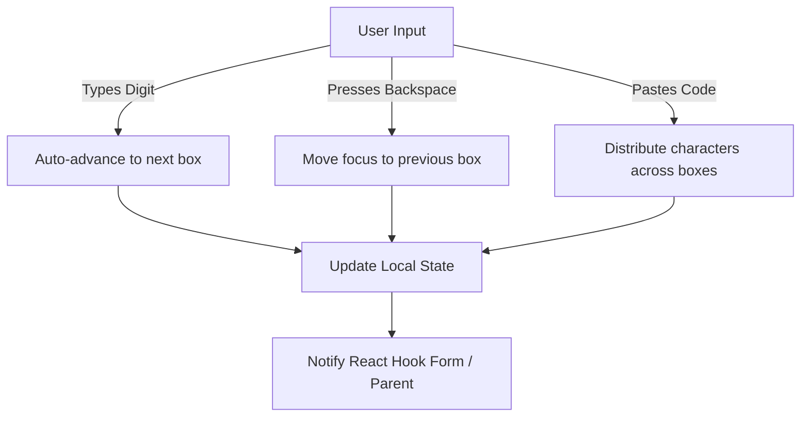
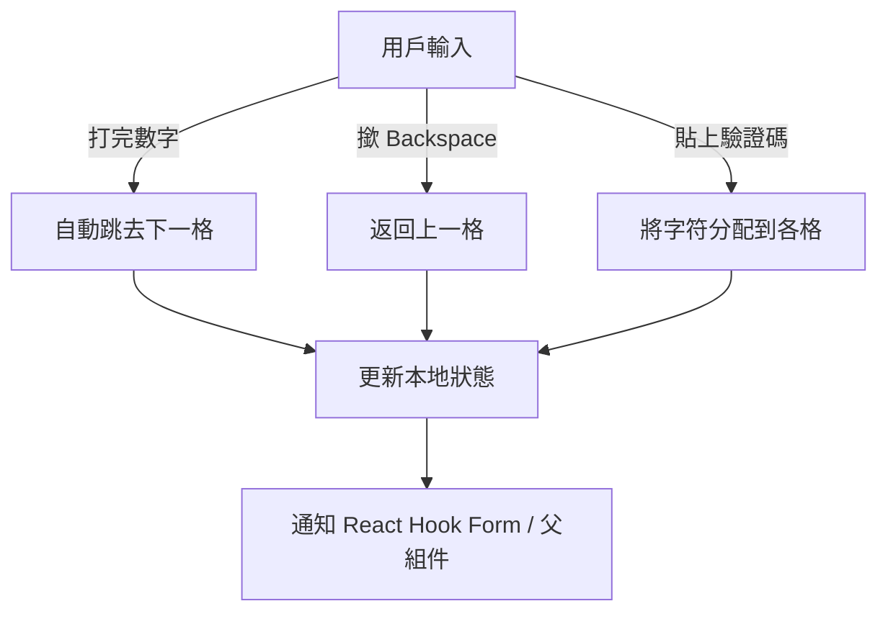

## Background: The Need for a Better Code Input

Whenever we build modern web applications, we often encounter scenarios that require users to input a short verification code. This could be:
- **SMS Verification Codes**
- **Email OTPs (One-Time Passwords)**
- **TOTP (Time-based One-Time Password) from Authenticator Apps**

A simple `<input type="text" />` works, but it rarely provides the best user experience. Users often lose track of how many digits they've typed, and it just doesn't feel "premium."

Recently, I was working on a personal idea to standardize how I handle these 2FA (Two-Factor Authentication) and verification flows. I wanted to design a dedicated `CodeInput` component that looks great and handles all the tiny UX details gracefully.

Today, I'll walk you through how to build a robust, multi-box code input component using **React** and **MUI (Material-UI)**.

---

## Component Design & Requirements

Before writing code, let's outline what our `CodeInput` needs to do to deliver a great UX:

1. **Individual Input Boxes**: Visually separate boxes for each digit.
2. **Auto-Advance Focus**: Typing a digit should automatically move the cursor to the next box.
3. **Backspace Handling**: Pressing `Backspace` on an empty box should move focus back to the previous box.
4. **Paste Support**: Users must be able to paste a full code (e.g., from clipboard) into the component, and it should populate all boxes correctly.
5. **Validation**: Restrict inputs to numbers only (by default).
6. **Form Integration**: It needs to seamlessly integrate with form libraries like `react-hook-form`.



---

## Implementation Details

Here is the complete implementation of our `CodeInput.tsx`. Let's break it down piece by piece.

### 1. Component Structure & Props

We define our component to accept a `length` (how many digits), an `onlyNumber` flag, and a `controllerField` object to integrate seamlessly with `react-hook-form`.


```tsx
import { Box, Stack, TextField, Typography } from '@mui/material';
import React, { useEffect, useRef, useState } from 'react';
import type { FieldValues, Path } from 'react-hook-form';

interface CodeInputProps<T extends FieldValues> {
  length: number;
  onlyNumber?: boolean;
  controllerField: {
    value: string;
    onChange: (value: string) => void;
    onBlur: () => void;
    name: Path<T>;
  };
  errorMessage?: string;
}
```


### 2. Managing Focus with Refs

To achieve the "auto-advance" and "move back on backspace" behavior, we need direct access to the underlying DOM elements. We use a `useRef` array to store references to each input box.


```tsx
const CodeInput = <T extends FieldValues>({
  length,
  onlyNumber = true,
  controllerField,
  errorMessage,
}: CodeInputProps<T>) => {
  // Refs to programmatically focus specific input elements
  const inputsRef = useRef<HTMLInputElement[]>([]);
```


### 3. Local State Management

We use a local state array (`localCode`) to track the exact character in each box. This array always has a length equal to the `length` prop, filled with empty strings where no digit exists. We also sync it with the external `controllerField.value` if the form is reset externally.


```tsx
  // Local state to track exact digit positions, preserving blanks
  const [localCode, setLocalCode] = useState<string[]>(() => {
    const arr = controllerField?.value
      ? controllerField.value.split('').slice(0, length)
      : [];
    while (arr.length < length) {
      arr.push('');
    }
    return arr;
  });

  const localCodeRef = useRef(localCode);
  useEffect(() => {
    localCodeRef.current = localCode;
  }, [localCode]);

  // Sync from controllerField only if outside changes occur (e.g. form reset)
  useEffect(() => {
    const currentJoined = localCodeRef.current.join('');
    const incomingVal = controllerField?.value || '';
    if (incomingVal !== currentJoined) {
      const arr = incomingVal.split('').slice(0, length);
      while (arr.length < length) {
        arr.push('');
      }
      setLocalCode(arr);
    }
  }, [controllerField?.value, length]);
```


### 4. Handling User Interaction

This is where the magic happens. We need three main handlers: `handleChange`, `handleKeyDown`, and `handlePaste`.

#### Typing (handleChange)
When a user types, we ensure it's a number (if `onlyNumber` is true). We take the *last* character typed to handle rapid typing edge cases, update our state, and focus the next input.


```tsx
  const handleChange = (
    e: React.ChangeEvent<HTMLInputElement>,
    index: number,
  ) => {
    const value = e.target.value;

    // Only allow numbers
    if (onlyNumber && value && /[^0-9]/.test(value)) return;

    const newCode = [...localCode];
    // Take only the last character in case of rapid typing
    newCode[index] = value ? value.slice(-1) : '';
    setLocalCode(newCode);

    const joinedCode = newCode.join('');

    // Auto-advance to the next input if a value was typed
    if (value && index < length - 1) {
      inputsRef.current[index + 1]?.focus();
    }

    controllerField.onChange(joinedCode);
  };
```


#### Backspace (handleKeyDown)
If the user presses `Backspace` on an empty box, we naturally want to pull them back to the previous box.


```tsx
  const handleKeyDown = (
    e: React.KeyboardEvent<HTMLInputElement>,
    index: number,
  ) => {
    // Move focus to the previous input on Backspace if the current one is empty
    if (e.key === 'Backspace' && !localCode[index] && index > 0) {
      inputsRef.current[index - 1]?.focus();
    }
  };
```


#### Pasting (handlePaste)
Pasting is critical. Without this, users have to manually type 6 digits from an SMS, which is incredibly frustrating. We intercept the paste event, split the string, fill our local state, and jump the focus to the appropriate box.


```tsx
  const handlePaste = (e: React.ClipboardEvent<HTMLInputElement>) => {
    e.preventDefault();
    // Get pasted data and limit it to the max length
    const pastedData = e.clipboardData.getData('text/plain').slice(0, length);

    // Only allow numbers
    if (onlyNumber && /[^0-9]/.test(pastedData)) return;

    const newCode = [...localCode];
    for (let i = 0; i < pastedData.length; i++) {
      newCode[i] = pastedData[i];
    }
    setLocalCode(newCode);

    const joinedCode = newCode.join('');

    // Focus the next empty input, or the last input if full
    const focusIndex = Math.min(pastedData.length, length - 1);
    inputsRef.current[focusIndex]?.focus();

    controllerField.onChange(joinedCode);
  };
```


### 5. UI Rendering with MUI

Finally, we map over our `localCode` array and render a neat row of MUI `TextField` components. We use MUI's `Stack` and `Box` for layout to keep them centered and evenly spaced.


```tsx
  return (
    <Stack spacing={1} alignItems="center">
      <Box sx={{ display: 'flex', gap: 1.5, justifyContent: 'center' }}>
        {localCode.map((digit, index) => (
          <TextField
            key={index}
            value={digit}
            onChange={(e: React.ChangeEvent<HTMLInputElement>) =>
              handleChange(e, index)
            }
            onKeyDown={(e: React.KeyboardEvent<HTMLInputElement>) =>
              handleKeyDown(e, index)
            }
            onPaste={handlePaste}
            inputRef={(el) => {
              // Store the ref for auto-focusing
              inputsRef.current[index] = el;
            }}
            error={Boolean(errorMessage)}
          />
        ))}
      </Box>
      {errorMessage && (
        <Typography variant="body2" color="error">
          {errorMessage}
        </Typography>
      )}
    </Stack>
  );
};

export default CodeInput;
```


---

## Conclusion

Building a robust code input component is all about **managing focus** and **handling edge cases**. By carefully intercepting keyboard events (like `Backspace`) and clipboard events (like `Paste`), we can turn a clustered UI into a seamless, premium experience.

The combination of React's `useRef` for DOM manipulation and MUI's layout components makes achieving this highly polished result surprisingly straightforward.

If you are using `react-hook-form`, this component plugs right into your `Controller`, giving you a beautiful 2FA or text verification input out of the box!

---

- - -

## 背景：點解要整一個好用嘅驗證碼輸入組件？

整 modern web applications 嘅時候，我哋成日都會遇到要用戶輸入短驗證碼嘅場景，例如：

- **SMS 驗證碼**
- **Email OTP（一次性密碼）**
- **TOTP（基於時間嘅一次性密碼）嚟自身份驗證器 App**

用 `<input type="text" />` 係可以運作，但係用戶體驗就麻麻地囉。用戶成日唔記得自己打咗幾多個字，感覺亦都唔夠 "高級"。

最近我喺度諗住標準化我一啲 2FA（雙重驗證）同驗證流程嘅處理方式。想要設計一個好用嘅 `CodeInput` 組件，外觀靚之餘又要處理晒所有細節。

今日就等我帶你一步步整一個堅固嘅多格驗證碼輸入組件，用嘅係 **React** 同 **MUI (Material-UI)**。

---

## 組件設計同需求

喺開始寫代碼之前，先嚟睇下我哋嘅 `CodeInput` 需要做啲咩先可以提供好用嘅 UX：

1. **獨立輸入格**：每個數字都有自己嘅獨立格仔。
2. **自動跳格**：打完一個數字就自動跳去下一格。
3. **Backspace 處理**：喺空嘅格仔撳 Backspace 就自動返回上一格。
4. **剪貼簿貼上**：用戶可以直接 paste 成個驗證碼（譬如由 SMS 度 copy），組件會自動分配到各個格仔。
5. **驗證**：預設情況下只接受數字輸入。
6. **表單整合**：要可以順利同 `react-hook-form` 呢啲表單庫整合。



---

## 實現細節

以下係我哋 `CodeInput.tsx` 嘅完整實現。等我一嚇逐步拆解。

### 1. 組件結構同 Props

我哋定義組件接受 `length`（有幾多個數字）、`onlyNumber` 標記，仲有 `controllerField` 對象嚟同 `react-hook-form` 無縫整合。


```tsx
import { Box, Stack, TextField, Typography } from '@mui/material';
import React, { useEffect, useRef, useState } from 'react';
import type { FieldValues, Path } from 'react-hook-form';

interface CodeInputProps<T extends FieldValues> {
  length: number;
  onlyNumber?: boolean;
  controllerField: {
    value: string;
    onChange: (value: string) => void;
    onBlur: () => void;
    name: Path<T>;
  };
  errorMessage?: string;
}
```


### 2. 用 Refs 管理焦點

要做到「自動跳格」同「backspace 自動返回」呢個行為，我哋需要直接訪問底層 DOM 元素。用 `useRef` 數組嚟儲存每個輸入格嘅引用。


```tsx
const CodeInput = <T extends FieldValues>({
  length,
  onlyNumber = true,
  controllerField,
  errorMessage,
}: CodeInputProps<T>) => {
  // 用嚟程式化控制邊個輸入格應該取得焦點
  const inputsRef = useRef<HTMLInputElement[]>([]);
```


### 3. 本地狀態管理

用本地狀態數組（`localCode`）嚟追蹤每個格仔入面嘅確切字符。呢個數組嘅長度永遠等於 `length` prop，空嘅位置會填上空字符串。同時如果表單被外部重設，我哋都要同步 `controllerField.value`。


```tsx
  // 本地狀態追蹤每個格仔嘅確切字符，保留空白
  const [localCode, setLocalCode] = useState<string[]>(() => {
    const arr = controllerField?.value
      ? controllerField.value.split('').slice(0, length)
      : [];
    while (arr.length < length) {
      arr.push('');
    }
    return arr;
  });

  const localCodeRef = useRef(localCode);
  useEffect(() => {
    localCodeRef.current = localCode;
  }, [localCode]);

  // 只有喺外部發生變化先至同步（例如表單重設）
  useEffect(() => {
    const currentJoined = localCodeRef.current.join('');
    const incomingVal = controllerField?.value || '';
    if (incomingVal !== currentJoined) {
      const arr = incomingVal.split('').slice(0, length);
      while (arr.length < length) {
        arr.push('');
      }
      setLocalCode(arr);
    }
  }, [controllerField?.value, length]);
```


### 4. 處理用戶互動

呢度就係魔法發生嘅地方。我哋需要三個主要處理函數：`handleChange`、`handleKeyDown` 同 `handlePaste`。

#### 打字（handleChange）
用戶打字嘅時候，我哋確保佢係數字（如果 `onlyNumber` 係 true 嘅話）。為咗處理快速輸入嘅邊緣情況，我哋取 *最後* 一個字符，更新狀態，然後將焦點移到下一個輸入格。


```tsx
  const handleChange = (
    e: React.ChangeEvent<HTMLInputElement>,
    index: number,
  ) => {
    const value = e.target.value;

    // 只允許數字
    if (onlyNumber && value && /[^0-9]/.test(value)) return;

    const newCode = [...localCode];
    // 為咗處理快速輸入，只取最後一個字符
    newCode[index] = value ? value.slice(-1) : '';
    setLocalCode(newCode);

    const joinedCode = newCode.join('');

    // 如果打咗字就自動跳去下一格
    if (value && index < length - 1) {
      inputsRef.current[index + 1]?.focus();
    }

    controllerField.onChange(joinedCode);
  };
```


#### Backspace（handleKeyDown）
如果用戶喺空嘅格仔撳 `Backspace`，我哋自然想將佢帶返去上一格。


```tsx
  const handleKeyDown = (
    e: React.KeyboardEvent<HTMLInputElement>,
    index: number,
  ) => {
    // 如果目前格仔係空嘅，撳 Backspace 就將焦點移去上一格
    if (e.key === 'Backspace' && !localCode[index] && index > 0) {
      inputsRef.current[index - 1]?.focus();
    }
  };
```


#### 貼上（handlePaste）
貼上呢個功能好重要。冇呢個功能嘅話，用戶就要自己逐個數字打完 SMS 驗證碼，勁麻煩。我哋攔截 paste 事件，分割字符串，填入本地狀態，然後將焦點跳去相應嘅格仔。


```tsx
  const handlePaste = (e: React.ClipboardEvent<HTMLInputElement>) => {
    e.preventDefault();
    // 取得貼上嘅資料並限制喺最大長度
    const pastedData = e.clipboardData.getData('text/plain').slice(0, length);

    // 只允許數字
    if (onlyNumber && /[^0-9]/.test(pastedData)) return;

    const newCode = [...localCode];
    for (let i = 0; i < pastedData.length; i++) {
      newCode[i] = pastedData[i];
    }
    setLocalCode(newCode);

    const joinedCode = newCode.join('');

    // 將焦點移到下一個空嘅格仔，或者最後一格（如果已經填滿）
    const focusIndex = Math.min(pastedData.length, length - 1);
    inputsRef.current[focusIndex]?.focus();

    controllerField.onChange(joinedCode);
  };
```


### 5. 用 MUI 渲染 UI

最後，我哋 map 吓 `localCode` 數組，render 一整齊嘅 MUI `TextField` 組件排。用 MUI 嘅 `Stack` 同 `Box` 嚟做佈局，保持佢哋置中同均勻分布。


```tsx
  return (
    <Stack spacing={1} alignItems="center">
      <Box sx={{ display: 'flex', gap: 1.5, justifyContent: 'center' }}>
        {localCode.map((digit, index) => (
          <TextField
            key={index}
            value={digit}
            onChange={(e: React.ChangeEvent<HTMLInputElement>) =>
              handleChange(e, index)
            }
            onKeyDown={(e: React.KeyboardEvent<HTMLInputElement>) =>
              handleKeyDown(e, index)
            }
            onPaste={handlePaste}
            inputRef={(el) => {
              // 儲存 ref 嚟自動取得焦點
              inputsRef.current[index] = el;
            }}
            error={Boolean(errorMessage)}
          />
        ))}
      </Box>
      {errorMessage && (
        <Typography variant="body2" color="error">
          {errorMessage}
        </Typography>
      )}
    </Stack>
  );
};

export default CodeInput;
```


---

## 總結

整一個好用嘅驗證碼輸入組件，關鍵喺於 **管理焦點** 同 **處理邊緣情況**。只要仔細攔截鍵盤事件（例如 `Backspace`）同剪貼簿事件（例如 `Paste`），就可以將一堆雜亂嘅 UI 變成流暢嘅體驗。

結合 React 嘅 `useRef` 嚟做 DOM 操作，同 MUI 嘅佈局組件，整呢種靚嘅效果出乎意料地簡單。

如果你用緊 `react-hook-form`，呢個組件可以直接插入你嘅 `Controller`，即刻擁有一個靚嘅 2FA 或文字驗證輸入組件！
