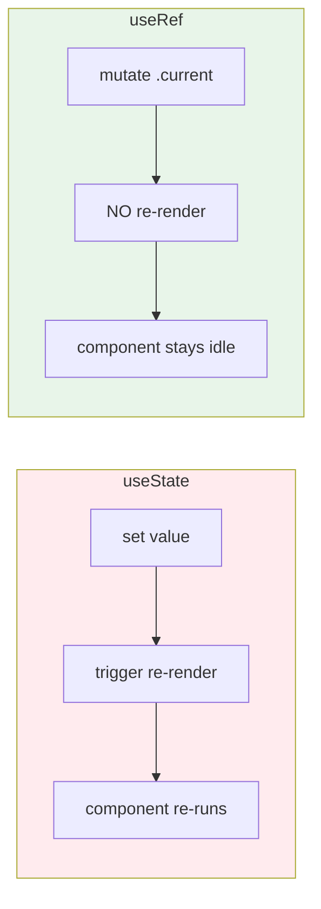
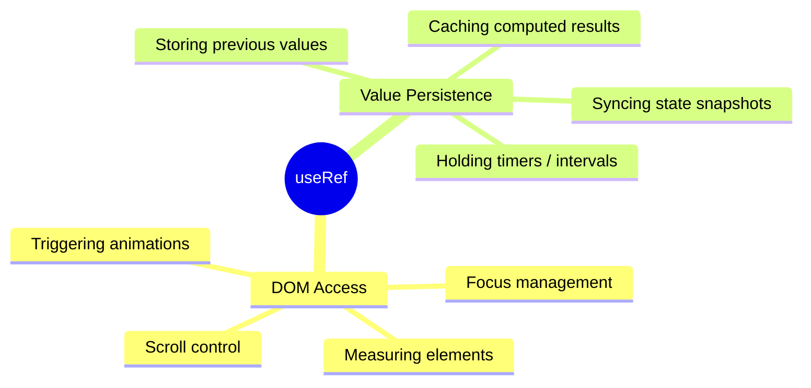
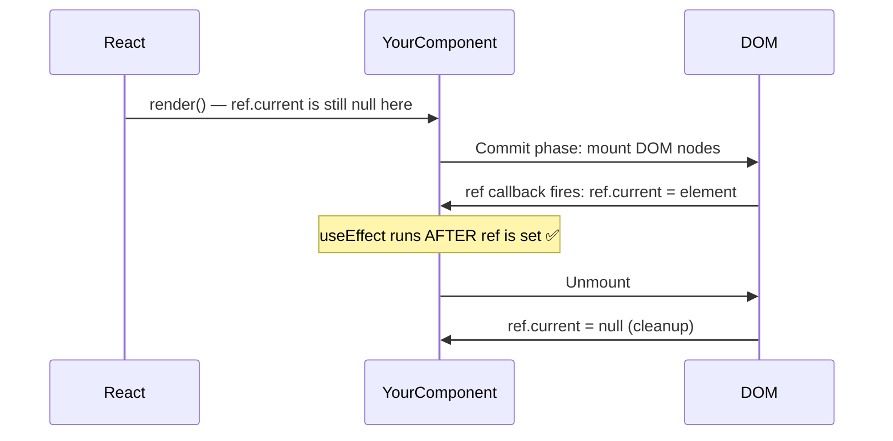
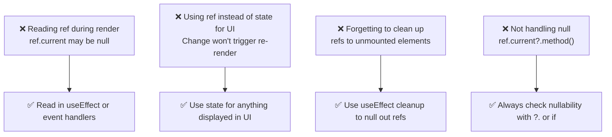
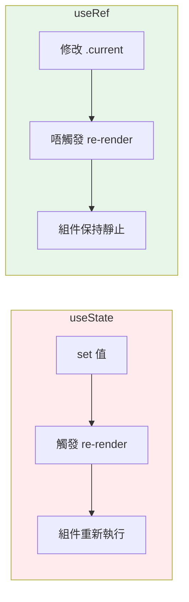
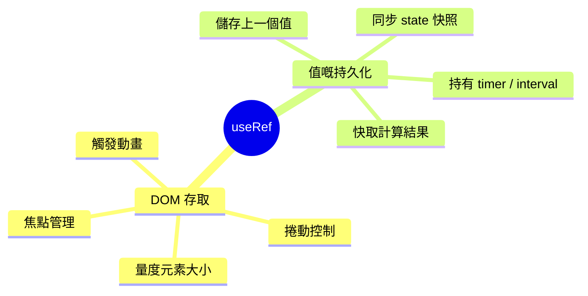
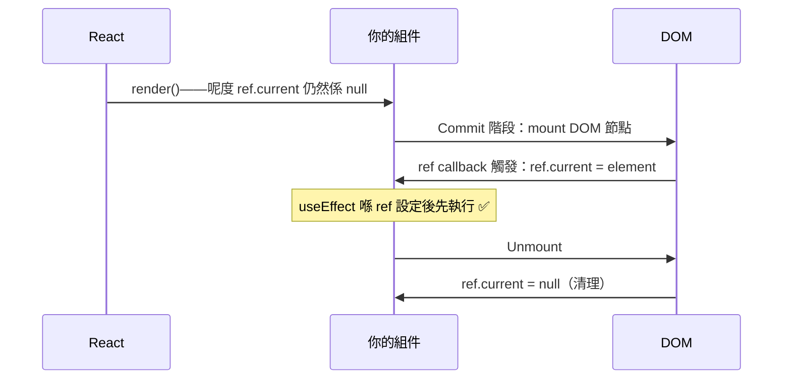
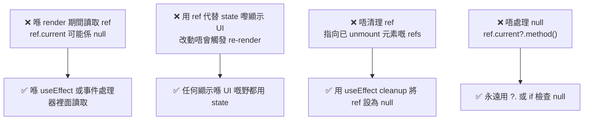

## Background: What Even Is a Ref?

If you've been building React components for a while, you've probably bumped into `useRef` and wondered: *when do I actually reach for this instead of `useState`?*

The short answer is: **whenever you need something to persist across renders without triggering a re-render**. That's the fundamental superpower of `useRef`.

I've been using refs extensively while building multi-box input components, and I realized that `useRef` is one of those hooks that feels cryptic until it *clicks* — and once it does, you see its use cases everywhere. Today, I'll give you that "click" moment.

---

## What Is `useRef`?

At its core, `useRef` returns a **mutable ref object** whose `.current` property is initialized with the value you pass in. The key insight is:

> **Mutating `.current` does NOT trigger a re-render.**

This is the fundamental difference from `useState`.



### The Two Main Use Cases



---

## Use Case 1: Accessing DOM Elements

This is the most common use of `useRef` — getting a direct handle to a DOM node.

### Basic Focus Management


```tsx
import { useRef } from 'react';

function SearchBar() {
  // Create a ref to attach to the input
  const inputRef = useRef<HTMLInputElement>(null);

  const focusInput = () => {
    // Directly call .focus() on the underlying DOM element
    inputRef.current?.focus();
  };

  return (
    <>
      {/* Attach the ref to the DOM element via the `ref` prop */}
      <input ref={inputRef} type="text" placeholder="Search..." />
      <button onClick={focusInput}>Focus Input</button>
    </>
  );
}
```


### Ref Arrays for Dynamic Lists

Things get more interesting when you have a **dynamic number** of elements — for example, a multi-box code input where you need to programmatically focus any box at any time.


```tsx
import { useRef } from 'react';

function PinInput({ length = 6 }: { length?: number }) {
  // An array of refs — one per input box
  const inputsRef = useRef<HTMLInputElement[]>([]);

  const focusBox = (index: number) => {
    inputsRef.current[index]?.focus();
  };

  return (
    <div style={{ display: 'flex', gap: 8 }}>
      {Array.from({ length }).map((_, i) => (
        <input
          key={i}
          // Populate the ref array as each element mounts
          ref={(el) => {
            if (el) inputsRef.current[i] = el;
          }}
          type="text"
          maxLength={1}
          onKeyDown={(e) => {
            // Move to next box on digit, back on Backspace
            if (e.key === 'Backspace' && !e.currentTarget.value && i > 0) {
              focusBox(i - 1);
            }
          }}
          onChange={(e) => {
            if (e.target.value && i < length - 1) {
              focusBox(i + 1);
            }
          }}
          style={{ width: 40, height: 40, textAlign: 'center', fontSize: 20 }}
        />
      ))}
    </div>
  );
}
```


> **Why not `document.querySelector`?** In React's world, the DOM may not always be what you think it is — especially with SSR, StrictMode double-rendering, or concurrent features. Refs are the *correct* React-idiomatic way to touch DOM nodes.

---

## Use Case 2: Persisting Values Without Re-renders

This is the underrated half of `useRef` that many developers miss.

### The Problem with Stale Closures

Consider a `setInterval` inside a React component:


```tsx
import { useState, useEffect } from 'react';

// ❌ BUGGY: count will always be 0 inside the interval
function BuggyTimer() {
  const [count, setCount] = useState(0);

  useEffect(() => {
    const id = setInterval(() => {
      // This closure captures count = 0 at mount time and never updates
      console.log('count is:', count);
    }, 1000);
    return () => clearInterval(id);
  }, []); // empty deps — closure is stale

  return <button onClick={() => setCount(c => c + 1)}>{count}</button>;
}
```


The fix: **use a ref to hold the latest value**, so the interval's closure always reads fresh data.


```tsx
import { useState, useEffect, useRef } from 'react';

// ✅ CORRECT: ref always holds the current value
function FixedTimer() {
  const [count, setCount] = useState(0);
  const countRef = useRef(count);

  // Keep the ref in sync with state on every render
  useEffect(() => {
    countRef.current = count;
  }, [count]);

  useEffect(() => {
    const id = setInterval(() => {
      // Reading from ref always gives us the latest count
      console.log('count is:', countRef.current);
    }, 1000);
    return () => clearInterval(id);
  }, []); // safe now — no stale closure

  return <button onClick={() => setCount(c => c + 1)}>{count}</button>;
}
```


This pattern — **maintaining a "ref mirror" of a state value** — is a common pattern in real-world apps. You'll see it whenever you need to reference current state inside event handlers registered once at mount (WebSockets, `setInterval`, native event listeners, etc.).

### Storing Timer IDs


```tsx
import { useRef } from 'react';

function Debouncer() {
  // Store the timer ID so we can cancel it
  const timerRef = useRef<ReturnType<typeof setTimeout> | null>(null);

  const handleInput = (value: string) => {
    // Cancel any pending timer before starting a new one
    if (timerRef.current) clearTimeout(timerRef.current);

    timerRef.current = setTimeout(() => {
      console.log('Debounced value:', value);
    }, 300);
  };

  return <input onChange={(e) => handleInput(e.target.value)} />;
}
```


---

## The Ref Lifecycle

Understanding *when* a ref gets populated is important to avoid bugs.



The key rule: **`ref.current` is `null` during the first render pass.** It gets set *after* the DOM is committed. This is why you must always use optional chaining (`ref.current?.focus()`) or check nullability before using a DOM ref.

---

## Practical Patterns & Tips

### Pattern 1: Previous Value Tracking


```tsx
import { useRef, useEffect } from 'react';

function usePrevious<T>(value: T): T | undefined {
  const prevRef = useRef<T | undefined>(undefined);

  useEffect(() => {
    // Runs AFTER render — so prevRef holds the last render's value
    prevRef.current = value;
  });

  return prevRef.current; // Returns last render's value during current render
}

// Usage
function PriceTag({ price }: { price: number }) {
  const prevPrice = usePrevious(price);

  return (
    <span style={{ color: price > (prevPrice ?? price) ? 'green' : 'red' }}>
      ${price}
    </span>
  );
}
```


### Pattern 2: Imperative Handle with `forwardRef`

When building component libraries, you sometimes want to expose specific methods to the parent without giving them full DOM access.


```tsx
import { forwardRef, useImperativeHandle, useRef } from 'react';

interface VideoPlayerHandle {
  play: () => void;
  pause: () => void;
}

const VideoPlayer = forwardRef<VideoPlayerHandle>((_, ref) => {
  const videoRef = useRef<HTMLVideoElement>(null);

  // Expose only the methods we want the parent to call
  useImperativeHandle(ref, () => ({
    play: () => videoRef.current?.play(),
    pause: () => videoRef.current?.pause(),
  }));

  return <video ref={videoRef} src="/demo.mp4" />;
});

// Parent usage
function App() {
  const playerRef = useRef<VideoPlayerHandle>(null);

  return (
    <>
      <VideoPlayer ref={playerRef} />
      <button onClick={() => playerRef.current?.play()}>Play</button>
      <button onClick={() => playerRef.current?.pause()}>Pause</button>
    </>
  );
}
```


---

## Common Pitfalls



### Pitfall 1: Treating Ref Like State for UI


```tsx
// ❌ WRONG: UI will NOT update when ref changes
function BadCounter() {
  const countRef = useRef(0);
  return (
    <button onClick={() => { countRef.current += 1; }}>
      Clicked {countRef.current} times {/* always shows 0! */}
    </button>
  );
}

// ✅ CORRECT: Use state for values that affect what the user sees
function GoodCounter() {
  const [count, setCount] = useState(0);
  return (
    <button onClick={() => setCount(c => c + 1)}>
      Clicked {count} times
    </button>
  );
}
```


### Pitfall 2: Mutating Ref During Render


```tsx
// ❌ WRONG: side effects during render are unpredictable in concurrent mode
function BadComponent({ value }: { value: string }) {
  const ref = useRef('');
  ref.current = value; // Don't do this during render

  return <div>{ref.current}</div>;
}

// ✅ CORRECT: Sync in an effect
function GoodComponent({ value }: { value: string }) {
  const ref = useRef('');
  useEffect(() => {
    ref.current = value; // Safe — runs after render
  }, [value]);

  return <div>{value}</div>; // Render from the prop directly
}
```


---

## `useRef` vs `useState` vs `useMemo` — When to Use What

| Need                           | Hook                    |
| ------------------------------ | ----------------------- |
| Value visible in UI            | `useState`              |
| Derived value from other state | `useMemo`               |
| DOM node access                | `useRef`                |
| Timer / interval ID            | `useRef`                |
| Stale closure fix              | `useRef` mirror         |
| Previous render's value        | `useRef` in `useEffect` |

---

## Conclusion

`useRef` has two faces: a **DOM whisperer** and a **render-invisible variable**. The trick is knowing which face you need at any given moment.

- Reach for it when you need to talk directly to the DOM (focus, scroll, measure).
- Reach for it when you need a variable that survives re-renders but shouldn't *cause* them.
- Always treat `ref.current` as potentially `null` at render time.
- Never use it as a replacement for `useState` when the value affects your UI.

Once these rules are internalized, `useRef` stops feeling like a "escape hatch" and starts feeling like an essential tool in your React toolbox.

---

- - -

## 背景：Ref 到底係咩嚟㗎？

如果你已經整咗一段時間 React 組件，你一定試過望住 `useRef` 諗：*我咩時候應該用呢個，而唔係 `useState`？*

簡單嚟講：**當你需要某樣野喺 re-render 之間持久存在，但又唔想觸發 re-render 嘅時候**，就係 `useRef` 出場嘅時候。呢個就係佢嘅核心超能力。

我喺整多格驗證碼輸入組件嘅時候大量用到 refs，先發現 `useRef` 係一個令人費解直至你 *突然明白* 嗰種 hook——一旦你明咗，你到處都見到佢嘅用武之地。今日，我就帶你去感受嗰個「突然明白」嘅時刻。

---

## `useRef` 係咩？

`useRef` 嘅核心係返回一個 **可變嘅 ref 物件**，佢嘅 `.current` 屬性會用你傳入嘅值初始化。關鍵洞察係：

> **改變 `.current` 唔會觸發 re-render。**

呢個就係同 `useState` 嘅根本分別。



### 兩大主要使用場景



---

## 使用場景 1：存取 DOM 元素

呢個係 `useRef` 最常見嘅用法——直接拎到 DOM 節點嘅 handle。

### 基本焦點管理


```tsx
import { useRef } from 'react';

function SearchBar() {
  // 整一個 ref 嚟掛喺 input 上
  const inputRef = useRef<HTMLInputElement>(null);

  const focusInput = () => {
    // 直接喺底層 DOM 元素上調用 .focus()
    inputRef.current?.focus();
  };

  return (
    <>
      {/* 透過 `ref` prop 將 ref 掛到 DOM 元素上 */}
      <input ref={inputRef} type="text" placeholder="搜尋..." />
      <button onClick={focusInput}>聚焦輸入框</button>
    </>
  );
}
```


### Ref 陣列用於動態列表

當你有 **動態數量** 嘅元素時，情況就變得更有趣——例如多格驗證碼輸入，你需要隨時程式化地聚焦任何一格。


```tsx
import { useRef } from 'react';

function PinInput({ length = 6 }: { length?: number }) {
  // 一個 ref 陣列——每個輸入格一個
  const inputsRef = useRef<HTMLInputElement[]>([]);

  const focusBox = (index: number) => {
    inputsRef.current[index]?.focus();
  };

  return (
    <div style={{ display: 'flex', gap: 8 }}>
      {Array.from({ length }).map((_, i) => (
        <input
          key={i}
          // 每個元素 mount 嘅時候填入 ref 陣列
          ref={(el) => {
            if (el) inputsRef.current[i] = el;
          }}
          type="text"
          maxLength={1}
          onKeyDown={(e) => {
            // 打咗數字跳去下一格，撳 Backspace 返去上一格
            if (e.key === 'Backspace' && !e.currentTarget.value && i > 0) {
              focusBox(i - 1);
            }
          }}
          onChange={(e) => {
            if (e.target.value && i < length - 1) {
              focusBox(i + 1);
            }
          }}
          style={{ width: 40, height: 40, textAlign: 'center', fontSize: 20 }}
        />
      ))}
    </div>
  );
}
```


> **點解唔用 `document.querySelector`？** 喺 React 嘅世界裡，DOM 未必係你諗嘅樣——尤其係有 SSR、StrictMode 雙重渲染、或 concurrent features 嘅情況下。Refs 係 *正確* 嘅 React 方式嚟接觸 DOM 節點。

---

## 使用場景 2：唔觸發 Re-render 地持久化值

呢個係 `useRef` 被好多開發者忽略嘅另一半能力。

### Stale Closure 嘅問題

考慮一個喺 React 組件裡面嘅 `setInterval`：


```tsx
import { useState, useEffect } from 'react';

// ❌ 有 BUG：interval 裡面嘅 count 永遠都係 0
function BuggyTimer() {
  const [count, setCount] = useState(0);

  useEffect(() => {
    const id = setInterval(() => {
      // 呢個 closure 喺 mount 時捕捉咗 count = 0，永遠唔更新
      console.log('count is:', count);
    }, 1000);
    return () => clearInterval(id);
  }, []); // 空依賴——closure 係 stale 嘅

  return <button onClick={() => setCount(c => c + 1)}>{count}</button>;
}
```


修復方法：**用 ref 嚟持有最新嘅值**，咁 interval 嘅 closure 就永遠讀到最新資料。


```tsx
import { useState, useEffect, useRef } from 'react';

// ✅ 正確：ref 永遠持有當前值
function FixedTimer() {
  const [count, setCount] = useState(0);
  const countRef = useRef(count);

  // 每次 render 都同步 ref 同 state
  useEffect(() => {
    countRef.current = count;
  }, [count]);

  useEffect(() => {
    const id = setInterval(() => {
      // 從 ref 讀取永遠給你最新嘅 count
      console.log('count is:', countRef.current);
    }, 1000);
    return () => clearInterval(id);
  }, []); // 而家係安全嘅——冇 stale closure

  return <button onClick={() => setCount(c => c + 1)}>{count}</button>;
}
```


呢個模式——**維護一個 state 值嘅「ref 鏡像」**——喺實際應用中非常常見。每當你需要喺只 mount 一次嘅 event handler 裡面引用當前 state（WebSockets、`setInterval`、native event listener 等），你都會用到佢。

### 儲存 Timer ID


```tsx
import { useRef } from 'react';

function Debouncer() {
  // 儲存 timer ID 咁我哋先可以取消佢
  const timerRef = useRef<ReturnType<typeof setTimeout> | null>(null);

  const handleInput = (value: string) => {
    // 開新 timer 之前先取消所有待處理嘅 timer
    if (timerRef.current) clearTimeout(timerRef.current);

    timerRef.current = setTimeout(() => {
      console.log('Debounced value:', value);
    }, 300);
  };

  return <input onChange={(e) => handleInput(e.target.value)} />;
}
```


---

## Ref 嘅生命週期

了解 ref *幾時* 會被填入非常重要，可以避免好多 bug。



關鍵規則：**`ref.current` 喺第一次 render pass 期間係 `null`。** 佢喺 DOM commit 之後先被設定。所以你必須永遠用 optional chaining（`ref.current?.focus()`）或者喺使用 DOM ref 之前檢查 null。

---

## 實用模式同技巧

### 模式 1：追蹤上一個值


```tsx
import { useRef, useEffect } from 'react';

function usePrevious<T>(value: T): T | undefined {
  const prevRef = useRef<T | undefined>(undefined);

  useEffect(() => {
    // 喺 render 之後執行——所以 prevRef 持有上一次 render 嘅值
    prevRef.current = value;
  });

  return prevRef.current; // 喺當前 render 期間返回上一次 render 嘅值
}

// 使用方式
function PriceTag({ price }: { price: number }) {
  const prevPrice = usePrevious(price);

  return (
    <span style={{ color: price > (prevPrice ?? price) ? 'green' : 'red' }}>
      ${price}
    </span>
  );
}
```


### 模式 2：用 `forwardRef` 嘅 Imperative Handle

整組件庫嘅時候，你有時想向父組件暴露特定方法，而唔係畀佢哋完整嘅 DOM 存取權。


```tsx
import { forwardRef, useImperativeHandle, useRef } from 'react';

interface VideoPlayerHandle {
  play: () => void;
  pause: () => void;
}

const VideoPlayer = forwardRef<VideoPlayerHandle>((_, ref) => {
  const videoRef = useRef<HTMLVideoElement>(null);

  // 只暴露我哋想父組件調用嘅方法
  useImperativeHandle(ref, () => ({
    play: () => videoRef.current?.play(),
    pause: () => videoRef.current?.pause(),
  }));

  return <video ref={videoRef} src="/demo.mp4" />;
});

// 父組件用法
function App() {
  const playerRef = useRef<VideoPlayerHandle>(null);

  return (
    <>
      <VideoPlayer ref={playerRef} />
      <button onClick={() => playerRef.current?.play()}>播放</button>
      <button onClick={() => playerRef.current?.pause()}>暫停</button>
    </>
  );
}
```


---

## 常見陷阱



### 陷阱 1：將 Ref 當 State 嚟顯示 UI


```tsx
// ❌ 錯：ref 改變嘅時候 UI 唔會更新
function BadCounter() {
  const countRef = useRef(0);
  return (
    <button onClick={() => { countRef.current += 1; }}>
      點擊咗 {countRef.current} 次 {/* 永遠顯示 0！*/}
    </button>
  );
}

// ✅ 啱：用 state 嚟儲存影響用戶介面嘅值
function GoodCounter() {
  const [count, setCount] = useState(0);
  return (
    <button onClick={() => setCount(c => c + 1)}>
      點擊咗 {count} 次
    </button>
  );
}
```


### 陷阱 2：喺 Render 期間修改 Ref


```tsx
// ❌ 錯：喺 render 期間有副作用喺 concurrent mode 下係不可預測嘅
function BadComponent({ value }: { value: string }) {
  const ref = useRef('');
  ref.current = value; // 唔好喺 render 期間咁做

  return <div>{ref.current}</div>;
}

// ✅ 啱：喺 effect 裡面同步
function GoodComponent({ value }: { value: string }) {
  const ref = useRef('');
  useEffect(() => {
    ref.current = value; // 安全——喺 render 之後執行
  }, [value]);

  return <div>{value}</div>; // 直接從 prop render
}
```


---

## `useRef` vs `useState` vs `useMemo`——幾時用邊個？

| 需求                  | Hook                         |
| --------------------- | ---------------------------- |
| 喺 UI 顯示嘅值        | `useState`                   |
| 從其他 state 衍生嘅值 | `useMemo`                    |
| DOM 節點存取          | `useRef`                     |
| Timer / interval ID   | `useRef`                     |
| 修復 stale closure    | `useRef` 鏡像                |
| 上一次 render 嘅值    | `useRef` 喺 `useEffect` 裡面 |

---

## 總結

`useRef` 有兩面：**DOM 低語者** 同 **唔見得光嘅變數**。訣竅係知道喺任何特定時刻你需要邊一面。

- 當你需要直接同 DOM 溝通（focus、scroll、量度），就攞出嚟用。
- 當你需要一個喺 re-render 之間存活但唔應該 *引起* re-render 嘅變數，就攞出嚟用。
- 永遠將 `ref.current` 視為喺 render 時可能係 `null`。
- 永遠唔好用佢代替 `useState` 嚟儲存影響 UI 嘅值。

一旦呢啲規則都內化咗，`useRef` 就唔再係個「逃生出口」，而係你 React 工具箱裡面嘅必備工具。
