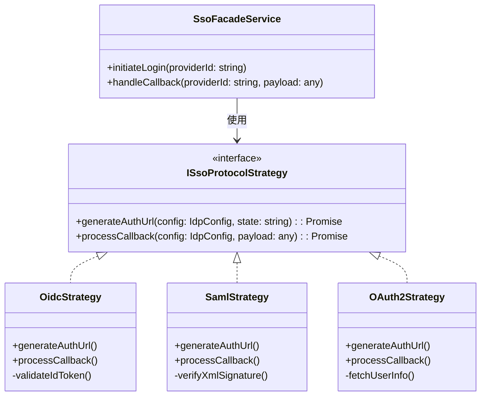

## Introduction: The Shift to Federated Identity

Welcome to the first installment of our comprehensive series on building an Enterprise Single Sign-On (SSO) system. If you followed our previous 10-part series on Time-Based One-Time Passwords (TOTP), you understand the rigorous security requirements necessary for modern application development. As systems grow, managing local credentials becomes a liability. Enterprise customers demand seamless integration with their existing Identity Providers (IdPs) like Microsoft Entra ID (formerly Azure AD), Okta, Ping Identity, and Google Workspace.

Implementing SSO is far more complex than dropping in a social login button. A true enterprise SSO implementation must support multiple legacy and modern protocols, handle dynamic configuration, map identity attributes precisely, and, most importantly, secure cryptographic secrets and certificates at rest. In this series, we will design and implement a robust SSO architecture from the ground up, based on a rigorous functional requirement specification.

In Part 1, we focus on the **Architectural Foundation**, **Protocol Selection**, and **Core Security Mechanisms**. We will explore how to use the Strategy Design Pattern to support OAuth 2.0, OpenID Connect (OIDC), and SAML 2.0 gracefully, and how to protect sensitive IdP configurations using Envelope Encryption and Proof Key for Code Exchange (PKCE).

---

## 1. Protocol Deep Dive: The Triad of Enterprise SSO

To build a universal SSO gateway, we must support the three pillars of federated identity. Each protocol has its own semantic rules, security considerations, and historical context.

### OAuth 2.0 (Authorization Framework)
OAuth 2.0 is fundamentally an *authorization* framework, not an authentication protocol. It is designed to grant a third-party application limited access to an HTTP service. However, historically, it has been co-opted for pseudo-authentication (e.g., "Sign in with GitHub").
- **Flows Supported:** We must support the highly secure **Authorization Code Flow** (where a code is exchanged for an access token via a secure back-channel) and the legacy **Implicit Flow** (where tokens are returned directly in the URI fragment).
- **Security Warning:** The Implicit Flow is officially deprecated by the OAuth 2.0 Security Best Current Practice (RFC 9700) due to token leakage in browser histories and referer headers. We provide it strictly as a fallback for archaic IdPs.

### OpenID Connect (OIDC)
OIDC sits on top of OAuth 2.0 and provides a standardized identity layer. It introduces the **ID Token**, a signed JSON Web Token (JWT) containing cryptographically verifiable claims about the authenticated user.
- **Standard Claims:** It provides standard attributes like `sub` (subject identifier), `email`, and `preferred_username`.
- **Validation:** Implementing OIDC requires fetching the IdP's JSON Web Key Set (JWKS) to mathematically verify the signature of the ID Token before trusting any data within it.

### SAML 2.0 (Security Assertion Markup Language)
Despite its age, SAML 2.0 remains the heavyweight champion of corporate enterprise environments, particularly in healthcare, finance, and government sectors.
- **XML-Based:** It relies on massive XML documents called Assertions, signed using XML Digital Signatures.
- **Trust Model:** Trust is established out-of-band by exchanging metadata XML files containing public X.509 certificates.
- **Complexity:** Parsing and validating SAML responses requires meticulous attention to XML canonicalization and signature validation to prevent XML Signature Wrapping (XSW) attacks.

---

## 2. Architectural Design: The Strategy Pattern

When dealing with multiple distinct authentication protocols, a naive approach uses massive `if/else` or `switch` statements scattered across controllers and services. This violates the **Open/Closed Principle** (OCP) of SOLID design.

Instead, we employ the **Strategy Pattern**. We define a common interface `ISsoProtocolStrategy`, and implement concrete strategies for OIDC, OAuth2, and SAML. A factory or registry resolves the correct strategy dynamically based on the IdP's configuration at runtime.

### Mermaid Diagram: Strategy Architecture


### Code Implementation: Strategy Interface and Factory

Let's look at the clean code implementation in TypeScript (NestJS context).

```typescript
// src/sso/interfaces/sso-strategy.interface.ts
import { IdpProviderConfig } from '../entities/idp-provider.entity';
import { SsoUserClaims } from '../dto/sso-user-claims.dto';

export interface ISsoProtocolStrategy {
  /**
   * Generates the authorization URL to redirect the user to the IdP.
   * Also generates and stores necessary state parameters (State, Nonce, PKCE).
   */
  initiateLogin(
    providerConfig: IdpProviderConfig, 
    redirectUri: string
  ): Promise<string>;

  /**
   * Processes the callback payload from the IdP (e.g., query params, form body).
   * Validates tokens/assertions and extracts normalized user claims.
   */
  processCallback(
    providerConfig: IdpProviderConfig, 
    payload: any, 
    storedState: string
  ): Promise<SsoUserClaims>;
}
```

```typescript
// src/sso/services/sso-strategy.factory.ts
import { Injectable, InternalServerErrorException } from '@nestjs/common';
import { ProtocolType } from '../enums/protocol-type.enum';
import { ISsoProtocolStrategy } from '../interfaces/sso-strategy.interface';
import { OidcStrategy } from '../strategies/oidc.strategy';
import { SamlStrategy } from '../strategies/saml.strategy';
import { OAuth2Strategy } from '../strategies/oauth2.strategy';

@Injectable()
export class SsoStrategyFactory {
  constructor(
    private readonly oidcStrategy: OidcStrategy,
    private readonly samlStrategy: SamlStrategy,
    private readonly oauth2Strategy: OAuth2Strategy,
  ) {}

  getStrategy(protocolType: ProtocolType): ISsoProtocolStrategy {
    switch (protocolType) {
      case ProtocolType.OIDC:
        return this.oidcStrategy;
      case ProtocolType.SAML2:
        return this.samlStrategy;
      case ProtocolType.OAUTH2:
        return this.oauth2Strategy;
      default:
        throw new InternalServerErrorException(`Unsupported protocol type: ${protocolType}`);
    }
  }
}
```

By decoupling the protocol-specific logic into separate classes, we ensure our core `SsoCallbackService` remains perfectly clean. If we ever need to add a new protocol (like WS-Federation), we simply write a new strategy without touching existing code.

---

## 3. Security Foundation: Envelope Encryption for IdP Secrets

In an enterprise SSO system, the database stores highly sensitive data:
- **OAuth/OIDC Client Secrets**: Used to authenticate the server to the IdP during token exchange.
- **SAML Private Keys**: Used to sign SAML AuthnRequests and decrypt incoming Assertions.
- **mTLS Private Keys**: Used for mutual TLS client authentication during token exchange.

If the database is compromised, these secrets could allow an attacker to forge logins or impersonate the application to the IdP. **Never store these secrets in plaintext.**

We reuse the robust **Envelope Encryption** architecture from our TOTP series. 
1. **Layer 1 (KEK - Key Encryption Key)**: A master key derived at application startup via HKDF-SHA256 from an environment variable and salt file. Lives in memory, never persisted.
2. **Layer 2 (DEK - Data Encryption Key)**: A unique AES-256 key generated for each Identity Provider configuration. It is stored in the database, but wrapped (encrypted) by the KEK.
3. **Layer 3 (Ciphertext)**: The actual JSON config containing the client secret, encrypted using the provider's unique DEK via AES-256-GCM.

### Code Implementation: Managing Encrypted Provider Config

```typescript
// src/sso/services/idp-secret-manager.service.ts
import { Injectable, InternalServerErrorException } from '@nestjs/common';
import * as crypto from 'crypto';
import { EnterpriseEncryptionService } from '../../core/security/encryption.service';
import { KekManagementService } from '../../core/security/kek-management.service';
import { IdpProvider } from '../entities/idp-provider.entity';

@Injectable()
export class IdpSecretManagerService {
  constructor(
    private readonly encryptionService: EnterpriseEncryptionService,
    private readonly kekService: KekManagementService,
  ) {}

  /**
   * Encrypts the sensitive configuration JSON for a new or updated IdP.
   */
  async encryptProviderConfig(providerId: string, plainConfig: any): Promise<{ encryptedBlob: string, wrappedDek: string }> {
    const activeKek = this.kekService.getActiveKek();
    if (!activeKek) {
      throw new InternalServerErrorException('KEK is not initialized');
    }

    // 1. Generate a unique Data Encryption Key (DEK) for this specific provider
    const dek = crypto.randomBytes(32);

    // 2. Wrap the DEK using the global KEK (AES-256-GCM)
    // We use the providerId as Additional Authenticated Data (AAD) to bind the DEK to this row
    const wrappedDek = this.encryptionService.encryptWithAad(dek, activeKek, providerId);

    // 3. Encrypt the actual configuration JSON using the raw DEK (AES-256-GCM)
    const configString = JSON.stringify(plainConfig);
    const encryptedBlob = this.encryptionService.encrypt(configString, dek);

    // Clear DEK from memory immediately
    dek.fill(0);

    return { encryptedBlob, wrappedDek };
  }

  /**
   * Decrypts the provider configuration at runtime.
   */
  async decryptProviderConfig(provider: IdpProvider): Promise<any> {
    const activeKek = this.kekService.getActiveKek();
    
    try {
      // 1. Unwrap the DEK using KEK and AAD
      const rawDek = this.encryptionService.decryptWithAad(
        provider.configDekWrapped, 
        activeKek, 
        provider.id
      );

      // 2. Decrypt the config blob using the unrwapped DEK
      const plainString = this.encryptionService.decrypt(provider.configEncrypted, rawDek);
      
      // Clear DEK from memory
      rawDek.fill(0);

      return JSON.parse(plainString);
    } catch (e) {
      throw new InternalServerErrorException('Failed to decrypt IdP configuration. Possible data corruption or KEK mismatch.');
    }
  }
}
```

This ensures that even if an attacker dumps the `idp_provider` table, they only get AES-256-GCM ciphertext. Without the in-memory KEK (which lives only in the running Node.js process environment variables), the data is mathematically impenetrable.

---

## 4. Security Pillar: Defeating Interception with PKCE

For OAuth 2.0 and OIDC Authorization Code flows, the user is redirected to the IdP, authenticates, and is redirected back with an `authorization_code` in the URL. If a malicious app on the user's device intercepts this redirect URL, it could steal the code and exchange it for an access token.

To prevent this, we implement **PKCE (Proof Key for Code Exchange)** (RFC 7636).
When initiating the login, the backend generates a random `code_verifier` and hashes it (using SHA-256) to create a `code_challenge`. The backend sends the challenge to the IdP. When the backend later exchanges the code for a token, it sends the original plaintext `code_verifier`. The IdP hashes it and verifies it matches the original challenge. A malicious interceptor cannot exchange the code because they don't know the original `code_verifier`.

### Code Implementation: PKCE Generator

```typescript
// src/sso/utils/pkce.util.ts
import * as crypto from 'crypto';

export interface PkceData {
  verifier: string;
  challenge: string;
  method: 'S256' | 'plain';
}

export class PkceGenerator {
  /**
   * Generates a cryptographically secure PKCE verifier and its S256 challenge.
   */
  static generate(): PkceData {
    // RFC 7636 dictates verifier must be between 43 and 128 chars.
    // 32 bytes of random data base64url encoded yields 43 characters.
    const verifierBuffer = crypto.randomBytes(32);
    
    // Base64URL encode without padding
    const verifier = verifierBuffer.toString('base64')
      .replace(/\+/g, '-')
      .replace(/\//g, '_')
      .replace(/=/g, '');

    // Hash with SHA-256 for the challenge
    const hash = crypto.createHash('sha256').update(verifier).digest();
    
    const challenge = hash.toString('base64')
      .replace(/\+/g, '-')
      .replace(/\//g, '_')
      .replace(/=/g, '');

    return {
      verifier,
      challenge,
      method: 'S256',
    };
  }
}
```

During login initiation, the `verifier` must be stored securely in a fast cache (like Redis) bound to the `state` parameter, so it can be retrieved during the callback phase.

### Code Implementation: Stateful Session Management (Redis)

To protect against Cross-Site Request Forgery (CSRF) and store the PKCE verifier, we generate a cryptographically random `state` parameter and cache the session context in Redis.

```typescript
// src/sso/services/sso-state.service.ts
import { Injectable, BadRequestException } from '@nestjs/common';
import { Redis } from 'ioredis';
import * as crypto from 'crypto';

export interface SsoStateContext {
  providerId: string;
  pkceVerifier?: string;
  nonce?: string; // For OIDC ID Token replay protection
  redirectUri: string;
}

@Injectable()
export class SsoStateService {
  constructor(private readonly redisClient: Redis) {}

  async createContext(context: SsoStateContext, ttlSeconds: number = 300): Promise<string> {
    // Generate a secure random state string
    const state = crypto.randomBytes(24).toString('hex');
    
    const cacheKey = `sso_state:${state}`;
    
    // Store context in Redis with an expiry (e.g., 5 minutes)
    await this.redisClient.set(
      cacheKey, 
      JSON.stringify(context), 
      'EX', 
      ttlSeconds
    );
    
    return state;
  }

  async validateAndConsumeState(state: string): Promise<SsoStateContext> {
    const cacheKey = `sso_state:${state}`;
    
    // Atomically read and delete the state using Redis pipeline or GETDEL
    // GETDEL is available in Redis 6.2+
    const contextJson = await this.redisClient.getdel(cacheKey);
    
    if (!contextJson) {
      throw new BadRequestException('Invalid or expired SSO state. Please try logging in again.');
    }
    
    return JSON.parse(contextJson) as SsoStateContext;
  }
}
```

This ensures that the `state` is single-use. If an attacker tries to replay an old callback URL, the Redis lookup will fail, stopping the attack instantly.

---

## Looking Ahead

In this first part, we have laid the absolute foundation for an enterprise-grade SSO system. We've established a clean Strategy architecture to handle multiple protocols cleanly, fortified our database with Envelope Encryption to protect client secrets, and implemented rock-solid cryptographic mechanisms like PKCE and stateful anti-CSRF protection via Redis.

In Part 2, we will dive deep into **Admin Configuration & Attribute Mapping**. We will explore how to build dynamic user interfaces to configure these IdPs, handle Auto-Discovery of metadata via OpenID well-known endpoints, and implement an advanced mapping engine that translates remote IdP claims into local normalized user profiles securely.

Stay tuned, and keep building securely!

<br><br><br>

---
---

## 簡介：邁向聯邦身份認證 (Federated Identity) 嘅時代

歡迎來到我哋構建「企業級單一登入 (Enterprise SSO)」系統系列嘅第一集。如果你有追看我哋之前關於 Time-Based One-Time Password (TOTP) 嘅 10 集系列，你就會明白現代 Application 開發背後嗰種對保安極度嚴苛嘅要求。當系統越嚟越大，要自己管住堆 Local passwords 簡直係一個計時炸彈。企業級嘅客戶依家都會要求你個 System 要無縫對接佢哋現有嘅 Identity Providers (IdPs)，好似 Microsoft Entra ID (即係以前嘅 Azure AD)、Okta、Ping Identity 同埋 Google Workspace 咁。

整一個 SSO 絕對唔係喺畫面加粒「用 Google 登入」嘅按鈕咁簡單。一個真正嘅企業級 SSO 實作，必須要支援多種新舊 Protocols、處理動態嘅 Configuration、精準咁 Mapping 用戶嘅屬性 (Attributes)，最重要嘅係，要極度安全咁保護住啲密碼學 Secrets 同 Certificates。喺呢個系列入面，我哋會根據一份極度嚴謹嘅 Requirement Specification，由零開始設計同實作一個堅不可摧嘅 SSO 架構。

喺第一集，我哋會將重點放喺 **架構基礎 (Architectural Foundation)**、**協定選擇 (Protocol Selection)** 同埋 **核心保安機制 (Core Security Mechanisms)**。我哋會探討點樣運用策略模式 (Strategy Pattern) 去優雅地支援 OAuth 2.0、OpenID Connect (OIDC) 同 SAML 2.0，同埋點樣透過信封加密 (Envelope Encryption) 以及 PKCE 嚟保護敏感嘅 IdP 設定。

---

## 1. 協定深度解析：企業 SSO 嘅三大支柱

要整一個通用嘅 SSO Gateway，我哋必須支援聯邦身份認證嘅三大支柱。每一種 Protocol 都有佢自己嘅語義規則、保安考量同歷史背景。

### OAuth 2.0 (授權框架)
OAuth 2.0 本質上係一個 *授權 (Authorization)* 框架，而唔係一個認證 (Authentication) 協定。佢原本嘅設計係為咗俾第三方 App 攞到有限度嘅 API Access。不過，歷史演變落嚟，佢成日俾人借用嚟做「偽認證」(例如 "Sign in with GitHub")。
- **支援嘅 Flows：** 我哋必須支援高度安全嘅 **Authorization Code Flow** (透過 Secure 嘅 Back-channel 用 Code 換 Token)，同時亦要為咗向後兼容而支援舊式嘅 **Implicit Flow** (Token 直接喺 URL Fragment 度回傳)。
- **保安警告：** 根據最新的 OAuth 2.0 Security Best Current Practice (RFC 9700)，Implicit Flow 已經正式被 Deprecated (棄用)，因為 Token 容易喺 Browser history 同 Referer headers 洩漏。我哋提供佢，純粹係為咗應付一啲超級上古嘅 IdPs 作為 Fallback。

### OpenID Connect (OIDC)
OIDC 係騎喺 OAuth 2.0 上面嘅一個標準化身份層 (Identity layer)。佢引入咗 **ID Token** 呢樣嘢，其實就係一個 Signed JWT，入面包住咗已經通過密碼學驗證嘅用戶 Claims。
- **標準 Claims：** 佢提供咗好多標準化嘅 Attributes，好似 `sub` (用戶唯一標識)、`email` 同埋 `preferred_username` 咁。
- **驗證 (Validation)：** Implement OIDC 必須要識得去 IdP 攞佢哋嘅 JSON Web Key Set (JWKS)，然後用數學方法 Verify 咗 ID Token 個 Signature，先好信入面嘅 Data。

### SAML 2.0 (安全性聲明標記語言)
雖然 SAML 2.0 已經有啲歷史，但佢依然係大企業 (尤其係醫療、金融同政府部門) 嘅終極大佬。
- **基於 XML：** 佢依賴一種叫 Assertions 嘅超大舊 XML Documents，而且用 XML Digital Signatures 簽名。
- **信任模型 (Trust Model)：** 信任關係係靠線下交換 Metadata XML files 嚟建立嘅，入面有晒 Public X.509 Certificates。
- **複雜度：** Parse 同埋 Validate SAML responses 需要對 XML Canonicalization (規範化) 同 Signature validation 極度小心，如果唔係好容易中 XML Signature Wrapping (XSW) 攻擊。

---

## 2. 架構設計：策略模式 (The Strategy Pattern)

當你要處理幾種完全唔同嘅 Authentication protocols 嗰陣，最天真 (Naive) 嘅做法就係喺 Controllers 同 Services 入面寫到周圍都係 `if/else` 或者 `switch`。咁樣係完全違反咗 SOLID 原則入面嘅 **開閉原則 (Open/Closed Principle, OCP)**。

相反，我哋會運用 **策略模式 (Strategy Pattern)**。我哋定義一個 Common 嘅 Interface `ISsoProtocolStrategy`，然後為 OIDC、OAuth2 同 SAML 寫具體嘅 Strategies。之後用一個 Factory 根據 IdP 嘅設定，喺 Runtime 動態咁簡返啱用嘅 Strategy 出嚟。

### Mermaid 架構圖：策略模式



### Code 實作：Strategy Interface 與 Factory

我哋睇吓喺 TypeScript (NestJS 環境) 入面點樣寫出極致 Clean 嘅 Code。

```typescript
// src/sso/interfaces/sso-strategy.interface.ts
import { IdpProviderConfig } from '../entities/idp-provider.entity';
import { SsoUserClaims } from '../dto/sso-user-claims.dto';

export interface ISsoProtocolStrategy {
  /**
   * 產生一個用嚟 Redirect 用戶去 IdP 嘅 Authorization URL。
   * 同時會 Generate 同埋 Store 必須嘅 State parameters (State, Nonce, PKCE)。
   */
  initiateLogin(
    providerConfig: IdpProviderConfig, 
    redirectUri: string
  ): Promise<string>;

  /**
   * 處理 IdP Callback 彈返嚟嘅 Payload (例如 Query params, Form body)。
   * 負責 Validate tokens/assertions 同埋抽出 Normalize 好嘅用戶 Claims。
   */
  processCallback(
    providerConfig: IdpProviderConfig, 
    payload: any, 
    storedState: string
  ): Promise<SsoUserClaims>;
}
```

```typescript
// src/sso/services/sso-strategy.factory.ts
import { Injectable, InternalServerErrorException } from '@nestjs/common';
import { ProtocolType } from '../enums/protocol-type.enum';
import { ISsoProtocolStrategy } from '../interfaces/sso-strategy.interface';
import { OidcStrategy } from '../strategies/oidc.strategy';
import { SamlStrategy } from '../strategies/saml.strategy';
import { OAuth2Strategy } from '../strategies/oauth2.strategy';

@Injectable()
export class SsoStrategyFactory {
  constructor(
    private readonly oidcStrategy: OidcStrategy,
    private readonly samlStrategy: SamlStrategy,
    private readonly oauth2Strategy: OAuth2Strategy,
  ) {}

  getStrategy(protocolType: ProtocolType): ISsoProtocolStrategy {
    switch (protocolType) {
      case ProtocolType.OIDC:
        return this.oidcStrategy;
      case ProtocolType.SAML2:
        return this.samlStrategy;
      case ProtocolType.OAUTH2:
        return this.oauth2Strategy;
      default:
        throw new InternalServerErrorException(`唔支援嘅 Protocol type: ${protocolType}`);
    }
  }
}
```

透過將 Protocol specific 嘅邏輯 Decouple (解耦) 到獨立嘅 Classes 入面，我哋確保核心嘅 `SsoCallbackService` 永遠保持完美乾淨。如果將來老細話要加一隻新 Protocol (例如 WS-Federation)，我哋只需要寫一隻新嘅 Strategy 就搞掂，完全唔使掂到現有嘅 Code。

---

## 3. 保安基礎：用信封加密保護 IdP Secrets

喺企業級 SSO 系統入面，Database 裝住超級敏感嘅資料：
- **OAuth/OIDC Client Secrets**: 喺 Token exchange 嗰陣，Server 用嚟向 IdP 證明自己身份嘅密碼。
- **SAML Private Keys**: 用嚟 Sign SAML AuthnRequests 同埋 Decrypt 收返嚟嘅 Assertions 嘅私鑰。
- **mTLS Private Keys**: 喺 Token exchange 做 Mutual TLS Client authentication 嗰陣用。

如果 Database 俾黑客爆咗，呢堆 Secrets 會令到黑客可以隨意偽造登入，或者冒認你個 App 去呃 IdP。**所以絕對、絕對唔可以將呢啲 Secrets 明文 (Plaintext) 咁 Save！**

我哋會重用返喺 TOTP 系列度講過嘅超強 **信封加密 (Envelope Encryption)** 架構。
1. **第一層 (KEK - 金鑰加密金鑰)**: App 啟動嗰陣，透過 HKDF-SHA256 由 Environment variable 同 Salt file 計出嚟嘅 Master key。只會活喺 Memory，永遠唔會落 Hard disk。
2. **第二層 (DEK - 資料加密金鑰)**: 為每一個 IdP Configuration 獨立 Generate 嘅一把 AES-256 Key。佢會被 KEK Wrap (加密) 住，然後 Save 落 Database。
3. **第三層 (密文 Ciphertext)**: 真正包住 Client secret 嘅 JSON config，佢係被嗰個 Provider 專屬嘅 DEK 透過 AES-256-GCM 加密嘅。

### Code 實作：管理加密咗嘅 Provider 設定

```typescript
// src/sso/services/idp-secret-manager.service.ts
import { Injectable, InternalServerErrorException } from '@nestjs/common';
import * as crypto from 'crypto';
import { EnterpriseEncryptionService } from '../../core/security/encryption.service';
import { KekManagementService } from '../../core/security/kek-management.service';
import { IdpProvider } from '../entities/idp-provider.entity';

@Injectable()
export class IdpSecretManagerService {
  constructor(
    private readonly encryptionService: EnterpriseEncryptionService,
    private readonly kekService: KekManagementService,
  ) {}

  /**
   * 將新增或更新嘅 IdP 敏感設定 JSON 做加密。
   */
  async encryptProviderConfig(providerId: string, plainConfig: any): Promise<{ encryptedBlob: string, wrappedDek: string }> {
    const activeKek = this.kekService.getActiveKek();
    if (!activeKek) {
      throw new InternalServerErrorException('KEK 仲未初始化！');
    }

    // 1. 為呢個 Provider 生成一條專屬嘅 Data Encryption Key (DEK)
    const dek = crypto.randomBytes(32);

    // 2. 用全局嘅 KEK 去 Wrap 住條 DEK (AES-256-GCM)
    // 我哋用 providerId 作為 Additional Authenticated Data (AAD)，將條 DEK 綁死喺呢一行 record 度
    const wrappedDek = this.encryptionService.encryptWithAad(dek, activeKek, providerId);

    // 3. 用條原生嘅 DEK 去加密真正嘅 Configuration JSON (AES-256-GCM)
    const configString = JSON.stringify(plainConfig);
    const encryptedBlob = this.encryptionService.encrypt(configString, dek);

    // 即刻喺 Memory 度清空條 DEK
    dek.fill(0);

    return { encryptedBlob, wrappedDek };
  }

  /**
   * 喺 Runtime 解密 Provider 嘅設定。
   */
  async decryptProviderConfig(provider: IdpProvider): Promise<any> {
    const activeKek = this.kekService.getActiveKek();
    
    try {
      // 1. 配合 KEK 同 AAD 解開 (Unwrap) 條 DEK
      const rawDek = this.encryptionService.decryptWithAad(
        provider.configDekWrapped, 
        activeKek, 
        provider.id
      );

      // 2. 用解開咗嘅 DEK 去解密舊 Config blob
      const plainString = this.encryptionService.decrypt(provider.configEncrypted, rawDek);
      
      // 喺 Memory 度清空 DEK
      rawDek.fill(0);

      return JSON.parse(plainString);
    } catch (e) {
      throw new InternalServerErrorException('無法解密 IdP 設定。資料可能損毀，或者 KEK 唔夾。');
    }
  }
}
```

咁樣做，就算黑客 Dump 咗成個 `idp_provider` Table 走，佢哋攞到嘅都只係一堆 AES-256-GCM 嘅 Ciphertext。如果冇咗喺 Memory 入面嗰條 KEK (即係淨係活喺 Node.js Process 嘅 Environment variables 入面嘅嘢)，喺數學上係絕對破解唔到嘅。

---

## 4. 保安防線：用 PKCE 擊破攔截攻擊

喺 OAuth 2.0 同 OIDC 嘅 Authorization Code flow 入面，用戶會被 Redirect 去 IdP，搞掂認證之後，會連埋一個 `authorization_code` 喺 URL 度彈返轉頭。如果用戶部機入面有隻古惑嘅 App 攔截咗呢條 Redirect URL，佢就可以偷走個 Code，然後自己拎去換 Access token。

為咗防範呢點，我哋必須實作 **PKCE (Proof Key for Code Exchange)** (RFC 7636)。
喺 Initiate 登入嗰陣，Backend 會 Generate 一個 Random 嘅 `code_verifier`，然後將佢 Hash 咗 (用 SHA-256) 變做 `code_challenge`。Backend 將個 Challenge send 去 IdP。當 Backend 之後攞個 Code 去換 Token 嗰陣，佢會交出原本 Plaintext 嘅 `code_verifier`。IdP 會自己 Hash 一次，然後對比吓係咪 Match 原本個 Challenge。一隻惡意攔截嘅 App 就算偷到 Code 都換唔到 Token，因為佢根本唔知原本個 `code_verifier` 係乜。

### Code 實作：PKCE 產生器

```typescript
// src/sso/utils/pkce.util.ts
import * as crypto from 'crypto';

export interface PkceData {
  verifier: string;
  challenge: string;
  method: 'S256' | 'plain';
}

export class PkceGenerator {
  /**
   * 產生一個密碼學級別安全嘅 PKCE verifier 以及佢對應嘅 S256 challenge。
   */
  static generate(): PkceData {
    // RFC 7636 規定 verifier 長度必須介乎 43 到 128 個字元。
    // 32 bytes 嘅 random data 做 Base64URL encode 之後啱啱好 43 個字元。
    const verifierBuffer = crypto.randomBytes(32);
    
    // Base64URL encode 兼踢走 Padding
    const verifier = verifierBuffer.toString('base64')
      .replace(/\+/g, '-')
      .replace(/\//g, '_')
      .replace(/=/g, '');

    // 用 SHA-256 幫個 verifier 沖個涼變做 challenge
    const hash = crypto.createHash('sha256').update(verifier).digest();
    
    const challenge = hash.toString('base64')
      .replace(/\+/g, '-')
      .replace(/\//g, '_')
      .replace(/=/g, '');

    return {
      verifier,
      challenge,
      method: 'S256',
    };
  }
}
```

喺開始登入嗰陣，呢個 `verifier` 必須要安全咁 Save 喺一個快取 (例如 Redis) 入面，同個 `state` Parameter 綁埋一齊，咁到 Callback 嗰陣先可以拎得返出嚟用。

### Code 實作：有狀態會話管理 (Stateful Session Management via Redis)

為咗防範跨站請求偽造 (CSRF) 攻擊，同時又要裝住個 PKCE verifier，我哋會 Generate 一個密碼學 Random 嘅 `state` Parameter，然後將成個 Session context Cache 落 Redis 度。

```typescript
// src/sso/services/sso-state.service.ts
import { Injectable, BadRequestException } from '@nestjs/common';
import { Redis } from 'ioredis';
import * as crypto from 'crypto';

export interface SsoStateContext {
  providerId: string;
  pkceVerifier?: string;
  nonce?: string; // 用嚟防 OIDC ID Token Replay 嘅
  redirectUri: string;
}

@Injectable()
export class SsoStateService {
  constructor(private readonly redisClient: Redis) {}

  async createContext(context: SsoStateContext, ttlSeconds: number = 300): Promise<string> {
    // Generate 一條超級安全嘅 random state string
    const state = crypto.randomBytes(24).toString('hex');
    
    const cacheKey = `sso_state:${state}`;
    
    // 將個 Context 放落 Redis，定埋個死期 (例如 5 分鐘)
    await this.redisClient.set(
      cacheKey, 
      JSON.stringify(context), 
      'EX', 
      ttlSeconds
    );
    
    return state;
  }

  async validateAndConsumeState(state: string): Promise<SsoStateContext> {
    const cacheKey = `sso_state:${state}`;
    
    // 用 Redis pipeline 或者 GETDEL 原子性咁讀取兼 Delete 個 state
    // GETDEL 喺 Redis 6.2+ 有得用
    const contextJson = await this.redisClient.getdel(cacheKey);
    
    if (!contextJson) {
      throw new BadRequestException('無效或者過期嘅 SSO State。請重新登入試吓。');
    }
    
    return JSON.parse(contextJson) as SsoStateContext;
  }
}
```

咁樣寫，確保咗個 `state` 係「即用即棄 (Single-use)」嘅。如果黑客想攞條舊嘅 Callback URL 嚟玩 Replay 攻擊，Redis 個 Lookup 就會炒粉，即刻截停佢。

---

## 總結與展望

喺第一集入面，我哋為一個企業級 SSO 系統打好咗最堅實嘅根基。我哋建立咗一個超 Clean 嘅 Strategy 架構去優雅地處理唔同嘅 Protocols；我哋用信封加密 (Envelope Encryption) 幫 Database 披上咗裝甲去保護 Client secrets；我哋仲實作咗堅如磐石嘅密碼學機制，例如 PKCE 同埋靠 Redis 做後盾嘅防 CSRF 狀態管理。

喺第二集，我哋會深入探討 **管理員設定與屬性映射 (Admin Configuration & Attribute Mapping)**。我哋會研究點樣寫個 Dynamic UI 俾 Admin 去 Config 呢堆 IdPs，點樣處理 OIDC 嘅 Auto-Discovery (自動發現) Metadata 機制，同埋點樣寫一個超級 Mapping engine，將遙遠 IdP 掟過嚟嘅 Claims，安全兼精準咁 Translate 做我哋 Local 嘅標準化 User profile。

萬勿錯過，我哋下集見，繼續安全寫 Code！

<br><br><br>
