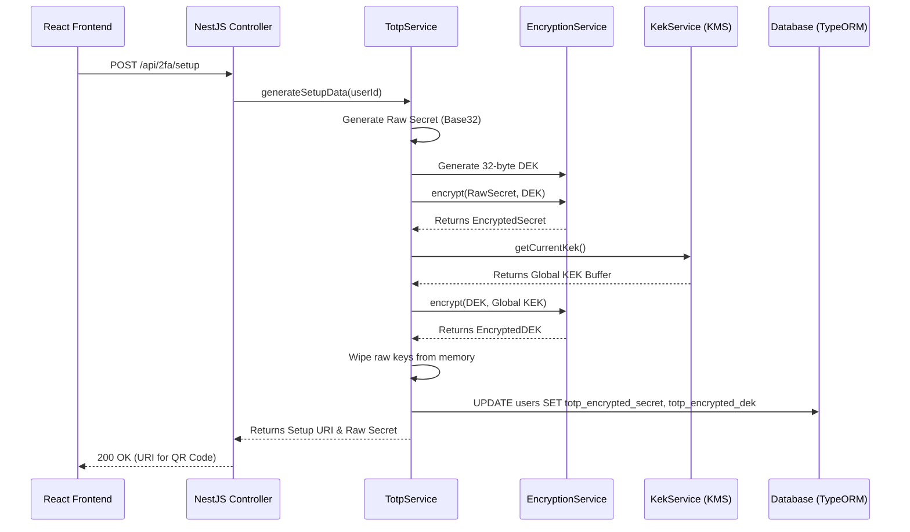
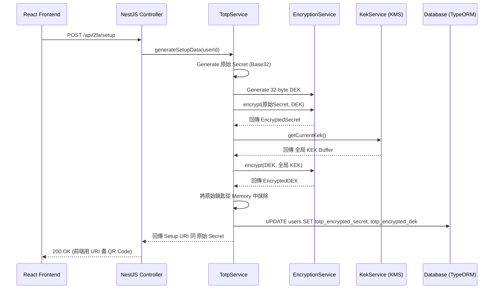

## The Critical Importance of Cryptographic Architecture in 2FA

When software engineers first encounter the requirement to implement Time-Based One-Time Passwords (TOTP), they often seek out the simplest path to compliance. A common, and fatal, mistake is to use a library like `otplib` to generate the Base32 secret string and then save that string directly into the relational database as plain text.

While this naive approach makes verification trivial, it creates a massive, single-point-of-failure security vulnerability that undermines the entire premise of Two-Factor Authentication. If a malicious actor gains read-only access to the database—perhaps through a zero-day SQL injection vulnerability, an exposed S3 bucket containing database backups, or a compromised internal analytics tool—they instantly gain the ability to generate valid 2FA codes for the entire user base. The "Something you have" factor is completely bypassed.

To build an enterprise-grade TOTP system, we must treat the TOTP secret with the exact same level of cryptographic paranoia as a user's master password. However, a unique challenge arises: unlike passwords, which can be irreversibly hashed using algorithms like bcrypt or Argon2 (because we only ever need to verify a hash match), TOTP secrets **must be reversible**. During the login verification process, the backend server must be able to read the original secret back into memory to perform the mathematical HMAC-SHA-1 calculation against the user's provided 6-digit code.

This stringent requirement for reversible, highly secure encryption leads us directly to the core of our enterprise backend architecture: **Envelope Encryption**.

In this exhaustive deep dive, we will explore the underlying theory of Envelope Encryption, how to model it flawlessly in a relational database using TypeORM, and how to write exceptionally clean, SOLID-compliant NestJS services to handle the intense cryptographic heavy lifting. We will also look at the architectural diagrams that define this flow.

---

## Deep Dive: The Envelope Encryption Pattern

Envelope Encryption is a foundational security pattern utilized heavily by major cloud providers, including AWS (Key Management Service) and Google Cloud (Cloud KMS). Instead of attempting to encrypt petabytes of application data with a single, highly sensitive master key, Envelope Encryption utilizes a hierarchical, two-tiered key structure.

### The Two-Tiered Key Hierarchy
1. **DEK (Data Encryption Key):** A unique, locally generated symmetric key used exclusively to encrypt the actual application data (in our specific case, the user's Base32 TOTP secret). In a highly secure system, **every single user gets their own uniquely generated DEK**.
2. **KEK (Key Encryption Key):** A global, system-wide master key that is used for one purpose and one purpose only: to encrypt the DEKs. The KEK is never used to encrypt application data directly. It is typically stored in a highly secure environment, such as a Hardware Security Module (HSM) or a cloud KMS provider, and is only loaded into the application's RAM during active cryptographic operations.

### The Lifecycle of a TOTP Secret
Let us trace the exact lifecycle of what happens when a user, Alice, decides to enable TOTP on her account:

1. The Node.js server generates Alice's raw TOTP Secret (e.g., `JBSWY3DPEHPK3PXP`).
2. The server generates a cryptographically secure, random 32-byte DEK specifically for Alice using `crypto.randomBytes(32)`.
3. The server uses Alice's raw DEK to encrypt her raw TOTP Secret. The result is the `EncryptedSecret`.
4. The server fetches the global KEK from memory (or via an API call to a KMS).
5. The server uses the global KEK to encrypt Alice's raw DEK. The result is the `EncryptedDEK`.
6. The server strictly wipes the raw Secret and the raw DEK from its RAM to prevent memory-dump extraction.
7. The server saves **only** the `EncryptedSecret` and `EncryptedDEK` into the PostgreSQL/MySQL database.

### The Architectural Advantage of Envelope Encryption
You might ask: "Why go through all this complexity? Why not just use the KEK to encrypt the TOTP secret directly?"

The answer lies in **Key Rotation**. Security compliance frameworks (like SOC2 or PCI-DSS) often mandate that master cryptographic keys must be rotated (changed) every 90 to 365 days. 

If we used a single master key to encrypt 10 million TOTP secrets directly, rotating the key would require us to decrypt 10 million rows and re-encrypt 10 million rows. This would take hours, consume massive database I/O, and risk catastrophic data corruption if the system crashed mid-rotation.

With Envelope Encryption, rotating the KEK is a breeze. We do **not** need to touch the 10 million `EncryptedSecrets`. We only need to decrypt the 10 million `EncryptedDEKs` using the Old KEK, and re-encrypt them using the New KEK. The underlying application data remains completely untouched. This makes Key Rotation an incredibly fast, safe, and routine operation.

---

## Architectural Visualization

Let's visualize this process using a Mermaid sequence diagram to understand the flow between the application layers and the database.



---

## Algorithm Breakdown: Advanced AEAD with AES-256-GCM

To perform the actual encryption of both the Secrets and the DEKs, we will strictly use **AES-256-GCM** (Advanced Encryption Standard, 256-bit key size, Galois/Counter Mode). 

### Why GCM over CBC?
Many legacy systems use AES-CBC (Cipher Block Chaining). The critical flaw with CBC is that it only provides *confidentiality*. If a sophisticated attacker gains access to the database and flips a single bit in the encrypted string, the decryption process will produce garbage output. However, the application itself will not inherently know that the ciphertext was tampered with; it will just attempt to process the garbage output, potentially leading to unpredictable application behavior or padding oracle attacks.

GCM, on the other hand, provides **Authenticated Encryption with Associated Data (AEAD)**. 

When GCM encrypts data, it produces an **Authentication Tag** alongside the ciphertext. During the decryption phase, if even a single microscopic bit of the ciphertext or the Initialization Vector (IV) is altered, the authentication tag validation will instantly fail. The Node.js `crypto` library will throw a fatal error before any decrypted data is returned. This guarantees both absolute confidentiality and mathematically proven data integrity.

---

## Implementation: Database Schema Design with TypeORM

Let's translate this sophisticated architecture into our database schema. We need to store the encrypted secret, the encrypted DEK, and track the boolean status of the 2FA feature. We also need to introduce a counter column to protect against brute-force guessing attacks on the 6-digit code.

```typescript
// src/entities/user.entity.ts
import { Entity, Column, PrimaryGeneratedColumn, Index } from 'typeorm';

@Entity('users')
export class User {
  @PrimaryGeneratedColumn('uuid')
  id: string;

  @Column({ unique: true })
  @Index()
  email: string;

  // ... existing columns (passwordHash, firstName, etc.)

  /**
   * Indicates whether the user has successfully completed the 2FA setup process.
   * Default is false. It is ONLY set to true after the first successful verification.
   */
  @Column({ name: 'is_totp_enabled', default: false })
  isTotpEnabled: boolean;

  /**
   * The TOTP Secret encrypted by the user's unique DEK.
   * Format: IV:AuthTag:Ciphertext (e.g., 12bytes:16bytes:ciphertext)
   */
  @Column({ name: 'totp_encrypted_secret', type: 'varchar', length: 255, nullable: true })
  totpEncryptedSecret: string | null;

  /**
   * The user's unique DEK, encrypted by the system's global KEK.
   * Format: IV:AuthTag:Ciphertext
   */
  @Column({ name: 'totp_encrypted_dek', type: 'varchar', length: 255, nullable: true })
  totpEncryptedDek: string | null;

  /**
   * Tracks failed TOTP verification attempts to prevent automated brute-force attacks.
   * Resets to 0 upon a successful login. Triggers account lockout at 5 attempts.
   */
  @Column({ name: 'ctrl_totp_attempt_count', type: 'int', default: 0 })
  totpAttemptCount: number; 
}
```

---

## Implementation: NestJS Clean Code Architecture

Following the Dependency Inversion Principle from SOLID, we create a dedicated `EncryptionService` that encapsulates all interactions with the low-level Node.js `crypto` module. This ensures our business logic remains clean and easily testable.

### The High-Security Encryption Service
```typescript
// src/modules/crypto/encryption.service.ts
import { Injectable, InternalServerErrorException, Logger } from '@nestjs/common';
import * as crypto from 'crypto';

@Injectable()
export class EncryptionService {
  private readonly logger = new Logger(EncryptionService.name);
  
  // AES-256 requires exactly a 32-byte key
  private readonly ALGORITHM = 'aes-256-gcm';
  // GCM mode highly recommends a 12-byte (96-bit) IV for performance and security
  private readonly IV_LENGTH = 12; 

  public encrypt(plaintext: string, keyBuffer: Buffer): string {
    if (!Buffer.isBuffer(keyBuffer) || keyBuffer.length !== 32) {
      this.logger.error('Invalid KeyBuffer length provided to encrypt().');
      throw new InternalServerErrorException('Cryptographic key configuration error.');
    }

    try {
      // Generate a cryptographically strong pseudo-random IV
      const iv = crypto.randomBytes(this.IV_LENGTH);
      const cipher = crypto.createCipheriv(this.ALGORITHM, keyBuffer, iv);
      
      let encrypted = cipher.update(plaintext, 'utf8', 'hex');
      encrypted += cipher.final('hex');
      
      // Extract the 16-byte authentication tag
      const authTag = cipher.getAuthTag().toString('hex');
      
      // Construct the final payload string, separated by colons
      return `${iv.toString('hex')}:${authTag}:${encrypted}`;
    } catch (error) {
      this.logger.error(`Encryption failure: ${error.message}`, error.stack);
      throw new InternalServerErrorException('Encryption process failed.');
    }
  }

  public decrypt(encryptedPayload: string, keyBuffer: Buffer): string {
    if (!encryptedPayload) {
      throw new Error('No payload provided for decryption.');
    }

    try {
      const parts = encryptedPayload.split(':');
      if (parts.length !== 3) {
        throw new Error('Malformed encrypted payload structure.');
      }

      const ivHex = parts[0];
      const authTagHex = parts[1];
      const ciphertextHex = parts[2];

      const iv = Buffer.from(ivHex, 'hex');
      const authTag = Buffer.from(authTagHex, 'hex');
      
      const decipher = crypto.createDecipheriv(this.ALGORITHM, keyBuffer, iv);
      // Inform the decipher of the expected AuthTag
      decipher.setAuthTag(authTag);
      
      let decrypted = decipher.update(ciphertextHex, 'hex', 'utf8');
      // If the AuthTag or Ciphertext was tampered with, decipher.final() will throw an error here
      decrypted += decipher.final('utf8');
      
      return decrypted;
    } catch (error) {
      this.logger.error(`Decryption or Data Integrity failure: ${error.message}`);
      throw new InternalServerErrorException('Data integrity check failed during decryption.');
    }
  }
}
```

### Orchestrating the Setup in TotpService
Now we inject the `EncryptionService`, our `UserRepository`, and a hypothetical `KekService` (which manages fetching the master key from environment variables or AWS KMS) into the core `TotpService`.

```typescript
// src/modules/auth/totp/totp.service.ts
import { Injectable, Logger } from '@nestjs/common';
import { authenticator } from 'otplib'; // The industry standard TOTP library
import * as crypto from 'crypto';

@Injectable()
export class TotpService {
  private readonly logger = new Logger(TotpService.name);

  constructor(
    private readonly userRepository: UserRepository,
    private readonly encryptionService: EncryptionService,
    private readonly kekService: KekService, 
  ) {}

  async generateSetupData(userId: string) {
    this.logger.log(`Initiating 2FA setup flow for user ${userId}`);
    
    // 1. Generate the standard Base32 TOTP secret (e.g., JBSWY3DPEHPK3PXP)
    const rawSecret = authenticator.generateSecret();
    
    // 2. Generate a highly secure, random 32-byte DEK exclusively for this user
    const rawDekBuffer = crypto.randomBytes(32);
    
    // 3. Fetch the current system KEK (must be exactly 32 bytes for AES-256)
    const currentKekBuffer = await this.kekService.getCurrentKek();
    
    // 4. Encrypt the TOTP secret using the user's specific DEK
    const encryptedSecret = this.encryptionService.encrypt(rawSecret, rawDekBuffer);
    
    // 5. Encrypt the DEK using the global system KEK 
    // (We convert the DEK buffer to a hex string temporarily for encryption)
    const encryptedDek = this.encryptionService.encrypt(rawDekBuffer.toString('hex'), currentKekBuffer);
    
    // 6. Save the encrypted materials to the database
    await this.userRepository.update(userId, {
      totpEncryptedSecret: encryptedSecret,
      totpEncryptedDek: encryptedDek,
      // CRITICAL NOTE: isTotpEnabled is NOT set to true here! 
      // It must remain false until the user successfully verifies their first 6-digit code.
    });
    
    // 7. Format the URI required for the QR code generation
    const issuer = 'MyEnterpriseApp';
    const user = await this.userRepository.findById(userId);
    const otpauthUrl = authenticator.keyuri(user.email, issuer, rawSecret);
    
    // Return the raw secret and URL to the frontend so it can display the QR code.
    // The frontend will discard this information immediately after rendering.
    return { 
      secret: rawSecret, 
      otpauthUrl 
    };
  }
}
```

By aggressively decoupling the cryptographic implementation logic from the high-level domain workflow, we ensure our `TotpService` is highly robust and easily testable. In our Jest unit test suites, we can easily mock the `EncryptionService` and `KekService` to verify the application state transitions without needing to instantiate actual AES cipher buffers.

In Part 3 of this series, we will tackle the daunting challenge of KEK Rotation—exploring exactly how to handle the complex scenario where the master key needs to be swapped out safely in a live production environment without causing system downtime.

---

## 後端架構、信封加密技術與 TypeORM 設計的終極指南

當軟體工程師第一次接到要 Implement Time-Based One-Time Passwords (TOTP) 呢個 Requirement 嗰陣，佢哋通常會貪圖方便，搵最簡單嘅路徑嚟達標。一個最常見而且最致命嘅錯誤，就係用好似 `otplib` 呢類 Library Generate 出條 Base32 嘅 Secret string 之後，就咁將條 String 以 Plaintext (明文) 嘅形式，直接 Save 落關聯式資料庫 (Relational Database) 度。

雖然呢種天真 (Naive) 嘅做法令到驗證過程變得非常容易，但佢同時製造咗一個極度巨大、單點故障 (Single-point-of-failure) 嘅 Security Vulnerability (安全漏洞)。呢個漏洞完全摧毀咗雙重認證 (2FA) 存在嘅意義。試幻想，如果一個惡意黑客攞到 Database 嘅 Read-only access (可能係透過 Zero-day SQL Injection、一個意外公開咗嘅 S3 Backup bucket，又或者係一個被攻陷咗嘅內部數據分析系統)，佢哋就可以瞬間獲得為全系統所有用戶 Generate 有效 2FA Codes 嘅能力。所謂嘅「擁有物要素 (Something you have)」就完全形同虛設。

要建立一個真正企業級 (Enterprise-grade) 嘅 TOTP 系統，我哋必須要用對待用戶 Master Password 一樣嘅「密碼學被害妄想症 (Cryptographic Paranoia)」態度，去對待每一條 TOTP Secret。不過，呢度出現咗一個獨特嘅挑戰：密碼可以運用 bcrypt 或者 Argon2 呢啲演算法進行 **不可逆 (Irreversible)** 嘅 Hash 處理 (因為我哋只係需要驗證 Hash 係咪吻合)；但係 TOTP Secrets **必須係可逆轉的 (Reversible)**。喺登入驗證嘅過程中，Backend server 必須要將原始嘅 Secret 讀取返入 Memory，然後用嚟做 HMAC-SHA-1 數學運算，去對比用戶輸入嗰 6 位數字。

呢種對「可逆轉、極高安全性加密」嘅嚴苛要求，帶領我哋來到企業級 Backend 架構嘅絕對核心：**信封加密 (Envelope Encryption)**。

喺呢篇巨細無遺嘅深度探討入面，我哋會研究 Envelope Encryption 背後嘅底層理論、點樣喺 TypeORM 入面完美地建立 Database 模型，同埋點樣寫出極度 Clean、符合 SOLID 原則嘅 NestJS Services 去處理繁重嘅密碼學運算。我哋仲會一齊睇埋定義呢個流程嘅架構圖。

---

## 深度探討：信封加密模式 (The Envelope Encryption Pattern)

Envelope Encryption 係一個基礎嘅安全模式 (Security Pattern)，被全球頂尖嘅 Cloud Providers 廣泛採用，包括 AWS (Key Management Service) 同 Google Cloud (Cloud KMS)。與其嘗試用單一一條極度敏感嘅 Master Key 去加密海量級別嘅 Application Data，Envelope Encryption 採用咗一種分層級嘅「雙層鎖匙結構」。

### 雙層鎖匙結構
1. **DEK (資料加密金鑰 - Data Encryption Key):** 一條獨特嘅、喺 Local generate 出嚟嘅對稱金鑰 (Symmetric key)，佢唯一嘅用途就係用嚟加密真正嘅 Application Data (喺我哋嘅情況下，就係用戶條 Base32 TOTP secret)。喺一個極度安全嘅系統入面，**每一位用戶都會獲派發一條佢專屬、獨一無二嘅 DEK**。
2. **KEK (金鑰加密金鑰 - Key Encryption Key):** 一條全局嘅、系統級別嘅 Master Key。佢存在嘅目的只有一個：就係用嚟加密啲 DEKs。KEK 永遠、絕對唔會被用嚟直接加密 Application Data。KEK 通常會被安置喺一個極度安全嘅環境入面，例如硬體安全模組 (HSM) 或者 Cloud KMS 供應商度，而且只會喺進行密碼學運算嗰一刻，先會被短暫 Load 入 Application 嘅 RAM 裡面。

### TOTP Secret 嘅生命週期
我哋嚟精確咁 Trace 吓，當一個用戶 (例如 Alice) 決定開啟 TOTP 嗰陣，成個流程係點樣行嘅：

1. Node.js Server generate 出 Alice 嘅原始 TOTP Secret (例如：`JBSWY3DPEHPK3PXP`)。
2. Server 透過 `crypto.randomBytes(32)`，為 Alice 專門 generate 一條密碼學上絕對安全、隨機嘅 32-byte DEK。
3. Server 運用 Alice 條原始 DEK 去加密佢條原始 TOTP Secret。得出嘅結果就係 `EncryptedSecret` (加密版 Secret)。
4. Server 喺 Memory (或者透過 API 向 KMS 查詢) 獲取全局嘅 KEK。
5. Server 運用全局 KEK 去加密 Alice 條原始 DEK。得出嘅結果就係 `EncryptedDEK` (加密版 DEK)。
6. Server 嚴格地將原始 Secret 同原始 DEK 喺 RAM 裡面徹底抹走，防止被 Memory-dump 攻擊抽走。
7. Server **只會** 將 `EncryptedSecret` 同 `EncryptedDEK` Save 落 PostgreSQL 或者 MySQL Database 度。

### 信封加密嘅架構優勢
你可能會問：「點解要搞到咁複雜？點解唔直接用 KEK 去加密條 TOTP Secret 就算？」

答案在於 **金鑰輪換 (Key Rotation)**。安全合規框架 (例如 SOC2 或者 PCI-DSS) 通常會強制規定，Master Cryptographic Keys 必須每 90 到 365 日進行一次輪換 (即係更換新鎖匙)。

如果我哋用一條 Master Key 直接加密咗 1,000 萬條 TOTP Secrets，當要換 Key 嗰陣，我哋就被迫要將 1,000 萬行 Record 逐一 Decrypt，然後再重新 Encrypt 1,000 萬次。呢個過程需要耗費幾個鐘頭、消耗極其龐大嘅 Database I/O，而且如果系統喺換 Key 期間死機，隨時會引發災難性嘅 Data 損毀。

有咗 Envelope Encryption，輪換 KEK 變得輕而易舉。我哋 **完全唔需要** 掂嗰 1,000 萬條 `EncryptedSecrets`。我哋只需要用舊嘅 KEK 將 1,000 萬條 `EncryptedDEKs` 解密，然後用新嘅 KEK 重新加密佢哋。底層嘅 Application Data 原封不動。呢個絕妙嘅設計令到 Key Rotation 變成一個極之快速、安全而且可以當成 Routine (例行公事) 嘅操作。

---

## 架構視覺化 (Architectural Visualization)

我哋用 Mermaid Sequence Diagram 嚟視覺化呢個過程，等大家清楚明白 Application 各層次同 Database 之間嘅互動流程。



---

## 演算法解碼：具備 AEAD 嘅進階 AES-256-GCM

為咗執行 Secrets 同 DEKs 嘅加密程序，我哋會嚴格採用 **AES-256-GCM** (進階加密標準，256-bit Key，Galois/Counter Mode)。

### 點解揀 GCM 而唔用 CBC？
好多舊式系統會用 AES-CBC (Cipher Block Chaining)。CBC 嘅致命弱點係，佢只係提供 *機密性 (Confidentiality)*。如果一個高階黑客入侵咗 Database，偷偷地改咗密文 (Ciphertext) 裡面嘅一個 Bit，解密過程會產生出一堆亂碼。但係，Application 本身並唔會知道啲 Ciphertext 已經俾人竄改過；佢只會盲目咁嘗試 process 嗰堆亂碼，隨時導致 Application 出現不可預期嘅行為，甚至引發 Padding Oracle Attacks。

相反，GCM 提供咗 **認證加密 (Authenticated Encryption with Associated Data, AEAD)**。

當 GCM 進行加密嗰陣，佢會喺 Ciphertext 旁邊額外產生一個 **認證標籤 (Authentication Tag)**。喺解密階段，就算 Ciphertext 或者初始化向量 (IV) 有任何一粒微小嘅 Bit 俾人改動過，Authentication Tag 嘅驗證都會瞬間失敗。Node.js 嘅 `crypto` library 會喺 return 任何解密 Data 之前，即刻 Throw 一個 Fatal error。呢個機制同時保證咗絕對嘅機密性同埋喺數學上被證明嘅資料完整性 (Data Integrity)。

---

## 實踐：運用 TypeORM 設計 Database Schema

我哋將呢個複雜精妙嘅架構轉化做 Database schema。我哋需要儲存 Encrypted secret、Encrypted DEK、track 住 2FA 嘅開關狀態。另外，我哋必須要加入一個 Counter column，用嚟防禦針對 6 位數 Code 嘅自動化暴力破解 (Brute-force) 攻擊。

```typescript
// src/entities/user.entity.ts
import { Entity, Column, PrimaryGeneratedColumn, Index } from 'typeorm';

@Entity('users')
export class User {
  @PrimaryGeneratedColumn('uuid')
  id: string;

  @Column({ unique: true })
  @Index()
  email: string;

  // ... 其他現有 columns (passwordHash, firstName 等等)

  /**
   * 標示用戶係咪已經成功完成咗 2FA 嘅 Setup 流程。
   * 預設係 false。只有當用戶成功驗證咗第一次 6 位數 Code 之後，先可以 set 做 true。
   */
  @Column({ name: 'is_totp_enabled', default: false })
  isTotpEnabled: boolean;

  /**
   * 被用戶專屬 DEK 加密咗嘅 TOTP Secret。
   * 格式: IV:AuthTag:Ciphertext (例如：12bytes:16bytes:密文)
   */
  @Column({ name: 'totp_encrypted_secret', type: 'varchar', length: 255, nullable: true })
  totpEncryptedSecret: string | null;

  /**
   * 被系統全局 KEK 加密咗嘅用戶專屬 DEK。
   * 格式: IV:AuthTag:Ciphertext
   */
  @Column({ name: 'totp_encrypted_dek', type: 'varchar', length: 255, nullable: true })
  totpEncryptedDek: string | null;

  /**
   * 記錄 TOTP 驗證失敗嘅次數，用來防禦自動化嘅暴力撞碼攻擊。
   * 成功登入之後會 Reset 返做 0。如果連續失敗 5 次，就會觸發 Account Lockout。
   */
  @Column({ name: 'ctrl_totp_attempt_count', type: 'int', default: 0 })
  totpAttemptCount: number; 
}
```

---

## 實踐：NestJS Clean Code 架構

遵循 SOLID 原則入面嘅「依賴反轉原則 (Dependency Inversion Principle)」，我哋會建立一個專屬嘅 `EncryptionService`，將所有同底層 Node.js `crypto` module 嘅互動封裝起嚟。咁樣可以確保我哋嘅 Business logic 保持乾淨俐落，而且極容易寫 Test。

### 高度設防嘅 Encryption Service
```typescript
// src/modules/crypto/encryption.service.ts
import { Injectable, InternalServerErrorException, Logger } from '@nestjs/common';
import * as crypto from 'crypto';

@Injectable()
export class EncryptionService {
  private readonly logger = new Logger(EncryptionService.name);
  
  // AES-256 強制要求一條 exactly 32-byte 嘅 Key
  private readonly ALGORITHM = 'aes-256-gcm';
  // GCM mode 強烈建議用 12-byte (96-bit) 嘅 IV 來獲取最佳效能同安全性
  private readonly IV_LENGTH = 12; 

  public encrypt(plaintext: string, keyBuffer: Buffer): string {
    if (!Buffer.isBuffer(keyBuffer) || keyBuffer.length !== 32) {
      this.logger.error('傳入 encrypt() 嘅 KeyBuffer 長度不合法。');
      throw new InternalServerErrorException('密碼學金鑰配置錯誤。');
    }

    try {
      // Generate 一條密碼學上夠 random 嘅 IV
      const iv = crypto.randomBytes(this.IV_LENGTH);
      const cipher = crypto.createCipheriv(this.ALGORITHM, keyBuffer, iv);
      
      let encrypted = cipher.update(plaintext, 'utf8', 'hex');
      encrypted += cipher.final('hex');
      
      // 抽取 16-byte 嘅 Authentication Tag
      const authTag = cipher.getAuthTag().toString('hex');
      
      // 將 IV、AuthTag 同 Ciphertext 用冒號串連起嚟，構建出最終嘅 Payload string
      return `${iv.toString('hex')}:${authTag}:${encrypted}`;
    } catch (error) {
      this.logger.error(`加密失敗: ${error.message}`, error.stack);
      throw new InternalServerErrorException('加密過程發生嚴重錯誤。');
    }
  }

  public decrypt(encryptedPayload: string, keyBuffer: Buffer): string {
    if (!encryptedPayload) {
      throw new Error('未有提供 Payload 作解密之用。');
    }

    try {
      const parts = encryptedPayload.split(':');
      if (parts.length !== 3) {
        throw new Error('加密 Payload 結構變形。');
      }

      const ivHex = parts[0];
      const authTagHex = parts[1];
      const ciphertextHex = parts[2];

      const iv = Buffer.from(ivHex, 'hex');
      const authTag = Buffer.from(authTagHex, 'hex');
      
      const decipher = crypto.createDecipheriv(this.ALGORITHM, keyBuffer, iv);
      // 通知 Decipher 預期嘅 AuthTag 係咩
      decipher.setAuthTag(authTag);
      
      let decrypted = decipher.update(ciphertextHex, 'hex', 'utf8');
      // 如果 AuthTag 或者 Ciphertext 被人改過，decipher.final() 會喺呢度爆 Error
      decrypted += decipher.final('utf8');
      
      return decrypted;
    } catch (error) {
      this.logger.error(`解密或資料完整性檢查失敗: ${error.message}`);
      throw new InternalServerErrorException('解密期間資料完整性檢查不合格。');
    }
  }
}
```

### 喺 TotpService 裡面編排 Setup 流程
而家我哋將 `EncryptionService`、我哋嘅 `UserRepository`，同埋一個假設嘅 `KekService` (負責由 Environment variables 或者 AWS KMS 提取 Master Key) 注入去核心嘅 `TotpService` 裡面。

```typescript
// src/modules/auth/totp/totp.service.ts
import { Injectable, Logger } from '@nestjs/common';
import { authenticator } from 'otplib'; // 業界 Standard 嘅 TOTP library
import * as crypto from 'crypto';

@Injectable()
export class TotpService {
  private readonly logger = new Logger(TotpService.name);

  constructor(
    private readonly userRepository: UserRepository,
    private readonly encryptionService: EncryptionService,
    private readonly kekService: KekService, 
  ) {}

  async generateSetupData(userId: string) {
    this.logger.log(`開始為用戶 ${userId} 啟動 2FA Setup 流程`);
    
    // 1. Generate 標準嘅 Base32 TOTP secret (例如 JBSWY3DPEHPK3PXP)
    const rawSecret = authenticator.generateSecret();
    
    // 2. 專為呢個用戶，Generate 一條極高安全性、隨機嘅 32-byte DEK
    const rawDekBuffer = crypto.randomBytes(32);
    
    // 3. 提取當前系統用緊嘅 KEK (為配合 AES-256，必須 exactly 32 bytes)
    const currentKekBuffer = await this.kekService.getCurrentKek();
    
    // 4. 用用戶專屬嘅 DEK 去加密 TOTP secret
    const encryptedSecret = this.encryptionService.encrypt(rawSecret, rawDekBuffer);
    
    // 5. 用系統全局嘅 KEK 去加密 DEK 
    // (我哋短暫地將 DEK buffer 轉做 hex string 去做加密)
    const encryptedDek = this.encryptionService.encrypt(rawDekBuffer.toString('hex'), currentKekBuffer);
    
    // 6. 將加密好嘅材料 Save 落 Database
    await this.userRepository.update(userId, {
      totpEncryptedSecret: encryptedSecret,
      totpEncryptedDek: encryptedDek,
      // 極度重要提示：isTotpEnabled 喺呢度 **絕對唔可以** set 做 true！
      // 必須等到用戶成功驗證咗佢哋第一個 6 位數 Code 之後，先可以真正生效。
    });
    
    // 7. Format 條 URI 俾 Frontend 畫 QR code
    const issuer = 'MyEnterpriseApp';
    const user = await this.userRepository.findById(userId);
    const otpauthUrl = authenticator.keyuri(user.email, issuer, rawSecret);
    
    // 將原始 Secret 同 URL return 俾 Frontend 等佢畫 QR code。
    // Frontend 畫完之後應該要即刻銷毀呢啲資料。
    return { 
      secret: rawSecret, 
      otpauthUrl 
    };
  }
}
```

透過果斷地將密碼學實作邏輯與高層次嘅 Domain 工作流程 (Domain Workflow) 拆解分離，我哋確保咗 `TotpService` 具備極高嘅穩健性同埋可測試性。喺寫 Jest Unit Test Suites 嗰陣，我哋可以輕易咁 Mock 咗 `EncryptionService` 同 `KekService`，從而驗證 Application 嘅狀態轉換，完全唔需要真正去行啲複雜嘅 AES Cipher buffers。

喺呢個系列嘅第 3 篇文，我哋將會迎難而上，挑戰 KEK 輪換 (KEK Rotation) 呢個艱巨嘅任務——探討點樣喺一個 Live Production 環境入面，安全地將 Master Key 偷龍轉鳳，同時保證系統零停機時間 (Zero Downtime)！
