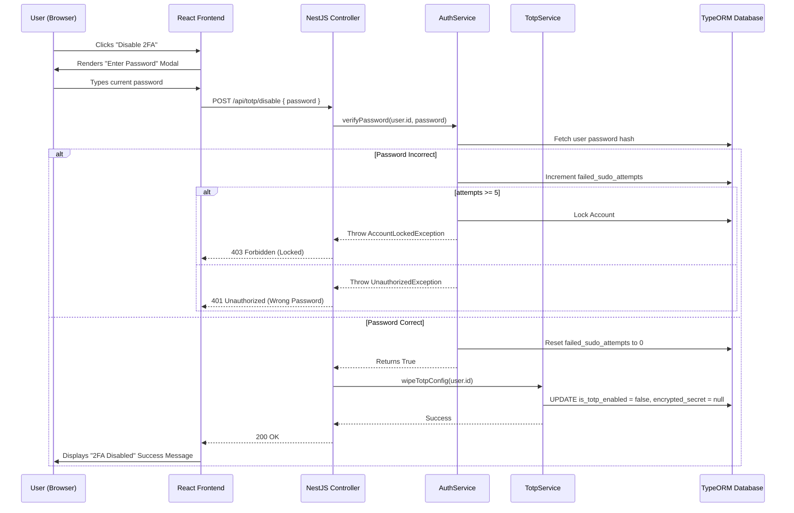
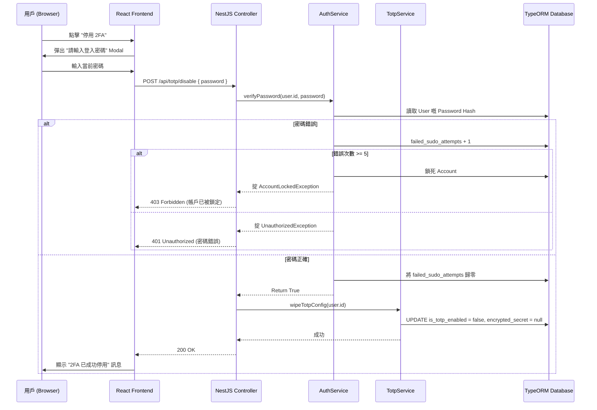

## The Danger of Convenience

In modern web applications, user autonomy is highly valued. We want users to be able to manage their own profiles, change their email addresses, and update their security settings without constantly raising tickets with the IT Helpdesk. Therefore, providing a "Self-Service 2FA Reset" mechanism is a standard requirement. If a user buys a new iPhone, they need a way to log in, disable their old TOTP configuration, and generate a new QR code for their new device.

However, designing the Self-Service Reset flow is one of the most perilous tasks in building an authentication system. 

Consider a scenario where a user, Bob, logs into an enterprise dashboard on his office computer and then steps away to grab a coffee without locking his screen. A malicious coworker, Eve, walks over to Bob's unlocked computer. If the application allows Eve to simply click "Disable 2FA" and then immediately click "Enable 2FA" to scan a new QR code onto *her* phone, Bob's account is permanently compromised. Eve has successfully hijacked Bob's Possession Factor.

To prevent this trivial Account Takeover (ATO) vector, we must implement **Sudo Mode** (named after the Unix command). Even if the user has an active, valid JWT session, any attempt to disable or reset 2FA *must* be gated by a fresh, synchronous password verification prompt.

But this introduces a secondary, even more insidious vulnerability. By exposing an API endpoint that takes a password and verifies it, we have inadvertently created an authenticated password-guessing oracle. If we don't strictly rate-limit this specific endpoint, an attacker who has hijacked the session token can use the `POST /api/2fa/disable` endpoint to brute-force the user's plaintext password at millions of attempts per second.

In this deep dive, we will architect the absolute safest Self-Service Reset flow. We will build Sudo-Mode Guards, map the process with Sequence Diagrams, and implement strict database-backed rate limiting to eliminate brute-force password attacks on the reset endpoints.

---

## Architectural Visualization: The Sudo-Mode Reset Flow

Let's visualize the exact sequence of events required to safely disable a TOTP configuration.



---

## Deep Dive: Building the Sudo-Mode Controller

Let's look at the NestJS Controller implementation. We require the user to be fully authenticated (they must possess a valid JWT), but the body of the request must contain their current plaintext password.

```typescript
// src/modules/auth/totp/totp.controller.ts
import { Controller, Post, Body, UseGuards, Request, HttpCode, HttpStatus } from '@nestjs/common';
import { AuthGuard } from '@nestjs/passport';
import { ApiTags, ApiOperation, ApiResponse, ApiBearerAuth } from '@nestjs/swagger';
import { DisableTotpDto } from './dto/disable-totp.dto';

@ApiTags('User Security - 2FA')
@ApiBearerAuth()
@Controller('totp')
@UseGuards(AuthGuard('jwt')) // Must be fully logged in
export class TotpController {
  constructor(
    private readonly totpService: TotpService,
    private readonly sudoService: SudoService,
  ) {}

  @Post('disable')
  @HttpCode(HttpStatus.OK)
  @ApiOperation({ summary: 'Disable 2FA using Sudo-Mode (Requires Password)' })
  @ApiResponse({ status: 200, description: '2FA successfully disabled.' })
  @ApiResponse({ status: 401, description: 'Incorrect password.' })
  @ApiResponse({ status: 403, description: 'Account locked due to brute-force attempts.' })
  async disableTotp(@Request() req: CustomRequest, @Body() dto: DisableTotpDto) {
    const userId = req.user.id;
    
    // 1. Sudo-Mode Verification
    // This will throw 401 or 403 if the password is wrong or brute-forced
    await this.sudoService.verifySudoPassword(userId, dto.password, req.ip);

    // 2. If we reach here, the password was correct. Wipe the config.
    await this.totpService.wipeTotpConfig(userId);

    return { success: true, message: 'Two-Factor Authentication has been disabled.' };
  }
}
```

### The SudoService and Brute-Force Prevention

This is the most critical piece of code in this post. We cannot simply use standard `bcrypt.compare`. We must meticulously track failed attempts in the database. If we relied on an in-memory rate limiter (like `nestjs-throttler`), an attacker could easily bypass it by distributing their attack across hundreds of proxy IP addresses. The failure count MUST be tied to the User ID in the database.

```typescript
// src/modules/auth/sudo/sudo.service.ts
import { Injectable, UnauthorizedException, ForbiddenException, Logger } from '@nestjs/common';
import * as bcrypt from 'bcrypt';

@Injectable()
export class SudoService {
  private readonly logger = new Logger(SudoService.name);
  private readonly MAX_SUDO_ATTEMPTS = 5;

  constructor(
    private readonly userRepository: UserRepository,
    private readonly auditLogService: AuditLogService,
  ) {}

  async verifySudoPassword(userId: string, plaintextPassword: string, ipAddress: string): Promise<boolean> {
    const user = await this.userRepository.findById(userId);

    if (!user) {
      throw new UnauthorizedException('User not found.');
    }

    // 1. Check if they are already locked
    if (user.isLocked) {
      this.logger.warn(`Locked user ${userId} attempted Sudo action from ${ipAddress}`);
      throw new ForbiddenException('Account is locked. Please contact support.');
    }

    // 2. Perform the heavy bcrypt comparison
    const isMatch = await bcrypt.compare(plaintextPassword, user.passwordHash);

    // 3. Handle Failure Logic
    if (!isMatch) {
      user.failedSudoAttempts += 1;

      if (user.failedSudoAttempts >= this.MAX_SUDO_ATTEMPTS) {
        // Lock the account to stop the brute-force attack dead in its tracks
        user.isLocked = true;
        user.lockedAt = new Date();
        await this.userRepository.save(user);

        // Emit critical security log
        await this.auditLogService.createLog({
          targetUserId: user.id,
          action: 'ACCOUNT_LOCKED_SUDO_BRUTE_FORCE',
          ipAddress,
          description: `Account locked after ${this.MAX_SUDO_ATTEMPTS} failed Sudo password attempts.`,
        });

        throw new ForbiddenException('Account locked due to too many failed security attempts.');
      }

      await this.userRepository.save(user);
      throw new UnauthorizedException('Incorrect password.');
    }

    // 4. Handle Success Logic
    // If they were previously failing, reset the counter back to 0
    if (user.failedSudoAttempts > 0) {
      user.failedSudoAttempts = 0;
      await this.userRepository.save(user);
    }

    // Emit a standard audit log
    await this.auditLogService.createLog({
      targetUserId: user.id,
      action: 'SUDO_AUTHENTICATION_SUCCESS',
      ipAddress,
    });

    return true;
  }
}
```

By decoupling this into a `SudoService`, we can reuse this exact logic for *any* destructive user action in the future (e.g., changing their primary email, deleting their account, or downloading a GDPR data export).

---

## Clean Code: The Erasure of Cryptographic Material

When the `wipeTotpConfig` method is called in the `TotpService`, it is not enough to just set `isTotpEnabled = false`. If we leave the `totpEncryptedSecret` and `totpEncryptedDek` in the database, a future vulnerability could allow an attacker to read the old secrets, decrypt them, and potentially use them if the user ever re-enables 2FA and the system mistakenly reuses the old row state.

We must explicitly `NULL` out the cryptographic material, enforcing cryptographic hygiene.

```typescript
// src/modules/auth/totp/totp.service.ts
import { Injectable, Logger } from '@nestjs/common';

@Injectable()
export class TotpService {
  private readonly logger = new Logger(TotpService.name);

  constructor(private readonly userRepository: UserRepository) {}

  async wipeTotpConfig(userId: string): Promise<void> {
    this.logger.log(`Wiping TOTP configuration for user ${userId}`);

    // Atomically reset all 2FA related columns
    await this.userRepository.update(userId, {
      isTotpEnabled: false,
      totpEncryptedSecret: null, // Hard erasure
      totpEncryptedDek: null,    // Hard erasure
      totpAttemptCount: 0,   // Reset login brute-force trackers
    });
  }
}
```

---

## 便利性帶來的致命危險

喺現代嘅 Web Application 開發入面，我哋極度重視用戶嘅自主權 (User Autonomy)。我哋希望用戶可以自己管理自己個 Profile、自己改 Email、自己 Update 保安設定，而唔需要郁啲就開個 Ticket 去煩班 IT Helpdesk 職員。因此，提供一個「自助 2FA 重置 (Self-Service 2FA Reset)」機制絕對係一個標準嘅 Requirement。舉個例，如果用戶換咗部新 iPhone，佢哋需要一個方法去 Login，停用舊嗰個 TOTP 設定，然後為新電話 Generate 過一個新嘅 QR Code。

不過，設計呢個自助重置流程，絕對係構建 Authentication 系統入面其中一項最兇險、最容易踩地雷嘅任務。

試幻想一個情境：用戶 Bob 喺公司部電腦度登入咗個企業 Dashboard，然後佢行開咗去沖咖啡，但又唔記得 Lock Screen。一個心懷不軌嘅同事 Eve 行埋去 Bob 部冇 Lock 嘅電腦前面。如果個 Application 容許 Eve 就咁㩒一粒 "Disable 2FA" 掣，然後再即刻㩒 "Enable 2FA"，將個新 QR Code Scan 落 **Eve 自己** 部手機度，Bob 個 Account 就會被永久挾持！Eve 已經成功強行綁架咗 Bob 嘅 Possession Factor (擁有物要素)。

為咗防止呢種極度低級嘅帳戶騎劫 (Account Takeover, ATO) 手法，我哋必須要 Implement **Sudo 模式 (Sudo Mode)** (命名源自 Unix 系統嘅 sudo command)。就算用戶手揸住一條完全 Valid 嘅 JWT Session，任何企圖停用或者重置 2FA 嘅操作，**必須** 被一個即時、同步嘅「重新輸入密碼 (Password Verification)」機制強行閘住！

但係，呢個做法又會引申出第二個、而且更加陰毒嘅系統漏洞。當我哋開放咗一個可以接受 Password 兼且做 Verify 嘅 API Endpoint，我哋其實係無意中創造咗一個「已認證嘅密碼猜測神諭 (Authenticated password-guessing oracle)」。如果我哋唔對呢個特定嘅 Endpoint 進行極度嚴格嘅 Rate-limit (限制頻率)，一個已經騎劫咗 JWT Session token 嘅黑客，就可以利用 `POST /api/2fa/disable` 呢個 Endpoint，以每秒幾百萬次嘅速度，瘋狂暴力破解 (Brute-force) 個用戶個 Plaintext password！

喺呢篇極度深入嘅探討入面，我哋會一齊架構出全宇宙最安全嘅「自助重置流程」。我哋會建立 Sudo-Mode Guards (Sudo 模式守衛)、用 Sequence Diagrams (循序圖) 畫清楚成個流程，仲會親手寫一個基於 Database 嘅嚴格 Rate limiting 機制，將針對 Reset Endpoint 嘅暴力破解攻擊徹底扼殺喺搖籃之中！

---

## 架構視覺化：Sudo 模式重置流程 (The Sudo-Mode Reset Flow)

我哋用 Mermaid 循序圖嚟視覺化一下，安全停用 TOTP 設定所需嘅精確步驟。



---

## 深度探討：建構 Sudo 模式控制器 (Sudo-Mode Controller)

我哋嚟睇吓 NestJS Controller 點樣寫。我哋強制要求個 Request 必須係已登入狀態 (要有 JWT)，但 Request Body 裡面必須要包含用戶當前嘅 Plaintext password。

```typescript
// src/modules/auth/totp/totp.controller.ts
import { Controller, Post, Body, UseGuards, Request, HttpCode, HttpStatus } from '@nestjs/common';
import { AuthGuard } from '@nestjs/passport';
import { ApiTags, ApiOperation, ApiResponse, ApiBearerAuth } from '@nestjs/swagger';
import { DisableTotpDto } from './dto/disable-totp.dto';

@ApiTags('User Security - 2FA')
@ApiBearerAuth()
@Controller('totp')
@UseGuards(AuthGuard('jwt')) // 必須係「已登入」狀態
export class TotpController {
  constructor(
    private readonly totpService: TotpService,
    private readonly sudoService: SudoService,
  ) {}

  @Post('disable')
  @HttpCode(HttpStatus.OK)
  @ApiOperation({ summary: '使用 Sudo 模式停用 2FA (強制要求提供密碼)' })
  @ApiResponse({ status: 200, description: '2FA 已成功停用。' })
  @ApiResponse({ status: 401, description: '密碼錯誤。' })
  @ApiResponse({ status: 403, description: '由於多次暴力破解嘗試，帳戶已被強制鎖死。' })
  async disableTotp(@Request() req: CustomRequest, @Body() dto: DisableTotpDto) {
    const userId = req.user.id;
    
    // 1. 執行 Sudo 模式驗證
    // 如果密碼錯，或者被人 Brute-force 緊，呢個 Service 會直接掟 401 或者 403 出去
    await this.sudoService.verifySudoPassword(userId, dto.password, req.ip);

    // 2. 如果行到嚟呢度，代表密碼係完全正確嘅。可以放心洗白個 Config。
    await this.totpService.wipeTotpConfig(userId);

    return { success: true, message: '雙重認證 (2FA) 已經成功停用。' };
  }
}
```

### SudoService 與 防禦暴力破解 (Brute-Force Prevention)

呢一段係成篇文最生死攸關嘅 Code。我哋絕對唔可以求其用個標準 `bcrypt.compare` 就算。我哋必須要極度小心咁喺 Database 裡面 track 住失敗次數。如果我哋貪方便用 Memory-based 嘅 Rate limiter (例如 `nestjs-throttler`)，一個有經驗嘅黑客只要將佢嘅攻擊分散落幾百個 Proxy IP Addresses 度，就可以輕易 Bypass。所以，個 Failure count **必須** 係死死綁定喺 Database 入面個 User ID 身上！

```typescript
// src/modules/auth/sudo/sudo.service.ts
import { Injectable, UnauthorizedException, ForbiddenException, Logger } from '@nestjs/common';
import * as bcrypt from 'bcrypt';

@Injectable()
export class SudoService {
  private readonly logger = new Logger(SudoService.name);
  private readonly MAX_SUDO_ATTEMPTS = 5;

  constructor(
    private readonly userRepository: UserRepository,
    private readonly auditLogService: AuditLogService,
  ) {}

  async verifySudoPassword(userId: string, plaintextPassword: string, ipAddress: string): Promise<boolean> {
    const user = await this.userRepository.findById(userId);

    if (!user) {
      throw new UnauthorizedException('搵唔到該用戶。');
    }

    // 1. 第一步：Check 吓佢係咪已經俾系統 Lock 咗
    if (user.isLocked) {
      this.logger.warn(`已經被鎖定嘅用戶 ${userId} 嘗試由 IP ${ipAddress} 執行 Sudo 操作`);
      throw new ForbiddenException('帳戶已被鎖定，請聯絡客戶服務部。');
    }

    // 2. 執行極度消耗 CPU 資源嘅 bcrypt 對比運算
    const isMatch = await bcrypt.compare(plaintextPassword, user.passwordHash);

    // 3. 處理「密碼錯誤」嘅邏輯
    if (!isMatch) {
      user.failedSudoAttempts += 1;

      if (user.failedSudoAttempts >= this.MAX_SUDO_ATTEMPTS) {
        // 將個 Account 直接鎖死！將個 Brute-force 攻擊徹底扼殺！
        user.isLocked = true;
        user.lockedAt = new Date();
        await this.userRepository.save(user);

        // 發出最高級別嘅保安 Audit Log
        await this.auditLogService.createLog({
          targetUserId: user.id,
          action: 'ACCOUNT_LOCKED_SUDO_BRUTE_FORCE',
          ipAddress,
          description: `因連續 ${this.MAX_SUDO_ATTEMPTS} 次輸入 Sudo 密碼錯誤，系統已將帳戶強制鎖定。`,
        });

        throw new ForbiddenException('由於多次安全驗證失敗，帳戶已被強制鎖定。');
      }

      await this.userRepository.save(user);
      throw new UnauthorizedException('密碼錯誤。');
    }

    // 4. 處理「密碼正確」嘅邏輯
    // 如果佢之前有錯過，我哋要將個 Counter reset 返做 0
    if (user.failedSudoAttempts > 0) {
      user.failedSudoAttempts = 0;
      await this.userRepository.save(user);
    }

    // 發出標準嘅 Audit Log
    await this.auditLogService.createLog({
      targetUserId: user.id,
      action: 'SUDO_AUTHENTICATION_SUCCESS',
      ipAddress,
    });

    return true;
  }
}
```

透過將呢段邏輯解耦 (Decoupling) 去一個獨立嘅 `SudoService` 度，將來無論系統要加咩破壞性極高嘅 User action (例如：更改主 Email、永久刪除帳戶、或者 Download GDPR Data 副本)，我哋都可以完美重用呢套邏輯！

---

## Clean Code 原則：密碼學材料嘅物理抹除 (Erasure)

當 `TotpService` call 個 `wipeTotpConfig` method 嗰陣，淨係將 `isTotpEnabled = false` 係絕對唔夠嘅！如果我哋將舊嘅 `totpEncryptedSecret` 同 `totpEncryptedDek` 原封不動留喺 Database，將來萬一發生 Security vulnerability，黑客就可以 Read 返呢啲舊 Secrets、Decrypt 佢哋，甚至如果系統有 Bug 唔小心 Reuse 舊 Data 嗰陣，黑客就可以輕易騎劫個戶口。

我哋必須要明確地將啲密碼學材料 `NULL` 掉，執行嚴格嘅 Cryptographic hygiene (密碼學衛生)。

```typescript
// src/modules/auth/totp/totp.service.ts
import { Injectable, Logger } from '@nestjs/common';

@Injectable()
export class TotpService {
  private readonly logger = new Logger(TotpService.name);

  constructor(private readonly userRepository: UserRepository) {}

  async wipeTotpConfig(userId: string): Promise<void> {
    this.logger.log(`正在徹底洗白用戶 ${userId} 嘅 TOTP 設定...`);

    // 以原子性方式 (Atomically) 將所有同 2FA 有關嘅 Column reset 晒
    await this.userRepository.update(userId, {
      isTotpEnabled: false,
      totpEncryptedSecret: null, // Hard erasure (物理抹除)
      totpEncryptedDek: null,    // Hard erasure (物理抹除)
      totpAttemptCount: 0,   // 將防止 6 位數撞碼嘅 tracker 都清埋
    });
  }
}
```
