## Introduction: Why Should a Junior Programmer Care About SSO?

If you are a junior developer who just landed your first job or is building your first web application, you might be wondering: "Why do I need to know about Single Sign-On (SSO)? Isn't that something for senior architects to worry about?"

The reality is that SSO is everywhere. When you click "Sign in with Google" on a website, that is SSO. When your company lets you access ten different internal tools with one corporate password, that is SSO. When you log into a SaaS product using your company's Microsoft account, that is also SSO.

Understanding SSO is no longer a "nice-to-have" skill. It is essential for any full-stack or backend developer who wants to build modern, enterprise-ready applications. The good news is that the core concepts are actually quite simple once you strip away the intimidating jargon.

This post is designed for beginners. We will explain, step by step, what SSO is, why it exists, and how the major protocols work. We will use a lot of Mermaid diagrams to visualize the flows because seeing the arrows is often easier than reading paragraphs of text.

---

## What Problem Does SSO Solve?

### The Password Fatigue Problem

Imagine you work at a company that uses 10 different internal tools:
1. A project management tool (like Jira)
2. A code repository (like GitHub)
3. A communication tool (like Slack)
4. A HR system
5. A finance dashboard
6. A CRM system
7. A bug tracker
8. A wiki / documentation site
9. A deployment portal
10. An analytics dashboard

Without SSO, you need to create 10 separate accounts, remember 10 separate passwords, and reset your password 10 separate times when you forget them. This is called **password fatigue**.

### The Admin Nightmare

Now imagine you are the IT administrator. When a new employee joins, you need to create 10 accounts for them. When an employee leaves, you need to disable 10 accounts. If you miss even one, you have a serious security risk.

### The Solution: SSO

SSO solves this by letting users log in **once** and gain access to **all** connected applications. The user authenticates with a single **Identity Provider (IdP)** -- for example, Microsoft Entra ID, Okta, or Google Workspace -- and the IdP vouches for their identity to all other applications.

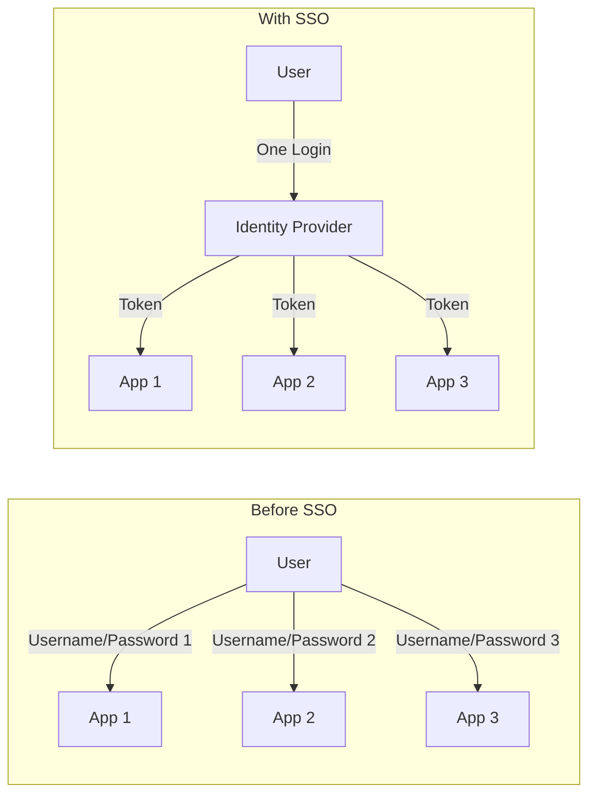

---

## The Cast of Characters: Key Terminology

Before we dive into protocols, let's introduce the main actors in the SSO play. Understanding these terms is half the battle.

### User
The person who wants to log in. That's you!

### Service Provider (SP)
The application the user wants to access. This could be a web app, a mobile app, or an API. In SSO terminology, the SP **trusts** the IdP to verify who the user is.

Examples: Jira, GitHub, Slack, your company's internal dashboard.

### Identity Provider (IdP)
The centralized system that authenticates the user and issues a "voucher" (token) proving their identity. The IdP is the source of truth for user credentials.

Examples: Microsoft Entra ID (Azure AD), Okta, Google Workspace, Auth0, Keycloak.

### Authentication vs. Authorization
This is the single most confused pair of terms in the industry:
- **Authentication (AuthN)**: Proving WHO you are. "Are you really John Doe?"
- **Authorization (AuthZ)**: Deciding WHAT you are allowed to do. "John Doe is allowed to view reports but not delete them."

SSO is primarily about Authentication. Once the user is authenticated, the SP decides what resources they are authorized to access.

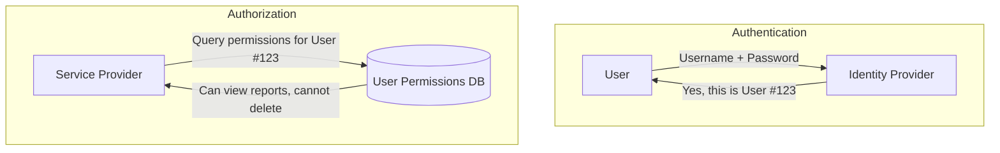

---

## Protocol 1: OAuth 2.0 -- The Delegation Framework

OAuth 2.0 is the most widely used protocol in modern SSO. But here is the trick: **OAuth 2.0 is not technically an authentication protocol**. It is an **authorization framework** designed to let a user grant a third-party app limited access to their resources.

### The Classic Example

Imagine you use a photo printing website. The website asks, "Can we access your Google Photos to print them?" You don't want to give the website your Google password. Instead, Google uses OAuth 2.0 to let you **delegate** limited access.

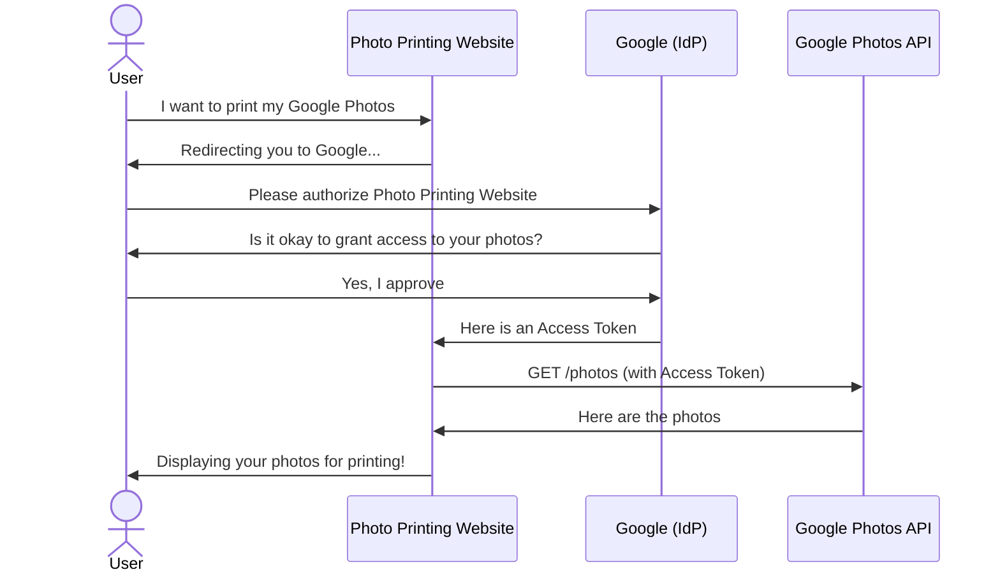

### Why Is OAuth 2.0 Used for Login?

Even though OAuth 2.0 was built for delegation, developers realized they could use it for login too. If the user successfully authorizes the app, the app knows the user must be logged into the IdP. The problem is that OAuth 2.0 doesn't define a standard way to get user identity information -- that's where OpenID Connect comes in.

---

## Protocol 2: OpenID Connect (OIDC) -- Identity on Top of OAuth

OpenID Connect (OIDC) is a thin layer built **on top of** OAuth 2.0. It adds the missing piece: a standardized way to prove the user's identity.

### The ID Token

OIDC introduces a special token called the **ID Token**. This is a **JSON Web Token (JWT)** that contains claims (pieces of information) about the user, such as:
- `sub`: A unique identifier for the user
- `email`: The user's email address
- `name`: The user's full name
- `preferred_username`: The username

### JWT Quick Explanation

A JWT is a string that looks like this:
```
eyJhbGciOiJSUzI1NiIs...eyJzdWIiOiIxMjM0NTY3ODkwIiwibmFtZSI6IkpvaG4gRG9lIiwiaWF0IjoxNTE2MjM5MDIyfQ...SflKxwRJSMeKKF2QT4fwpMe...
```

It is divided into three parts separated by dots (`.`):
1. **Header**: What algorithm was used to sign the token
2. **Payload**: The actual data (claims) about the user
3. **Signature**: A cryptographic signature proving the token was issued by the IdP and hasn't been tampered with

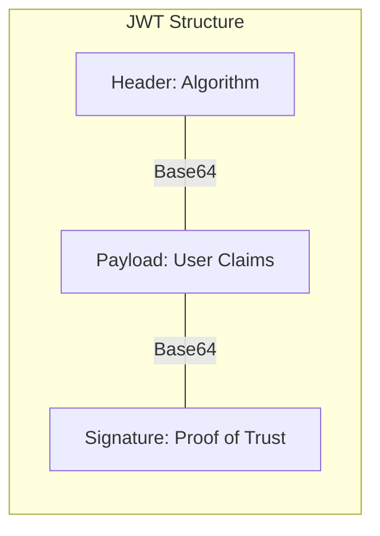

### OIDC Login Flow (Simplified)

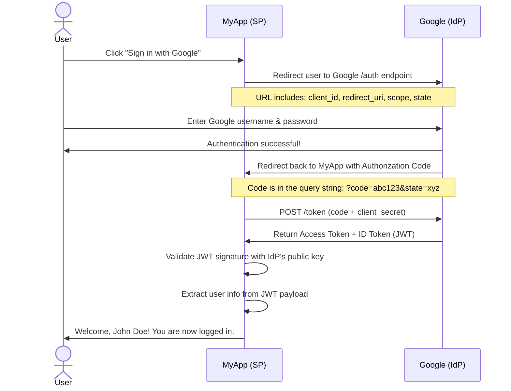

### Key Security Parameters

You will see these terms in every OIDC implementation:

| Parameter | Purpose |
|-----------|---------|
| `client_id` | Identifies your application to the IdP |
| `client_secret` | A secret password your app uses to authenticate with the IdP (keep this safe!) |
| `redirect_uri` | The URL the IdP should send the user back to after login |
| `scope` | What information you are requesting (e.g., `openid email profile`) |
| `state` | A random string to prevent CSRF attacks (more on this later) |
| `nonce` | A random string to prevent replay attacks for ID Tokens |

---

## Protocol 3: SAML 2.0 -- The Enterprise Veteran

SAML (Security Assertion Markup Language) 2.0 is the oldest of the three protocols and is still heavily used in large enterprises, especially in healthcare, finance, and government.

### Key Differences from OIDC

| Feature | SAML 2.0 | OIDC |
|---------|----------|------|
| Data Format | XML | JSON (JWT) |
| Transport | Browser POST / Redirect | HTTP GET/POST + API calls |
| Complexity | Higher (XML parsing) | Lower |
| Modern App Support | Limited | Excellent |
| Enterprise Legacy | Strong | Growing |

### How SAML Works (High Level)

Instead of tokens, SAML passes **Assertions** -- XML documents that make claims about the user. The IdP signs the Assertion with an X.509 certificate, and the SP validates that signature.

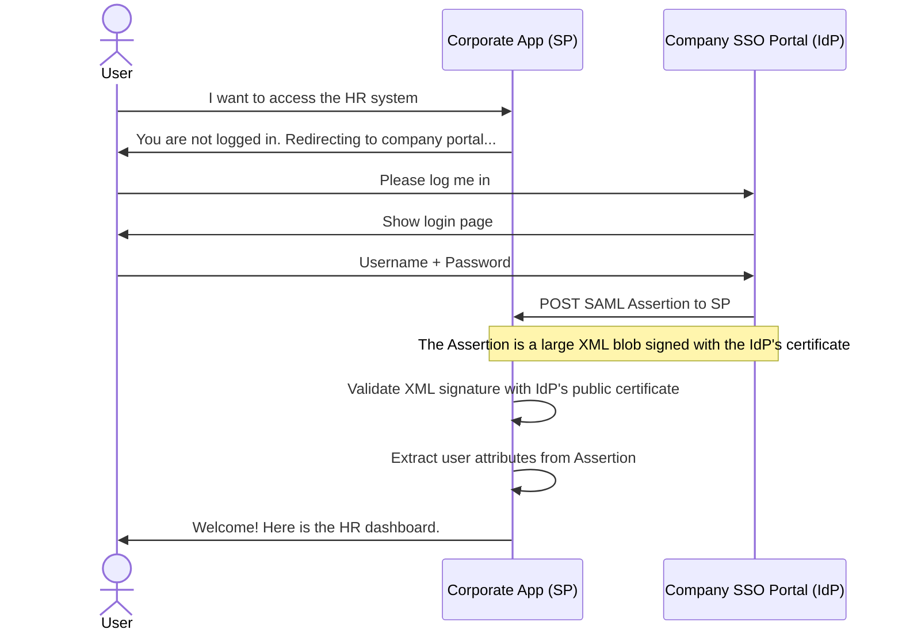

### Why SAML Is Still Around

Many enterprises invested heavily in SAML infrastructure years ago. Switching everything to OIDC is expensive and risky. As a developer, you will likely need to support both.

---

## Common SSO Flows Explained with Diagrams

### Flow 1: SP-Initiated Login (Service Provider Initiated)

This is the most common flow. The user starts at the application they want to use.

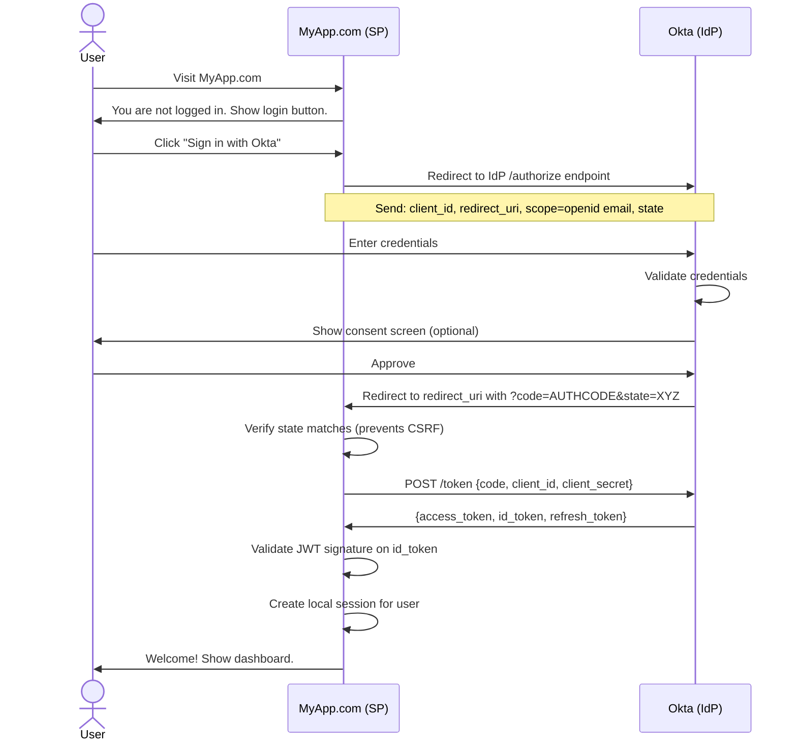

### Flow 2: IdP-Initiated Login (Identity Provider Initiated)

In this flow, the user starts at their company dashboard (the IdP) and clicks a tile that represents your application.

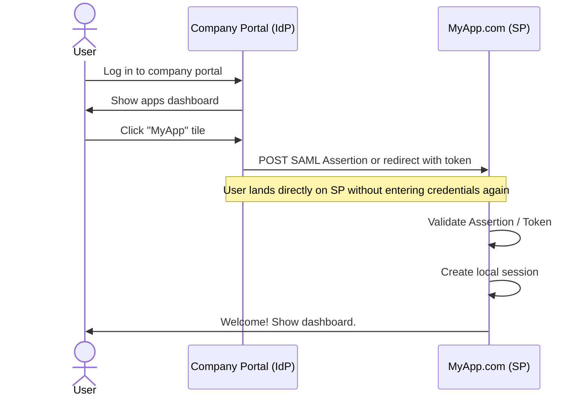

**Security Warning:** IdP-initiated flows can be vulnerable to certain attacks if not properly validated. Always verify the Assertion/Token carefully.

---

## Tokens Explained: Access, ID, and Refresh

When an SSO login succeeds, the IdP usually returns multiple tokens. Let's clarify what each one does.

### Access Token
- **Purpose**: Grants permission to access APIs
- **Audience**: Resource Servers (APIs)
- **Example**: Calling the Google Calendar API to fetch events
- **Lifetime**: Short (usually 5-60 minutes)

### ID Token
- **Purpose**: Proves the user's identity
- **Audience**: The client application (SP)
- **Example**: Extracting user's email and name for display
- **Lifetime**: Short (usually same as Access Token)

### Refresh Token
- **Purpose**: Gets a new Access Token when the old one expires
- **Audience**: The IdP's token endpoint
- **Example**: Silently renewing the user's session without asking them to log in again
- **Lifetime**: Long (days, weeks, or even months), but can be revoked

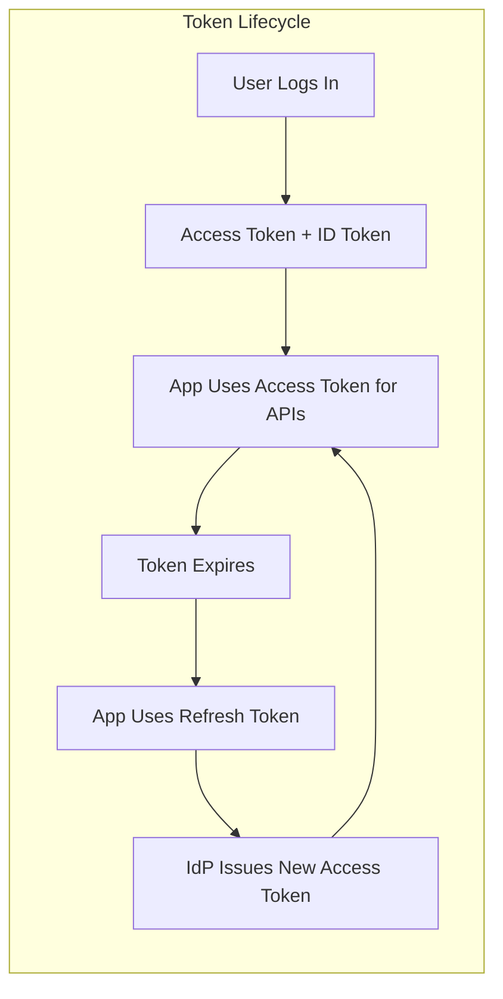

---

## Security Essentials Every Junior Dev Should Know

SSO is powerful, but if implemented poorly, it can open massive security holes. Here are the absolute essentials.

### 1. Validate the `state` Parameter (CSRF Protection)

When your app redirects the user to the IdP, you generate a random `state` string and store it in a cookie or session. When the user returns, the IdP sends back the same `state`. Your app MUST verify they match.

**Why?** Without this, an attacker could trick a user into logging in as the attacker. The user would end up on your app thinking they are logged in as themselves, but they are actually in the attacker's account.

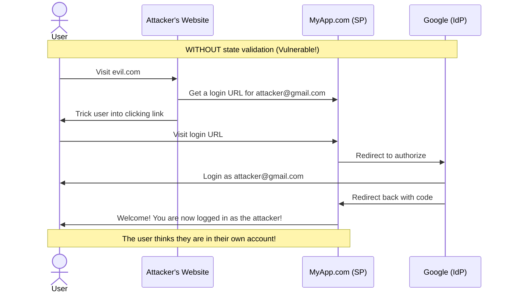

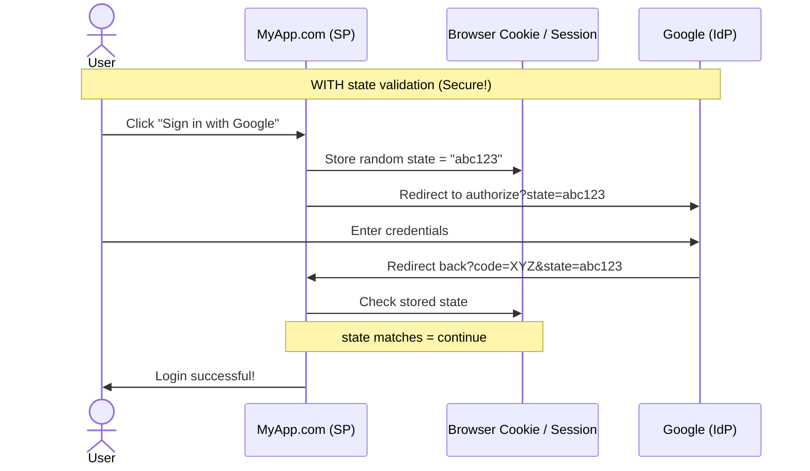

### 2. Use HTTPS Everywhere

This sounds obvious, but it is worth repeating: **never send tokens or authorization codes over HTTP**. Always use HTTPS. An attacker on the same network can intercept HTTP traffic trivially using tools like Wireshark or a simple proxy.

### 3. Validate Token Signatures

When your app receives an ID Token (JWT), you must verify the cryptographic signature using the IdP's public key. Never trust the claims inside a JWT without validating the signature first. A JWT library like `jsonwebtoken` (Node.js) or `PyJWT` (Python) makes this easy.

```javascript
// Node.js example using jsonwebtoken library
const jwt = require('jsonwebtoken');
const jwksClient = require('jwks-rsa');

const client = jwksClient({
  jwksUri: 'https://your-idp.com/.well-known/jwks.json'
});

function getKey(header, callback) {
  client.getSigningKey(header.kid, (err, key) => {
    const signingKey = key.publicKey || key.rsaPublicKey;
    callback(null, signingKey);
  });
}

// idToken is the JWT received from the IdP
jwt.verify(idToken, getKey, { algorithms: ['RS256'] }, (err, decoded) => {
  if (err) {
    console.error('Invalid token!', err);
  } else {
    console.log('User claims:', decoded);
    // decoded.sub, decoded.email, etc.
  }
});
```

### 4. Set Short Token Lifetimes

Access tokens should expire quickly (5-60 minutes). This limits the damage if a token is stolen. Use refresh tokens to get new access tokens without bothering the user.

### 5. Securely Store Client Secrets

Your `client_secret` is a password that identifies your application to the IdP. Never hardcode it in frontend JavaScript (attackers can read it). Never commit it to public Git repositories. Use environment variables or secret management services (like AWS Secrets Manager or HashiCorp Vault).

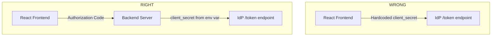

---

## Summary Cheat Sheet for Junior Developers

| Concept | Remember This |
|---------|---------------|
| **SSO** | Log in once, access many apps |
| **IdP** | The system that checks your password (Google, Okta, Microsoft) |
| **SP** | The app you want to use (Jira, GitHub, your app) |
| **OAuth 2.0** | Authorization framework ("Can this app access my stuff?") |
| **OIDC** | Identity layer on top of OAuth ("This is who I am") |
| **SAML** | Older XML-based protocol for enterprise SSO |
| **Access Token** | Lets you call APIs |
| **ID Token** | Proves who you are (JWT) |
| **Refresh Token** | Gets new Access Tokens without re-login |
| **state** | Random string to prevent CSRF attacks |
| **client_secret** | Your app's password -- keep it secret! |

---

<br><br><br>

---
---

## 導言：點解 Junior Programmer 要關心 SSO？

如果你係一個啱啱入行嘅 developer，或者正在整你第一個 Web Application，你可能會問：「我點解要知 SSO 係啲乜？呢啲唔係 senior architects 先至要理嘅嘢咩？」

但現實係，SSO 已經周圍都係。你喺某個網站撳「用 Google 登入」嗰陣，就係緊用緊 SSO。你公司幫你用一個密碼就咁登入十個內部工具，呢樣都係 SSO。你用公司 Microsoft 帳戶登入某個 SaaS 產品，仲係 SSO。

理解 SSO 已經唔再係「加分項」，而係每個想做 modern、enterprise-ready applications 嘅 full-stack 或 backend developer 嘅基本功。好消息係，一旦你剝走嗰啲令人望而生畏嘅術語，核心概念其實相當簡單。

呢篇文係專為新手而設。我哋會一步一步咁解釋咩係 SSO、點解要存在，同埋幾個主要 Protocols 係點運作。我哋會用大量 Mermaid diagrams 將流程視覺化，因為睇箭咀往往比睇一大段文字更容易理解。

---

## SSO 到底係為咗解決咩問題？

### 密碼疲勞問題 (Password Fatigue)

幻想吓你在某間公司返工，公司用到 10 個唔同嘅內部工具：
1. 項目管理工具（如 Jira）
2. 程式碼倉庫（如 GitHub）
3. 溝通工具（如 Slack）
4. HR 系統
5. 財務 Dashboard
6. CRM 系統
7. Bug Tracker
8. Wiki / 文檔網站
9. 部署 Portal
10. 數據分析 Dashboard

冇 SSO 嘅話，你需要創建 10 個獨立帳戶、記住 10 組獨立密碼，然後當你忘記嗰陣又要重置 10 次。呢個就叫做 **密碼疲勞 (Password Fatigue)**。

### IT Admin 嘅噩夢

再幻想吓你係 IT 管理員。當有新員工入職，你需要幫佢創建 10 個帳戶。當有員工離職，你需要停用 10 個帳戶。如果你漏咗其中任何一個，就已經係一個好嚴重嘅安全風險。

### 解決方案：SSO

SSO 就係為咗呢個問題而出現——佢讓用戶**只登入一次**，就可以訪問**所有**已連接嘅應用程式。用戶只係向一個 **Identity Provider (IdP)** 做認證，例如 Microsoft Entra ID、Okta 或者 Google Workspace，然後 IdP 就為佢嘅身份向所有其他應用程式擔保。


---

## 主要角色：關鍵術語你要知

喺深入研究 Protocols 之前，我哋先介紹一下 SSO 世界裡面嘅主要演員。理解呢啲術語，你已經贏咗一半。

### User（用戶）
就係想登入嘅嗰個人——就係你！

### Service Provider (SP)（服務提供者）
用戶想要訪問嘅應用程式。佢可以係 Web App、Mobile App 或者 API。喺 SSO 術語入面，SP **信任** IdP 嚟驗證用戶身份。

例子：Jira、GitHub、Slack、你公司嘅內部 Dashboard。

### Identity Provider (IdP)（身份提供者）
集中管理用戶認證、並發出一張「 vouch」咁嘅 token（通行證）嚟證明用戶身份嘅系統。IdP 係用戶憑證嘅最終仲裁者。

例子：Microsoft Entra ID (Azure AD)、Okta、Google Workspace、Auth0、Keycloak。

### Authentication（認證）vs. Authorization（授權）
呢兩個係業界最容易被混淆嘅一對術語：
- **Authentication (AuthN)**：證明你**係邊個**。「你真係 John Doe 嗎？」
- **Authorization (AuthZ)**：決定你**可以做啲乜**。「John Doe 可以睇報告但唔可以刪除。」

SSO 主要係關乎 Authentication。一旦用戶通過咗認證，SP 先至會決定佢可以訪問邊啲資源。


---

## Protocol 1：OAuth 2.0 -- 委託框架

OAuth 2.0 係現代 SSO 入面最廣泛使用嘅 Protocol。但係重點就係：**OAuth 2.0 技術上唔係一個認證 Protocol**。佢係一個 **授權框架 (Authorization framework)**，設計嚟俾用戶委託第三方 App 有限度咁訪問佢哋嘅資源。

### 經典例子

幻想吓你用緊一間相片冲印網站。網站問：「我哋可以訪問你嘅 Google Photos 嚟冲印嗎？」你唔想將你嘅 Google 密碼俾呢個網站。點算？Google 就用 OAuth 2.0 俾你**委託**佢哋有限度嘅訪問權。


### 點解 OAuth 2.0 會被用嚟做登入？

雖然 OAuth 2.0 係為咗委託而建，但係 developers 後嚟發現佢都可以用嚟做登入。如果用戶成功authorize 咗個 App，個 App 就知道用戶肯定已經登入咗喺 IdP。但係問題係 OAuth 2.0 冇定義一個標準方式嚟攞用戶身份資訊——呢個就係 OpenID Connect 出現嘅原因。

---

## Protocol 2：OpenID Connect (OIDC) -- 喺 OAuth 上面加身份層

OpenID Connect (OIDC) 係一個 **建基於** OAuth 2.0 上面嘅薄身份層。佢加咗缺失嗰塊：標準化嘅用戶身份證明方式。

### ID Token

OIDC 引入了叫做 **ID Token** 嘅特別 token。呢個係一個 **JSON Web Token (JWT)**，入面包含關於用戶嘅 claims（資訊片段），例如：
- `sub`：用戶嘅唯一標識
- `email`：用戶電郵地址
- `name`：用戶全名
- `preferred_username`：用戶名

### JWT 快速解說

JWT 係一串睇落似呢個樣嘅字串：
```
eyJhbGciOiJSUzI1NiIs...eyJzdWIiOiIxMjM0NTY3ODkwIiwibmFtZSI6IkpvaG4gRG9lIiwiaWF0IjoxNTE2MjM5MDIyfQ...SflKxwRJSMeKKF2QT4fwpMe...
```

佢分為三部分，用點（`.`）分隔：
1. **Header**：簽名用咗咩演算法
2. **Payload**：關於用戶嘅實際資料（claims）
3. **Signature**：密碼學簽名，證明 token 係由 IdP 發出而且未被篡改


### OIDC 登入流程（精簡版）


### 關鍵安全參數

喺每個 OIDC 實作入面都會見到呢啲術語：

| 參數 | 用途 |
|-----------|---------|
| `client_id` | 向 IdP 標識你嘅應用程式 |
| `client_secret` | 你嘅 App 向 IdP 做認證用嘅密碼（一定要妥善保管！） |
| `redirect_uri` | IdP 喺登入完成後要 redirect 用戶去嘅 URL |
| `scope` | 你喺度請求咩資訊（例如 `openid email profile`） |
| `state` | 一個 random string，用嚟防止 CSRF 攻擊（稍後再詳細講） |
| `nonce` | 一個 random string，用嚟防止 ID Token 嘅 replay 攻擊 |

---

## Protocol 3：SAML 2.0 -- 企業老將

SAML (Security Assertion Markup Language) 2.0 係三個 Protocols 之中最老資格嘅，時至今日依然被大型企業廣泛使用，特別係醫療、金融同政府範疇。

### 同 OIDC 嘅主要分別

| 特性 | SAML 2.0 | OIDC |
|---------|----------|------|
| 資料格式 | XML | JSON (JWT) |
| 傳輸方式 | Browser POST / Redirect | HTTP GET/POST + API calls |
| 複雜度 | 較高（XML parsing） | 較低 |
| 支援現代 App | 有限 | 優秀 |
| 企業 legacy | 強大 | 正在增長 |

### SAML 點運作（高層次）

SAML 唔使用 token，而係傳遞 **Assertions**——即係關於用戶嘅 XML documents。IdP 會用 X.509 certificate 簽名嗰個 Assertion，然後 SP 驗證呢個 signature。


### 點解 SAML 依然存在

好多企業幾年前已經喺 SAML 基建上面大灑金錢。要將所有嘢轉去 OIDC 係昂貴而且有風險嘅。作為 developer，你好可能需要同時支援兩者。

---

## 常見 SSO 流程圖解

### 流程 1：SP-Initiated Login（服務提供者發起嘅登入）

呢個係最常見嘅流程。用戶由佢想要用嘅應用程式開始。


### 流程 2：IdP-Initiated Login（身份提供者發起嘅登入）

喺呢個流程入面，用戶由公司 Dashboard（IdP）開始，然後撳代表你應用程式嘅一塊 tile。


**安全警告：** 如果冇妥善驗證，IdP-Initiated 流程可能容易受到某啲攻擊。一定要仔細驗證 Assertion/Token。

---

## Token 解說：Access、ID 同 Refresh

當 SSO 登入成功嗰陣，IdP 通常會返回多個 tokens。我哋嚟厘清每個係做咩嘅。

### Access Token
- **用途**：授予訪問 APIs 嘅權限
- **受眾**：Resource Servers (APIs)
- **例子**：呼叫 Google Calendar API 嚟攞活動
- **有效期**：短（通常 5-60 分鐘）

### ID Token
- **用途**：證明用戶身份
- **受眾**：客戶端應用程式（SP）
- **例子**：抽出用戶電郵同姓名嚟顯示
- **有效期**：短（通常同 Access Token 一樣）

### Refresh Token
- **用途**：當舊嘅 Access Token 過期嗰陣，攞新嘅 Access Token
- **受眾**：IdP 嘅 token endpoint
- **例子**：默默咁幫用戶續期，唔使佢再登入一次
- **有效期**：長（數日、數周，甚至數月），但可以隨時被撤銷

```mermaid
graph LR
    subgraph "Token Lifecycle"
        direction TB
        Login[User Logs In] --> AT[Access Token + ID Token]
        AT --> Use[App Uses Access Token for APIs]
        Use --> Expire[Token Expires]
        Expire --> Refresh[App Uses Refresh Token]
        Refresh --> NewAT[IdP Issues New Access Token]
        NewAT --> Use
    end
```

---

## 每個 Junior Dev 都必須知道嘅安全要點

SSO 好強大，但如果實作得衰，可以打開巨大嘅安全漏洞。以下係啲最基本嘅你要知。

### 1. 驗證 `state` 參數（CSRF 防護）

當你嘅 App 將用戶 redirect 去 IdP 嗰陣，你要 generate 一個 random `state` string，然後存喺 cookie 或 session 度。當用戶返轉頭嗰陣，IdP 會將同一個 `state` 彈返俾你。你嘅 App **必須**驗證佢哋係 match 嘅。

**點解要咁做？** 如果冇呢個，用戶可能被攻击者呃到用攻击者嘅帳戶登入。用戶會以為自己係登入緊自己嘅帳戶，但實際上佢係已經登入咗入攻击者嘅帳戶。

```mermaid
sequenceDiagram
    actor User
    participant Attacker as Attacker's Website
    participant SP as MyApp.com (SP)
    participant IdP as Google (IdP)

    Note over User,IdP: WITHOUT state validation (Vulnerable!)
    User->>Attacker: Visit evil.com
    Attacker->>SP: Get a login URL for attacker@gmail.com
    Attacker->>User: Trick user into clicking link
    User->>SP: Visit login URL
    SP->>IdP: Redirect to authorize
    IdP->>User: Login as attacker@gmail.com
    IdP->>SP: Redirect back with code
    SP->>User: Welcome! You are now logged in as the attacker!
    Note over User,SP: The user thinks they are in their own account!
```

```mermaid
sequenceDiagram
    actor User
    participant SP as MyApp.com (SP)
    participant Cookie as Browser Cookie / Session
    participant IdP as Google (IdP)

    Note over User,IdP: WITH state validation (Secure!)
    User->>SP: Click "Sign in with Google"
    SP->>Cookie: Store random state = "abc123"
    SP->>IdP: Redirect to authorize?state=abc123
    User->>IdP: Enter credentials
    IdP->>SP: Redirect back?code=XYZ&state=abc123
    SP->>Cookie: Check stored state
    Note over SP,Cookie: state matches = continue
    SP->>User: Login successful!
```

### 2. 所有地方都要用 HTTPS

呢個聽落似是老生常談，但係值得再重複一次：**永遠、永遠唔好通過 HTTP 傳送 tokens 或者 authorization codes**。一定要用 HTTPS。攻擊者只要喺同一個網絡上面，就可以用 Wireshark 或者簡單嘅 proxy 轻易攔截 HTTP 流量。

### 3. 驗證 Token Signatures

當你嘅 App 收到 ID Token (JWT) 嗰陣，你必須用 IdP 嘅 public key 驗證嗰個密碼學 signature。在未驗證 signature 之前，千祈唔好信任 JWT 入面嘅任何 claims。`jsonwebtoken` (Node.js) 或者 `PyJWT` (Python) 呢啲 JWT libraries 令呢樣嘢變得容易。

```javascript
// Node.js example using jsonwebtoken library
const jwt = require('jsonwebtoken');
const jwksClient = require('jwks-rsa');

const client = jwksClient({
  jwksUri: 'https://your-idp.com/.well-known/jwks.json'
});

function getKey(header, callback) {
  client.getSigningKey(header.kid, (err, key) => {
    const signingKey = key.publicKey || key.rsaPublicKey;
    callback(null, signingKey);
  });
}

// idToken is the JWT received from the IdP
jwt.verify(idToken, getKey, { algorithms: ['RS256'] }, (err, decoded) => {
  if (err) {
    console.error('Invalid token!', err);
  } else {
    console.log('User claims:', decoded);
    // decoded.sub, decoded.email, etc.
  }
});
```

### 4. 設定短啲嘅 Token 有效期

Access tokens 應該快啲過期（5-60 分鐘）。咁樣可以限制如果 token 被盜用嘅損失。用 refresh tokens 嚟帮用户攞新 access tokens，唔使打搞用戶。

### 5. 安全儲存 Client Secrets

你嘅 `client_secret` 係一隻password，用嚟向 IdP 標識你嘅應用程式。永遠、永远唔好將佢 hardcode 喺 frontend JavaScript 度（攻擊者可以睇到）。永远唔好 commit 去 public Git repositories。用 environment variables 或者 secret management services（好似 AWS Secrets Manager 或者 HashiCorp Vault）。

```mermaid
graph TD
    subgraph "WRONG"
        Frontend[React Frontend] -->|Hardcoded client_secret| IdP[IdP /token endpoint]
    end

    subgraph "RIGHT"
        FE[React Frontend] -->|Authorization Code| BE[Backend Server]
        BE -->|client_secret from env var| IdP2[IdP /token endpoint]
    end
```

---

## 新手 Developer 概要速查表

| 概念 | 記住呢樣 |
|---------|---------------|
| **SSO** | 登入一次，訪問多個 Apps |
| **IdP** | 幫你檢查密碼嘅系統（Google、Okta、Microsoft） |
| **SP** | 你想要用嘅 App（Jira、GitHub、你嘅 App） |
| **OAuth 2.0** | 授權框架（「呢個 App 可以訪問我啲嘢嗎？」） |
| **OIDC** | 喺 OAuth 上面加嘅身份層（「呢個係我」） |
| **SAML** | 企業 SSO 嘅舊式 XML-based Protocol |
| **Access Token** | 讓你可以呼叫 APIs |
| **ID Token** | 證明你係邊個（JWT） |
| **Refresh Token** | 唔使重新登入就可以攞新 Access Tokens |
| **state** | 用嚟防止 CSRF 攻擊嘅 random string |
| **client_secret** | 你嘅 App 密碼——一定要保密！ |

---

## 結論：SSO 冇你想像中咁難

如果你係一個啱啱入行嘅 junior programmer，你可能會覺得 SSO 係一啲好高階、好遙遠嘅嘢，淨係得 senior architect 先至需要識。但事實係，SSO 已經無處不在。當你喺某個網站撳「用 Google 登入」嗰陣，就已經係緊用緊 SSO。

理解 SSO 嘅基本概念——咩係 IdP、咩係 SP、OAuth 2.0 同 OIDC 有咩分別、點解 JWT 咁重要——係每一個現代全端或者後端開發者都應該具備嘅基本功。呢篇文用咗好多 mermaid 圖解去將複雜嘅流程視覺化，希望可以幫到你建立一個清晰嘅 mental model。

記住，無論你用咩 protocol，以下呢幾點係鐵則：
1. **永遠驗證 `state` 參數** — 防止 CSRF 攻擊
2. **永遠用 HTTPS** — 保護 token 唔俾人攔截
3. **永遠驗證 JWT signature** — 確保 token 真係由 IdP 發出
4. **設定短嘅 token 有效期** — 限制被盗用後嘅損失
5. **安全儲存 client_secret** — 唔好 hardcode 喺 frontend code 入面

掌握咗呢啲基礎之後，你會發現閱讀同埋實作 SSO 相關嘅功能時，唔再係望住啲文件發呆，而係真係理解到背後嘅邏輯。繼續加油，安全寫 code！