## Introduction: Seeing the Whole Elephant

In the ancient Indian parable of the blind men and the elephant, each person touches a different part and believes they understand the whole animal. The same danger lurks in SSO implementation. Parts 1 through 6 of this series each dissected a critical component—encryption, configuration, user matching, OIDC validation, SAML processing, and logout. But if you only see the pieces, you miss the architecture.

This post is the **architectural blueprint**. It ties every piece together into a unified, visual narrative. We will walk through the **complete lifecycle** of an SSO interaction—from the moment a user clicks "Login with SSO" to the moment they are securely logged out—with Mermaid diagrams at every step. If you ever feel lost navigating the other parts of this series, come back here. This is the map.

---

## 1. The 30,000-Foot View: System Architecture

Before diving into flows, let's see the major components and how they connect. Our SSO system is built on a **layered architecture** with clear separation of concerns.

### Mermaid Diagram: High-Level System Architecture

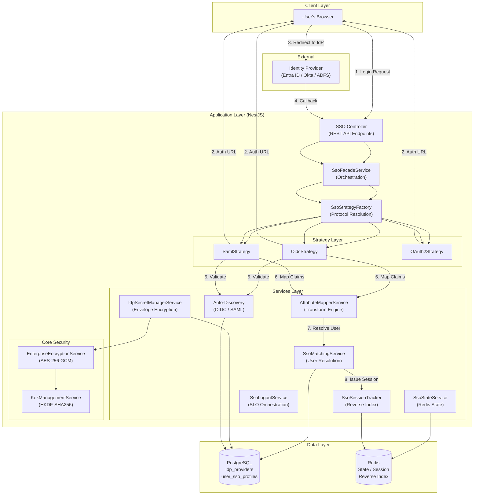
```mermaid
graph TB
    subgraph "Client Layer"
        Browser["User's Browser"]
    end

    subgraph "Application Layer (NestJS)"
        direction TB
        Controller["SSO Controller<br/>(REST API Endpoints)"]
        Facade["SsoFacadeService<br/>(Orchestration)"]
        Factory["SsoStrategyFactory<br/>(Protocol Resolution)"]

        subgraph "Strategy Layer"
            OIDC["OidcStrategy"]
            SAML["SamlStrategy"]
            OAUTH2["OAuth2Strategy"]
        end

        subgraph "Services Layer"
            StateSvc["SsoStateService<br/>(Redis State)"]
            DiscoverySvc["Auto-Discovery<br/>(OIDC / SAML)"]
            MapperSvc["AttributeMapperService<br/>(Transform Engine)"]
            MatchSvc["SsoMatchingService<br/>(User Resolution)"]
            SecretMgr["IdpSecretManagerService<br/>(Envelope Encryption)"]
            SessionSvc["SsoSessionTracker<br/>(Reverse Index)"]
            LogoutSvc["SsoLogoutService<br/>(SLO Orchestration)"]
        end

        subgraph "Core Security"
            KEK["KekManagementService<br/>(HKDF-SHA256)"]
            EncSvc["EnterpriseEncryptionService<br/>(AES-256-GCM)"]
        end
    end

    subgraph "Data Layer"
        DB[(PostgreSQL<br/>idp_providers<br/>user_sso_profiles)]
        Cache[(Redis<br/>State / Session<br/>Reverse Index)]
    end

    subgraph "External"
        IdP["Identity Provider<br/>(Entra ID / Okta / ADFS)"]
    end

    Browser -->|"1. Login Request"| Controller
    Controller --> Facade
    Facade --> Factory
    Factory --> OIDC & SAML & OAUTH2
    OIDC & SAML & OAUTH2 -->|"2. Auth URL"| Browser
    Browser -->|"3. Redirect to IdP"| IdP
    IdP -->|"4. Callback"| Controller
    Controller --> Facade
    Facade --> Factory
    Factory --> OIDC & SAML & OAUTH2
    OIDC & SAML -->|"5. Validate"| DiscoverySvc
    OIDC & SAML -->|"6. Map Claims"| MapperSvc
    MapperSvc -->|"7. Resolve User"| MatchSvc
    MatchSvc -->|"8. Issue Session"| SessionSvc

    StateSvc --> Cache
    SessionSvc --> Cache
    SecretMgr --> EncSvc
    EncSvc --> KEK
    MatchSvc --> DB
    SecretMgr --> DB
    DiscoverySvc --> DB
```

### Key Architectural Principles

| Principle | Implementation |
|---|---|
| **Strategy Pattern** | Each protocol (OIDC, SAML, OAuth2) is an isolated strategy behind a common interface |
| **Envelope Encryption** | All IdP secrets encrypted with per-provider DEK, wrapped by global KEK |
| **Stateless Validation** | JWT signature verified against cached JWKS; no DB round-trip per request |
| **Single-Use State** | Every `state` / `RelayState` is consumed atomically from Redis |
| **Fail-Safe Logout** | Local session destroyed *before* attempting IdP communication |

---

## 2. The OIDC Login Flow: End-to-End Sequence

OpenID Connect is the modern standard for federated authentication. Here is the complete sequence from click to session.

### Mermaid Diagram: OIDC Authorization Code Flow with PKCE

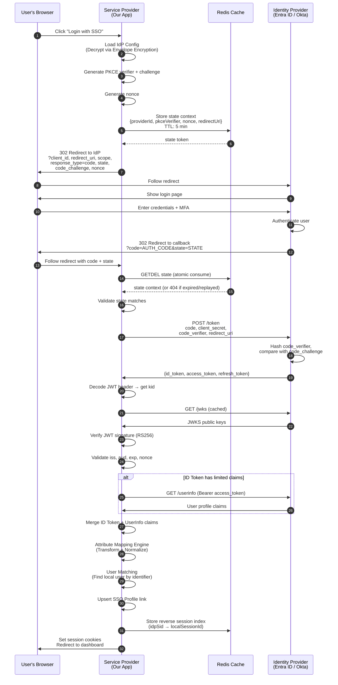
```mermaid
sequenceDiagram
    autonumber
    participant U as User's Browser
    participant SP as Service Provider<br/>(Our App)
    participant Redis as Redis Cache
    participant IdP as Identity Provider<br/>(Entra ID / Okta)

    U->>SP: Click "Login with SSO"
    SP->>SP: Load IdP Config<br/>(Decrypt via Envelope Encryption)
    SP->>SP: Generate PKCE verifier + challenge
    SP->>SP: Generate nonce
    SP->>Redis: Store state context<br/>{providerId, pkceVerifier, nonce, redirectUri}<br/>TTL: 5 min
    Redis-->>SP: state token
    SP->>U: 302 Redirect to IdP<br/>?client_id, redirect_uri, scope,<br/>response_type=code, state,<br/>code_challenge, nonce

    U->>IdP: Follow redirect
    IdP->>U: Show login page
    U->>IdP: Enter credentials + MFA
    IdP->>IdP: Authenticate user
    IdP->>U: 302 Redirect to callback<br/>?code=AUTH_CODE&state=STATE

    U->>SP: Follow redirect with code + state
    SP->>Redis: GETDEL state (atomic consume)
    Redis-->>SP: state context (or 404 if expired/replayed)
    SP->>SP: Validate state matches

    SP->>IdP: POST /token<br/>code, client_secret,<br/>code_verifier, redirect_uri
    IdP->>IdP: Hash code_verifier,<br/>compare with code_challenge
    IdP->>SP: {id_token, access_token, refresh_token}

    SP->>SP: Decode JWT header → get kid
    SP->>IdP: GET /jwks (cached)
    IdP->>SP: JWKS public keys
    SP->>SP: Verify JWT signature (RS256)
    SP->>SP: Validate iss, aud, exp, nonce

    alt ID Token has limited claims
        SP->>IdP: GET /userinfo (Bearer access_token)
        IdP->>SP: User profile claims
    end

    SP->>SP: Merge ID Token + UserInfo claims
    SP->>SP: Attribute Mapping Engine<br/>(Transform + Normalize)
    SP->>SP: User Matching<br/>(Find local user by identifier)
    SP->>SP: Upsert SSO Profile link
    SP->>Redis: Store reverse session index<br/>(idpSid → localSessionId)
    SP->>U: Set session cookies<br/>Redirect to dashboard
```

### Critical Security Checkpoints

At each numbered step, specific security validations occur:

1. **Envelope Encryption** decrypts the IdP client secret at runtime (Part 1)
2. **PKCE `code_challenge`** prevents authorization code interception (Part 1)
3. **`state` parameter** prevents CSRF; single-use via Redis `GETDEL` (Part 1)
4. **`nonce`** embedded in ID Token prevents replay attacks (Part 4)
5. **JWKS signature verification** ensures token authenticity (Part 4)
6. **Algorithm restriction** (`RS256` only) prevents `alg: none` attacks (Part 4)
7. **Audience validation** prevents cross-client token injection (Part 4)

---

## 3. The SAML 2.0 Login Flow: End-to-End Sequence

SAML 2.0 is the XML-based heavyweight used in government, healthcare, and finance. The flow is fundamentally different from OIDC.

### Mermaid Diagram: SAML 2.0 SP-Initiated Flow (HTTP-POST Binding)

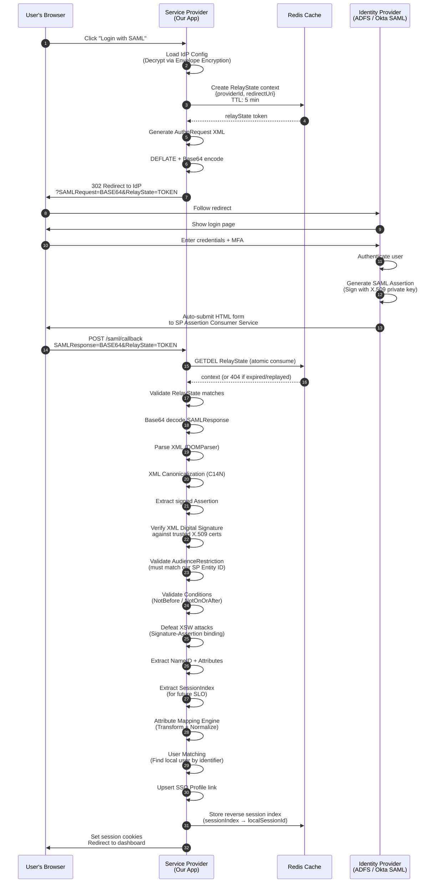
```mermaid
sequenceDiagram
    autonumber
    participant U as User's Browser
    participant SP as Service Provider<br/>(Our App)
    participant Redis as Redis Cache
    participant IdP as Identity Provider<br/>(ADFS / Okta SAML)

    U->>SP: Click "Login with SAML"
    SP->>SP: Load IdP Config<br/>(Decrypt via Envelope Encryption)
    SP->>Redis: Create RelayState context<br/>{providerId, redirectUri}<br/>TTL: 5 min
    Redis-->>SP: relayState token
    SP->>SP: Generate AuthnRequest XML
    SP->>SP: DEFLATE + Base64 encode
    SP->>U: 302 Redirect to IdP<br/>?SAMLRequest=BASE64&RelayState=TOKEN

    U->>IdP: Follow redirect
    IdP->>U: Show login page
    U->>IdP: Enter credentials + MFA
    IdP->>IdP: Authenticate user
    IdP->>IdP: Generate SAML Assertion<br/>(Sign with X.509 private key)
    IdP->>U: Auto-submit HTML form<br/>to SP Assertion Consumer Service

    U->>SP: POST /saml/callback<br/>SAMLResponse=BASE64&RelayState=TOKEN
    SP->>Redis: GETDEL RelayState (atomic consume)
    Redis-->>SP: context (or 404 if expired/replayed)
    SP->>SP: Validate RelayState matches

    SP->>SP: Base64 decode SAMLResponse
    SP->>SP: Parse XML (DOMParser)
    SP->>SP: XML Canonicalization (C14N)
    SP->>SP: Extract signed Assertion
    SP->>SP: Verify XML Digital Signature<br/>against trusted X.509 certs
    SP->>SP: Validate AudienceRestriction<br/>(must match our SP Entity ID)
    SP->>SP: Validate Conditions<br/>(NotBefore / NotOnOrAfter)
    SP->>SP: Defeat XSW attacks<br/>(Signature-Assertion binding)

    SP->>SP: Extract NameID + Attributes
    SP->>SP: Extract SessionIndex<br/>(for future SLO)
    SP->>SP: Attribute Mapping Engine<br/>(Transform + Normalize)
    SP->>SP: User Matching<br/>(Find local user by identifier)
    SP->>SP: Upsert SSO Profile link
    SP->>Redis: Store reverse session index<br/>(sessionIndex → localSessionId)
    SP->>U: Set session cookies<br/>Redirect to dashboard
```

### SAML vs OIDC: Key Differences at a Glance

| Aspect | OIDC | SAML 2.0 |
|---|---|---|
| **Data Format** | JSON (JWT) | XML (Assertions) |
| **Signature** | JWS (RS256) | XML Digital Signatures (X.509) |
| **Key Discovery** | JWKS endpoint (auto-cached) | Metadata XML (manual or fetched) |
| **State Protection** | `state` + `nonce` parameters | `RelayState` parameter |
| **Session Identifier** | `sid` claim in ID Token | `SessionIndex` in AuthnStatement |
| **Complexity** | Low-Medium | High (XML canonicalization, XSW) |
| **Primary Audience** | Modern SaaS, Cloud | Enterprise, Government, Healthcare |

---

## 4. Envelope Encryption: Protecting IdP Secrets

The database stores OAuth client secrets, SAML private keys, and mTLS certificates. If compromised, an attacker could impersonate our application to any IdP. We use a three-layer encryption architecture.

### Mermaid Diagram: Envelope Encryption Architecture

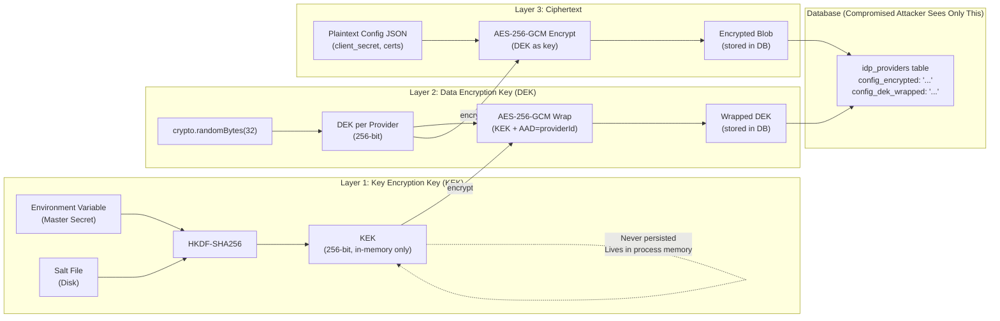
```mermaid
graph LR
    subgraph "Layer 1: Key Encryption Key (KEK)"
        ENV["Environment Variable<br/>(Master Secret)"]
        SALT["Salt File<br/>(Disk)"]
        HKDF["HKDF-SHA256"]
        KEK["KEK<br/>(256-bit, in-memory only)"]

        ENV --> HKDF
        SALT --> HKDF
        HKDF --> KEK
    end

    subgraph "Layer 2: Data Encryption Key (DEK)"
        DEK_GEN["crypto.randomBytes(32)"]
        DEK["DEK per Provider<br/>(256-bit)"]
        WRAP["AES-256-GCM Wrap<br/>(KEK + AAD=providerId)"]
        WRAPPED["Wrapped DEK<br/>(stored in DB)"]

        DEK_GEN --> DEK
        DEK --> WRAP
        KEK -->|"encrypt"| WRAP
        WRAP --> WRAPPED
    end

    subgraph "Layer 3: Ciphertext"
        CONFIG["Plaintext Config JSON<br/>(client_secret, certs)"]
        ENCRYPT["AES-256-GCM Encrypt<br/>(DEK as key)"]
        CIPHER["Encrypted Blob<br/>(stored in DB)"]

        CONFIG --> ENCRYPT
        DEK -->|"encrypt"| ENCRYPT
        ENCRYPT --> CIPHER
    end

    subgraph "Database (Compromised Attacker Sees Only This)"
        DB_ROW["idp_providers table<br/>config_encrypted: '...'<br/>config_dek_wrapped: '...'"]
    end

    WRAPPED --> DB_ROW
    CIPHER --> DB_ROW
    KEK -.->|"Never persisted<br/>Lives in process memory"| KEK
```

### Why Three Layers?

1. **KEK rotation**: If the master key is compromised, we only need to re-wrap the DEKs, not re-encrypt all data
2. **Per-provider isolation**: Compromising one provider's DEK doesn't expose others
3. **AAD binding**: The `providerId` as Additional Authenticated Data prevents moving a DEK between rows

### Mermaid Diagram: Decryption Flow (Runtime)

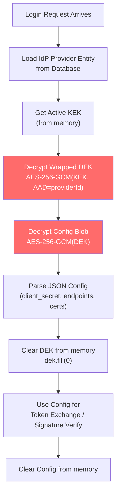
```mermaid
flowchart TD
    A["Login Request Arrives"] --> B["Load IdP Provider Entity<br/>from Database"]
    B --> C["Get Active KEK<br/>(from memory)"]
    C --> D["Decrypt Wrapped DEK<br/>AES-256-GCM(KEK, AAD=providerId)"]
    D --> E["Decrypt Config Blob<br/>AES-256-GCM(DEK)"]
    E --> F["Parse JSON Config<br/>(client_secret, endpoints, certs)"]
    F --> G["Clear DEK from memory<br/>dek.fill(0)"]
    G --> H["Use Config for<br/>Token Exchange / Signature Verify"]
    H --> I["Clear Config from memory"]

    style D fill:#ff6b6b,color:#fff
    style E fill:#ff6b6b,color:#fff
```

---

## 5. PKCE: Defeating Authorization Code Interception

PKCE (Proof Key for Code Exchange) prevents a malicious app on the user's device from stealing the authorization code during the redirect.

### Mermaid Diagram: PKCE Protection Mechanism

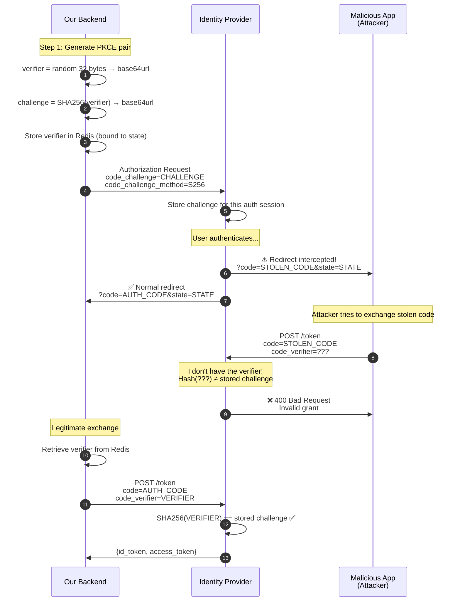
```mermaid
sequenceDiagram
    autonumber
    participant App as Our Backend
    participant IdP as Identity Provider
    participant Evil as Malicious App<br/>(Attacker)

    Note over App: Step 1: Generate PKCE pair
    App->>App: verifier = random 32 bytes → base64url
    App->>App: challenge = SHA256(verifier) → base64url
    App->>App: Store verifier in Redis (bound to state)

    App->>IdP: Authorization Request<br/>code_challenge=CHALLENGE<br/>code_challenge_method=S256
    IdP->>IdP: Store challenge for this auth session

    Note over IdP: User authenticates...
    IdP->>Evil: ⚠️ Redirect intercepted!<br/>?code=STOLEN_CODE&state=STATE
    IdP->>App: ✅ Normal redirect<br/>?code=AUTH_CODE&state=STATE

    Note over Evil: Attacker tries to exchange stolen code
    Evil->>IdP: POST /token<br/>code=STOLEN_CODE<br/>code_verifier=???

    Note over IdP: I don't have the verifier!<br/>Hash(???) ≠ stored challenge
    IdP->>Evil: ❌ 400 Bad Request<br/>Invalid grant

    Note over App: Legitimate exchange
    App->>App: Retrieve verifier from Redis
    App->>IdP: POST /token<br/>code=AUTH_CODE<br/>code_verifier=VERIFIER
    IdP->>IdP: SHA256(VERIFIER) == stored challenge ✅
    IdP->>App: {id_token, access_token}
```

### Why PKCE Matters Even for Confidential Clients

Historically, PKCE was designed for public clients (SPAs, mobile apps). But RFC 7636 and OAuth 2.0 BCP (RFC 9700) now recommend PKCE for **all** clients, including confidential server-side apps. The reason: defense-in-depth. Even if the `client_secret` is compromised, the attacker still cannot exchange a stolen code without the `verifier`.

---

## 6. Auto-Discovery: Eliminating Manual Configuration

Both OIDC and SAML support metadata discovery. This eliminates human error when configuring IdP endpoints.

### Mermaid Diagram: OIDC Auto-Discovery Flow

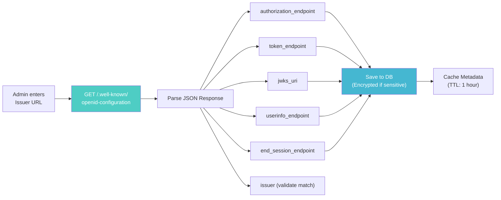
```mermaid
flowchart LR
    A["Admin enters<br/>Issuer URL"] --> B["GET /.well-known/<br/>openid-configuration"]
    B --> C["Parse JSON Response"]

    C --> D["authorization_endpoint"]
    C --> E["token_endpoint"]
    C --> F["jwks_uri"]
    C --> G["userinfo_endpoint"]
    C --> H["end_session_endpoint"]
    C --> I["issuer (validate match)"]

    D & E & F & G & H --> J["Save to DB<br/>(Encrypted if sensitive)"]
    J --> K["Cache Metadata<br/>(TTL: 1 hour)"]

    style B fill:#4ecdc4,color:#fff
    style J fill:#45b7d1,color:#fff
```

### Mermaid Diagram: SAML Metadata Discovery Flow

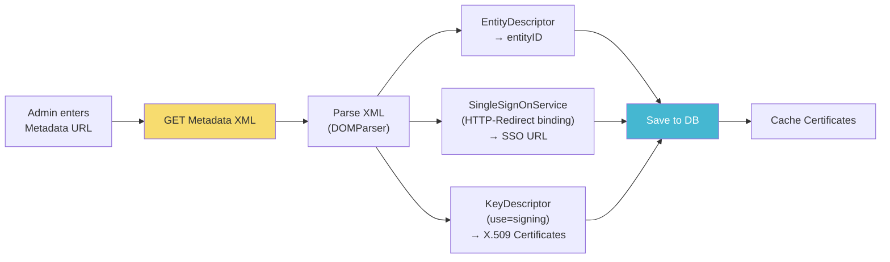
```mermaid
flowchart LR
    A["Admin enters<br/>Metadata URL"] --> B["GET Metadata XML"]
    B --> C["Parse XML<br/>(DOMParser)"]

    C --> D["EntityDescriptor<br/>→ entityID"]
    C --> E["SingleSignOnService<br/>(HTTP-Redirect binding)<br/>→ SSO URL"]
    C --> F["KeyDescriptor<br/>(use=signing)<br/>→ X.509 Certificates"]

    D & E & F --> G["Save to DB"]
    G --> H["Cache Certificates"]

    style B fill:#f7dc6f,color:#333
    style G fill:#45b7d1,color:#fff
```

### What Gets Discovered?

| Protocol | Discovered Data | Used For |
|---|---|---|
| **OIDC** | `authorization_endpoint` | Building login redirect URL |
| | `token_endpoint` | Exchanging code for tokens |
| | `jwks_uri` | Fetching public keys for JWT verification |
| | `userinfo_endpoint` | Getting additional user profile data |
| | `end_session_endpoint` | Building logout redirect URL |
| **SAML** | `entityID` | Validating Issuer in assertions |
| | `SingleSignOnService.Location` | Building AuthnRequest redirect URL |
| | `X.509 Certificate` | Verifying XML digital signatures |

---

## 7. Attribute Mapping Engine: Normalizing Chaos

Every IdP speaks a different dialect. Azure AD returns `upn`, Okta returns `preferred_username`, ADFS returns `http://schemas.xmlsoap.org/ws/2005/05/identity/claims/emailaddress`. Our mapping engine normalizes all of them.

### Mermaid Diagram: Attribute Mapping Pipeline

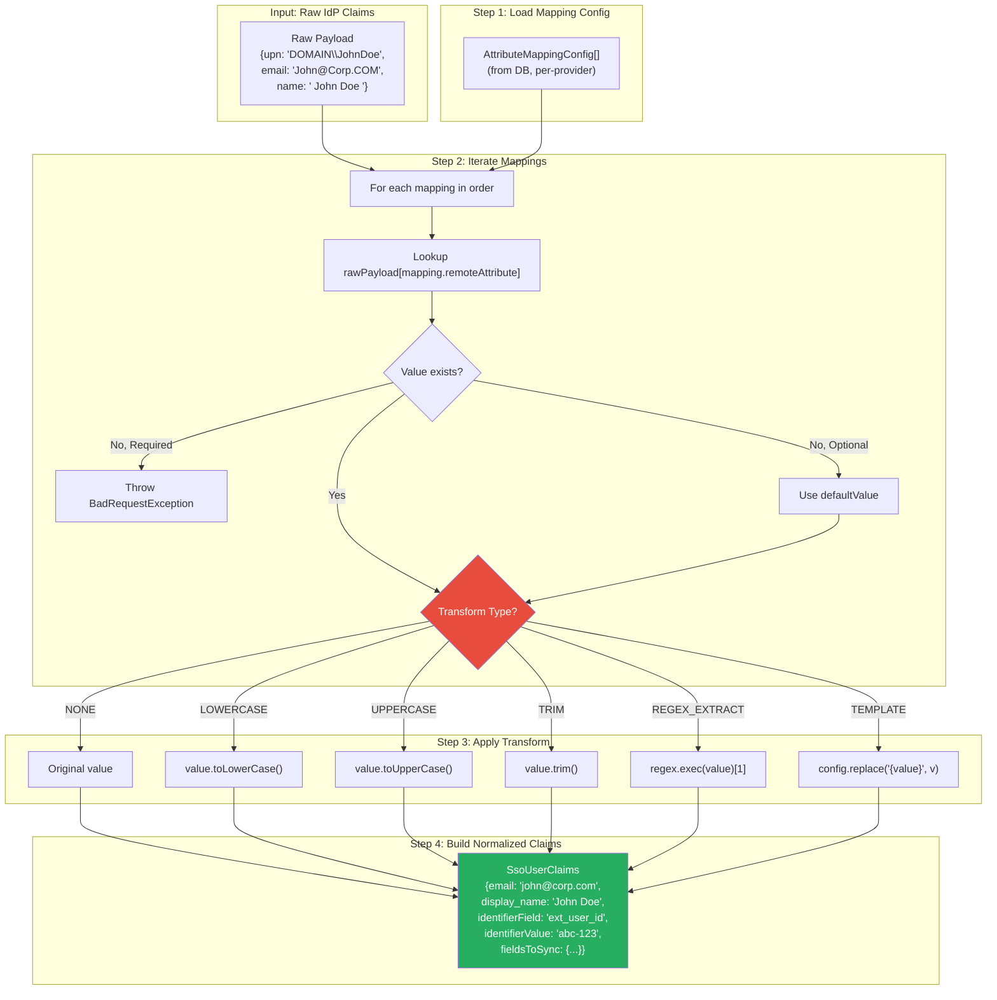
```mermaid
flowchart TD
    subgraph "Input: Raw IdP Claims"
        RAW["Raw Payload<br/>{upn: 'DOMAIN\\JohnDoe',<br/>email: 'John@Corp.COM',<br/>name: '  John Doe  '}"]
    end

    subgraph "Step 1: Load Mapping Config"
        CONFIG["AttributeMappingConfig[]<br/>(from DB, per-provider)"]
    end

    subgraph "Step 2: Iterate Mappings"
        direction TB
        LOOP["For each mapping in order"]
        LOOKUP["Lookup rawPayload[mapping.remoteAttribute]"]
        CHECK{"Value exists?"}

        LOOP --> LOOKUP --> CHECK
        CHECK -->|"Yes"| TRANSFORM
        CHECK -->|"No, Required"| ERROR["Throw BadRequestException"]
        CHECK -->|"No, Optional"| DEFAULT["Use defaultValue"]
        DEFAULT --> TRANSFORM
    end

    subgraph "Step 3: Apply Transform"
        direction TB
        TRANSFORM{"Transform Type?"}
        TRANSFORM -->|"NONE"| OUT1["Original value"]
        TRANSFORM -->|"LOWERCASE"| OUT2["value.toLowerCase()"]
        TRANSFORM -->|"UPPERCASE"| OUT3["value.toUpperCase()"]
        TRANSFORM -->|"TRIM"| OUT4["value.trim()"]
        TRANSFORM -->|"REGEX_EXTRACT"| OUT5["regex.exec(value)[1]"]
        TRANSFORM -->|"TEMPLATE"| OUT6["config.replace('{value}', v)"]
    end

    subgraph "Step 4: Build Normalized Claims"
        RESULT["SsoUserClaims<br/>{email: 'john@corp.com',<br/>display_name: 'John Doe',<br/>identifierField: 'ext_user_id',<br/>identifierValue: 'abc-123',<br/>fieldsToSync: {...}}"]
    end

    OUT1 & OUT2 & OUT3 & OUT4 & OUT5 & OUT6 --> RESULT
    RAW --> LOOP
    CONFIG --> LOOP

    style TRANSFORM fill:#e74c3c,color:#fff
    style RESULT fill:#27ae60,color:#fff
```

### Transform Examples

| Remote Claim (Raw) | Transform | Local Field | Result |
|---|---|---|---|
| `DOMAIN\JohnDoe` | `REGEX_EXTRACT: \\(.+)` | `username` | `JohnDoe` |
| `John@Corp.COM` | `LOWERCASE` | `email` | `john@corp.com` |
| `  John Doe  ` | `TRIM` | `display_name` | `John Doe` |
| `12345` | `TEMPLATE: EMP-{value}` | `staff_id` | `EMP-12345` |

---

## 8. User Matching & Account Linking

After mapping, we must find the corresponding local user. This is where Account Takeover (ATO) vulnerabilities lurk if done carelessly.

### Mermaid Diagram: User Resolution Flowchart

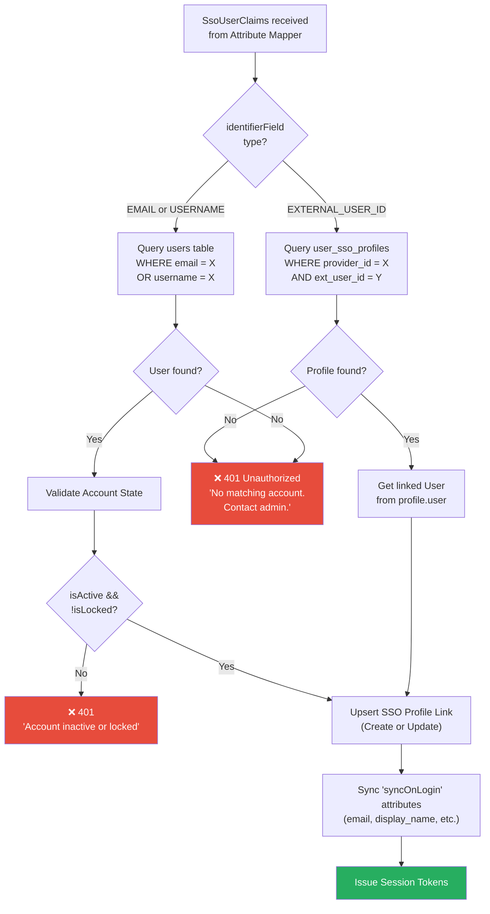
```mermaid
flowchart TD
    START["SsoUserClaims received<br/>from Attribute Mapper"] --> CHECK_ID{"identifierField<br/>type?"}

    CHECK_ID -->|"EXTERNAL_USER_ID"| SSO_LOOKUP["Query user_sso_profiles<br/>WHERE provider_id = X<br/>AND ext_user_id = Y"]
    CHECK_ID -->|"EMAIL or USERNAME"| USER_LOOKUP["Query users table<br/>WHERE email = X<br/>OR username = X"]

    SSO_LOOKUP --> FOUND_SSO{"Profile found?"}
    FOUND_SSO -->|"Yes"| USER_FROM_PROFILE["Get linked User<br/>from profile.user"]
    FOUND_SSO -->|"No"| REJECT["❌ 401 Unauthorized<br/>'No matching account.<br/>Contact admin.'"]

    USER_LOOKUP --> FOUND_USER{"User found?"}
    FOUND_USER -->|"Yes"| VALIDATE["Validate Account State"]
    FOUND_USER -->|"No"| REJECT

    VALIDATE --> IS_ACTIVE{"isActive &&<br/>!isLocked?"}
    IS_ACTIVE -->|"No"| REJECT_LOCKED["❌ 401<br/>'Account inactive or locked'"]
    IS_ACTIVE -->|"Yes"| UPSERT["Upsert SSO Profile Link<br/>(Create or Update)"]

    USER_FROM_PROFILE --> UPSERT

    UPSERT --> SYNC["Sync 'syncOnLogin' attributes<br/>(email, display_name, etc.)"]
    SYNC --> SESSION["Issue Session Tokens"]

    style REJECT fill:#e74c3c,color:#fff
    style REJECT_LOCKED fill:#e74c3c,color:#fff
    style SESSION fill:#27ae60,color:#fff
```

### Mermaid Diagram: SSO Profile Entity Relationship

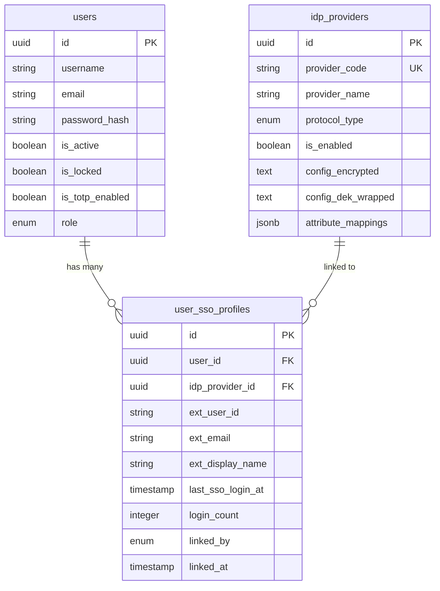
```mermaid
erDiagram
    users {
        uuid id PK
        string username
        string email
        string password_hash
        boolean is_active
        boolean is_locked
        boolean is_totp_enabled
        enum role
    }

    idp_providers {
        uuid id PK
        string provider_code UK
        string provider_name
        enum protocol_type
        boolean is_enabled
        text config_encrypted
        text config_dek_wrapped
        jsonb attribute_mappings
    }

    user_sso_profiles {
        uuid id PK
        uuid user_id FK
        uuid idp_provider_id FK
        string ext_user_id
        string ext_email
        string ext_display_name
        timestamp last_sso_login_at
        integer login_count
        enum linked_by
        timestamp linked_at
    }

    users ||--o{ user_sso_profiles : "has many"
    idp_providers ||--o{ user_sso_profiles : "linked to"
```

---

## 9. ENFORCED Mode: When SSO Becomes Mandatory

Enterprise customers often mandate that once SSO is configured, local passwords must be disabled. But new users need to log in *once* with a password to establish the initial SSO link.

### Mermaid Diagram: ENFORCED Mode Decision Flow

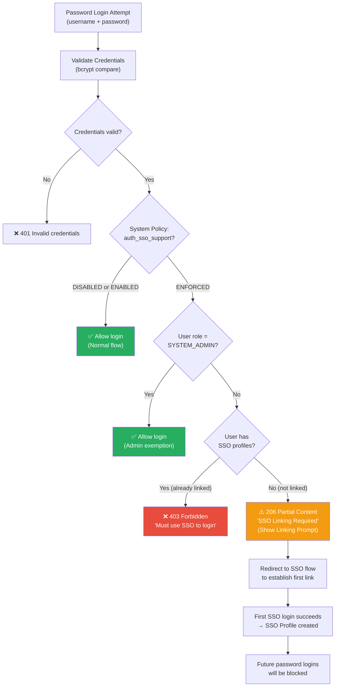
```mermaid
flowchart TD
    LOGIN["Password Login Attempt<br/>(username + password)"] --> VALIDATE["Validate Credentials<br/>(bcrypt compare)"]

    VALIDATE --> BAD_CREDS{"Credentials valid?"}
    BAD_CREDS -->|"No"| REJECT_CREDS["❌ 401 Invalid credentials"]
    BAD_CREDS -->|"Yes"| CHECK_POLICY{"System Policy:<br/>auth_sso_support?"}

    CHECK_POLICY -->|"DISABLED or ENABLED"| ALLOW["✅ Allow login<br/>(Normal flow)"]
    CHECK_POLICY -->|"ENFORCED"| CHECK_ADMIN{"User role =<br/>SYSTEM_ADMIN?"}

    CHECK_ADMIN -->|"Yes"| ALLOW_ADMIN["✅ Allow login<br/>(Admin exemption)"]
    CHECK_ADMIN -->|"No"| CHECK_SSO{"User has<br/>SSO profiles?"}

    CHECK_SSO -->|"Yes (already linked)"| BLOCK["❌ 403 Forbidden<br/>'Must use SSO to login'"]
    CHECK_SSO -->|"No (not linked)"| LINKING["⚠️ 206 Partial Content<br/>'SSO Linking Required'<br/>(Show Linking Prompt)"]

    LINKING --> REDIRECT["Redirect to SSO flow<br/>to establish first link"]
    REDIRECT --> LINK_DONE["First SSO login succeeds<br/>→ SSO Profile created"]
    LINK_DONE --> FUTURE_BLOCK["Future password logins<br/>will be blocked"]

    style BLOCK fill:#e74c3c,color:#fff
    style LINKING fill:#f39c12,color:#fff
    style ALLOW fill:#27ae60,color:#fff
    style ALLOW_ADMIN fill:#27ae60,color:#fff
```

### Why Admin Exemption?

If the IdP goes down (outage, misconfiguration), and all users are locked to SSO-only, nobody can log in—not even the admin who needs to fix the configuration. The `SYSTEM_ADMIN` exemption is a critical safety valve.

---

## 10. OIDC Callback Validation Pipeline

The ID Token is the heart of OIDC. But a JWT is just a base64-encoded string—anyone can *create* one. The security lies in *verifying* it.

### Mermaid Diagram: ID Token Verification Pipeline

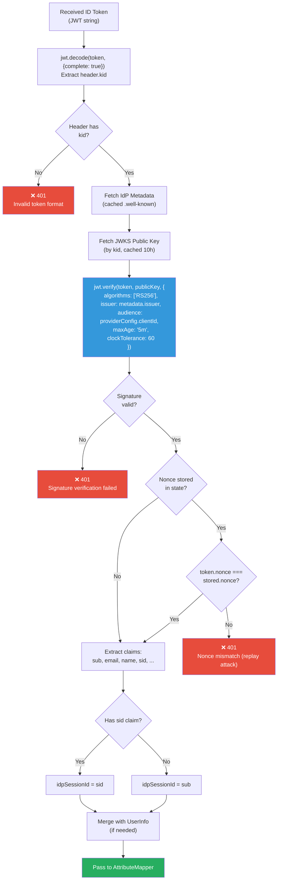
```mermaid
flowchart TD
    TOKEN["Received ID Token<br/>(JWT string)"] --> DECODE["jwt.decode(token, {complete: true})<br/>Extract header.kid"]

    DECODE --> HAS_KID{"Header has<br/>kid?"}
    HAS_KID -->|"No"| ERR_KID["❌ 401<br/>Invalid token format"]
    HAS_KID -->|"Yes"| DISCOVER["Fetch IdP Metadata<br/>(cached .well-known)"]

    DISCOVER --> JWKS["Fetch JWKS Public Key<br/>(by kid, cached 10h)"]
    JWKS --> VERIFY["jwt.verify(token, publicKey, {<br/>  algorithms: ['RS256'],<br/>  issuer: metadata.issuer,<br/>  audience: providerConfig.clientId,<br/>  maxAge: '5m',<br/>  clockTolerance: 60<br/>})"]

    VERIFY --> SIG_OK{"Signature<br/>valid?"}
    SIG_OK -->|"No"| ERR_SIG["❌ 401<br/>Signature verification failed"]
    SIG_OK -->|"Yes"| CHECK_NONCE{"Nonce stored<br/>in state?"}

    CHECK_NONCE -->|"Yes"| MATCH_NONCE{"token.nonce ===<br/>stored.nonce?"}
    CHECK_NONCE -->|"No"| EXTRACT

    MATCH_NONCE -->|"No"| ERR_NONCE["❌ 401<br/>Nonce mismatch (replay attack)"]
    MATCH_NONCE -->|"Yes"| EXTRACT["Extract claims:<br/>sub, email, name, sid, ..."]

    EXTRACT --> SID{"Has sid claim?"}
    SID -->|"Yes"| USE_SID["idpSessionId = sid"]
    SID -->|"No"| USE_SUB["idpSessionId = sub"]

    USE_SID & USE_SUB --> MERGE["Merge with UserInfo<br/>(if needed)"]
    MERGE --> MAP["Pass to AttributeMapper"]

    style VERIFY fill:#3498db,color:#fff
    style ERR_SIG fill:#e74c3c,color:#fff
    style ERR_NONCE fill:#e74c3c,color:#fff
    style ERR_KID fill:#e74c3c,color:#fff
    style MAP fill:#27ae60,color:#fff
```

### Attack Vectors Prevented

| Attack | How It's Prevented |
|---|---|
| **`alg: none`** | `algorithms: ['RS256']` whitelist |
| **Key confusion (HS256 with public key)** | Algorithm whitelist |
| **Token from different IdP** | `issuer` validation |
| **Token for different app** | `audience` validation |
| **Stale token** | `maxAge: '5m'` |
| **Replay attack** | `nonce` validation against Redis state |
| **Clock skew** | `clockTolerance: 60` seconds |

---

## 11. SAML Response Validation: Defeating XML Attacks

SAML validation is significantly more complex due to XML's flexibility, which attackers exploit through Signature Wrapping attacks.

### Mermaid Diagram: SAML Response Processing & XSW Defense

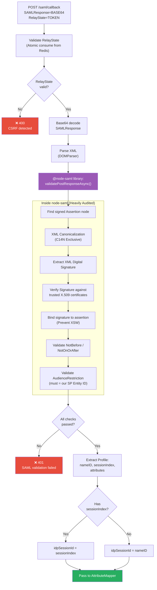
```mermaid
flowchart TD
    POST["POST /saml/callback<br/>SAMLResponse=BASE64<br/>RelayState=TOKEN"] --> VALIDATE_RS["Validate RelayState<br/>(Atomic consume from Redis)"]

    VALIDATE_RS --> RS_OK{"RelayState<br/>valid?"}
    RS_OK -->|"No"| ERR_RS["❌ 400<br/>CSRF detected"]
    RS_OK -->|"Yes"| DECODE_XML["Base64 decode<br/>SAMLResponse"]

    DECODE_XML --> PARSE["Parse XML<br/>(DOMParser)"]
    PARSE --> NODE_SAML["@node-saml library:<br/>validatePostResponseAsync()"]

    subgraph "Inside node-saml (Heavily Audited)"
        direction TB
        FIND_ASSERTION["Find signed Assertion node"]
        C14N["XML Canonicalization<br/>(C14N Exclusive)"]
        EXTRACT_SIG["Extract XML Digital Signature"]
        VERIFY_SIG["Verify Signature against<br/>trusted X.509 certificates"]
        BINDING["Bind signature to assertion<br/>(Prevent XSW)"]
        CHECK_TIME["Validate NotBefore /<br/>NotOnOrAfter"]
        CHECK_AUD["Validate AudienceRestriction<br/>(must = our SP Entity ID)"]
    end

    NODE_SAML --> FIND_ASSERTION --> C14N --> EXTRACT_SIG --> VERIFY_SIG --> BINDING --> CHECK_TIME --> CHECK_AUD

    CHECK_AUD --> SIG_VALID{"All checks<br/>passed?"}
    SIG_VALID -->|"No"| ERR_SIG["❌ 401<br/>SAML validation failed"]
    SIG_VALID -->|"Yes"| EXTRACT["Extract Profile:<br/>nameID, sessionIndex,<br/>attributes"]

    EXTRACT --> SESSION_IDX{"Has<br/>sessionIndex?"}
    SESSION_IDX -->|"Yes"| USE_SI["idpSessionId = sessionIndex"]
    SESSION_IDX -->|"No"| USE_NID["idpSessionId = nameID"]

    USE_SI & USE_NID --> MAP["Pass to AttributeMapper"]

    style NODE_SAML fill:#9b59b6,color:#fff
    style ERR_RS fill:#e74c3c,color:#fff
    style ERR_SIG fill:#e74c3c,color:#fff
    style MAP fill:#27ae60,color:#fff
```

### Mermaid Diagram: XML Signature Wrapping (XSW) Attack Explained

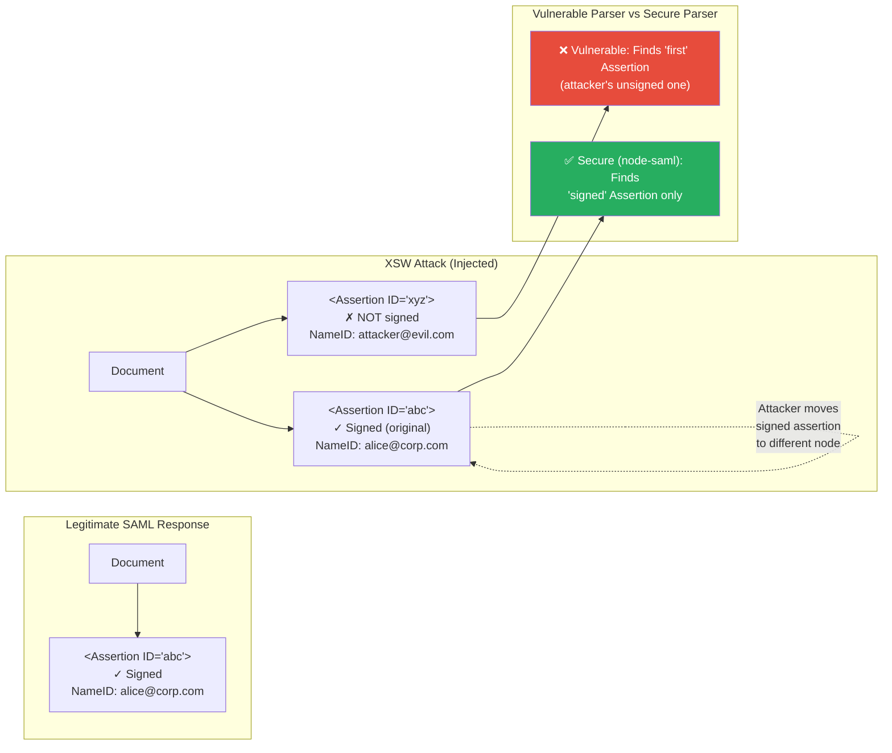
```mermaid
graph LR
    subgraph "Legitimate SAML Response"
        A1["Document"] --> B1["&lt;Assertion ID='abc'&gt;<br/>✓ Signed<br/>NameID: alice@corp.com"]
    end

    subgraph "XSW Attack (Injected)"
        A2["Document"] --> B2["&lt;Assertion ID='abc'&gt;<br/>✓ Signed (original)<br/>NameID: alice@corp.com"]
        A2 --> C2["&lt;Assertion ID='xyz'&gt;<br/>✗ NOT signed<br/>NameID: attacker@evil.com"]

        B2 -.->|"Attacker moves<br/>signed assertion<br/>to different node"| B2
    end

    subgraph "Vulnerable Parser vs Secure Parser"
        VULN["❌ Vulnerable: Finds 'first' Assertion<br/>(attacker's unsigned one)"]
        SECURE["✅ Secure (node-saml): Finds<br/>'signed' Assertion only"]
    end

    C2 --> VULN
    B2 --> SECURE

    style VULN fill:#e74c3c,color:#fff
    style SECURE fill:#27ae60,color:#fff
```

---

## 12. SP-Initiated Single Logout (SLO)

Logging out is harder than logging in. We must tear down the local session AND notify the IdP.

### Mermaid Diagram: SP-Initiated Logout Flow

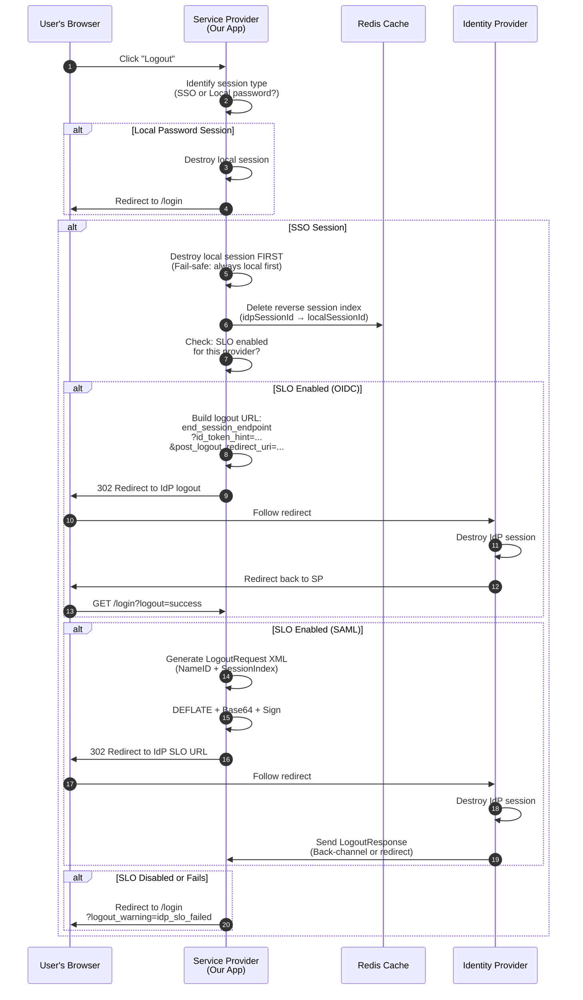
```mermaid
sequenceDiagram
    autonumber
    participant U as User's Browser
    participant SP as Service Provider<br/>(Our App)
    participant Redis as Redis Cache
    participant IdP as Identity Provider

    U->>SP: Click "Logout"
    SP->>SP: Identify session type<br/>(SSO or Local password?)

    alt Local Password Session
        SP->>SP: Destroy local session
        SP->>U: Redirect to /login
    end

    alt SSO Session
        SP->>SP: Destroy local session FIRST<br/>(Fail-safe: always local first)
        SP->>Redis: Delete reverse session index<br/>(idpSessionId → localSessionId)

        SP->>SP: Check: SLO enabled<br/>for this provider?

        alt SLO Enabled (OIDC)
            SP->>SP: Build logout URL:<br/>end_session_endpoint<br/>?id_token_hint=...<br/>&post_logout_redirect_uri=...
            SP->>U: 302 Redirect to IdP logout
            U->>IdP: Follow redirect
            IdP->>IdP: Destroy IdP session
            IdP->>U: Redirect back to SP
            U->>SP: GET /login?logout=success
        end

        alt SLO Enabled (SAML)
            SP->>SP: Generate LogoutRequest XML<br/>(NameID + SessionIndex)
            SP->>SP: DEFLATE + Base64 + Sign
            SP->>U: 302 Redirect to IdP SLO URL
            U->>IdP: Follow redirect
            IdP->>IdP: Destroy IdP session
            IdP->>SP: Send LogoutResponse<br/>(Back-channel or redirect)
        end

        alt SLO Disabled or Fails
            SP->>U: Redirect to /login<br/>?logout_warning=idp_slo_failed
        end
    end
```

### Mermaid Diagram: Reverse Session Index Architecture

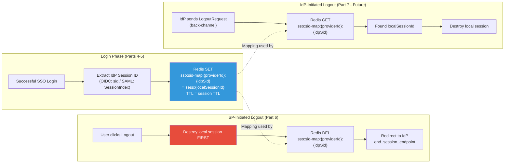
```mermaid
graph LR
    subgraph "Login Phase (Parts 4-5)"
        LOGIN["Successful SSO Login"] --> EXTRACT["Extract IdP Session ID<br/>(OIDC: sid / SAML: SessionIndex)"]
        EXTRACT --> STORE["Redis SET<br/>sso:sid-map:{providerId}:{idpSid}<br/>= sess:{localSessionId}<br/>TTL = session TTL"]
    end

    subgraph "SP-Initiated Logout (Part 6)"
        SP_LOGOUT["User clicks Logout"] --> LOCAL_DESTROY["Destroy local session FIRST"]
        LOCAL_DESTROY --> CLEANUP["Redis DEL<br/>sso:sid-map:{providerId}:{idpSid}"]
        CLEANUP --> NOTIFY["Redirect to IdP<br/>end_session_endpoint"]
    end

    subgraph "IdP-Initiated Logout (Part 7 - Future)"
        IDP_LOGOUT["IdP sends LogoutRequest<br/>(back-channel)"] --> LOOKUP["Redis GET<br/>sso:sid-map:{providerId}:{idpSid}"]
        LOOKUP --> FOUND["Found localSessionId"]
        FOUND --> DESTROY["Destroy local session"]
    end

    STORE -.->|"Mapping used by"| CLEANUP
    STORE -.->|"Mapping used by"| LOOKUP

    style STORE fill:#3498db,color:#fff
    style LOCAL_DESTROY fill:#e74c3c,color:#fff
```

---

## 13. Session Lifecycle State Diagram

A session goes through well-defined states. Understanding these states is critical for implementing logout correctly.

### Mermaid Diagram: Session State Machine

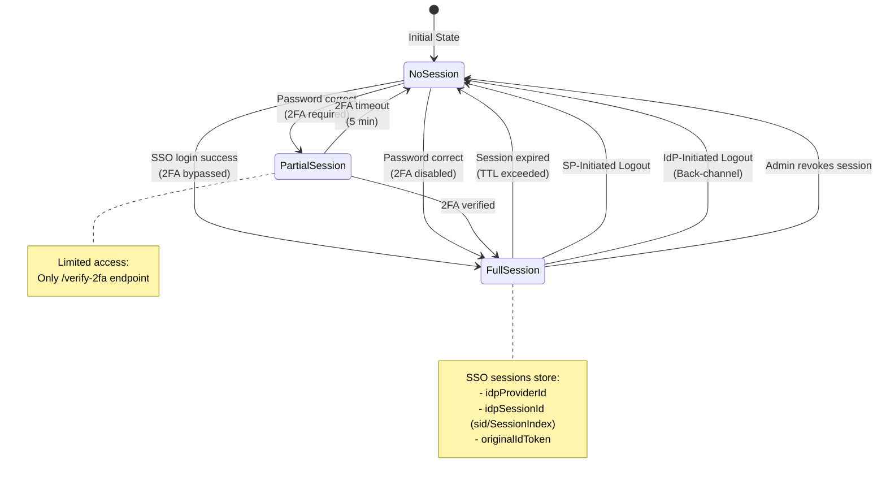
```mermaid
stateDiagram-v2
    [*] --> NoSession: Initial State

    NoSession --> PartialSession: Password correct<br/>(2FA required)
    NoSession --> FullSession: SSO login success<br/>(2FA bypassed)
    NoSession --> FullSession: Password correct<br/>(2FA disabled)

    PartialSession --> FullSession: 2FA verified
    PartialSession --> NoSession: 2FA timeout<br/>(5 min)

    FullSession --> NoSession: Session expired<br/>(TTL exceeded)
    FullSession --> NoSession: SP-Initiated Logout
    FullSession --> NoSession: IdP-Initiated Logout<br/>(Back-channel)
    FullSession --> NoSession: Admin revokes session

    note right of FullSession
        SSO sessions store:
        - idpProviderId
        - idpSessionId (sid/SessionIndex)
        - originalIdToken
    end note

    note right of PartialSession
        Limited access:
        Only /verify-2fa endpoint
    end note
```

---

## 14. Strategy Pattern: Protocol Abstraction

The Strategy Pattern is the backbone of our multi-protocol support. Adding a new protocol (e.g., WS-Federation) requires only a new strategy class—zero changes to existing code.

### Mermaid Diagram: Strategy Pattern Class Diagram

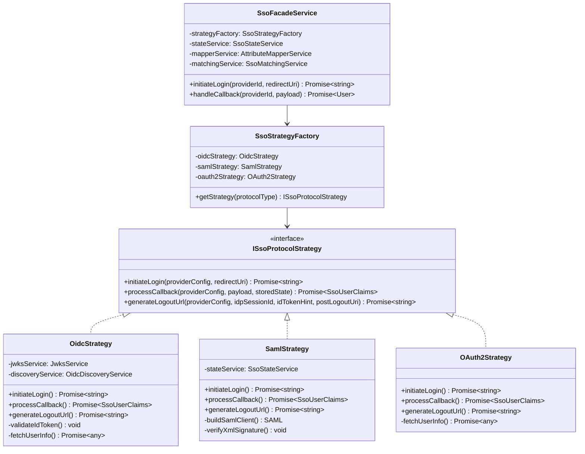
```mermaid
classDiagram
    class ISsoProtocolStrategy {
        <<interface>>
        +initiateLogin(providerConfig, redirectUri) Promise~string~
        +processCallback(providerConfig, payload, storedState) Promise~SsoUserClaims~
        +generateLogoutUrl(providerConfig, idpSessionId, idTokenHint, postLogoutUri) Promise~string~
    }

    class OidcStrategy {
        -jwksService: JwksService
        -discoveryService: OidcDiscoveryService
        +initiateLogin() Promise~string~
        +processCallback() Promise~SsoUserClaims~
        +generateLogoutUrl() Promise~string~
        -validateIdToken() void
        -fetchUserInfo() Promise~any~
    }

    class SamlStrategy {
        -stateService: SsoStateService
        +initiateLogin() Promise~string~
        +processCallback() Promise~SsoUserClaims~
        +generateLogoutUrl() Promise~string~
        -buildSamlClient() SAML
        -verifyXmlSignature() void
    }

    class OAuth2Strategy {
        +initiateLogin() Promise~string~
        +processCallback() Promise~SsoUserClaims~
        +generateLogoutUrl() Promise~string~
        -fetchUserInfo() Promise~any~
    }

    class SsoStrategyFactory {
        -oidcStrategy: OidcStrategy
        -samlStrategy: SamlStrategy
        -oauth2Strategy: OAuth2Strategy
        +getStrategy(protocolType) ISsoProtocolStrategy
    }

    class SsoFacadeService {
        -strategyFactory: SsoStrategyFactory
        -stateService: SsoStateService
        -mapperService: AttributeMapperService
        -matchingService: SsoMatchingService
        +initiateLogin(providerId, redirectUri) Promise~string~
        +handleCallback(providerId, payload) Promise~User~
    }

    ISsoProtocolStrategy <|.. OidcStrategy
    ISsoProtocolStrategy <|.. SamlStrategy
    ISsoProtocolStrategy <|.. OAuth2Strategy
    SsoStrategyFactory --> ISsoProtocolStrategy
    SsoFacadeService --> SsoStrategyFactory
```

---

## 15. The Complete SSO Lifecycle: One Diagram to Rule Them All

This is the master diagram that shows the entire SSO lifecycle from configuration to daily use to logout.

### Mermaid Diagram: Complete SSO Lifecycle

```mermaid
flowchart TB
    subgraph "Phase 1: Admin Configuration (Part 2)"
        direction TB
        A1["Admin creates IdP provider"] --> A2["Enter Issuer URL / Metadata URL"]
        A2 --> A3["Auto-Discovery fetches endpoints"]
        A3 --> A4["Configure attribute mappings"]
        A4 --> A5["Encrypt config (Envelope Encryption)"]
        A5 --> A6["Save to DB"]
    end

    subgraph "Phase 2: User Login (Parts 3-5)"
        direction TB
        B1["User clicks 'Login with SSO'"] --> B2["Strategy generates auth URL<br/>(PKCE + state + nonce)"]
        B2 --> B3["Redirect to IdP"]
        B3 --> B4["User authenticates at IdP"]
        B4 --> B5["IdP redirects back with code/assertion"]
        B5 --> B6["Strategy validates response<br/>(Signature, claims, nonce)"]
        B6 --> B7["Attribute Mapper normalizes claims"]
        B7 --> B8["User Matcher finds local user"]
        B8 --> B9["Upsert SSO Profile link"]
        B9 --> B10["Issue session tokens"]
    end

    subgraph "Phase 3: Session Active"
        B10 --> C1["User accesses protected resources"]
        C1 --> C2["Session valid until expiry"]
    end

    subgraph "Phase 4: Logout (Part 6)"
        direction TB
        C2 --> D1["User clicks Logout"]
        D1 --> D2["Destroy local session FIRST"]
        D2 --> D3["Clean reverse session index"]
        D3 --> D4["Generate IdP logout URL"]
        D4 --> D5["Redirect to IdP"]
        D5 --> D6["IdP destroys global session"]
        D6 --> D7["Redirect back to login page"]
    end

    A6 --> B1

    style A5 fill:#9b59b6,color:#fff
    style B6 fill:#3498db,color:#fff
    style D2 fill:#e74c3c,color:#fff
```

---

## 16. Security Defense Matrix

Here is a comprehensive view of every attack vector we defend against across the entire series.

### Mermaid Diagram: Security Defense Layers

```mermaid
graph TD
    subgraph "Attack Surface"
        ATK1["Database Breach"]
        ATK2["Authorization Code Theft"]
        ATK3["CSRF Attack"]
        ATK4["Token Replay"]
        ATK5["Token Forgery"]
        ATK6["XML Signature Wrapping"]
        ATK7["Account Takeover"]
        ATK8["Session Hijacking"]
    end

    subgraph "Defense Layer 1: Encryption (Part 1)"
        DEF1["Envelope Encryption<br/>AES-256-GCM + HKDF-SHA256"]
    end

    subgraph "Defense Layer 2: Protocol Security (Parts 1, 4, 5)"
        DEF2["PKCE (code_challenge)"]
        DEF3["State / RelayState<br/>(Single-use, Redis)"]
        DEF4["Nonce (ID Token)"]
        DEF5["JWT Signature + JWKS"]
        DEF6["XSW Prevention<br/>(node-saml C14N)"]
    end

    subgraph "Defense Layer 3: Identity Resolution (Part 3)"
        DEF7["Pre-provisioning only<br/>(No JIT)"]
        DEF8["Identifier validation<br/>(Exactly one)"]
    end

    subgraph "Defense Layer 4: Session Management (Part 6)"
        DEF9["Reverse Session Index"]
        DEF10["Fail-safe logout<br/>(Local first)"]
    end

    ATK1 --> DEF1
    ATK2 --> DEF2
    ATK3 --> DEF3
    ATK4 --> DEF4
    ATK5 --> DEF5
    ATK6 --> DEF6
    ATK7 --> DEF7 & DEF8
    ATK8 --> DEF9 & DEF10

    style DEF1 fill:#9b59b6,color:#fff
    style DEF2 fill:#3498db,color:#fff
    style DEF3 fill:#3498db,color:#fff
    style DEF4 fill:#3498db,color:#fff
    style DEF5 fill:#3498db,color:#fff
    style DEF6 fill:#3498db,color:#fff
    style DEF7 fill:#27ae60,color:#fff
    style DEF8 fill:#27ae60,color:#fff
    style DEF9 fill:#e67e22,color:#fff
    style DEF10 fill:#e67e22,color:#fff
```

---

## Looking Ahead

This blueprint covers Parts 1 through 6 of the SSO series. The journey is not over. In future parts, we will explore:

- **Part 7: IdP-Initiated Back-Channel Logout (BCL)** — When an IT admin revokes sessions from the IdP portal, how does our app know?
- **Part 8: Certificate Rotation & Key Management** — How to handle IdP certificate rotation without downtime.
- **Part 9: Multi-Tenant SSO** — Isolating IdP configurations per tenant in a shared infrastructure.
- **Part 10: Audit Logging & Compliance** — Tracking every SSO event for SOC 2 and ISO 27001.

Keep this blueprint bookmarked. Every time you implement a piece of the SSO puzzle, come back here to see where it fits in the bigger picture.

   

---

---

## 簡介：睇到成隻象

喺印度古老嘅「盲人摸象」寓言入面，每個人都摸住唔同嘅部位，然後就以為自己睇透晒成隻動物。喺 SSO 實作入面，都有同一樣嘅危險。呢個系列嘅第一到第六集，每一集都解剖咗一個關鍵部件——加密、設定、用戶匹配、OIDC 驗證、SAML 處理同埋登出。但如果你淨係睇到碎片，你就會錯過成個架構。

呢篇文就係 **架構設計藍圖**。佢會將每一嚿嘢拼埋一齊，變成一個統一嘅、視覺化嘅敘事。我哋會由用家撳「用 SSO 登入」嗰一刻開始，一直行到佢安全登出嗰一刻為止，每一步都有 Mermaid 圖解。如果你喺呢個系列嘅其他文章度蕩失路，就返嚟呢度。呢度就係地圖。

---

## 1. 三萬呎高空俯瞰：系統架構

喺深入睇流程之前，我哋先睇吓主要嘅 Components 同佢哋點樣連接。我哋嘅 SSO 系統係建基於一個 **分層架構 (Layered Architecture)**，每一層都有清晰嘅職責分離。

### Mermaid 圖解：高層系統架構

```mermaid
graph TB
    subgraph "客戶端層 (Client Layer)"
        Browser["用戶嘅 Browser"]
    end

    subgraph "應用層 (NestJS)"
        direction TB
        Controller["SSO Controller<br/>(REST API Endpoints)"]
        Facade["SsoFacadeService<br/>(編排器)"]
        Factory["SsoStrategyFactory<br/>(協定解像度)"]

        subgraph "策略層 (Strategy Layer)"
            OIDC["OidcStrategy"]
            SAML["SamlStrategy"]
            OAUTH2["OAuth2Strategy"]
        end

        subgraph "服務層 (Services Layer)"
            StateSvc["SsoStateService<br/>(Redis State)"]
            DiscoverySvc["自動發現<br/>(OIDC / SAML)"]
            MapperSvc["AttributeMapperService<br/>(轉換引擎)"]
            MatchSvc["SsoMatchingService<br/>(用戶解析)"]
            SecretMgr["IdpSecretManagerService<br/>(信封加密)"]
            SessionSvc["SsoSessionTracker<br/>(反向索引)"]
            LogoutSvc["SsoLogoutService<br/>(SLO 編排)"]
        end

        subgraph "核心保安 (Core Security)"
            KEK["KekManagementService<br/>(HKDF-SHA256)"]
            EncSvc["EnterpriseEncryptionService<br/>(AES-256-GCM)"]
        end
    end

    subgraph "數據層 (Data Layer)"
        DB[(PostgreSQL<br/>idp_providers<br/>user_sso_profiles)]
        Cache[(Redis<br/>State / Session<br/>反向索引)]
    end

    subgraph "外部"
        IdP["Identity Provider<br/>(Entra ID / Okta / ADFS)"]
    end

    Browser -->|"1. 登入請求"| Controller
    Controller --> Facade
    Facade --> Factory
    Factory --> OIDC & SAML & OAUTH2
    OIDC & SAML & OAUTH2 -->|"2. Auth URL"| Browser
    Browser -->|"3. Redirect 去 IdP"| IdP
    IdP -->|"4. Callback"| Controller
    Controller --> Facade
    Facade --> Factory
    Factory --> OIDC & SAML & OAUTH2
    OIDC & SAML -->|"5. 驗證"| DiscoverySvc
    OIDC & SAML -->|"6. Map Claims"| MapperSvc
    MapperSvc -->|"7. 解析用戶"| MatchSvc
    MatchSvc -->|"8. 發行 Session"| SessionSvc

    StateSvc --> Cache
    SessionSvc --> Cache
    SecretMgr --> EncSvc
    EncSvc --> KEK
    MatchSvc --> DB
    SecretMgr --> DB
    DiscoverySvc --> DB
```

### 核心架構原則

| 原則 | 實作 |
|---|---|
| **策略模式 (Strategy Pattern)** | 每個協定 (OIDC, SAML, OAuth2) 都係一個隔離嘅 Strategy，背後共用同一個 Interface |
| **信封加密 (Envelope Encryption)** | 所有 IdP Secrets 都用獨立嘅 DEK 加密，再用全局 KEK Wrap 住 |
| **無狀態驗證 (Stateless Validation)** | JWT 簽名靠 Cached JWKS 驗證；唔需要每次 Request 都撞 Database |
| **即用即棄狀態 (Single-Use State)** | 每個 `state` / `RelayState` 都係由 Redis 原子性咁消費 |
| **安全優先登出 (Fail-Safe Logout)** | Local session 一定 *先於* 同 IdP 溝通之前被徹底炸毀 |

---

## 2. OIDC 登入流程：端到端序列圖

OpenID Connect 係現代聯邦身份認證嘅標準。呢度係由撳掣到 Session 嘅完整序列。

### Mermaid 圖解：OIDC Authorization Code Flow + PKCE

```mermaid
sequenceDiagram
    autonumber
    participant U as 用戶嘅 Browser
    participant SP as Service Provider<br/>(我哋個 App)
    participant Redis as Redis Cache
    participant IdP as Identity Provider<br/>(Entra ID / Okta)

    U->>SP: 撳「用 SSO 登入」
    SP->>SP: 載入 IdP 設定<br/>(透過信封加密解密)
    SP->>SP: Generate PKCE verifier + challenge
    SP->>SP: Generate nonce
    SP->>Redis: Save state context<br/>{providerId, pkceVerifier, nonce, redirectUri}<br/>TTL: 5 分鐘
    Redis-->>SP: state token
    SP->>U: 302 Redirect 去 IdP<br/>?client_id, redirect_uri, scope,<br/>response_type=code, state,<br/>code_challenge, nonce

    U->>IdP: 跟住 Redirect
    IdP->>U: 顯示登入畫面
    U->>IdP: 入帳號密碼 + MFA
    IdP->>IdP: 驗證用戶
    IdP->>U: 302 Redirect 返 callback<br/>?code=AUTH_CODE&state=STATE

    U->>SP: 跟住 Redirect 帶 code + state
    SP->>Redis: GETDEL state (原子性消費)
    Redis-->>SP: state context (或者 404 如果過咗期/被 Replay)
    SP->>SP: 驗證 state match

    SP->>IdP: POST /token<br/>code, client_secret,<br/>code_verifier, redirect_uri
    IdP->>IdP: Hash code_verifier,<br/>同 code_challenge 對比
    IdP->>SP: {id_token, access_token, refresh_token}

    SP->>SP: Decode JWT header → 攞 kid
    SP->>IdP: GET /jwks (有 Cache)
    IdP->>SP: JWKS 公鑰
    SP->>SP: Verify JWT 簽名 (RS256)
    SP->>SP: 驗證 iss, aud, exp, nonce

    alt ID Token 得少量 Claims
        SP->>IdP: GET /userinfo (Bearer access_token)
        IdP->>SP: 用戶 Profile Claims
    end

    SP->>SP: 溝埋 ID Token + UserInfo Claims
    SP->>SP: 屬性映射引擎<br/>(轉換 + 標準化)
    SP->>SP: 用戶匹配<br/>(搵返 Local user)
    SP->>SP: Upsert SSO Profile Link
    SP->>Redis: Save 反向 Session 索引<br/>(idpSid → localSessionId)
    SP->>U: Set session cookies<br/>Redirect 去 Dashboard
```

### 關鍵保安檢查點

每一步都有特定嘅保安驗證：

1. **信封加密** 喺 Runtime 解密 IdP 嘅 client secret（第一集）
2. **PKCE `code_challenge`** 防止 Authorization Code 被攔截（第一集）
3. **`state` 參數** 防 CSRF；透過 Redis `GETDEL` 做到即用即棄（第一集）
4. **`nonce`** 嵌入 ID Token 防重放攻擊（第四集）
5. **JWKS 簽名驗證** 確保 Token 真實性（第四集）
6. **Algorithm 限制** (只准 `RS256`) 防 `alg: none` 攻擊（第四集）
7. **Audience 驗證** 防跨客戶端 Token 注入（第四集）

---

## 3. SAML 2.0 登入流程：端到端序列圖

SAML 2.0 係基於 XML 嘅重量級協定，喺政府、醫療同金融界廣泛使用。佢嘅流程同 OIDC 根本性地唔同。

### Mermaid 圖解：SAML 2.0 SP-Initiated Flow (HTTP-POST Binding)

```mermaid
sequenceDiagram
    autonumber
    participant U as 用戶嘅 Browser
    participant SP as Service Provider<br/>(我哋個 App)
    participant Redis as Redis Cache
    participant IdP as Identity Provider<br/>(ADFS / Okta SAML)

    U->>SP: 撳「用 SAML 登入」
    SP->>SP: 載入 IdP 設定<br/>(透過信封加密解密)
    SP->>Redis: 建立 RelayState context<br/>{providerId, redirectUri}<br/>TTL: 5 分鐘
    Redis-->>SP: relayState token
    SP->>SP: Generate AuthnRequest XML
    SP->>SP: DEFLATE + Base64 編碼
    SP->>U: 302 Redirect 去 IdP<br/>?SAMLRequest=BASE64&RelayState=TOKEN

    U->>IdP: 跟住 Redirect
    IdP->>U: 顯示登入畫面
    U->>IdP: 入帳號密碼 + MFA
    IdP->>IdP: 驗證用戶
    IdP->>IdP: Generate SAML Assertion<br/>(用 X.509 私鑰簽名)
    IdP->>U: 自動 Submit HTML form<br/>去 SP Assertion Consumer Service

    U->>SP: POST /saml/callback<br/>SAMLResponse=BASE64&RelayState=TOKEN
    SP->>Redis: GETDEL RelayState (原子性消費)
    Redis-->>SP: context (或者 404 如果過咗期/被 Replay)
    SP->>SP: 驗證 RelayState match

    SP->>SP: Base64 decode SAMLResponse
    SP->>SP: Parse XML (DOMParser)
    SP->>SP: XML 規範化 (C14N)
    SP->>SP: 抽出有簽名嘅 Assertion
    SP->>SP: 驗證 XML 數碼簽署<br/>對比受信嘅 X.509 證書
    SP->>SP: 驗證 AudienceRestriction<br/>(必須 match 我哋嘅 SP Entity ID)
    SP->>SP: 驗證 Conditions<br/>(NotBefore / NotOnOrAfter)
    SP->>SP: 擋住 XSW 攻擊<br/>(Signature-Assertion 綁定)

    SP->>SP: 抽出 NameID + Attributes
    SP->>SP: 抽出 SessionIndex<br/>(留俾未來 SLO 用)
    SP->>SP: 屬性映射引擎<br/>(轉換 + 標準化)
    SP->>SP: 用戶匹配<br/>(搵返 Local user)
    SP->>SP: Upsert SSO Profile Link
    SP->>Redis: Save 反向 Session 索引<br/>(sessionIndex → localSessionId)
    SP->>U: Set session cookies<br/>Redirect 去 Dashboard
```

### SAML vs OIDC：關鍵差異一覽

| 方面 | OIDC | SAML 2.0 |
|---|---|---|
| **數據格式** | JSON (JWT) | XML (Assertions) |
| **簽名方式** | JWS (RS256) | XML 數碼簽署 (X.509) |
| **金鑰發現** | JWKS endpoint (自動 Cache) | Metadata XML (手動或 Fetch) |
| **狀態防護** | `state` + `nonce` 參數 | `RelayState` 參數 |
| **Session 識別符** | ID Token 嘅 `sid` Claim | AuthnStatement 嘅 `SessionIndex` |
| **複雜度** | 低至中 | 高 (XML 規範化、XSW) |
| **主要用戶** | 現代 SaaS、雲端 | 大企業、政府、醫療 |

---

## 4. 信封加密：保護 IdP Secrets

Database 裝住 OAuth client secrets、SAML 私鑰同 mTLS 證書。如果俾人爆咗，黑客就可以冒認我哋個 App 去呃任何 IdP。我哋用一個三層加密架構嚟防範。

### Mermaid 圖解：信封加密架構

```mermaid
graph LR
    subgraph "第一層：金鑰加密金鑰 (KEK)"
        ENV["環境變數<br/>(Master Secret)"]
        SALT["Salt File<br/>(磁碟)"]
        HKDF["HKDF-SHA256"]
        KEK["KEK<br/>(256-bit，淨係喺 Memory)"]

        ENV --> HKDF
        SALT --> HKDF
        HKDF --> KEK
    end

    subgraph "第二層：資料加密金鑰 (DEK)"
        DEK_GEN["crypto.randomBytes(32)"]
        DEK["每個 Provider 一把 DEK<br/>(256-bit)"]
        WRAP["AES-256-GCM Wrap<br/>(KEK + AAD=providerId)"]
        WRAPPED["Wrapped DEK<br/>(Save 落 DB)"]

        DEK_GEN --> DEK
        DEK --> WRAP
        KEK -->|"加密"| WRAP
        WRAP --> WRAPPED
    end

    subgraph "第三層：密文"
        CONFIG["明文 Config JSON<br/>(client_secret, 證書)"]
        ENCRYPT["AES-256-GCM 加密<br/>(用 DEK 做 Key)"]
        CIPHER["加密咗嘅 Blob<br/>(Save 落 DB)"]

        CONFIG --> ENCRYPT
        DEK -->|"加密"| ENCRYPT
        ENCRYPT --> CIPHER
    end

    subgraph "Database（爆咗嘅黑客淨係睇到呢啲）"
        DB_ROW["idp_providers table<br/>config_encrypted: '...'<br/>config_dek_wrapped: '...'"]
    end

    WRAPPED --> DB_ROW
    CIPHER --> DB_ROW
    KEK -.->|"永遠唔會落 Disk<br/>淨係活喺 Process Memory"| KEK
```

### 點解要三層？

1. **KEK 輪換**：如果 Master key 出事，我哋只需要重新 Wrap 條 DEK，唔使重新加密所有數據
2. **Provider 之間隔離**：搞掂一條 Provider 嘅 DEK，唔會連累到其他嘅
3. **AAD 綁定**：用 `providerId` 做 Additional Authenticated Data，防止有人將條 DEK 搬去另一行 record

### Mermaid 圖解：解密流程（Runtime）

```mermaid
flowchart TD
    A["登入請求到埗"] --> B["由 Database 載入<br/>IdP Provider Entity"]
    B --> C["攞 Active KEK<br/>（喺 Memory 入面）"]
    C --> D["解密 Wrapped DEK<br/>AES-256-GCM(KEK, AAD=providerId)"]
    D --> E["解密 Config Blob<br/>AES-256-GCM(DEK)"]
    E --> F["Parse JSON Config<br/>（client_secret, endpoints, certs）"]
    F --> G["喺 Memory 清空 DEK<br/>dek.fill(0)"]
    G --> H["用 Config 做<br/>Token Exchange / 簽名驗證"]
    H --> I["喺 Memory 清空 Config"]

    style D fill:#ff6b6b,color:#fff
    style E fill:#ff6b6b,color:#fff
```

---

## 5. PKCE：擊敗 Authorization Code 攔截

PKCE（Proof Key for Code Exchange）防止用戶裝置上嘅惡意 App 喺 Redirect 途中偷走 Authorization Code。

### Mermaid 圖解：PKCE 防護機制

```mermaid
sequenceDiagram
    autonumber
    participant App as 我哋嘅 Backend
    participant IdP as Identity Provider
    participant Evil as 惡意 App<br/>（黑客）

    Note over App: Step 1: Generate PKCE pair
    App->>App: verifier = random 32 bytes → base64url
    App->>App: challenge = SHA256(verifier) → base64url
    App->>App: Save verifier 入 Redis（綁住 state）

    App->>IdP: Authorization Request<br/>code_challenge=CHALLENGE<br/>code_challenge_method=S256
    IdP->>IdP: Save 住個 challenge 留俾呢個 auth session

    Note over IdP: 用戶驗證中...
    IdP->>Evil: ⚠️ Redirect 被攔截！<br/>?code=STOLEN_CODE&state=STATE
    IdP->>App: ✅ 正常 Redirect<br/>?code=AUTH_CODE&state=STATE

    Note over Evil: 黑客試圖用偷返嚟嘅 Code 換 Token
    Evil->>IdP: POST /token<br/>code=STOLEN_CODE<br/>code_verifier=???

    Note over IdP: 我冇你個 verifier！<br/>Hash(???) ≠ stored challenge
    IdP->>Evil: ❌ 400 Bad Request<br/>Invalid grant

    Note over App: 正常交換
    App->>App: 由 Redis 攞返 verifier
    App->>IdP: POST /token<br/>code=AUTH_CODE<br/>code_verifier=VERIFIER
    IdP->>IdP: SHA256(VERIFIER) == stored challenge ✅
    IdP->>App: {id_token, access_token}
```

### 點解 Confidential Client 都要玩 PKCE？

歷史上，PKCE 係為咗 Public clients（SPAs、Mobile Apps）而設計嘅。但 RFC 7636 同 OAuth 2.0 BCP（RFC 9700）依家建議 **所有** Clients 都用 PKCE，包括 Confidential 嘅 Server-side Apps。原因：縱深防禦。就算 `client_secret` 出事，冇咗個 `verifier`，黑客照樣換唔到 Code。

---

## 6. 自動發現：消除人手設定

OIDC 同 SAML 都支援 Metadata Discovery。咁就唔使人手 Enter 嗰堆 IdP Endpoints，減少人為錯誤。

### Mermaid 圖解：OIDC 自動發現流程

```mermaid
flowchart LR
    A["Admin 入<br/>Issuer URL"] --> B["GET /.well-known/<br/>openid-configuration"]
    B --> C["Parse JSON Response"]

    C --> D["authorization_endpoint"]
    C --> E["token_endpoint"]
    C --> F["jwks_uri"]
    C --> G["userinfo_endpoint"]
    C --> H["end_session_endpoint"]
    C --> I["issuer（驗證 match）"]

    D & E & F & G & H --> J["Save 落 DB<br/>（敏感嘅要加密）"]
    J --> K["Cache Metadata<br/>（TTL: 1 個鐘）"]

    style B fill:#4ecdc4,color:#fff
    style J fill:#45b7d1,color:#fff
```

### Mermaid 圖解：SAML Metadata Discovery 流程

```mermaid
flowchart LR
    A["Admin 入<br/>Metadata URL"] --> B["GET Metadata XML"]
    B --> C["Parse XML<br/>(DOMParser)"]

    C --> D["EntityDescriptor<br/>→ entityID"]
    C --> E["SingleSignOnService<br/>(HTTP-Redirect binding)<br/>→ SSO URL"]
    C --> F["KeyDescriptor<br/>(use=signing)<br/>→ X.509 證書"]

    D & E & F --> G["Save 落 DB"]
    G --> H["Cache 證書"]

    style B fill:#f7dc6f,color:#333
    style G fill:#45b7d1,color:#fff
```

### 發現咗啲乜？

| 協定 | 發現到嘅數據 | 用途 |
|---|---|---|
| **OIDC** | `authorization_endpoint` | 砌登入 Redirect URL |
| | `token_endpoint` | 用 Code 換 Token |
| | `jwks_uri` | 攞公鑰驗證 JWT 簽名 |
| | `userinfo_endpoint` | 攞額外用戶 Profile Data |
| | `end_session_endpoint` | 砌登出 Redirect URL |
| **SAML** | `entityID` | 驗證 Assertion 入面嘅 Issuer |
| | `SingleSignOnService.Location` | 砌 AuthnRequest Redirect URL |
| | `X.509 Certificate` | 驗證 XML 數碼簽署 |

---

## 7. 屬性映射引擎：標準化混沌

每個 IdP 都講唔同嘅「方言」。Azure AD 俾 `upn`，Okta 俾 `preferred_username`，ADFS 俾 `http://schemas.xmlsoap.org/ws/2005/05/identity/claims/emailaddress`。我哋嘅 Mapping Engine 將佢哋全部 Normalize。

### Mermaid 圖解：屬性映射流水線

```mermaid
flowchart TD
    subgraph "輸入：原始 IdP Claims"
        RAW["原始 Payload<br/>{upn: 'DOMAIN\\JohnDoe',<br/>email: 'John@Corp.COM',<br/>name: '  John Doe  '}"]
    end

    subgraph "Step 1：載入 Mapping Config"
        CONFIG["AttributeMappingConfig[]<br/>（由 DB 攞，每個 Provider 獨立）"]
    end

    subgraph "Step 2：逐個 Mapping 迭代"
        direction TB
        LOOP["For each mapping (按 order)"]
        LOOKUP["Lookup rawPayload[mapping.remoteAttribute]"]
        CHECK{"有 Value？"}

        LOOP --> LOOKUP --> CHECK
        CHECK -->|"有"| TRANSFORM
        CHECK -->|"冇，Required"| ERROR["Throw BadRequestException"]
        CHECK -->|"冇，Optional"| DEFAULT["用 defaultValue"]
        DEFAULT --> TRANSFORM
    end

    subgraph "Step 3：套用轉換"
        direction TB
        TRANSFORM{"轉換類型？"}
        TRANSFORM -->|"NONE"| OUT1["原裝 Value"]
        TRANSFORM -->|"LOWERCASE"| OUT2["value.toLowerCase()"]
        TRANSFORM -->|"UPPERCASE"| OUT3["value.toUpperCase()"]
        TRANSFORM -->|"TRIM"| OUT4["value.trim()"]
        TRANSFORM -->|"REGEX_EXTRACT"| OUT5["regex.exec(value)[1]"]
        TRANSFORM -->|"TEMPLATE"| OUT6["config.replace('{value}', v)"]
    end

    subgraph "Step 4：砌返標準化 Claims"
        RESULT["SsoUserClaims<br/>{email: 'john@corp.com',<br/>display_name: 'John Doe',<br/>identifierField: 'ext_user_id',<br/>identifierValue: 'abc-123',<br/>fieldsToSync: {...}}"]
    end

    OUT1 & OUT2 & OUT3 & OUT4 & OUT5 & OUT6 --> RESULT
    RAW --> LOOP
    CONFIG --> LOOP

    style TRANSFORM fill:#e74c3c,color:#fff
    style RESULT fill:#27ae60,color:#fff
```

### 轉換範例

| 原始 Claim | 轉換 | Local Field | 結果 |
|---|---|---|---|
| `DOMAIN\JohnDoe` | `REGEX_EXTRACT: \\(.+)` | `username` | `JohnDoe` |
| `John@Corp.COM` | `LOWERCASE` | `email` | `john@corp.com` |
| `  John Doe  ` | `TRIM` | `display_name` | `John Doe` |
| `12345` | `TEMPLATE: EMP-{value}` | `staff_id` | `EMP-12345` |

---

## 8. 用戶匹配與帳戶連結

Map 完之後，我哋要搵返對應嘅 Local user。如果處理唔小心，Account Takeover（ATO）漏洞就會出現。

### Mermaid 圖解：用戶解析流程圖

```mermaid
flowchart TD
    START["收到 SsoUserClaims<br/>（來自 Attribute Mapper）"] --> CHECK_ID{"identifierField<br/>類型？"}

    CHECK_ID -->|"EXTERNAL_USER_ID"| SSO_LOOKUP["查 user_sso_profiles<br/>WHERE provider_id = X<br/>AND ext_user_id = Y"]
    CHECK_ID -->|"EMAIL 或 USERNAME"| USER_LOOKUP["查 users table<br/>WHERE email = X<br/>OR username = X"]

    SSO_LOOKUP --> FOUND_SSO{"搵到 Profile？"}
    FOUND_SSO -->|"係"| USER_FROM_PROFILE["拎返關聯嘅 User<br/>from profile.user"]
    FOUND_SSO -->|"唔係"| REJECT["❌ 401 Unauthorized<br/>'搵唔到對應帳戶。<br/>請聯絡管理員。'"]

    USER_LOOKUP --> FOUND_USER{"搵到 User？"}
    FOUND_USER -->|"係"| VALIDATE["驗證帳戶狀態"]
    FOUND_USER -->|"唔係"| REJECT

    VALIDATE --> IS_ACTIVE{"isActive &&<br/>!isLocked?"}
    IS_ACTIVE -->|"唔係"| REJECT_LOCKED["❌ 401<br/>'帳戶停用或鎖定'"]
    IS_ACTIVE -->|"係"| UPSERT["Upsert SSO Profile Link<br/>（新增或更新）"]

    USER_FROM_PROFILE --> UPSERT

    UPSERT --> SYNC["Sync 'syncOnLogin' 屬性<br/>(email, display_name 等)"]
    SYNC --> SESSION["發行 Session Tokens"]

    style REJECT fill:#e74c3c,color:#fff
    style REJECT_LOCKED fill:#e74c3c,color:#fff
    style SESSION fill:#27ae60,color:#fff
```

### Mermaid 圖解：SSO Profile 實體關係圖

```mermaid
erDiagram
    users {
        uuid id PK
        string username
        string email
        string password_hash
        boolean is_active
        boolean is_locked
        boolean is_totp_enabled
        enum role
    }

    idp_providers {
        uuid id PK
        string provider_code UK
        string provider_name
        enum protocol_type
        boolean is_enabled
        text config_encrypted
        text config_dek_wrapped
        jsonb attribute_mappings
    }

    user_sso_profiles {
        uuid id PK
        uuid user_id FK
        uuid idp_provider_id FK
        string ext_user_id
        string ext_email
        string ext_display_name
        timestamp last_sso_login_at
        integer login_count
        enum linked_by
        timestamp linked_at
    }

    users ||--o{ user_sso_profiles : "has many"
    idp_providers ||--o{ user_sso_profiles : "linked to"
```

---

## 9. ENFORCED 模式：當 SSO 變成強制

企業客戶好多時都會規定：一旦設定咗 SSO，Local 密碼就必須停用。但新用戶需要登入 *一次* 先用密碼建立第一條 SSO Link。

### Mermaid 圖解：ENFORCED 模式決策流程

```mermaid
flowchart TD
    LOGIN["密碼登入嘗試<br/>（username + password）"] --> VALIDATE["驗證憑證<br/>（bcrypt compare）"]

    VALIDATE --> BAD_CREDS{"憑證有效？"}
    BAD_CREDS -->|"唔係"| REJECT_CREDS["❌ 401 帳號或密碼錯誤"]
    BAD_CREDS -->|"係"| CHECK_POLICY{"系統政策：<br/>auth_sso_support？"}

    CHECK_POLICY -->|"DISABLED 或 ENABLED"| ALLOW["✅ 允許登入<br/>（正常流程）"]
    CHECK_POLICY -->|"ENFORCED"| CHECK_ADMIN{"User role =<br/>SYSTEM_ADMIN？"}

    CHECK_ADMIN -->|"係"| ALLOW_ADMIN["✅ 允許登入<br/>（Admin 豁免）"]
    CHECK_ADMIN -->|"唔係"| CHECK_SSO{"User 有<br/>SSO profiles？"}

    CHECK_SSO -->|"有（已連結）"| BLOCK["❌ 403 Forbidden<br/>'必須用 SSO 登入'"]
    CHECK_SSO -->|"冇（未連結）"| LINKING["⚠️ 206 Partial Content<br/>'需要連結 SSO'<br/>（顯示 Linking Prompt）"]

    LINKING --> REDIRECT["Redirect 去 SSO 流程<br/>建立第一條 Link"]
    REDIRECT --> LINK_DONE["第一次 SSO 登入成功<br/>→ SSO Profile 建立"]
    LINK_DONE --> FUTURE_BLOCK["之後嘅密碼登入<br/>會被 Block"]

    style BLOCK fill:#e74c3c,color:#fff
    style LINKING fill:#f39c12,color:#fff
    style ALLOW fill:#27ae60,color:#fff
    style ALLOW_ADMIN fill:#27ae60,color:#fff
```

### 點解 Admin 有豁免權？

如果 IdP 死機（Outage、Misconfiguration），而所有 User 都被鎖死喺 SSO-only，就連 Admin 都入唔到去修嘢。`SYSTEM_ADMIN` 豁免權係一個至關重要嘅安全閥。

---

## 10. OIDC Callback 驗證流水線

ID Token 係 OIDC 嘅心臟。但一個 JWT 只不過係一個 base64 編碼嘅字串——邊個都 *整* 到一個。真正嘅保安在於 *驗證* 佢。

### Mermaid 圖解：ID Token 驗證流水線

```mermaid
flowchart TD
    TOKEN["收到 ID Token<br/>（JWT string）"] --> DECODE["jwt.decode(token, {complete: true})<br/>抽出 header.kid"]

    DECODE --> HAS_KID{"Header 有<br/>kid？"}
    HAS_KID -->|"冇"| ERR_KID["❌ 401<br/>Token 格式錯"]
    HAS_KID -->|"有"| DISCOVER["攞 IdP Metadata<br/>（cached .well-known）"]

    DISCOVER --> JWKS["攞 JWKS 公鑰<br/>（用 kid 搵，Cache 10 個鐘）"]
    JWKS --> VERIFY["jwt.verify(token, publicKey, {<br/>  algorithms: ['RS256'],<br/>  issuer: metadata.issuer,<br/>  audience: providerConfig.clientId,<br/>  maxAge: '5m',<br/>  clockTolerance: 60<br/>})"]

    VERIFY --> SIG_OK{"簽名<br/>有效？"}
    SIG_OK -->|"唔係"| ERR_SIG["❌ 401<br/>簽名驗證失敗"]
    SIG_OK -->|"係"| CHECK_NONCE{"State 入面<br/>有 Nonce？"}

    CHECK_NONCE -->|"有"| MATCH_NONCE{"token.nonce ===<br/>stored.nonce？"}
    CHECK_NONCE -->|"冇"| EXTRACT

    MATCH_NONCE -->|"唔係"| ERR_NONCE["❌ 401<br/>Nonce 唔 Match（重放攻擊）"]
    MATCH_NONCE -->|"係"| EXTRACT["抽出 Claims：<br/>sub, email, name, sid, ..."]

    EXTRACT --> SID{"有 sid claim？"}
    SID -->|"有"| USE_SID["idpSessionId = sid"]
    SID -->|"冇"| USE_SUB["idpSessionId = sub"]

    USE_SID & USE_SUB --> MERGE["溝埋 UserInfo<br/>（如果需要）"]
    MERGE --> MAP["掟去 AttributeMapper"]

    style VERIFY fill:#3498db,color:#fff
    style ERR_SIG fill:#e74c3c,color:#fff
    style ERR_NONCE fill:#e74c3c,color:#fff
    style ERR_KID fill:#e74c3c,color:#fff
    style MAP fill:#27ae60,color:#fff
```

### 擋住咗嘅攻擊向量

| 攻擊 | 點樣擋住 |
|---|---|
| **`alg: none`** | `algorithms: ['RS256']` 白名單 |
| **Key Confusion（HS256 配 Public key）** | Algorithm 白名單 |
| **Token 來自第二個 IdP** | `issuer` 驗證 |
| **Token 俾第二個 App 用** | `audience` 驗證 |
| **過期 Token** | `maxAge: '5m'` |
| **重放攻擊** | `nonce` 驗證 + Redis state |
| **時鐘漂移** | `clockTolerance: 60` 秒 |

---

## 11. SAML Response 驗證：擊退 XML 攻擊

SAML 驗證複雜好多，因為 XML 嘅靈活性俾 Attackers 利用嚟做 Signature Wrapping 攻擊。

### Mermaid 圖解：SAML Response 處理同 XSW 防禦

```mermaid
flowchart TD
    POST["POST /saml/callback<br/>SAMLResponse=BASE64<br/>RelayState=TOKEN"] --> VALIDATE_RS["驗證 RelayState<br/>（Redis 原子性消費）"]

    VALIDATE_RS --> RS_OK{"RelayState<br/>有效？"}
    RS_OK -->|"唔係"| ERR_RS["❌ 400<br/>偵測到 CSRF"]
    RS_OK -->|"係"| DECODE_XML["Base64 decode<br/>SAMLResponse"]

    DECODE_XML --> PARSE["Parse XML<br/>(DOMParser)"]
    PARSE --> NODE_SAML["@node-saml library:<br/>validatePostResponseAsync()"]

    subgraph "node-saml 入面（經過嚴格 Security Audit）"
        direction TB
        FIND_ASSERTION["搵有簽名嘅 Assertion Node"]
        C14N["XML 規範化<br/>(C14N Exclusive)"]
        EXTRACT_SIG["抽出 XML 數碼簽署"]
        VERIFY_SIG["驗證簽名對比<br/>受信嘅 X.509 證書"]
        BINDING["將簽名綁定到 Assertion<br/>（防 XSW）"]
        CHECK_TIME["驗證 NotBefore /<br/>NotOnOrAfter"]
        CHECK_AUD["驗證 AudienceRestriction<br/>（必須 = 我哋嘅 SP Entity ID）"]
    end

    NODE_SAML --> FIND_ASSERTION --> C14N --> EXTRACT_SIG --> VERIFY_SIG --> BINDING --> CHECK_TIME --> CHECK_AUD

    CHECK_AUD --> SIG_VALID{"所有 Checks<br/>都 Pass？"}
    SIG_VALID -->|"唔係"| ERR_SIG["❌ 401<br/>SAML 驗證失敗"]
    SIG_VALID -->|"係"| EXTRACT["抽出 Profile：<br/>nameID, sessionIndex,<br/>attributes"]

    EXTRACT --> SESSION_IDX{"有<br/>sessionIndex？"}
    SESSION_IDX -->|"有"| USE_SI["idpSessionId = sessionIndex"]
    SESSION_IDX -->|"冇"| USE_NID["idpSessionId = nameID"]

    USE_SI & USE_NID --> MAP["掟去 AttributeMapper"]

    style NODE_SAML fill:#9b59b6,color:#fff
    style ERR_RS fill:#e74c3c,color:#fff
    style ERR_SIG fill:#e74c3c,color:#fff
    style MAP fill:#27ae60,color:#fff
```

### Mermaid 圖解：XML Signature Wrapping (XSW) 攻擊解析

```mermaid
graph LR
    subgraph "正常嘅 SAML Response"
        A1["Document"] --> B1["&lt;Assertion ID='abc'&gt;<br/>✓ 有簽名<br/>NameID: alice@corp.com"]
    end

    subgraph "XSW 攻擊（被注入）"
        A2["Document"] --> B2["&lt;Assertion ID='abc'&gt;<br/>✓ 有簽名（原裝）<br/>NameID: alice@corp.com"]
        A2 --> C2["&lt;Assertion ID='xyz'&gt;<br/>✗ 冇簽名<br/>NameID: attacker@evil.com"]

        B2 -.->|"黑客將有簽名嘅<br/>Assertion 搬去<br/>XML Tree 另一個位"| B2
    end

    subgraph "有漏洞 Parser vs 安全 Parser"
        VULN["❌ 有漏洞：搵『第一個』 Assertion<br/>（即係黑客嗰個冇簽名嘅）"]
        SECURE["✅ 安全（node-saml）：淨係搵<br/>『有簽名』嘅 Assertion"]
    end

    C2 --> VULN
    B2 --> SECURE

    style VULN fill:#e74c3c,color:#fff
    style SECURE fill:#27ae60,color:#fff
```

---

## 12. SP 發起嘅單一登出 (SLO)

登出其實難過登入。我哋必須炸毀 Local Session，同時通知 IdP。

### Mermaid 圖解：SP-Initiated Logout 流程

```mermaid
sequenceDiagram
    autonumber
    participant U as 用戶嘅 Browser
    participant SP as Service Provider<br/>(我哋個 App)
    participant Redis as Redis Cache
    participant IdP as Identity Provider

    U->>SP: 撳「登出」
    SP->>SP: 辨識 Session 類型<br/>（SSO 定 Local 密碼？）

    alt Local 密碼 Session
        SP->>SP: 炸毀 Local Session
        SP->>U: Redirect 去 /login
    end

    alt SSO Session
        SP->>SP: 第一時間炸毀 Local Session<br/>（安全優先：永遠 Local 先）
        SP->>Redis: 刪除反向 Session 索引<br/>(idpSessionId → localSessionId)

        SP->>SP: Check：呢個 Provider<br/>有冇開 SLO？

        alt SLO 開咗 (OIDC)
            SP->>SP: 砌 Logout URL：<br/>end_session_endpoint<br/>?id_token_hint=...<br/>&post_logout_redirect_uri=...
            SP->>U: 302 Redirect 去 IdP 登出
            U->>IdP: 跟住 Redirect
            IdP->>IdP: 炸毀 IdP Session
            IdP->>U: Redirect 返 SP
            U->>SP: GET /login?logout=success
        end

        alt SLO 開咗 (SAML)
            SP->>SP: Generate LogoutRequest XML<br/>(NameID + SessionIndex)
            SP->>SP: DEFLATE + Base64 + 簽名
            SP->>U: 302 Redirect 去 IdP SLO URL
            U->>IdP: 跟住 Redirect
            IdP->>IdP: 炸毀 IdP Session
            IdP->>SP: Send LogoutResponse<br/>(Back-channel 或 Redirect)
        end

        alt SLO 未開或者失敗
            SP->>U: Redirect 去 /login<br/>?logout_warning=idp_slo_failed
        end
    end
```

### Mermaid 圖解：反向 Session 索引架構

```mermaid
graph LR
    subgraph "登入階段（第 4-5 集）"
        LOGIN["SSO 登入成功"] --> EXTRACT["抽出 IdP Session ID<br/>（OIDC: sid / SAML: SessionIndex）"]
        EXTRACT --> STORE["Redis SET<br/>sso:sid-map:{providerId}:{idpSid}<br/>= sess:{localSessionId}<br/>TTL = session TTL"]
    end

    subgraph "SP 發起登出（第 6 集）"
        SP_LOGOUT["用戶撳登出"] --> LOCAL_DESTROY["第一時間炸毀 Local Session"]
        LOCAL_DESTROY --> CLEANUP["Redis DEL<br/>sso:sid-map:{providerId}:{idpSid}"]
        CLEANUP --> NOTIFY["Redirect 去 IdP<br/>end_session_endpoint"]
    end

    subgraph "IdP 發起登出（第 7 集 - 未來）"
        IDP_LOGOUT["IdP 傳 LogoutRequest<br/>（back-channel）"] --> LOOKUP["Redis GET<br/>sso:sid-map:{providerId}:{idpSid}"]
        LOOKUP --> FOUND["搵到 localSessionId"]
        FOUND --> DESTROY["炸毀 Local Session"]
    end

    STORE -.->|"俾呢個用"| CLEANUP
    STORE -.->|"俾呢個用"| LOOKUP

    style STORE fill:#3498db,color:#fff
    style LOCAL_DESTROY fill:#e74c3c,color:#fff
```

---

## 13. Session 生命週期狀態圖

一個 Session 經歷清晰定義嘅狀態。理解呢啲狀態對於正確實作登出至關重要。

### Mermaid 圖解：Session 狀態機

```mermaid
stateDiagram-v2
    [*] --> NoSession: 初始狀態

    NoSession --> PartialSession: 密碼正確<br/>（需要 2FA）
    NoSession --> FullSession: SSO 登入成功<br/>（2FA 豁免）
    NoSession --> FullSession: 密碼正確<br/>（冇開 2FA）

    PartialSession --> FullSession: 2FA 驗證通過
    PartialSession --> NoSession: 2FA 超時<br/>（5 分鐘）

    FullSession --> NoSession: Session 過期<br/>（TTL 到期）
    FullSession --> NoSession: SP 發起登出
    FullSession --> NoSession: IdP 發起登出<br/>（Back-channel）
    FullSession --> NoSession: Admin 撤銷 Session

    note right of FullSession
        SSO Session 存住：
        - idpProviderId
        - idpSessionId (sid/SessionIndex)
        - originalIdToken
    end note

    note right of PartialSession
        有限度權限：
        淨係可以 Access /verify-2fa endpoint
    end note
```

---

## 14. 策略模式：協定抽象

策略模式係我哋多協定支援嘅骨幹。加一隻新協定（例如 WS-Federation），只需要寫一個新嘅 Strategy Class——現有嘅 Code 完全唔使掂。

### Mermaid 圖解：策略模式類別圖

```mermaid
classDiagram
    class ISsoProtocolStrategy {
        <<interface>>
        +initiateLogin(providerConfig, redirectUri) Promise~string~
        +processCallback(providerConfig, payload, storedState) Promise~SsoUserClaims~
        +generateLogoutUrl(providerConfig, idpSessionId, idTokenHint, postLogoutUri) Promise~string~
    }

    class OidcStrategy {
        -jwksService: JwksService
        -discoveryService: OidcDiscoveryService
        +initiateLogin() Promise~string~
        +processCallback() Promise~SsoUserClaims~
        +generateLogoutUrl() Promise~string~
        -validateIdToken() void
        -fetchUserInfo() Promise~any~
    }

    class SamlStrategy {
        -stateService: SsoStateService
        +initiateLogin() Promise~string~
        +processCallback() Promise~SsoUserClaims~
        +generateLogoutUrl() Promise~string~
        -buildSamlClient() SAML
        -verifyXmlSignature() void
    }

    class OAuth2Strategy {
        +initiateLogin() Promise~string~
        +processCallback() Promise~SsoUserClaims~
        +generateLogoutUrl() Promise~string~
        -fetchUserInfo() Promise~any~
    }

    class SsoStrategyFactory {
        -oidcStrategy: OidcStrategy
        -samlStrategy: SamlStrategy
        -oauth2Strategy: OAuth2Strategy
        +getStrategy(protocolType) ISsoProtocolStrategy
    }

    class SsoFacadeService {
        -strategyFactory: SsoStrategyFactory
        -stateService: SsoStateService
        -mapperService: AttributeMapperService
        -matchingService: SsoMatchingService
        +initiateLogin(providerId, redirectUri) Promise~string~
        +handleCallback(providerId, payload) Promise~User~
    }

    ISsoProtocolStrategy <|.. OidcStrategy
    ISsoProtocolStrategy <|.. SamlStrategy
    ISsoProtocolStrategy <|.. OAuth2Strategy
    SsoStrategyFactory --> ISsoProtocolStrategy
    SsoFacadeService --> SsoStrategyFactory
```

---

## 15. 完整 SSO 生命週期：一圖睇晒

呢個係 Master Diagram，展示由設定到日常使用到登出嘅完整 SSO 生命週期。

### Mermaid 圖解：完整 SSO 生命週期

```mermaid
flowchart TB
    subgraph "第一階段：Admin 設定（第二集）"
        direction TB
        A1["Admin 新增 IdP Provider"] --> A2["輸入 Issuer URL / Metadata URL"]
        A2 --> A3["自動發現攞 Endpoints"]
        A3 --> A4["設定 Attribute Mappings"]
        A4 --> A5["加密設定（信封加密）"]
        A5 --> A6["Save 落 DB"]
    end

    subgraph "第二階段：用戶登入（第 3-5 集）"
        direction TB
        B1["用戶撳「用 SSO 登入」"] --> B2["Strategy Generate Auth URL<br/>（PKCE + state + nonce）"]
        B2 --> B3["Redirect 去 IdP"]
        B3 --> B4["用戶喺 IdP 驗證身份"]
        B4 --> B5["IdP Redirect 返嚟<br/>帶 code / assertion"]
        B5 --> B6["Strategy 驗證 Response<br/>（簽名、Claims、nonce）"]
        B6 --> B7["Attribute Mapper 標準化 Claims"]
        B7 --> B8["User Matcher 搵返 Local User"]
        B8 --> B9["Upsert SSO Profile Link"]
        B9 --> B10["發行 Session Tokens"]
    end

    subgraph "第三階段：Session 運作中"
        B10 --> C1["用戶使用受保護資源"]
        C1 --> C2["Session 有效直到過期"]
    end

    subgraph "第四階段：登出（第六集）"
        direction TB
        C2 --> D1["用戶撳「登出」"]
        D1 --> D2["第一時間炸毀 Local Session"]
        D2 --> D3["清理反向 Session 索引"]
        D3 --> D4["Generate IdP Logout URL"]
        D4 --> D5["Redirect 去 IdP"]
        D5 --> D6["IdP 炸毀 Global Session"]
        D6 --> D7["Redirect 返登入頁"]
    end

    A6 --> B1

    style A5 fill:#9b59b6,color:#fff
    style B6 fill:#3498db,color:#fff
    style D2 fill:#e74c3c,color:#fff
```

---

## 16. 保安防禦矩陣

呢度係一個全面嘅視圖，展示我哋喺成個系列入面防禦緊嘅每一種攻擊向量。

### Mermaid 圖解：保安防禦層

```mermaid
graph TD
    subgraph "攻擊面"
        ATK1["Database 被爆"]
        ATK2["Authorization Code 被偷"]
        ATK3["CSRF 攻擊"]
        ATK4["Token 重放"]
        ATK5["Token 偽造"]
        ATK6["XML 簽名包裝"]
        ATK7["Account Takeover"]
        ATK8["Session 劫持"]
    end

    subgraph "防禦層 1：加密（第一集）"
        DEF1["信封加密<br/>AES-256-GCM + HKDF-SHA256"]
    end

    subgraph "防禦層 2：協定保安（第 1、4、5 集）"
        DEF2["PKCE (code_challenge)"]
        DEF3["State / RelayState<br/>（即用即棄，Redis）"]
        DEF4["Nonce（ID Token）"]
        DEF5["JWT 簽名 + JWKS"]
        DEF6["XSW 防禦<br/>（node-saml C14N）"]
    end

    subgraph "防禦層 3：身份解析（第三集）"
        DEF7["必須預先開戶<br/>（嚴禁 JIT）"]
        DEF8["Identifier 驗證<br/>（必須有且只有一個）"]
    end

    subgraph "防禦層 4：Session 管理（第六集）"
        DEF9["反向 Session 索引"]
        DEF10["安全優先登出<br/>（Local 先）"]
    end

    ATK1 --> DEF1
    ATK2 --> DEF2
    ATK3 --> DEF3
    ATK4 --> DEF4
    ATK5 --> DEF5
    ATK6 --> DEF6
    ATK7 --> DEF7 & DEF8
    ATK8 --> DEF9 & DEF10

    style DEF1 fill:#9b59b6,color:#fff
    style DEF2 fill:#3498db,color:#fff
    style DEF3 fill:#3498db,color:#fff
    style DEF4 fill:#3498db,color:#fff
    style DEF5 fill:#3498db,color:#fff
    style DEF6 fill:#3498db,color:#fff
    style DEF7 fill:#27ae60,color:#fff
    style DEF8 fill:#27ae60,color:#fff
    style DEF9 fill:#e67e22,color:#fff
    style DEF10 fill:#e67e22,color:#fff
```

---

## 總結與展望

呢份藍圖覆蓋咗 SSO 系列嘅第一到第六集。呢段旅程仲未完。喺未來嘅集數，我哋會探索：

- **第七集：IdP 發起嘅後台登出（Back-Channel Logout, BCL）** — 當 IT Admin 喺 IdP Portal 撤銷 Session，我哋個 App 點樣即時知道？
- **第八集：證書輪換與金鑰管理** — 點樣處理 IdP 證書輪換而唔影響服務。
- **第九集：多租戶 SSO** — 喺共享基礎設施入面隔離每個租戶嘅 IdP 設定。
- **第十集：審計日誌與合規** — 追蹤每一個 SSO 事件以符合 SOC 2 同 ISO 27001。

Bookmark 呢份藍圖。每次你實作 SSO 拼圖嘅其中一嚿，就返嚟呢度睇吓佢喺大局入面嘅位置。

   
