## Introduction: When the IdP Pulls the Plug

In Part 6, we covered SP-Initiated Logout—where the user actively clicks "Logout" in *our* application. But what happens when an IT administrator clicks "Revoke All Sessions" in the Entra ID portal? Or when Okta detects a compromised account and force-terminates every active session? Our application has no idea this happened. The user's local session remains valid, and anyone who opens that browser can still access our platform.

This is the gap that **Back-Channel Logout (BCL)** fills. Instead of relying on the user's browser to relay the logout (front-channel), the IdP sends a direct server-to-server HTTP request to our application's logout endpoint. This is the most robust form of Single Logout because it works even if the user's browser is closed.

In Part 7, we will implement `FN/ADM/SSO/007`: **IdP-Initiated Back-Channel Logout**. We will explore the OIDC Back-Channel Logout specification, the SAML `<LogoutRequest>` back-channel binding, how to look up local sessions using our Reverse Session Index, and the critical challenge of multi-device session termination.

---

## 1. The Back-Channel Logout Architecture

Unlike front-channel logout (which uses browser redirects), back-channel logout is a direct HTTP POST from the IdP's servers to our servers. The user's browser is not involved at all.

### Mermaid Diagram: Front-Channel vs Back-Channel Logout

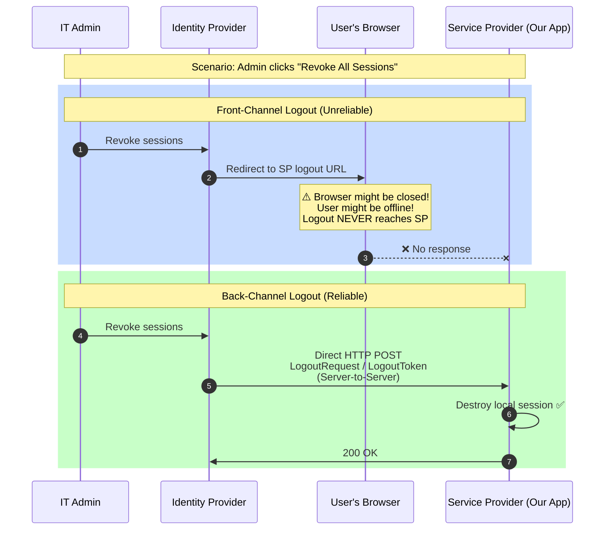

### Why Back-Channel Is Superior

| Aspect | Front-Channel (Part 6) | Back-Channel (Part 7) |
|---|---|---|
| **Relies on browser** | Yes (redirect) | No (server-to-server) |
| **Works if browser closed** | No | Yes |
| **Works if user offline** | No | Yes |
| **Multiple devices** | Only current device | All devices |
| **Latency** | User must click | Immediate |
| **Complexity** | Low | Medium-High |

---

## 2. OIDC Back-Channel Logout

The OIDC Back-Channel Logout specification (OpenID Connect Back-Channel Logout 1.0) defines how the IdP notifies the RP (our application) to end a session without user interaction.

### The Logout Token

The IdP sends an HTTP POST to our `backchannel_logout_uri` with a `logout_token` parameter. This token is a JWT containing:

- `iss` — The issuer identifier
- `aud` — Our client ID
- `iat` — When the token was issued
- `jti` — A unique token ID (for replay protection)
- `sub` — The subject identifier of the user to log out
- `sid` — The specific session identifier (optional but critical for multi-session)
- `events` — Must contain `http://openid.net/specs/openid-backchannel-1_0_e`

### Mermaid Diagram: OIDC Back-Channel Logout Flow

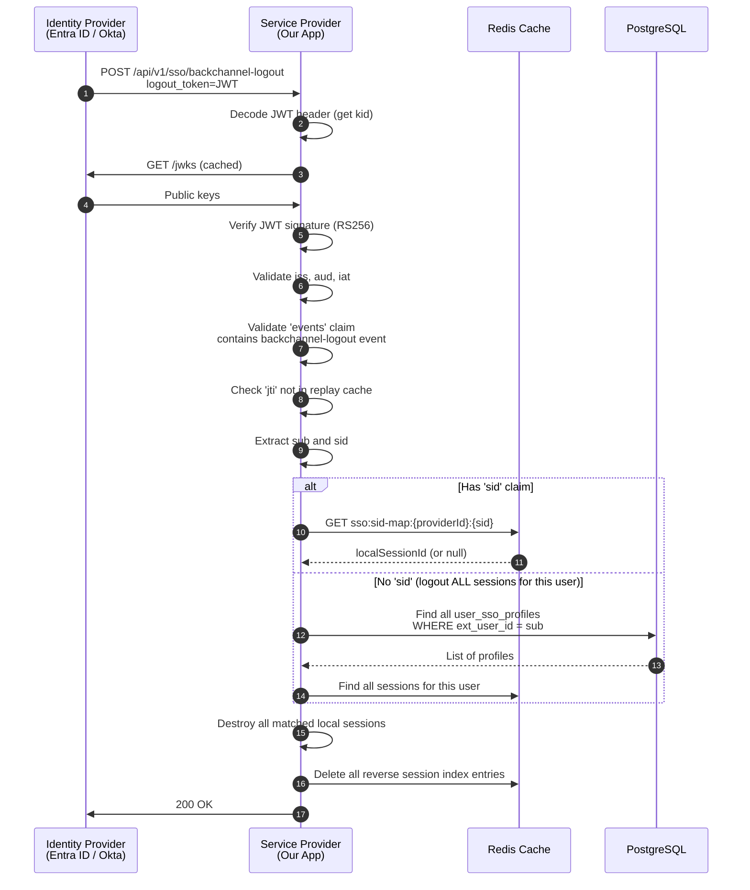

### Code Implementation: OIDC Back-Channel Logout Handler

```typescript
// src/sso/controllers/sso-backchannel.controller.ts
import { Controller, Post, Body, Headers, UnauthorizedException, Logger } from '@nestjs/common';
import { OidcBackChannelService } from '../services/oidc-backchannel.service';

@Controller('api/v1/sso')
export class SsoBackChannelController {
  private readonly logger = new Logger(SsoBackChannelController.name);

  constructor(private readonly oidcBclService: OidcBackChannelService) {}

  @Post('backchannel-logout')
  async handleOidcBackChannelLogout(
    @Body('logout_token') logoutToken: string,
  ): Promise<{ status: string }> {
    if (!logoutToken) {
      throw new UnauthorizedException('Missing logout_token');
    }

    this.logger.log('Received OIDC Back-Channel Logout request');
    await this.oidcBclService.processLogoutToken(logoutToken);

    return { status: 'ok' };
  }
}
```

```typescript
// src/sso/services/oidc-backchannel.service.ts
import { Injectable, UnauthorizedException, Logger } from '@nestjs/common';
import * as jwt from 'jsonwebtoken';
import { Redis } from 'ioredis';
import { JwksService } from './jwks.service';
import { SessionService } from '../../auth/services/session.service';
import { IdpProviderRepository } from '../repositories/idp-provider.repository';
import { UserRepository } from '../../users/repositories/user.repository';

@Injectable()
export class OidcBackChannelService {
  private readonly logger = new Logger(OidcBackChannelService.name);

  constructor(
    private readonly jwksService: JwksService,
    private readonly redisClient: Redis,
    private readonly sessionService: SessionService,
    private readonly idpProviderRepo: IdpProviderRepository,
    private readonly userRepo: UserRepository,
  ) {}

  async processLogoutToken(logoutToken: string): Promise<void> {
    // 1. Decode header to get kid and provider info
    const decodedHeader = jwt.decode(logoutToken, { complete: true });
    if (!decodedHeader?.header?.kid) {
      throw new UnauthorizedException('Invalid logout_token: missing header or kid');
    }

    // 2. Find the provider by matching the issuer
    const payload = jwt.decode(logoutToken) as any;
    const provider = await this.idpProviderRepo.findByIssuer(payload?.iss);
    if (!provider) {
      throw new UnauthorizedException('Unknown issuer in logout_token');
    }

    // 3. Fetch public key and verify signature
    const metadata = await this.discoveryService.fetchMetadata(provider.issuerUrl);
    const publicKey = await this.jwksService.getPublicKey(
      provider, metadata.jwks_uri, decodedHeader.header.kid
    );

    let verifiedPayload: any;
    try {
      verifiedPayload = jwt.verify(logoutToken, publicKey, {
        algorithms: ['RS256'],
        issuer: metadata.issuer,
        audience: provider.clientId,
        clockTolerance: 60,
      });
    } catch (error) {
      throw new UnauthorizedException(`logout_token verification failed: ${error.message}`);
    }

    // 4. Validate required claims per OIDC Back-Channel spec
    if (!verifiedPayload.events?.['http://openid.net/specs/openid-backchannel-1_0_e']) {
      throw new UnauthorizedException('logout_token missing required backchannel event');
    }

    // 5. Replay protection using jti
    if (verifiedPayload.jti) {
      const replayKey = `bcl:jti:${verifiedPayload.jti}`;
      const alreadyUsed = await this.redisClient.get(replayKey);
      if (alreadyUsed) {
        this.logger.warn(`Replay detected for jti: ${verifiedPayload.jti}`);
        return; // Idempotent: already processed
      }
      // Mark as used (TTL: 10 minutes — tokens should be very short-lived)
      await this.redisClient.set(replayKey, '1', 'EX', 600);
    }

    // 6. Extract identifiers
    const sub = verifiedPayload.sub;
    const sid = verifiedPayload.sid;

    if (sid) {
      // Specific session logout: use Reverse Session Index
      await this.terminateSpecificSession(provider.id, sid);
    } else if (sub) {
      // Global logout: terminate ALL sessions for this user from this IdP
      await this.terminateAllUserSessions(provider.id, sub);
    }
  }

  private async terminateSpecificSession(providerId: string, idpSessionId: string): Promise<void> {
    const reverseKey = `sso:sid-map:${providerId}:${idpSessionId}`;
    const localSessionId = await this.redisClient.get(reverseKey);

    if (localSessionId) {
      const sessionId = localSessionId.replace('sess:', '');
      await this.sessionService.destroySession(sessionId);
      await this.redisClient.del(reverseKey);
      this.logger.log(`Terminated local session ${sessionId} via BCL (sid: ${idpSessionId})`);
    } else {
      this.logger.warn(`No local session found for idpSessionId: ${idpSessionId}`);
    }
  }

  private async terminateAllUserSessions(providerId: string, extUserId: string): Promise<void> {
    // Find the local user via SSO profile
    const profile = await this.idpProviderRepo.findSsoProfile(providerId, extUserId);
    if (!profile) {
      this.logger.warn(`No SSO profile found for extUserId: ${extUserId}`);
      return;
    }

    // Destroy ALL active sessions for this user
    await this.sessionService.destroyAllUserSessions(profile.user.id);
    this.logger.log(`Terminated all sessions for user ${profile.user.id} via BCL (sub: ${extUserId})`);
  }
}
```

---

## 3. SAML 2.0 Back-Channel Logout

SAML Back-Channel Logout uses the same `<LogoutRequest>` XML document as front-channel, but delivered via an HTTP POST binding (instead of HTTP-Redirect binding).

### Mermaid Diagram: SAML Back-Channel Logout Flow

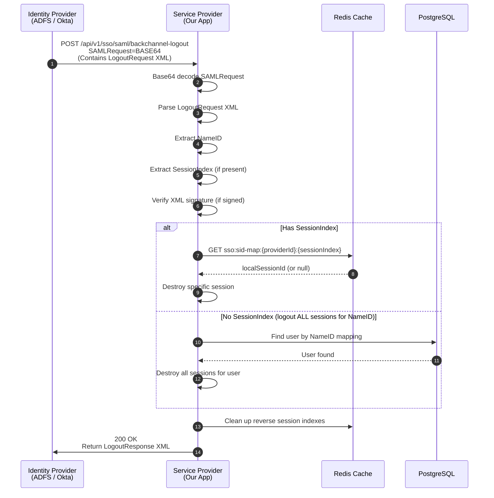

### Code Implementation: SAML Back-Channel Logout Handler

```typescript
// src/sso/services/saml-backchannel.service.ts
import { Injectable, Logger } from '@nestjs/common';
import { DOMParser } from '@xmldom/xmldom';
import { Redis } from 'ioredis';
import { SessionService } from '../../auth/services/session.service';
import { IdpProviderRepository } from '../repositories/idp-provider.repository';

@Injectable()
export class SamlBackChannelService {
  private readonly logger = new Logger(SamlBackChannelService.name);

  constructor(
    private readonly redisClient: Redis,
    private readonly sessionService: SessionService,
    private readonly idpProviderRepo: IdpProviderRepository,
  ) {}

  async processLogoutRequest(
    providerId: string,
    samlRequestBase64: string,
  ): Promise<string> {
    // 1. Base64 decode
    const xmlString = Buffer.from(samlRequestBase64, 'base64').toString('utf-8');
    const parser = new DOMParser();
    const doc = parser.parseFromString(xmlString, 'text/xml');

    // 2. Extract LogoutRequest namespace
    const logoutRequest = doc.getElementsByTagNameNS(
      'urn:oasis:names:tc:SAML:2.0:protocol', 'LogoutRequest'
    )[0];

    if (!logoutRequest) {
      throw new Error('Invalid SAML LogoutRequest: missing LogoutRequest element');
    }

    // 3. Extract NameID
    const nameIdElement = logoutRequest.getElementsByTagNameNS(
      'urn:oasis:names:tc:SAML:2.0:assertion', 'NameID'
    )[0];
    const nameId = nameIdElement?.textContent?.trim();

    if (!nameId) {
      throw new Error('Invalid SAML LogoutRequest: missing NameID');
    }

    // 4. Extract SessionIndex (optional)
    const sessionIndexElements = logoutRequest.getElementsByTagNameNS(
      'urn:oasis:names:tc:SAML:2.0:protocol', 'SessionIndex'
    );
    const sessionIndex = sessionIndexElements.length > 0
      ? sessionIndexElements[0].textContent?.trim()
      : null;

    // 5. Terminate session(s)
    if (sessionIndex) {
      await this.terminateSpecificSession(providerId, sessionIndex);
    } else {
      await this.terminateAllUserSessions(providerId, nameId);
    }

    // 6. Generate LogoutResponse
    return this.buildLogoutResponse(logoutRequest.getAttribute('ID'));
  }

  private async terminateSpecificSession(providerId: string, sessionIndex: string): Promise<void> {
    const reverseKey = `sso:sid-map:${providerId}:${sessionIndex}`;
    const localSessionId = await this.redisClient.get(reverseKey);

    if (localSessionId) {
      const sessionId = localSessionId.replace('sess:', '');
      await this.sessionService.destroySession(sessionId);
      await this.redisClient.del(reverseKey);
      this.logger.log(`Terminated session ${sessionId} via SAML BCL (SessionIndex: ${sessionIndex})`);
    }
  }

  private async terminateAllUserSessions(providerId: string, nameId: string): Promise<void> {
    const profile = await this.idpProviderRepo.findSsoProfileByExtId(providerId, nameId);
    if (profile) {
      await this.sessionService.destroyAllUserSessions(profile.user.id);
      this.logger.log(`Terminated all sessions for user ${profile.user.id} via SAML BCL (NameID: ${nameId})`);
    }
  }

  private buildLogoutResponse(inResponseTo: string): string {
    const id = `_${crypto.randomUUID()}`;
    const issueInstant = new Date().toISOString();

    return `<samlp:LogoutResponse
      xmlns:samlp="urn:oasis:names:tc:SAML:2.0:protocol"
      ID="${id}"
      InResponseTo="${inResponseTo}"
      Version="2.0"
      IssueInstant="${issueInstant}"
      Destination="https://idp.example.com/slo">
      <samlp:StatusCode Value="urn:oasis:names:tc:SAML:2.0:status:Success"/>
    </samlp:LogoutResponse>`;
  }
}
```

---

## 4. The Multi-Device Challenge

A user might be logged in on their laptop, phone, and tablet simultaneously. When the IdP sends a back-channel logout, we must terminate ALL sessions for that user, not just one.

### Mermaid Diagram: Multi-Device Session Termination

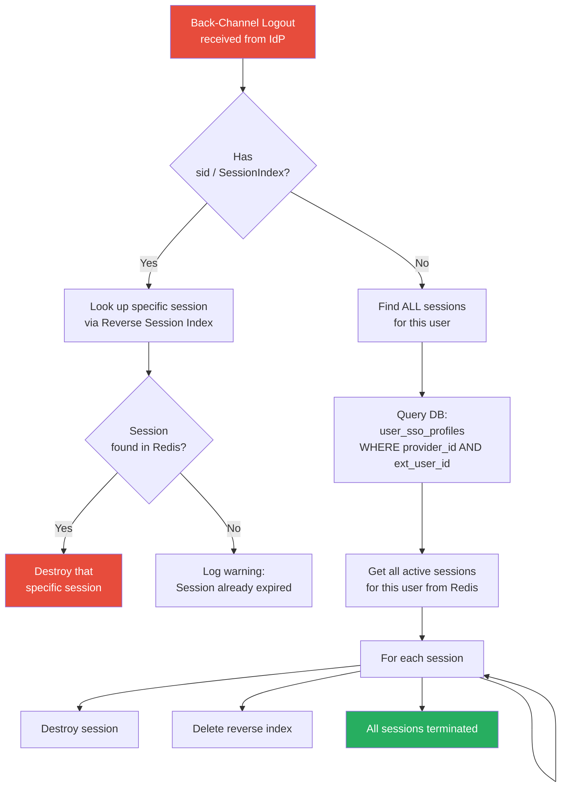

### Code Implementation: Multi-Device Session Cleanup

```typescript
// src/auth/services/session.service.ts
@Injectable()
export class SessionService {

  /**
   * Destroys ALL active sessions for a specific user.
   * Critical for IdP-Initiated Back-Channel Logout.
   */
  async destroyAllUserSessions(userId: string): Promise<number> {
    // 1. Find all session keys for this user
    const sessionPattern = `sess:user:${userId}:*`;
    const sessionKeys = await this.redisClient.keys(sessionPattern);

    let destroyed = 0;
    for (const key of sessionKeys) {
      const sessionId = key.split(':').pop();
      await this.destroySession(sessionId);
      destroyed++;
    }

    // 2. Also clean up any orphaned reverse session indexes
    const reversePattern = `sso:sid-map:*`;
    // Note: In production, use a more targeted approach with a user->sessions index
    // to avoid scanning the entire keyspace

    this.logger.log(`Destroyed ${destroyed} sessions for user ${userId}`);
    return destroyed;
  }
}
```

---

## 5. Replay Protection for Logout Tokens

An attacker could intercept a valid `logout_token` and replay it later. While the damage is limited (logging someone out is annoying, not catastrophic), we should still prevent it.

### Mermaid Diagram: Logout Token Replay Protection

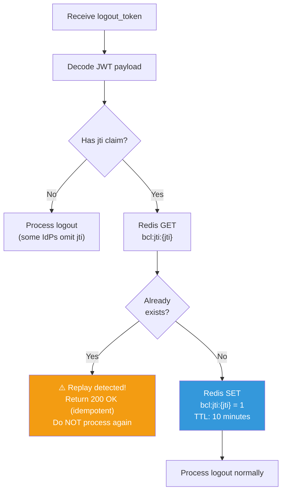

**Why 10 minutes?** Logout tokens are extremely short-lived (typically issued and consumed within seconds). A 10-minute window is more than enough to handle network retries while preventing stale replays.

---

## 6. Webhook Notifications for Real-Time UI Updates

When a back-channel logout terminates a session, the user might still be staring at our application. We need a way to push a "Your session has been terminated" notification to the frontend in real-time.

### Mermaid Diagram: BCL + WebSocket Notification

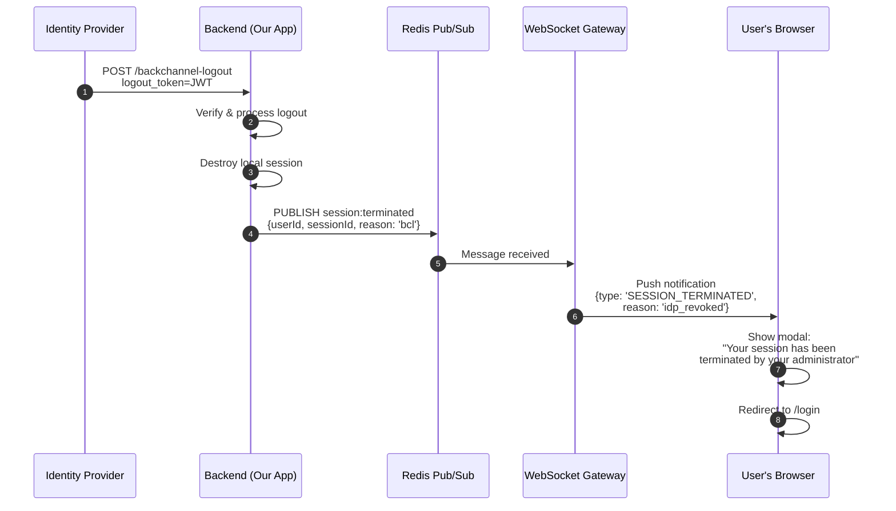

### Code Implementation: Session Termination Event

```typescript
// src/sso/services/oidc-backchannel.service.ts (addition)

import { EventEmitter2 } from '@nestjs/event-emitter';

@Injectable()
export class OidcBackChannelService {
  constructor(
    // ... existing dependencies
    private readonly eventEmitter: EventEmitter2,
  ) {}

  private async terminateSpecificSession(providerId: string, idpSessionId: string): Promise<void> {
    const reverseKey = `sso:sid-map:${providerId}:${idpSessionId}`;
    const localSessionId = await this.redisClient.get(reverseKey);

    if (localSessionId) {
      const sessionId = localSessionId.replace('sess:', '');
      
      // Get user info before destroying session (for the event)
      const sessionData = await this.sessionService.getSessionData(sessionId);
      
      await this.sessionService.destroySession(sessionId);
      await this.redisClient.del(reverseKey);

      // Emit event for WebSocket notification
      this.eventEmitter.emit('session.terminated', {
        userId: sessionData?.userId,
        sessionId,
        reason: 'idp_backchannel_logout',
        providerId,
      });

      this.logger.log(`Terminated session ${sessionId} via BCL`);
    }
  }
}
```

---

## 7. Health Check and Monitoring

Back-Channel Logout endpoints must be highly available. If the IdP cannot reach our endpoint, users will remain logged in even after their access is revoked.

### Mermaid Diagram: BCL Endpoint Health Monitoring

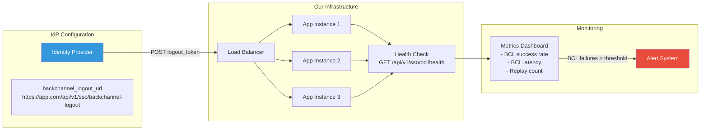

### Key Metrics to Monitor

| Metric | Description | Alert Threshold |
|---|---|---|
| `bcl_requests_total` | Total BCL requests received | — |
| `bcl_success_rate` | Percentage of successfully processed BCLs | < 99% |
| `bcl_latency_ms` | Time to process a BCL request | > 2000ms |
| `bcl_replay_count` | Number of replayed tokens detected | > 10/min |
| `bcl_session_not_found` | BCL received but no matching session | > 50% (possible stale index) |

---

## Conclusion

In Part 7, we have closed the final gap in Single Logout. By implementing Back-Channel Logout for both OIDC and SAML, we ensure that when an IT administrator revokes sessions from the IdP portal, our application responds immediately—even if the user's browser is closed. We built replay protection using `jti` tracking, multi-device session termination via the Reverse Session Index, and real-time WebSocket notifications to alert users of forced logouts.

However, our implementation still has a fragility: **certificate management**. When an IdP rotates its X.509 signing certificates, our cached certificates become stale and SAML signature verification will fail. In Part 8, we will tackle **Certificate Rotation & Key Management**, building automated certificate refresh and graceful rollover mechanisms.

<br><br><br>

---

---

## 簡介：當 IdP 直接拔插頭

喺第六集，我哋講咗 SP 發起嘅登出——即係用戶主動喺 *我哋* 嘅 Application 入面撳「登出」。但如果一個 IT Admin 喺 Entra ID Portal 度撳「撤銷所有會話」咁點算？又或者 Okta 偵測到個 Account 出事，強制終止晒所有 Active sessions？我哋個 App 完全唔知發生緊咩事。用戶嘅 Local session 依然有效，任何人開住個 Browser 都仲可以 Access 我哋個平台。

就係呢個缺口，**後台登出（Back-Channel Logout, BCL）** 要填上。BCL 唔需要靠用戶個 Browser 嚟傳遞登出訊號（Front-channel），而係 IdP 直接 Server-to-server 發一個 HTTP POST Request 過嚟我哋個 Application 嘅 Logout endpoint。呢個係最穩健嘅 Single Logout 形式，因為就算用戶個 Browser 關咗都照樣 Work。

喺第七集，我哋會實作 `FN/ADM/SSO/007`：**IdP 發起嘅後台登出（IdP-Initiated Back-Channel Logout）**。我哋會探討 OIDC Back-Channel Logout 規格、SAML `<LogoutRequest>` 嘅 Back-channel binding、點樣用我哋嘅反向 Session 索引 (Reverse Session Index) 搵返 Local sessions，同埋多裝置 Session 終止呢個關鍵挑戰。

---

## 1. 後台登出架構

同 Front-channel 登出（靠 Browser Redirect）唔同，Back-channel 登出係 IdP 嘅 Server 直接發一個 HTTP POST 過嚟我哋嘅 Server。用戶嘅 Browser 完全唔 involved。

### Mermaid 圖解：Front-Channel vs Back-Channel Logout

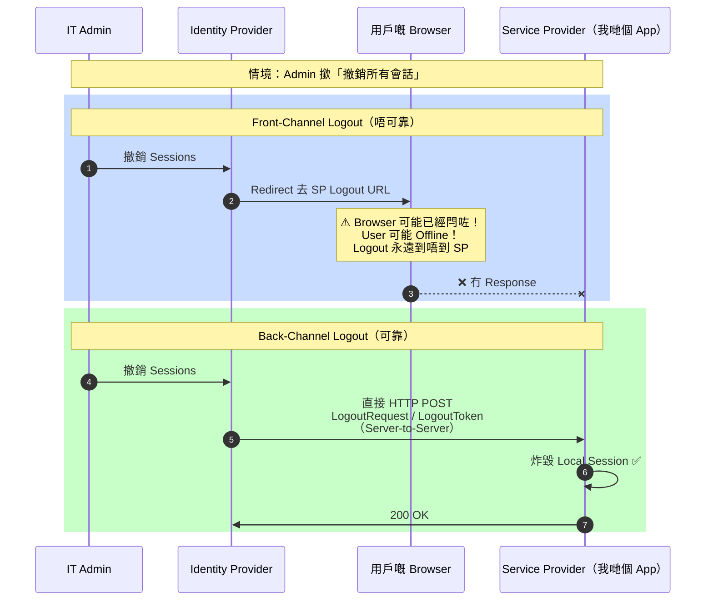

### 點解 Back-Channel 贏晒？

| 方面 | Front-Channel（第六集） | Back-Channel（第七集） |
|---|---|---|
| **靠 Browser？** | 係（Redirect） | 唔係（Server-to-server） |
| **Browser 關咗得唔得？** | 唔得 | 得 |
| **User Offline 得唔得？** | 唔得 | 得 |
| **多裝置？** | 淨係當前裝置 | 所有裝置 |
| **延遲？** | 用戶要撳 | 即時 |
| **複雜度？** | 低 | 中至高 |

---

## 2. OIDC Back-Channel Logout

OIDC Back-Channel Logout 規格（OpenID Connect Back-Channel Logout 1.0）定義咗 IdP 點樣通知 RP（我哋個 App）結束一個 Session，完全唔需要用戶介入。

### Logout Token

IdP 發一個 HTTP POST 去我哋嘅 `backchannel_logout_uri`，Body 有一個 `logout_token` 參數。呢個 Token 係一個 JWT，入面有：

- `iss` — Issuer 識別符
- `aud` — 我哋嘅 Client ID
- `iat` — Token 幾時發出
- `jti` — 一個獨特嘅 Token ID（用嚟防 Replay）
- `sub` — 要登出嗰個用戶嘅 Subject 識別符
- `sid` — 特定嘅 Session 識別符（Optional 但對多 Session 好關鍵）
- `events` — 必須包含 `http://openid.net/specs/openid-backchannel-1_0_e`

### Mermaid 圖解：OIDC Back-Channel Logout 流程

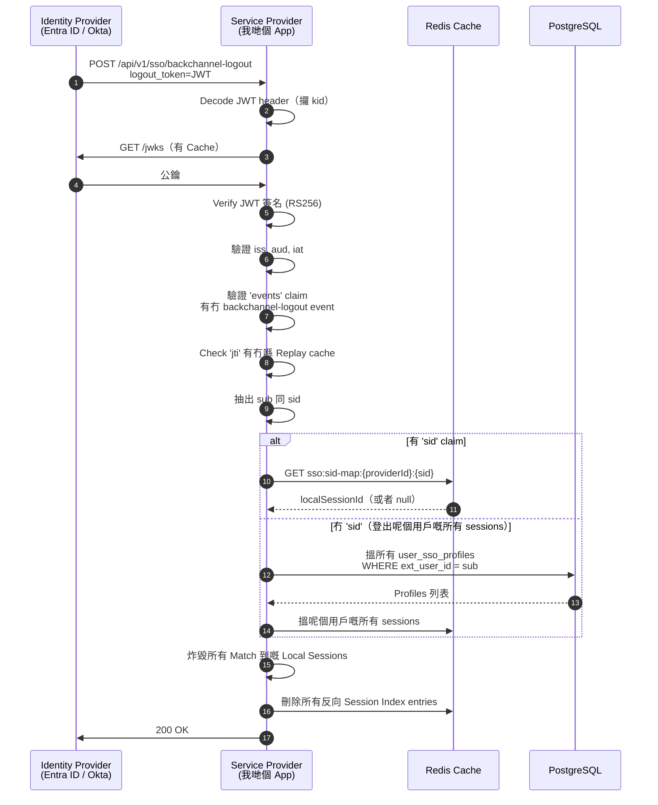

### Code 實作：OIDC Back-Channel Logout Handler

```typescript
// src/sso/controllers/sso-backchannel.controller.ts
import { Controller, Post, Body, Headers, UnauthorizedException, Logger } from '@nestjs/common';
import { OidcBackChannelService } from '../services/oidc-backchannel.service';

@Controller('api/v1/sso')
export class SsoBackChannelController {
  private readonly logger = new Logger(SsoBackChannelController.name);

  constructor(private readonly oidcBclService: OidcBackChannelService) {}

  @Post('backchannel-logout')
  async handleOidcBackChannelLogout(
    @Body('logout_token') logoutToken: string,
  ): Promise<{ status: string }> {
    if (!logoutToken) {
      throw new UnauthorizedException('漏咗 logout_token');
    }

    this.logger.log('收到 OIDC Back-Channel Logout 請求');
    await this.oidcBclService.processLogoutToken(logoutToken);

    return { status: 'ok' };
  }
}
```

```typescript
// src/sso/services/oidc-backchannel.service.ts
import { Injectable, UnauthorizedException, Logger } from '@nestjs/common';
import * as jwt from 'jsonwebtoken';
import { Redis } from 'ioredis';
import { JwksService } from './jwks.service';
import { SessionService } from '../../auth/services/session.service';
import { IdpProviderRepository } from '../repositories/idp-provider.repository';
import { UserRepository } from '../../users/repositories/user.repository';

@Injectable()
export class OidcBackChannelService {
  private readonly logger = new Logger(OidcBackChannelService.name);

  constructor(
    private readonly jwksService: JwksService,
    private readonly redisClient: Redis,
    private readonly sessionService: SessionService,
    private readonly idpProviderRepo: IdpProviderRepository,
    private readonly userRepo: UserRepository,
  ) {}

  async processLogoutToken(logoutToken: string): Promise<void> {
    // 1. Decode header 攞 kid 同 Provider info
    const decodedHeader = jwt.decode(logoutToken, { complete: true });
    if (!decodedHeader?.header?.kid) {
      throw new UnauthorizedException('無效嘅 logout_token：漏咗 Header 或者 kid');
    }

    // 2. 根據 Issuer 搵返邊個 Provider
    const payload = jwt.decode(logoutToken) as any;
    const provider = await this.idpProviderRepo.findByIssuer(payload?.iss);
    if (!provider) {
      throw new UnauthorizedException('logout_token 入面嘅 Issuer 唔識');
    }

    // 3. 攞公鑰同驗證簽名
    const metadata = await this.discoveryService.fetchMetadata(provider.issuerUrl);
    const publicKey = await this.jwksService.getPublicKey(
      provider, metadata.jwks_uri, decodedHeader.header.kid
    );

    let verifiedPayload: any;
    try {
      verifiedPayload = jwt.verify(logoutToken, publicKey, {
        algorithms: ['RS256'],
        issuer: metadata.issuer,
        audience: provider.clientId,
        clockTolerance: 60,
      });
    } catch (error) {
      throw new UnauthorizedException(`logout_token 驗證失敗: ${error.message}`);
    }

    // 4. 根據 OIDC Back-Channel 規格，驗證必須嘅 Claims
    if (!verifiedPayload.events?.['http://openid.net/specs/openid-backchannel-1_0_e']) {
      throw new UnauthorizedException('logout_token 漏咗必要嘅 backchannel event');
    }

    // 5. 用 jti 做防 Replay
    if (verifiedPayload.jti) {
      const replayKey = `bcl:jti:${verifiedPayload.jti}`;
      const alreadyUsed = await this.redisClient.get(replayKey);
      if (alreadyUsed) {
        this.logger.warn(`偵測到 Replay：jti: ${verifiedPayload.jti}`);
        return; // Idempotent：已經處理過，唔使再做
      }
      // 標記為已用（TTL: 10 分鐘——Token 應該好短命）
      await this.redisClient.set(replayKey, '1', 'EX', 600);
    }

    // 6. 抽出識別符
    const sub = verifiedPayload.sub;
    const sid = verifiedPayload.sid;

    if (sid) {
      // 特定 Session 登出：用反向 Session 索引
      await this.terminateSpecificSession(provider.id, sid);
    } else if (sub) {
      // 全局登出：終止呢個用戶嘅所有 Sessions
      await this.terminateAllUserSessions(provider.id, sub);
    }
  }

  private async terminateSpecificSession(providerId: string, idpSessionId: string): Promise<void> {
    const reverseKey = `sso:sid-map:${providerId}:${idpSessionId}`;
    const localSessionId = await this.redisClient.get(reverseKey);

    if (localSessionId) {
      const sessionId = localSessionId.replace('sess:', '');
      await this.sessionService.destroySession(sessionId);
      await this.redisClient.del(reverseKey);
      this.logger.log(`透過 BCL 終止咗 Local session ${sessionId} (sid: ${idpSessionId})`);
    } else {
      this.logger.warn(`搵唔到對應嘅 Local session，idpSessionId: ${idpSessionId}`);
    }
  }

  private async terminateAllUserSessions(providerId: string, extUserId: string): Promise<void> {
    // 透過 SSO Profile 搵返 Local User
    const profile = await this.idpProviderRepo.findSsoProfile(providerId, extUserId);
    if (!profile) {
      this.logger.warn(`搵唔到 SSO profile，extUserId: ${extUserId}`);
      return;
    }

    // 炸毀呢個用戶嘅所有 Active Sessions
    await this.sessionService.destroyAllUserSessions(profile.user.id);
    this.logger.log(`透過 BCL 終止咗用戶 ${profile.user.id} 嘅所有 sessions (sub: ${extUserId})`);
  }
}
```

---

## 3. SAML 2.0 後台登出

SAML Back-Channel Logout 用嘅係同一份 `<LogoutRequest>` XML document，但係透過 HTTP POST binding 傳送（唔係 HTTP-Redirect binding）。

### Mermaid 圖解：SAML Back-Channel Logout 流程

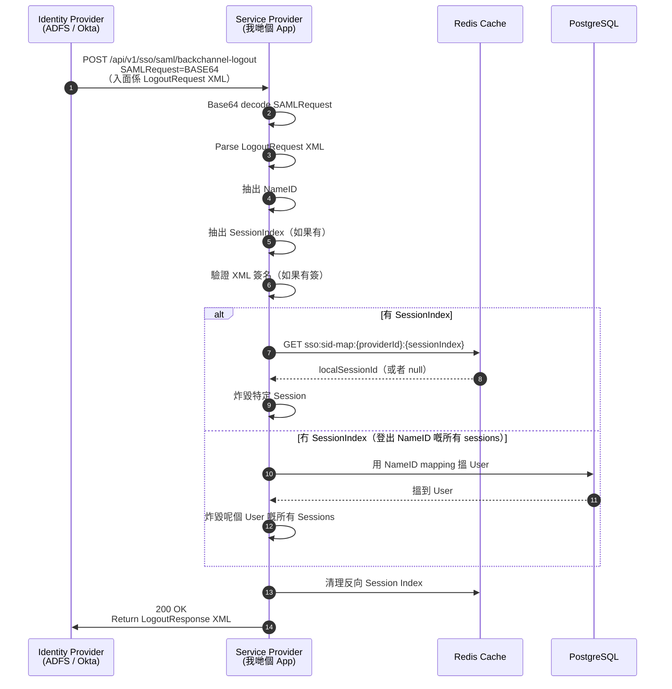

### Code 實作：SAML Back-Channel Logout Handler

```typescript
// src/sso/services/saml-backchannel.service.ts
import { Injectable, Logger } from '@nestjs/common';
import { DOMParser } from '@xmldom/xmldom';
import { Redis } from 'ioredis';
import { SessionService } from '../../auth/services/session.service';
import { IdpProviderRepository } from '../repositories/idp-provider.repository';

@Injectable()
export class SamlBackChannelService {
  private readonly logger = new Logger(SamlBackChannelService.name);

  constructor(
    private readonly redisClient: Redis,
    private readonly sessionService: SessionService,
    private readonly idpProviderRepo: IdpProviderRepository,
  ) {}

  async processLogoutRequest(
    providerId: string,
    samlRequestBase64: string,
  ): Promise<string> {
    // 1. Base64 decode
    const xmlString = Buffer.from(samlRequestBase64, 'base64').toString('utf-8');
    const parser = new DOMParser();
    const doc = parser.parseFromString(xmlString, 'text/xml');

    // 2. 抽出 LogoutRequest namespace
    const logoutRequest = doc.getElementsByTagNameNS(
      'urn:oasis:names:tc:SAML:2.0:protocol', 'LogoutRequest'
    )[0];

    if (!logoutRequest) {
      throw new Error('無效嘅 SAML LogoutRequest：搵唔到 LogoutRequest element');
    }

    // 3. 抽出 NameID
    const nameIdElement = logoutRequest.getElementsByTagNameNS(
      'urn:oasis:names:tc:SAML:2.0:assertion', 'NameID'
    )[0];
    const nameId = nameIdElement?.textContent?.trim();

    if (!nameId) {
      throw new Error('無效嘅 SAML LogoutRequest：漏咗 NameID');
    }

    // 4. 抽出 SessionIndex（Optional）
    const sessionIndexElements = logoutRequest.getElementsByTagNameNS(
      'urn:oasis:names:tc:SAML:2.0:protocol', 'SessionIndex'
    );
    const sessionIndex = sessionIndexElements.length > 0
      ? sessionIndexElements[0].textContent?.trim()
      : null;

    // 5. 終止 Session(s)
    if (sessionIndex) {
      await this.terminateSpecificSession(providerId, sessionIndex);
    } else {
      await this.terminateAllUserSessions(providerId, nameId);
    }

    // 6. Generate LogoutResponse
    return this.buildLogoutResponse(logoutRequest.getAttribute('ID'));
  }

  private async terminateSpecificSession(providerId: string, sessionIndex: string): Promise<void> {
    const reverseKey = `sso:sid-map:${providerId}:${sessionIndex}`;
    const localSessionId = await this.redisClient.get(reverseKey);

    if (localSessionId) {
      const sessionId = localSessionId.replace('sess:', '');
      await this.sessionService.destroySession(sessionId);
      await this.redisClient.del(reverseKey);
      this.logger.log(`透過 SAML BCL 終止咗 session ${sessionId} (SessionIndex: ${sessionIndex})`);
    }
  }

  private async terminateAllUserSessions(providerId: string, nameId: string): Promise<void> {
    const profile = await this.idpProviderRepo.findSsoProfileByExtId(providerId, nameId);
    if (profile) {
      await this.sessionService.destroyAllUserSessions(profile.user.id);
      this.logger.log(`透過 SAML BCL 終止咗用戶 ${profile.user.id} 嘅所有 sessions (NameID: ${nameId})`);
    }
  }

  private buildLogoutResponse(inResponseTo: string): string {
    const id = `_${crypto.randomUUID()}`;
    const issueInstant = new Date().toISOString();

    return `<samlp:LogoutResponse
      xmlns:samlp="urn:oasis:names:tc:SAML:2.0:protocol"
      ID="${id}"
      InResponseTo="${inResponseTo}"
      Version="2.0"
      IssueInstant="${issueInstant}"
      Destination="https://idp.example.com/slo">
      <samlp:StatusCode Value="urn:oasis:names:tc:SAML:2.0:status:Success"/>
    </samlp:LogoutResponse>`;
  }
}
```

---

## 4. 多裝置挑戰

一個用戶可能同時登入咗 Laptop、Phone 同 Tablet。當 IdP 發 Back-channel logout 過嚟，我哋必須終止晒所有嘅 Sessions，唔係淨係一個。

### Mermaid 圖解：多裝置 Session 終止

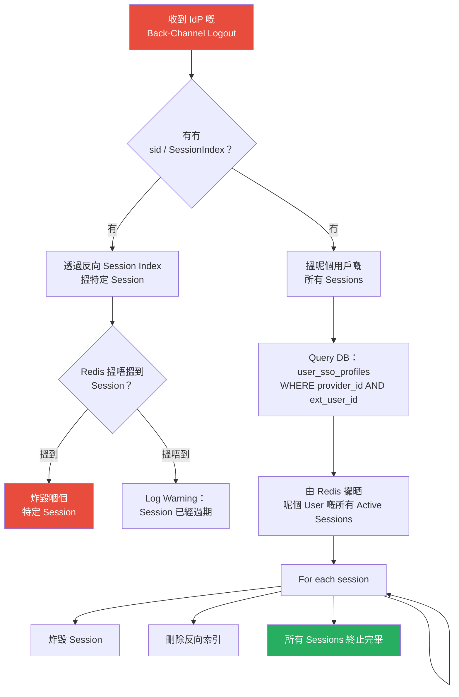

### Code 實作：多裝置 Session 清理

```typescript
// src/auth/services/session.service.ts
@Injectable()
export class SessionService {

  /**
   * 炸毀一個 User 嘅所有 Active Sessions。
   * IdP-Initiated Back-Channel Logout 嘅關鍵功能。
   */
  async destroyAllUserSessions(userId: string): Promise<number> {
    // 1. 搵晒呢個 User 嘅所有 Session keys
    const sessionPattern = `sess:user:${userId}:*`;
    const sessionKeys = await this.redisClient.keys(sessionPattern);

    let destroyed = 0;
    for (const key of sessionKeys) {
      const sessionId = key.split(':').pop();
      await this.destroySession(sessionId);
      destroyed++;
    }

    // 2. 清理埋啲孤兒反向 Session Index
    // 注意：Production 環境應該用一個更有 Target 嘅 user->sessions index
    // 唔好 Scan 成個 keyspace

    this.logger.log(`為用戶 ${userId} 炸毀咗 ${destroyed} 個 Sessions`);
    return destroyed;
  }
}
```

---

## 5. Logout Token 防 Replay

黑客可以攔截一個有效嘅 `logout_token` 然後 Replay。雖然 Damage 有限（登出人哋頂多係煩，唔係災難），但我哋都應該防範。

### Mermaid 圖解：Logout Token Replay 防護

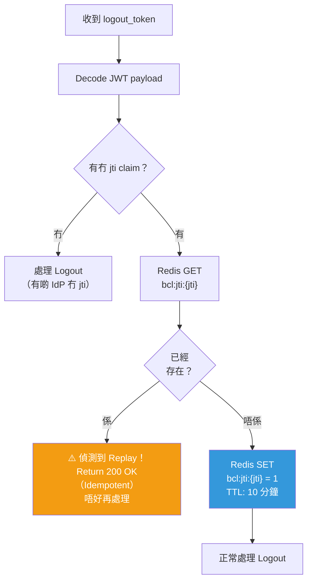

**點解 10 分鐘？** Logout Token 壽命極短（通常幾秒內就發出兼消費）。10 分鐘嘅窗口已經綽綽有餘，足以處理 Network retries 同時又可以防止過期嘅 Replay。

---

## 6. Webhook 通知：即時 UI 更新

當 Back-channel logout 炸毀咗一個 Session，個 User 可能仲喺度睇緊我哋個 App。我哋需要一個方法推一個「你嘅 Session 已被終止」嘅通知去 Frontend。

### Mermaid 圖解：BCL + WebSocket 通知

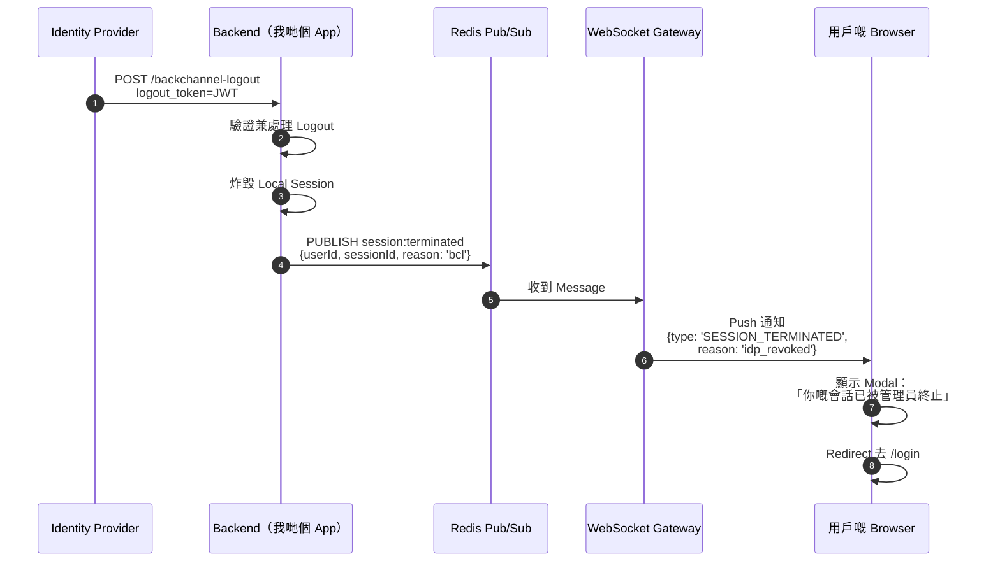

### Code 實作：Session 終止事件

```typescript
// src/sso/services/oidc-backchannel.service.ts（新增部份）

import { EventEmitter2 } from '@nestjs/event-emitter';

@Injectable()
export class OidcBackChannelService {
  constructor(
    // ... 現有嘅 Dependencies
    private readonly eventEmitter: EventEmitter2,
  ) {}

  private async terminateSpecificSession(providerId: string, idpSessionId: string): Promise<void> {
    const reverseKey = `sso:sid-map:${providerId}:${idpSessionId}`;
    const localSessionId = await this.redisClient.get(reverseKey);

    if (localSessionId) {
      const sessionId = localSessionId.replace('sess:', '');
      
      // 炸毀 Session 之前拎 User info（留俾 Event 用）
      const sessionData = await this.sessionService.getSessionData(sessionId);
      
      await this.sessionService.destroySession(sessionId);
      await this.redisClient.del(reverseKey);

      // 射個 Event 出去做 WebSocket 通知
      this.eventEmitter.emit('session.terminated', {
        userId: sessionData?.userId,
        sessionId,
        reason: 'idp_backchannel_logout',
        providerId,
      });

      this.logger.log(`透過 BCL 終止咗 session ${sessionId}`);
    }
  }
}
```

---

## 7. 健康檢查與監控

Back-Channel Logout endpoint 必須高度可用。如果 IdP 嚟唔到我哋嘅 endpoint，就算 Admin 已經撤銷咗權限，用戶都會仲登入緊。

### Mermaid 圖解：BCL Endpoint 健康監控

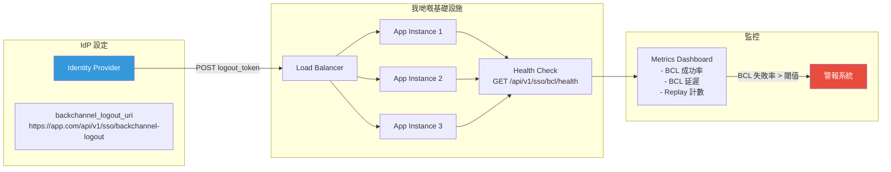

### 關鍵監控指標

| 指標 | 描述 | 警報閾值 |
|---|---|---|
| `bcl_requests_total` | 收到嘅 BCL 請求總數 | — |
| `bcl_success_rate` | 成功處理嘅 BCL 百分比 | < 99% |
| `bcl_latency_ms` | 處理一個 BCL 請求嘅時間 | > 2000ms |
| `bcl_replay_count` | 偵測到嘅 Replay Token 數量 | > 10/min |
| `bcl_session_not_found` | 收到 BCL 但搵唔到對應 Session | > 50%（可能索引過期） |

---

## 結語

喺第七集，我哋補完咗 Single Logout 嘅最後一塊拼圖。透過為 OIDC 同 SAML 實作 Back-Channel Logout，我哋確保咗當 IT Admin 喺 IdP Portal 撤銷 Sessions 嗰陣，我哋個 App 會即時回應——就算用戶個 Browser 關咗都冇問題。我哋用 `jti` 追蹤建立咗 Replay 防護，透過反向 Session Index 做到多裝置 Session 終止，仲加咗即時 WebSocket 通知去提醒用戶佢哋被強制登出。

不過，我哋嘅實作仲有一個脆弱點：**證書管理**。當 IdP 輪換佢哋嘅 X.509 簽名證書，我哋 Cache 住嘅證書就會過期，SAML 簽名驗證就會炒粉。喺第八集，我哋會處理 **證書輪換與金鑰管理（Certificate Rotation & Key Management）**，建立自動化嘅證書刷新同無縫過渡機制。

<br><br><br>
