## Introduction: The Ticking Time Bomb

Certificates expire. Keys get compromised. IdPs rotate their signing credentials on a regular schedule—typically every 1-2 years for SAML X.509 certificates, and much more frequently for OIDC JWKS (some providers rotate keys every 24 hours). If our application caches a certificate that suddenly becomes invalid, every SSO login attempt will fail. For a large enterprise, this means hundreds of users locked out simultaneously.

In Part 8, we will implement `FN/ADM/SSO/008`: **Automated Certificate Rotation & Key Management**. We will build systems to automatically discover new keys, gracefully handle key transitions (supporting both old and new keys during a rollover window), and alert administrators before certificates expire.

---

## 1. The Certificate Lifecycle

Every certificate and signing key goes through a predictable lifecycle. Understanding this lifecycle is the first step to managing it.

### Mermaid Diagram: Certificate Lifecycle State Machine

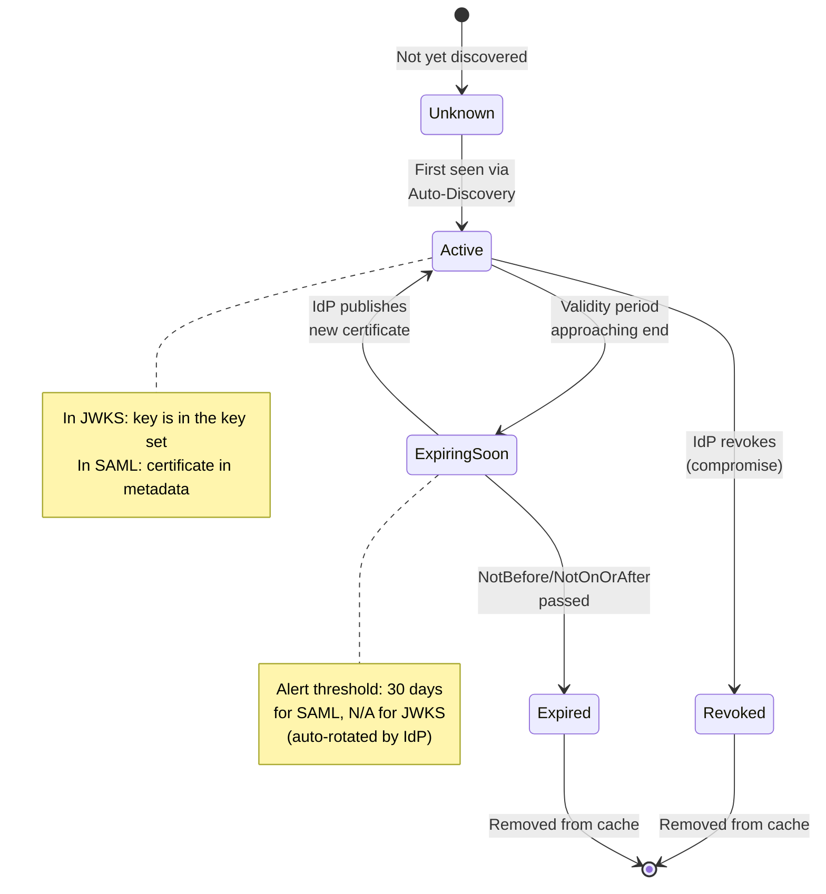

---

## 2. OIDC JWKS Key Rotation

OIDC providers publish their public keys at the `jwks_uri` endpoint. These keys have a `kid` (Key ID) that uniquely identifies each key. When a provider rotates keys, they typically:

1. Add the new key to the JWKS endpoint (both old and new keys coexist)
2. Start signing new tokens with the new key
3. Remove the old key after a grace period

### Mermaid Diagram: OIDC JWKS Key Rotation Flow

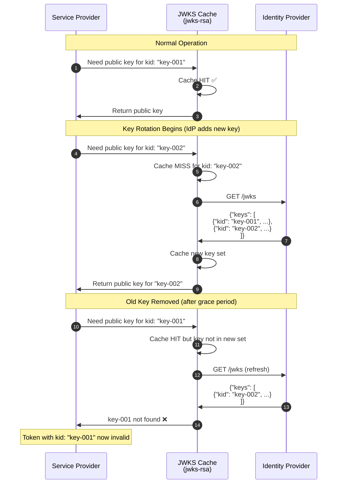

### Code Implementation: Enhanced JWKS Service with Rotation Handling

```typescript
// src/sso/services/jwks.service.ts
import { Injectable, Logger, InternalServerErrorException } from '@nestjs/common';
import * as jwksClient from 'jwks-rsa';
import { IdpProvider } from '../entities/idp-provider.entity';

@Injectable()
export class JwksService {
  private readonly logger = new Logger(JwksService.name);
  private clients = new Map<string, jwksClient.JwksClient>();

  private getClient(provider: IdpProvider, jwksUri: string): jwksClient.JwksClient {
    if (!this.clients.has(provider.id)) {
      const client = jwksClient({
        jwksUri: jwksUri,
        cache: true,
        cacheMaxEntries: 10, // Allow more keys during rotation
        cacheMaxAge: 600000, // 10 minutes — shorter to pick up new keys faster
        rateLimit: true,
        jwksRequestsPerMinute: 10,
        // Handle key rotation gracefully
        getKeysInterceptor: (keys) => {
          this.logger.debug(`JWKS fetched: ${keys.length} keys available for ${provider.providerCode}`);
          return keys;
        },
      });
      this.clients.set(provider.id, client);
    }
    return this.clients.get(provider.id);
  }

  async getPublicKey(provider: IdpProvider, jwksUri: string, kid: string): Promise<string> {
    try {
      const client = this.getClient(provider, jwksUri);
      const key = await client.getSigningKey(kid);
      return key.getPublicKey();
    } catch (error) {
      // If kid not found, force-refresh the JWKS and retry once
      if (error.message?.includes('Unable to find a signing key')) {
        this.logger.warn(`Key ${kid} not found in cache, forcing JWKS refresh for ${provider.providerCode}`);
        this.invalidateClient(provider);
        
        try {
          const client = this.getClient(provider, jwksUri);
          const key = await client.getSigningKey(kid);
          return key.getPublicKey();
        } catch (retryError) {
          throw new InternalServerErrorException(
            `Key ${kid} not found even after JWKS refresh. Key may have been revoked.`
          );
        }
      }
      throw error;
    }
  }

  /**
   * Force-invalidate the cached JWKS client for a provider.
   * Useful when we detect a key mismatch.
   */
  invalidateClient(provider: IdpProvider): void {
    this.clients.delete(provider.id);
    this.logger.log(`JWKS cache invalidated for provider: ${provider.providerCode}`);
  }
}
```

---

## 3. SAML X.509 Certificate Rotation

SAML certificate rotation is more complex because certificates are embedded in metadata XML, and there's no standard auto-rotation mechanism like JWKS. Admins must manually update the metadata.

### Mermaid Diagram: SAML Certificate Rotation Challenge

```mermaid
flowchart TD
    subgraph "Before Rotation"
        META_OLD["SAML Metadata (Old)<br/>Contains: Certificate A"]
        STORED_OLD["Our DB:<br/>certificates = [Cert A]"]
        VERIFY_OLD["Signature Verification<br/>Against Cert A ✅"]
    end

    subgraph "During Rotation (Transition Period)"
        META_NEW["SAML Metadata (New)<br/>Contains: Cert A + Cert B"]
        STORED_TRANS["Our DB:<br/>certificates = [Cert A, Cert B]"]
        VERIFY_TRANS["Signature Verification<br/>Against Cert A or Cert B ✅"]
    end

    subgraph "After Rotation (Old Cert Removed)"
        META_FINAL["SAML Metadata (Final)<br/>Contains: Cert B only"]
        STORED_NEW["Our DB:<br/>certificates = [Cert B]"]
        VERIFY_NEW["Signature Verification<br/>Against Cert B ✅"]
    end

    META_OLD --> STORED_OLD --> VERIFY_OLD
    META_NEW --> STORED_TRANS --> VERIFY_TRANS
    META_FINAL --> STORED_NEW --> VERIFY_NEW

    style STORED_TRANS fill:#f39c12,color:#fff
```

### Code Implementation: Certificate Refresh Service

```typescript
// src/sso/services/certificate-refresh.service.ts
import { Injectable, Logger } from '@nestjs/common';
import { Cron, CronExpression } from '@nestjs/schedule';
import { SamlDiscoveryService } from './saml-discovery.service';
import { IdpProviderRepository } from '../repositories/idp-provider.repository';
import { IdpSecretManagerService } from './idp-secret-manager.service';

@Injectable()
export class CertificateRefreshService {
  private readonly logger = new Logger(CertificateRefreshService.name);

  constructor(
    private readonly samlDiscovery: SamlDiscoveryService,
    private readonly idpProviderRepo: IdpProviderRepository,
    private readonly secretManager: IdpSecretManagerService,
  ) {}

  /**
   * Runs every 6 hours to check for certificate updates.
   */
  @Cron(CronExpression.EVERY_6_HOURS)
  async refreshSamlCertificates(): Promise<void> {
    this.logger.log('Starting scheduled SAML certificate refresh...');

    const samlProviders = await this.idpProviderRepo.findAll({
      protocolType: 'SAML2',
      isEnabled: true,
      autoDiscovery: true,
    });

    for (const provider of samlProviders) {
      try {
        await this.refreshProviderCertificates(provider);
      } catch (error) {
        this.logger.error(
          `Failed to refresh certificates for ${provider.providerCode}: ${error.message}`
        );
        // Emit alert for admin notification
        // this.eventEmitter.emit('certificate.refresh_failed', { providerId: provider.id });
      }
    }
  }

  private async refreshProviderCertificates(provider: IdpProvider): Promise<void> {
    // 1. Decrypt current config to get metadata URL
    const config = await this.secretManager.decryptProviderConfig(provider);
    const metadataUrl = config.metadataUrl;

    if (!metadataUrl) {
      this.logger.debug(`No metadata URL for ${provider.providerCode}, skipping`);
      return;
    }

    // 2. Fetch latest metadata
    const metadata = await this.samlDiscovery.fetchMetadata(metadataUrl);
    const newCerts = metadata.certificates;

    if (!newCerts || newCerts.length === 0) {
      this.logger.warn(`No certificates found in metadata for ${provider.providerCode}`);
      return;
    }

    // 3. Compare with stored certificates
    const currentCerts = config.idpPublicCertificates || [];
    const certsChanged = !this.arraysEqual(currentCerts.sort(), newCerts.sort());

    if (certsChanged) {
      // 4. Update the config with new certificates
      config.idpPublicCertificates = newCerts;
      const { encryptedBlob, wrappedDek } = await this.secretManager.encryptProviderConfig(
        provider.id, config
      );

      await this.idpProviderRepo.update(provider.id, {
        configEncrypted: encryptedBlob,
        configDekWrapped: wrappedDek,
      });

      this.logger.log(`Updated certificates for ${provider.providerCode}: ${newCerts.length} certificate(s)`);

      // 5. Check for expiry warnings
      this.checkCertificateExpiry(provider.providerCode, newCerts);
    }
  }

  private checkCertificateExpiry(providerCode: string, certificates: string[]): void {
    for (const cert of certificates) {
      // Parse X.509 certificate to check expiry
      // In production, use a library like 'node-forge' or 'pkijs'
      try {
        const certInfo = this.parseCertificate(cert);
        const daysUntilExpiry = Math.floor(
          (certInfo.validTo.getTime() - Date.now()) / (1000 * 60 * 60 * 24)
        );

        if (daysUntilExpiry < 30) {
          this.logger.warn(
            `Certificate for ${providerCode} expires in ${daysUntilExpiry} days! ` +
            `Expiry: ${certInfo.validTo.toISOString()}`
          );
          // Emit alert
          // this.eventEmitter.emit('certificate.expiring_soon', { providerCode, daysUntilExpiry });
        }
      } catch (error) {
        this.logger.debug(`Could not parse certificate expiry for ${providerCode}`);
      }
    }
  }

  private arraysEqual(a: string[], b: string[]): boolean {
    return a.length === b.length && a.every((val, idx) => val === b[idx]);
  }
}
```

### Mermaid Diagram: Certificate Refresh Scheduler Flow

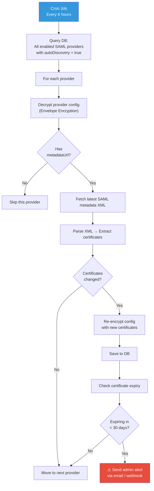

---

## 4. Graceful Key Rollover: Supporting Multiple Keys

During a transition period, the IdP might sign tokens with either the old or the new key. Our application must accept both.

### Mermaid Diagram: Multi-Key Verification Strategy

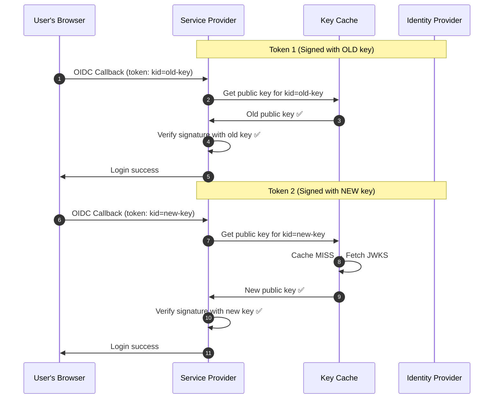

The key insight: by using the `kid` (Key ID) in the JWT header, we always fetch the *correct* key for verification. As long as the JWKS endpoint includes both keys during the transition, both old and new tokens work seamlessly.

---

## 5. SP Certificate Management (Our Signing Keys)

For SAML, we also need to manage our own signing certificates (used to sign AuthnRequests and encrypt assertions). These have the same expiry problem.

### Mermaid Diagram: SP Certificate Rotation Flow

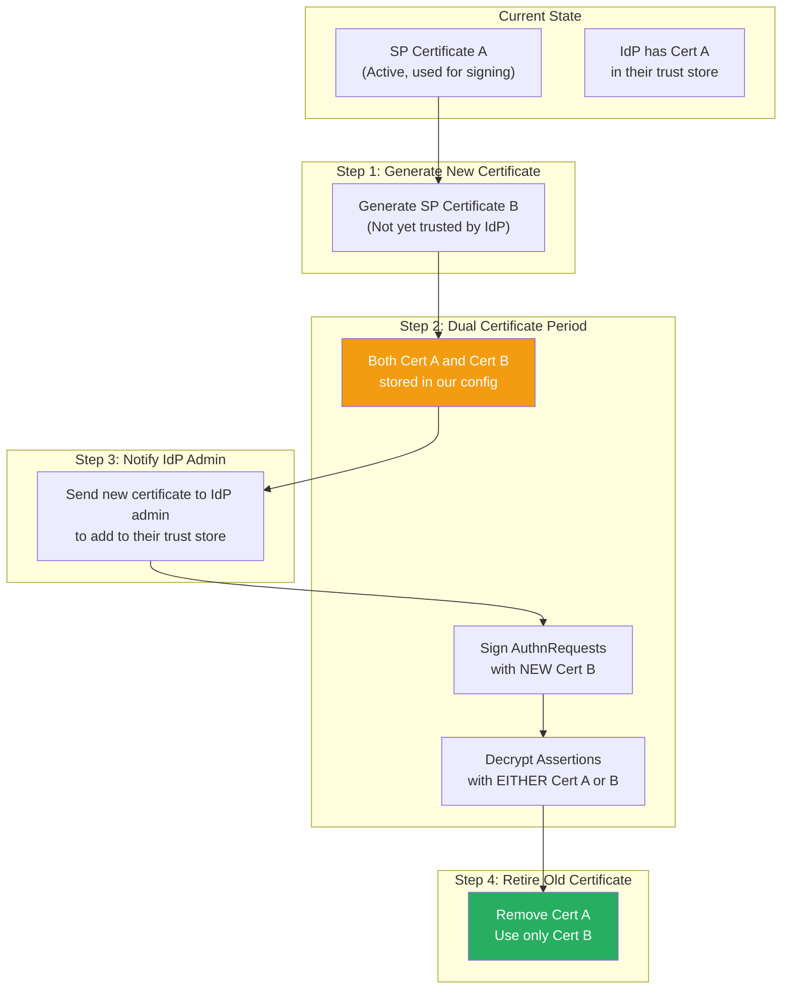

### Code Implementation: SP Key Pair Management

```typescript
// src/sso/services/sp-key-management.service.ts
import { Injectable, Logger } from '@nestjs/common';
import * as crypto from 'crypto';
import { IdpSecretManagerService } from './idp-secret-manager.service';

export interface SpKeyPair {
  certificate: string;    // X.509 certificate (PEM)
  privateKey: string;     // Private key (PEM)
  fingerprint: string;    // SHA-256 fingerprint for identification
  createdAt: Date;
  expiresAt: Date;
}

@Injectable()
export class SpKeyManagementService {
  private readonly logger = new Logger(SpKeyManagementService.name);

  constructor(private readonly secretManager: IdpSecretManagerService) {}

  /**
   * Generates a new SP signing key pair for a provider.
   */
  async generateNewKeyPair(providerId: string): Promise<SpKeyPair> {
    // In production, use a proper X.509 certificate generation library
    // This is a simplified illustration
    const { publicKey, privateKey } = crypto.generateKeyPairSync('rsa', {
      modulusLength: 2048,
      publicKeyEncoding: { type: 'spki', format: 'pem' },
      privateKeyEncoding: { type: 'pkcs8', format: 'pem' },
    });

    const fingerprint = crypto
      .createHash('sha256')
      .update(publicKey)
      .digest('hex');

    const now = new Date();
    const expiresAt = new Date(now);
    expiresAt.setFullYear(expiresAt.getFullYear() + 2); // 2-year validity

    const keyPair: SpKeyPair = {
      certificate: publicKey,
      privateKey,
      fingerprint,
      createdAt: now,
      expiresAt,
    };

    this.logger.log(`Generated new SP key pair for provider ${providerId}: ${fingerprint}`);
    return keyPair;
  }

  /**
   * Loads the active key pair for a provider (decrypted at runtime).
   */
  async getActiveKeyPair(providerId: string): Promise<SpKeyPair> {
    const config = await this.secretManager.decryptProviderConfigById(providerId);
    return config.spKeyPairs?.find((kp: SpKeyPair) => new Date(kp.expiresAt) > new Date());
  }

  /**
   * Returns all valid key pairs (for dual-certificate transition periods).
   */
  async getAllValidKeyPairs(providerId: string): Promise<SpKeyPair[]> {
    const config = await this.secretManager.decryptProviderConfigById(providerId);
    const now = new Date();
    return (config.spKeyPairs || []).filter((kp: SpKeyPair) => new Date(kp.expiresAt) > now);
  }
}
```

---

## 6. Admin Dashboard: Certificate Status Overview

Administrators need a clear view of all certificate statuses across all providers.

### Mermaid Diagram: Certificate Status Dashboard Flow

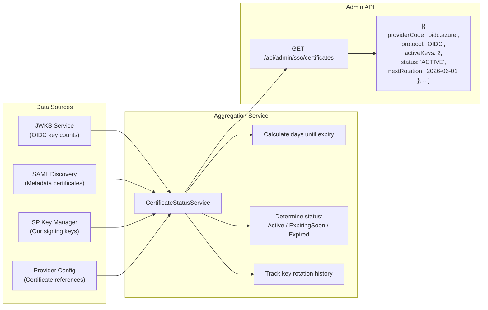

---

## 7. Emergency Key Revocation

When a key is compromised (e.g., private key leaked), immediate action is required.

### Mermaid Diagram: Emergency Key Revocation Flow

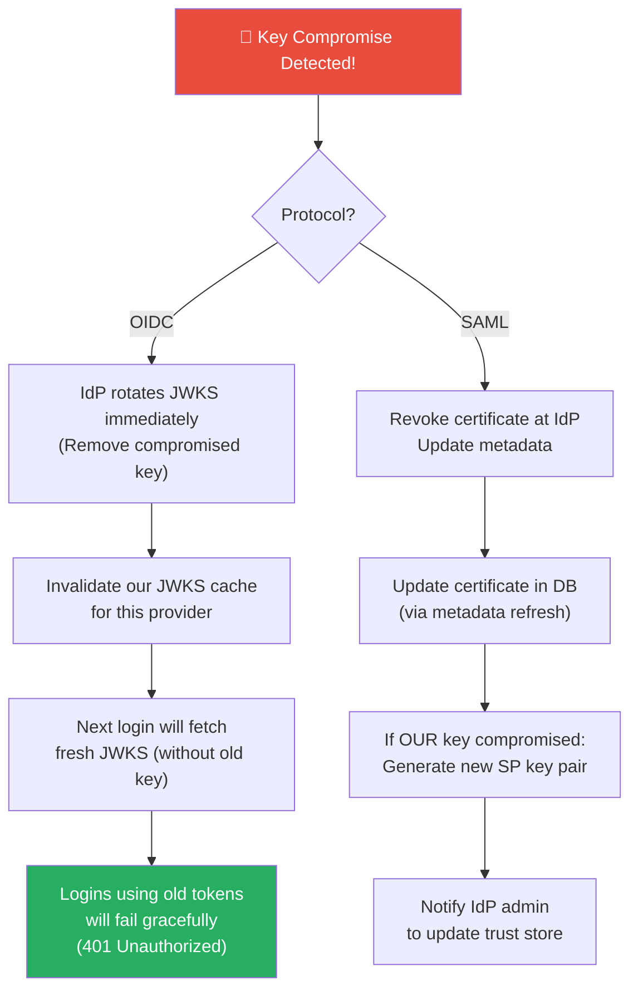

### Code Implementation: Emergency Cache Invalidation

```typescript
// src/sso/services/certificate-refresh.service.ts (addition)

  /**
   * Emergency: force-refresh all keys for a specific provider.
   * Called when a key compromise is suspected.
   */
  async emergencyKeyRefresh(providerId: string): Promise<void> {
    const provider = await this.idpProviderRepo.findById(providerId);
    if (!provider) return;

    this.logger.warn(`EMERGENCY: Force-refreshing keys for provider ${provider.providerCode}`);

    // 1. Invalidate JWKS cache
    this.jwksService.invalidateClient(provider);

    // 2. If SAML, force re-fetch metadata
    if (provider.protocolType === 'SAML2') {
      await this.refreshProviderCertificates(provider);
    }

    // 3. Log the emergency action for audit trail
    // this.eventEmitter.emit('security.emergency_key_refresh', {
    //   providerId,
    //   providerCode: provider.providerCode,
    //   triggeredBy: 'admin', // or 'system'
    //   timestamp: new Date(),
    // });
  }
```

---

## Conclusion

In Part 8, we have built a robust certificate and key management system. We handle OIDC JWKS rotation with cache invalidation and retry logic, manage SAML certificate updates via scheduled metadata polling, support dual-certificate transition periods for our own SP signing keys, and provide administrators with clear visibility into certificate health.

The final piece of the puzzle is scaling this to support multiple tenants, each with their own IdP configurations. In Part 9, we will explore **Multi-Tenant SSO**, where each customer can configure their own IdP while sharing the same application infrastructure.

<br><br><br>

---

---

## 簡介：計時炸彈

證書會過期。金鑰會被洩漏。IdPs 會定期輪換佢哋嘅簽名憑證——通常 SAML X.509 證書每 1-2 年一次，而 OIDC JWKS 就頻密好多（有啲 Provider 每 24 個鐘就輪換一次）。如果我哋個 App Cache 住一個突然失效嘅證書，所有 SSO 登入都會炒粉。對一個大企業嚟講，即係成百個用戶同時被鎖住。

喺第八集，我哋會實作 `FN/ADM/SSO/008`：**自動化證書輪換與金鑰管理**。我哋會建立系統去自動發現新金鑰、優雅地處理金鑰過渡期（喺輪換窗口期間同時支援新舊金鑰），同埋喺證書過期之前警告管理員。

---

## 1. 證書生命週期

每一把證書同簽名金鑰都會經歷一個可預測嘅生命週期。理解呢個生命週期係管理佢嘅第一步。

### Mermaid 圖解：證書生命週期狀態機

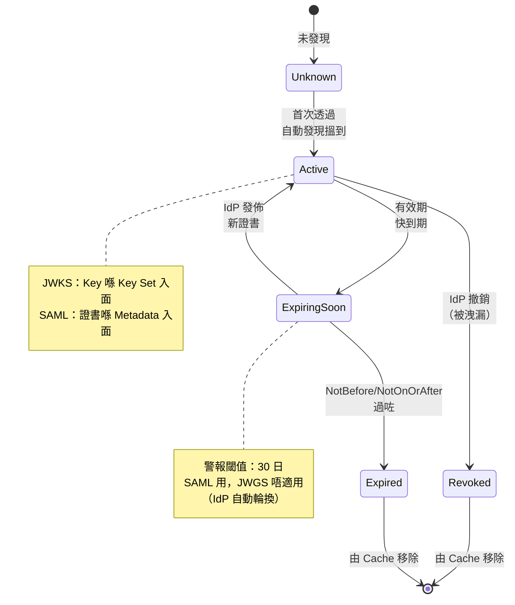

---

## 2. OIDC JWKS 金鑰輪換

OIDC Providers 喺 `jwks_uri` endpoint 發佈佢哋嘅公鑰。呢啲金鑰有一個 `kid`（Key ID）去獨特識別每一把 Key。當一個 Provider 輪換金鑰，佢哋通常：

1. 將新金鑰加入 JWKS endpoint（新舊金鑰同時存在）
2. 開始用新金鑰簽新 Token
3. 喺 Grace period 之後移除舊金鑰

### Mermaid 圖解：OIDC JWKS 金鑰輪換流程

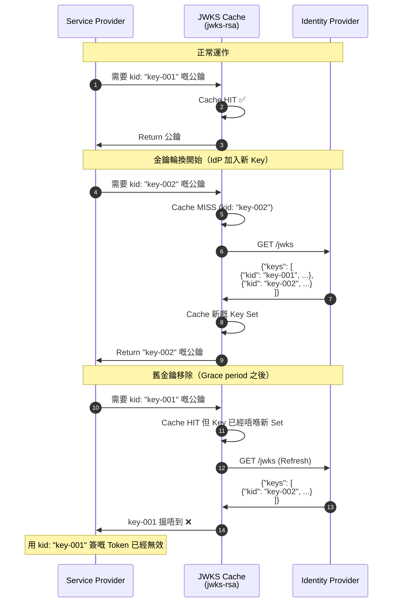

### Code 實作：增強版 JWKS Service 支援輪換

```typescript
// src/sso/services/jwks.service.ts
import { Injectable, Logger, InternalServerErrorException } from '@nestjs/common';
import * as jwksClient from 'jwks-rsa';
import { IdpProvider } from '../entities/idp-provider.entity';

@Injectable()
export class JwksService {
  private readonly logger = new Logger(JwksService.name);
  private clients = new Map<string, jwksClient.JwksClient>();

  private getClient(provider: IdpProvider, jwksUri: string): jwksClient.JwksClient {
    if (!this.clients.has(provider.id)) {
      const client = jwksClient({
        jwksUri: jwksUri,
        cache: true,
        cacheMaxEntries: 10, // 輪換期間容許更多 Keys
        cacheMaxAge: 600000, // 10 分鐘——短啲可以更快發現新 Keys
        rateLimit: true,
        jwksRequestsPerMinute: 10,
        // 優雅地處理金鑰輪換
        getKeysInterceptor: (keys) => {
          this.logger.debug(`JWKS fetched: ${keys.length} keys available for ${provider.providerCode}`);
          return keys;
        },
      });
      this.clients.set(provider.id, client);
    }
    return this.clients.get(provider.id);
  }

  async getPublicKey(provider: IdpProvider, jwksUri: string, kid: string): Promise<string> {
    try {
      const client = this.getClient(provider, jwksUri);
      const key = await client.getSigningKey(kid);
      return key.getPublicKey();
    } catch (error) {
      // 如果搵唔到 kid，強制 Refresh JWKS 再試一次
      if (error.message?.includes('Unable to find a signing key')) {
        this.logger.warn(`Key ${kid} 喺 Cache 搵唔到，強制 Refresh JWKS (${provider.providerCode})`);
        this.invalidateClient(provider);
        
        try {
          const client = this.getClient(provider, jwksUri);
          const key = await client.getSigningKey(kid);
          return key.getPublicKey();
        } catch (retryError) {
          throw new InternalServerErrorException(
            `Key ${kid} Refresh 完都搵唔到。可能已被撤銷。`
          );
        }
      }
      throw error;
    }
  }

  /**
   * 強制清除某個 Provider 嘅 JWKS Cache。
   * 偵測到 Key Mismatch 嗰陣用。
   */
  invalidateClient(provider: IdpProvider): void {
    this.clients.delete(provider.id);
    this.logger.log(`JWKS Cache 已清除：${provider.providerCode}`);
  }
}
```

---

## 3. SAML X.509 證書輪換

SAML 證書輪換複雜好多，因為證書係嵌入喺 Metadata XML 入面，而且冇好似 JWKS 嘅自動輪換機制。Admin 必須手動更新 Metadata。

### Mermaid 圖解：SAML 證書輪換挑戰

```mermaid
flowchart TD
    subgraph "輪換之前"
        META_OLD["SAML Metadata（舊）<br/>包含：Certificate A"]
        STORED_OLD["我哋 DB：<br/>certificates = [Cert A]"]
        VERIFY_OLD["簽名驗證<br/>對比 Cert A ✅"]
    end

    subgraph "輪換期間（過渡期）"
        META_NEW["SAML Metadata（新）<br/>包含：Cert A + Cert B"]
        STORED_TRANS["我哋 DB：<br/>certificates = [Cert A, Cert B]"]
        VERIFY_TRANS["簽名驗證<br/>對比 Cert A 或 Cert B ✅"]
    end

    subgraph "輪換之後（舊證書移除）"
        META_FINAL["SAML Metadata（最終）<br/>包含：只有 Cert B"]
        STORED_NEW["我哋 DB：<br/>certificates = [Cert B]"]
        VERIFY_NEW["簽名驗證<br/>對比 Cert B ✅"]
    end

    META_OLD --> STORED_OLD --> VERIFY_OLD
    META_NEW --> STORED_TRANS --> VERIFY_TRANS
    META_FINAL --> STORED_NEW --> VERIFY_NEW

    style STORED_TRANS fill:#f39c12,color:#fff
```

### Code 實作：證書刷新服務

```typescript
// src/sso/services/certificate-refresh.service.ts
import { Injectable, Logger } from '@nestjs/common';
import { Cron, CronExpression } from '@nestjs/schedule';
import { SamlDiscoveryService } from './saml-discovery.service';
import { IdpProviderRepository } from '../repositories/idp-provider.repository';
import { IdpSecretManagerService } from './idp-secret-manager.service';

@Injectable()
export class CertificateRefreshService {
  private readonly logger = new Logger(CertificateRefreshService.name);

  constructor(
    private readonly samlDiscovery: SamlDiscoveryService,
    private readonly idpProviderRepo: IdpProviderRepository,
    private readonly secretManager: IdpSecretManagerService,
  ) {}

  /**
   * 每 6 個鐘 Run 一次，Check 吓有冇證書更新。
   */
  @Cron(CronExpression.EVERY_6_HOURS)
  async refreshSamlCertificates(): Promise<void> {
    this.logger.log('開始定期 SAML 證書刷新...');

    const samlProviders = await this.idpProviderRepo.findAll({
      protocolType: 'SAML2',
      isEnabled: true,
      autoDiscovery: true,
    });

    for (const provider of samlProviders) {
      try {
        await this.refreshProviderCertificates(provider);
      } catch (error) {
        this.logger.error(
          `刷新 ${provider.providerCode} 嘅證書失敗：${error.message}`
        );
        // 射個警報俾 Admin
        // this.eventEmitter.emit('certificate.refresh_failed', { providerId: provider.id });
      }
    }
  }

  private async refreshProviderCertificates(provider: IdpProvider): Promise<void> {
    // 1. 解密現有 Config 攞 Metadata URL
    const config = await this.secretManager.decryptProviderConfig(provider);
    const metadataUrl = config.metadataUrl;

    if (!metadataUrl) {
      this.logger.debug(`${provider.providerCode} 冇 metadata URL，跳過`);
      return;
    }

    // 2. Fetch 最新 Metadata
    const metadata = await this.samlDiscovery.fetchMetadata(metadataUrl);
    const newCerts = metadata.certificates;

    if (!newCerts || newCerts.length === 0) {
      this.logger.warn(`${provider.providerCode} 嘅 Metadata 入面搵唔到證書`);
      return;
    }

    // 3. 同儲存咗嘅證書對比
    const currentCerts = config.idpPublicCertificates || [];
    const certsChanged = !this.arraysEqual(currentCerts.sort(), newCerts.sort());

    if (certsChanged) {
      // 4. 用新證書更新 Config
      config.idpPublicCertificates = newCerts;
      const { encryptedBlob, wrappedDek } = await this.secretManager.encryptProviderConfig(
        provider.id, config
      );

      await this.idpProviderRepo.update(provider.id, {
        configEncrypted: encryptedBlob,
        configDekWrapped: wrappedDek,
      });

      this.logger.log(`已更新 ${provider.providerCode} 嘅證書：${newCerts.length} 把`);

      // 5. Check 吓有冇證書快到期
      this.checkCertificateExpiry(provider.providerCode, newCerts);
    }
  }

  private checkCertificateExpiry(providerCode: string, certificates: string[]): void {
    for (const cert of certificates) {
      // Parse X.509 證書睇吓幾時到期
      // Production 環境用 'node-forge' 或者 'pkijs'
      try {
        const certInfo = this.parseCertificate(cert);
        const daysUntilExpiry = Math.floor(
          (certInfo.validTo.getTime() - Date.now()) / (1000 * 60 * 60 * 24)
        );

        if (daysUntilExpiry < 30) {
          this.logger.warn(
            `${providerCode} 嘅證書 ${daysUntilExpiry} 日後到期！` +
            `到期日：${certInfo.validTo.toISOString()}`
          );
          // 射警報
          // this.eventEmitter.emit('certificate.expiring_soon', { providerCode, daysUntilExpiry });
        }
      } catch (error) {
        this.logger.debug(`解析唔到 ${providerCode} 嘅證書到期日`);
      }
    }
  }

  private arraysEqual(a: string[], b: string[]): boolean {
    return a.length === b.length && a.every((val, idx) => val === b[idx]);
  }
}
```

### Mermaid 圖解：證書刷新排程流程

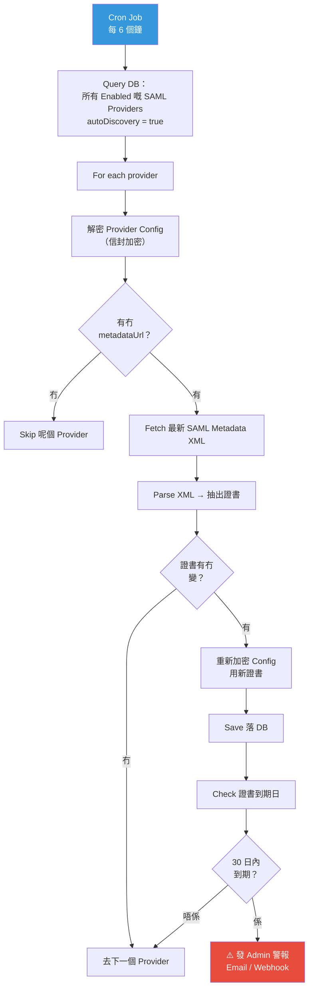

---

## 4. 優雅金鑰輪換：支援多把 Key

喺過渡期間，IdP 可能用舊金鑰或者新金鑰簽 Token。我哋個 App 必須兩把都 Accept。

### Mermaid 圖解：多金鑰驗證策略

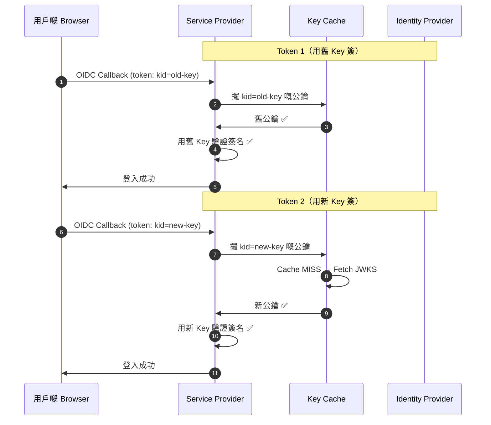

關鍵在於：靠 JWT Header 入面嘅 `kid`（Key ID），我哋永遠會搵到 *正確嘅* Key 嚟驗證。只要 JWKS endpoint 喺過渡期同時包含兩把 Key，新舊 Token 都可以無縫運作。

---

## 5. SP 證書管理（我哋自己嘅簽名金鑰）

SAML 入面，我哋仲要管自己嘅簽名證書（用嚟簽 AuthnRequests 同解密 Assertions）。佢哋都有同樣嘅過期問題。

### Mermaid 圖解：SP 證書輪換流程

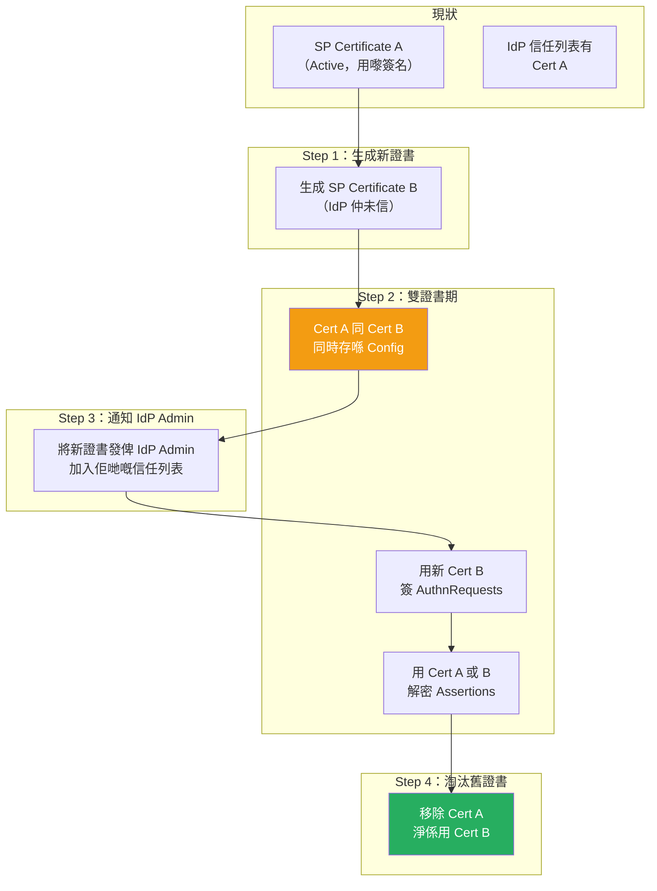

### Code 實作：SP 金鑰對管理

```typescript
// src/sso/services/sp-key-management.service.ts
import { Injectable, Logger } from '@nestjs/common';
import * as crypto from 'crypto';
import { IdpSecretManagerService } from './idp-secret-manager.service';

export interface SpKeyPair {
  certificate: string;    // X.509 證書 (PEM)
  privateKey: string;     // 私鑰 (PEM)
  fingerprint: string;    // SHA-256 指紋用嚟識別
  createdAt: Date;
  expiresAt: Date;
}

@Injectable()
export class SpKeyManagementService {
  private readonly logger = new Logger(SpKeyManagementService.name);

  constructor(private readonly secretManager: IdpSecretManagerService) {}

  /**
   * 為一個 Provider 生成新嘅 SP 簽名金鑰對。
   */
  async generateNewKeyPair(providerId: string): Promise<SpKeyPair> {
    // Production 環境用正經嘅 X.509 證書生成 Library
    // 呢度只係簡化示意
    const { publicKey, privateKey } = crypto.generateKeyPairSync('rsa', {
      modulusLength: 2048,
      publicKeyEncoding: { type: 'spki', format: 'pem' },
      privateKeyEncoding: { type: 'pkcs8', format: 'pem' },
    });

    const fingerprint = crypto
      .createHash('sha256')
      .update(publicKey)
      .digest('hex');

    const now = new Date();
    const expiresAt = new Date(now);
    expiresAt.setFullYear(expiresAt.getFullYear() + 2); // 有效期 2 年

    const keyPair: SpKeyPair = {
      certificate: publicKey,
      privateKey,
      fingerprint,
      createdAt: now,
      expiresAt,
    };

    this.logger.log(`為 Provider ${providerId} 生成咗新 SP 金鑰對：${fingerprint}`);
    return keyPair;
  }

  /**
   * 載入一個 Provider 嘅 Active 金鑰對（Runtime 解密）。
   */
  async getActiveKeyPair(providerId: string): Promise<SpKeyPair> {
    const config = await this.secretManager.decryptProviderConfigById(providerId);
    return config.spKeyPairs?.find((kp: SpKeyPair) => new Date(kp.expiresAt) > new Date());
  }

  /**
   * Return 所有有效嘅金鑰對（雙證書過渡期用）。
   */
  async getAllValidKeyPairs(providerId: string): Promise<SpKeyPair[]> {
    const config = await this.secretManager.decryptProviderConfigById(providerId);
    const now = new Date();
    return (config.spKeyPairs || []).filter((kp: SpKeyPair) => new Date(kp.expiresAt) > now);
  }
}
```

---

## 6. 管理員 Dashboard：證書狀態總覽

Admin 需要一個清晰嘅視圖睇到所有 Provider 嘅證書狀態。

### Mermaid 圖解：證書狀態 Dashboard 流程

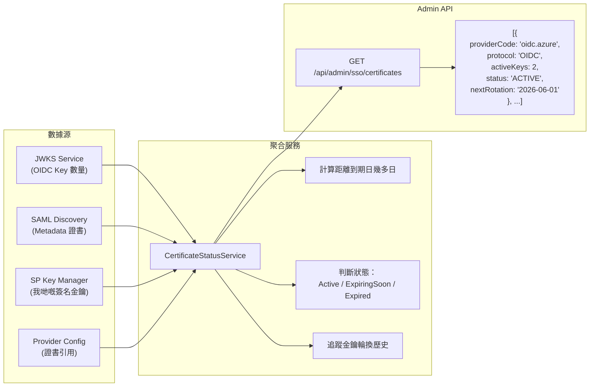

---

## 7. 緊急金鑰撤銷

當一把金鑰被洩漏（例如私鑰外泄），必須立即行動。

### Mermaid 圖解：緊急金鑰撤銷流程

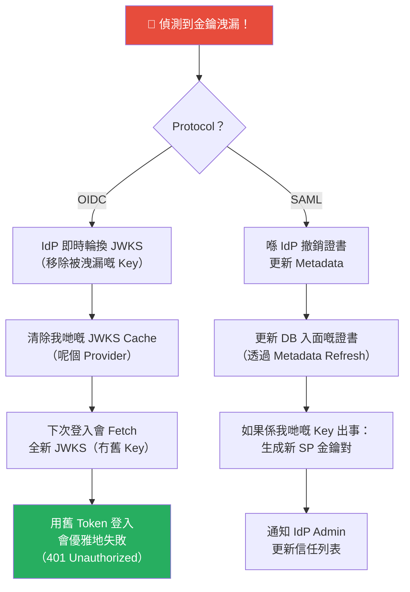

### Code 實作：緊急 Cache 清除

```typescript
// src/sso/services/certificate-refresh.service.ts（新增部份）

  /**
   * 緊急：強制 Refresh 某個 Provider 嘅所有金鑰。
   * 偵測到金鑰洩漏嗰陣用。
   */
  async emergencyKeyRefresh(providerId: string): Promise<void> {
    const provider = await this.idpProviderRepo.findById(providerId);
    if (!provider) return;

    this.logger.warn(`緊急：強制 Refresh Provider ${provider.providerCode} 嘅金鑰`);

    // 1. 清除 JWKS Cache
    this.jwksService.invalidateClient(provider);

    // 2. 如果係 SAML，強制重新 Fetch Metadata
    if (provider.protocolType === 'SAML2') {
      await this.refreshProviderCertificates(provider);
    }

    // 3. 將緊急行動寫入審計日誌
    // this.eventEmitter.emit('security.emergency_key_refresh', {
    //   providerId,
    //   providerCode: provider.providerCode,
    //   triggeredBy: 'admin', // 或 'system'
    //   timestamp: new Date(),
    // });
  }
```

---

## 結語

喺第八集，我哋建立咗一個穩健嘅證書同金鑰管理系統。我哋處理 OIDC JWKS 輪換用 Cache 清除加重試邏輯，管理 SAML 證書更新靠定期 Metadata Polling，支援我哋自己 SP 簽名金鑰嘅雙證書過渡期，仲俾管理員一個清晰嘅證書健康視圖。

最後一塊拼圖就係將呢套嘢 Scale 到支援多個租戶，每個客都有自己嘅 IdP 設定。喺第九集，我哋會探討 **多租戶 SSO（Multi-Tenant SSO）**，每個客戶可以 Config 自己嘅 IdP，同時共享同一套 Application 基礎設施。

<br><br><br>
