## Introduction: One Platform, Many Customers

In Parts 1 through 8, we built a single-tenant SSO system—one application supporting one set of Identity Providers. But real-world SaaS platforms serve dozens or hundreds of enterprise customers, each with their own IdP, their own attribute mappings, and their own security requirements. Customer A uses Entra ID with OIDC, Customer B uses Okta SAML, and Customer C uses a self-hosted Keycloak instance.

The challenge is clear: **how do we isolate each customer's SSO configuration while sharing the same application infrastructure?** A misconfiguration in Customer A's settings must never leak into Customer B's authentication flow.

In Part 9, we will implement `FN/ADM/SSO/009`: **Multi-Tenant SSO Architecture**. We will explore tenant isolation strategies, provider resolution by tenant, cross-tenant attack prevention, and the unique challenges of shared JWKS caching in a multi-tenant environment.

---

## 1. Tenant Isolation Models

There are three common approaches to multi-tenant SSO isolation, each with different trade-offs.

### Mermaid Diagram: Tenant Isolation Models

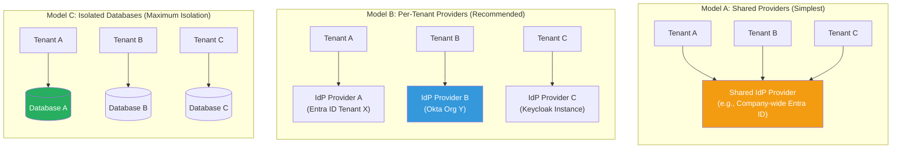
```mermaid
graph TB
    subgraph "Model A: Shared Providers (Simplest)"
        direction TB
        TA1["Tenant A"] --> SHARED["Shared IdP Provider<br/>(e.g., Company-wide Entra ID)"]
        TA2["Tenant B"] --> SHARED
        TA3["Tenant C"] --> SHARED
    end

    subgraph "Model B: Per-Tenant Providers (Recommended)"
        direction TB
        TB1["Tenant A"] --> IDPA["IdP Provider A<br/>(Entra ID Tenant X)"]
        TB2["Tenant B"] --> IDPB["IdP Provider B<br/>(Okta Org Y)"]
        TB3["Tenant C"] --> IDPC["IdP Provider C<br/>(Keycloak Instance)"]
    end

    subgraph "Model C: Isolated Databases (Maximum Isolation)"
        direction TB
        TC1["Tenant A"] --> DBA[(Database A)]
        TC2["Tenant B"] --> DBB[(Database B)]
        TC3["Tenant C"] --> DBC[(Database C)]
    end

    style SHARED fill:#f39c12,color:#fff
    style IDPB fill:#3498db,color:#fff
    style DBA fill:#27ae60,color:#fff
```

| Model | Isolation | Complexity | Cost | Best For |
|---|---|---|---|---|
| **A: Shared Providers** | Low | Low | Low | Internal tools, single org |
| **B: Per-Tenant Providers** | Medium | Medium | Medium | SaaS (most common) |
| **C: Isolated Databases** | High | High | High | Regulated industries |

We will implement **Model B** (Per-Tenant Providers) as it provides the best balance of isolation and operational simplicity.

---

## 2. The Tenant-Provider Relationship

In Model B, each tenant can have multiple IdP providers, but each provider belongs to exactly one tenant. This is a one-to-many relationship.

### Mermaid Diagram: Multi-Tenant Data Model (ER)

```mermaid
erDiagram
    tenants {
        uuid id PK
        string tenant_code UK
        string tenant_name
        string domain UK
        boolean is_active
        enum sso_policy DISABLED_ENABLED_ENFORCED
        timestamp created_at
    }

    idp_providers {
        uuid id PK
        uuid tenant_id FK
        string provider_code UK
        string provider_name
        enum protocol_type
        boolean is_enabled
        text config_encrypted
        text config_dek_wrapped
        jsonb attribute_mappings
        integer display_order
    }

    users {
        uuid id PK
        uuid tenant_id FK
        string username
        string email
        string password_hash
        boolean is_active
        enum role
    }

    user_sso_profiles {
        uuid id PK
        uuid user_id FK
        uuid idp_provider_id FK
        string ext_user_id
        string ext_email
        timestamp last_sso_login_at
    }

    tenants ||--o{ idp_providers : "has many"
    tenants ||--o{ users : "has many"
    idp_providers ||--o{ user_sso_profiles : "linked to"
    users ||--o{ user_sso_profiles : "has many"
```

### Code Implementation: Tenant-Scoped Provider Entity

```typescript
// src/sso/entities/idp-provider.entity.ts (updated)
@Entity('idp_providers')
@Index(['tenantId', 'providerCode'], { unique: true })
export class IdpProvider {
  @PrimaryGeneratedColumn('uuid')
  id: string;

  @Column({ name: 'tenant_id' })
  tenantId: string;

  @ManyToOne(() => Tenant, { onDelete: 'CASCADE' })
  @JoinColumn({ name: 'tenant_id' })
  tenant: Tenant;

  @Column({ length: 100 })
  providerCode: string;

  @Column({ length: 255 })
  providerName: string;

  @Column({ type: 'enum', enum: ProtocolType })
  protocolType: ProtocolType;

  @Column({ default: false })
  isEnabled: boolean;

  // ... rest of fields from Part 2
}
```

---

## 3. Tenant Resolution: How Do We Know Which Tenant?

The most critical question in multi-tenant SSO: when a callback arrives at `/api/v1/sso/callback`, how do we know which tenant (and therefore which IdP configuration) to use?

### Mermaid Diagram: Tenant Resolution Strategies

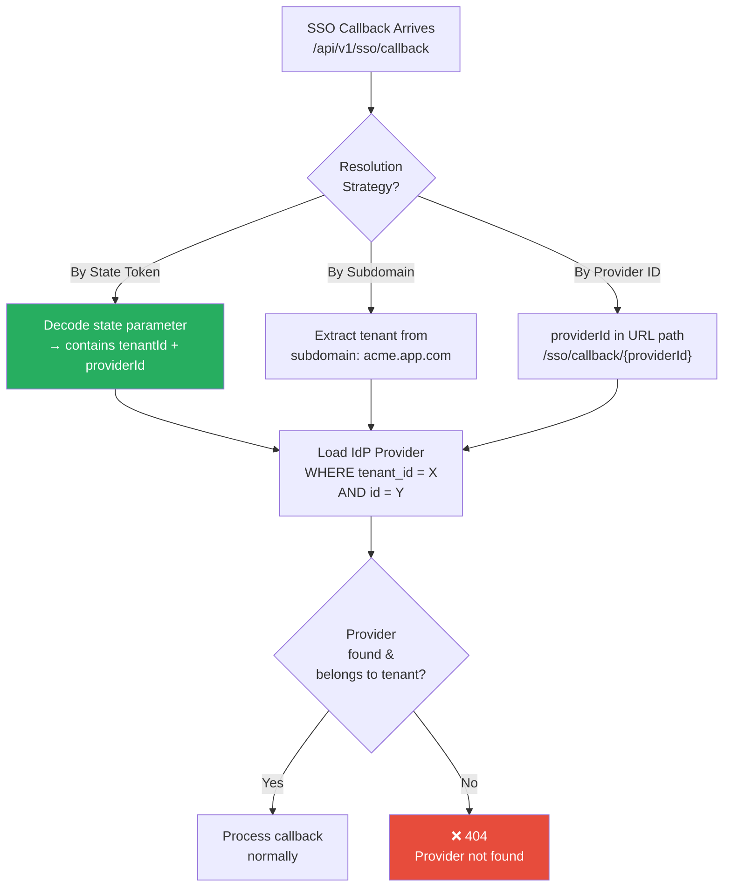
```mermaid
flowchart TD
    CALLBACK["SSO Callback Arrives<br/>/api/v1/sso/callback"] --> STRATEGY{"Resolution<br/>Strategy?"}

    STRATEGY -->|"By State Token"| STATE["Decode state parameter<br/>→ contains tenantId + providerId"]
    STRATEGY -->|"By Subdomain"| SUBDOMAIN["Extract tenant from<br/>subdomain: acme.app.com"]
    STRATEGY -->|"By Provider ID"| PROVIDER["providerId in URL path<br/>/sso/callback/{providerId}"]

    STATE --> LOAD["Load IdP Provider<br/>WHERE tenant_id = X<br/>AND id = Y"]
    SUBDOMAIN --> LOAD
    PROVIDER --> LOAD

    LOAD --> VALIDATE{"Provider<br/>found &<br/>belongs to tenant?"}
    VALIDATE -->|"Yes"| PROCESS["Process callback<br/>normally"]
    VALIDATE -->|"No"| REJECT["❌ 404<br/>Provider not found"]

    style STATE fill:#27ae60,color:#fff
    style REJECT fill:#e74c3c,color:#fff
```

**Recommendation:** Use the **State Token** approach. The `state` parameter we generate during login initiation already contains the providerId. By also including the tenantId, we get both tenant and provider resolution in a single, tamper-proof mechanism.

### Code Implementation: Tenant-Aware State Context

```typescript
// src/sso/services/sso-state.service.ts (updated)
export interface SsoStateContext {
  tenantId: string;        // NEW: Tenant identifier
  providerId: string;
  pkceVerifier?: string;
  nonce?: string;
  redirectUri: string;
}

@Injectable()
export class SsoStateService {
  constructor(private readonly redisClient: Redis) {}

  async createContext(context: SsoStateContext, ttlSeconds: number = 300): Promise<string> {
    const state = crypto.randomBytes(24).toString('hex');
    const cacheKey = `sso_state:${context.tenantId}:${state}`;

    await this.redisClient.set(
      cacheKey,
      JSON.stringify(context),
      'EX',
      ttlSeconds
    );

    return state;
  }

  async validateAndConsumeState(tenantId: string, state: string): Promise<SsoStateContext> {
    const cacheKey = `sso_state:${tenantId}:${state}`;
    const contextJson = await this.redisClient.getdel(cacheKey);

    if (!contextJson) {
      throw new BadRequestException('Invalid or expired SSO state.');
    }

    return JSON.parse(contextJson) as SsoStateContext;
  }
}
```

---

## 4. Tenant-Scoped Provider Resolution

Every service that loads an IdP provider must scope its query to the tenant. This prevents cross-tenant data access.

### Mermaid Diagram: Tenant-Scoped Query Flow

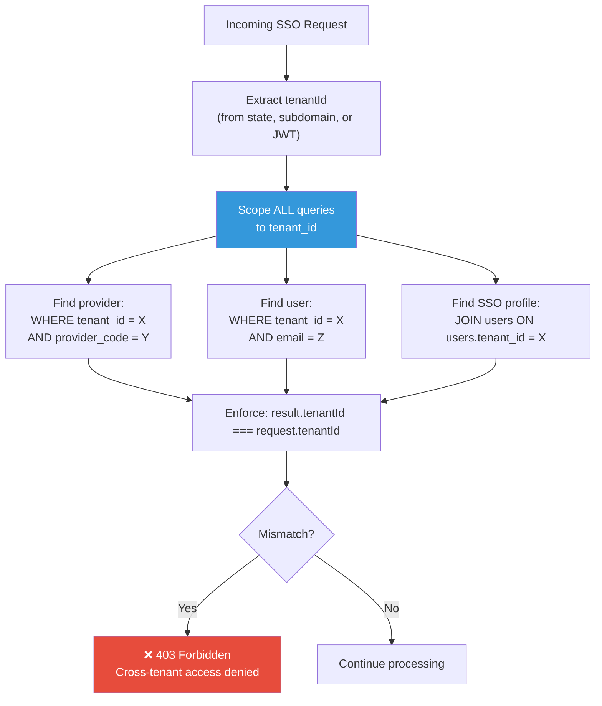
```mermaid
flowchart TD
    REQUEST["Incoming SSO Request"] --> EXTRACT["Extract tenantId<br/>(from state, subdomain, or JWT)"]
    EXTRACT --> SCOPE["Scope ALL queries<br/>to tenant_id"]
    
    SCOPE --> Q1["Find provider:<br/>WHERE tenant_id = X<br/>AND provider_code = Y"]
    SCOPE --> Q2["Find user:<br/>WHERE tenant_id = X<br/>AND email = Z"]
    SCOPE --> Q3["Find SSO profile:<br/>JOIN users ON users.tenant_id = X"]

    Q1 & Q2 & Q3 --> ENFORCE["Enforce: result.tenantId === request.tenantId"]
    ENFORCE --> MISMATCH{"Mismatch?"}
    MISMATCH -->|"Yes"| REJECT["❌ 403 Forbidden<br/>Cross-tenant access denied"]
    MISMATCH -->|"No"| ALLOW["Continue processing"]

    style SCOPE fill:#3498db,color:#fff
    style REJECT fill:#e74c3c,color:#fff
```

### Code Implementation: Tenant-Scoped Repository

```typescript
// src/sso/repositories/idp-provider.repository.ts
import { Injectable } from '@nestjs/common';
import { Repository } from 'typeorm';
import { IdpProvider } from '../entities/idp-provider.entity';

@Injectable()
export class IdpProviderRepository {
  constructor(private readonly repo: Repository<IdpProvider>) {}

  /**
   * Find a provider scoped to a specific tenant.
   * NEVER call this without tenantId.
   */
  async findByCode(tenantId: string, providerCode: string): Promise<IdpProvider | null> {
    return this.repo.findOne({
      where: {
        tenantId,
        providerCode,
        isEnabled: true,
      },
    });
  }

  async findById(tenantId: string, providerId: string): Promise<IdpProvider | null> {
    return this.repo.findOne({
      where: {
        id: providerId,
        tenantId,  // CRITICAL: Always scope to tenant
        isEnabled: true,
      },
    });
  }

  async findAllForTenant(tenantId: string): Promise<IdpProvider[]> {
    return this.repo.find({
      where: { tenantId, isEnabled: true },
      order: { displayOrder: 'ASC' },
    });
  }
}
```

---

## 5. Tenant-Specific Encryption Keys

In a multi-tenant environment, each tenant's IdP secrets should be encrypted with tenant-scoped keys. This ensures that a compromise of one tenant's KEK doesn't expose another tenant's secrets.

### Mermaid Diagram: Tenant-Scoped Envelope Encryption

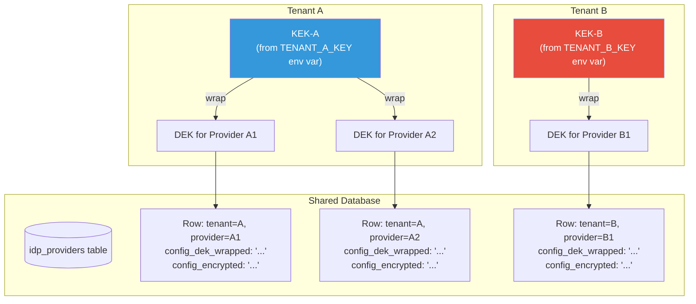
```mermaid
graph TB
    subgraph "Tenant A"
        KEK_A["KEK-A<br/>(from TENANT_A_KEY env var)"]
        DEK_A1["DEK for Provider A1"]
        DEK_A2["DEK for Provider A2"]
        KEK_A -->|"wrap"| DEK_A1
        KEK_A -->|"wrap"| DEK_A2
    end

    subgraph "Tenant B"
        KEK_B["KEK-B<br/>(from TENANT_B_KEY env var)"]
        DEK_B1["DEK for Provider B1"]
        KEK_B -->|"wrap"| DEK_B1
    end

    subgraph "Shared Database"
        DB[(idp_providers table)]
        DB_ROW_A1["Row: tenant=A, provider=A1<br/>config_dek_wrapped: '...'<br/>config_encrypted: '...'"]
        DB_ROW_A2["Row: tenant=A, provider=A2<br/>config_dek_wrapped: '...'<br/>config_encrypted: '...'"]
        DB_ROW_B1["Row: tenant=B, provider=B1<br/>config_dek_wrapped: '...'<br/>config_encrypted: '...'"]
    end

    DEK_A1 --> DB_ROW_A1
    DEK_A2 --> DB_ROW_A2
    DEK_B1 --> DB_ROW_B1

    style KEK_A fill:#3498db,color:#fff
    style KEK_B fill:#e74c3c,color:#fff
```

### Code Implementation: Tenant-Aware KEK Management

```typescript
// src/core/security/kek-management.service.ts (updated)
@Injectable()
export class KekManagementService {
  private keks = new Map<string, Buffer>(); // tenantId -> KEK

  async initializeTenantKek(tenantId: string): Promise<void> {
    const envKey = process.env[`SSO_KEK_${tenantId.toUpperCase()}`];
    if (!envKey) {
      throw new Error(`KEK environment variable not found for tenant: ${tenantId}`);
    }

    const saltPath = path.join(this.configService.get('SALT_DIR'), `sso-${tenantId}.salt`);
    const salt = fs.readFileSync(saltPath);

    const kek = crypto.hkdfSync('sha256', Buffer.from(envKey), salt, 'sso-kek', 32);
    this.keks.set(tenantId, Buffer.from(kek));
  }

  getActiveKek(tenantId: string): Buffer | undefined {
    return this.keks.get(tenantId);
  }
}
```

---

## 6. Preventing Cross-Tenant Attacks

In a multi-tenant system, attackers might try to use a valid token from Tenant A to authenticate against Tenant B.

### Mermaid Diagram: Cross-Tenant Attack Prevention

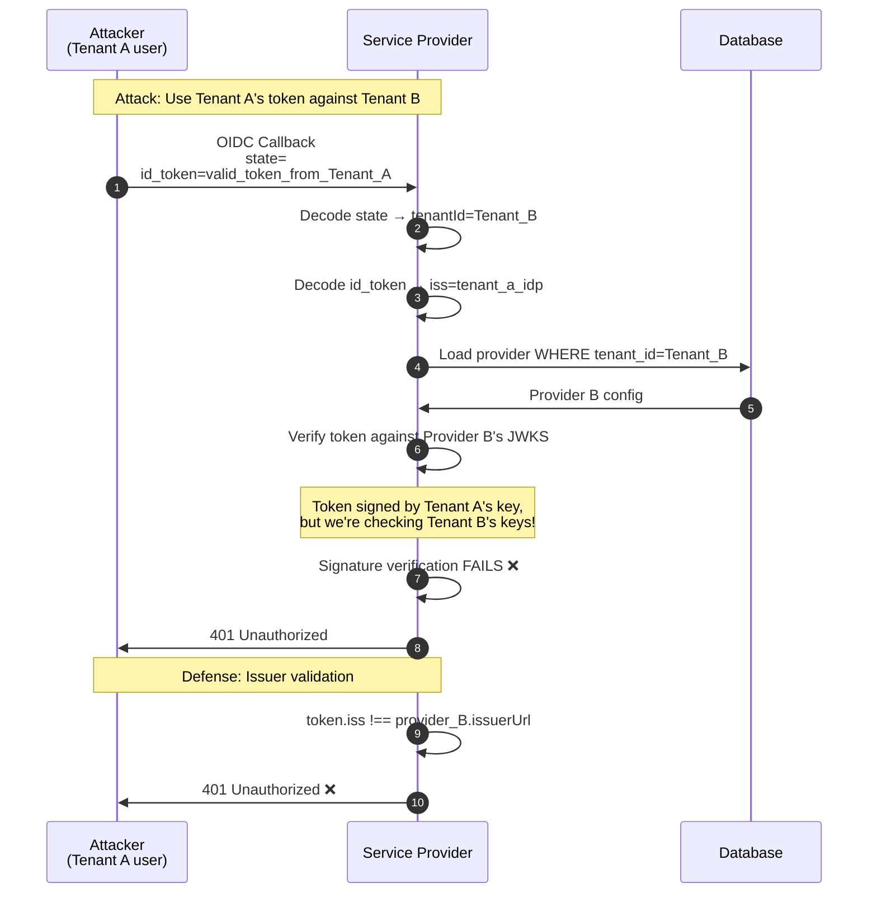
```mermaid
sequenceDiagram
    autonumber
    participant Attacker as Attacker<br/>(Tenant A user)
    participant SP as Service Provider
    participant DB as Database

    Note over Attacker,SP: Attack: Use Tenant A's token against Tenant B
    Attacker->>SP: OIDC Callback<br/>state=<br/>id_token=valid_token_from_Tenant_A

    SP->>SP: Decode state → tenantId=Tenant_B
    SP->>SP: Decode id_token → iss=tenant_a_idp
    SP->>DB: Load provider WHERE tenant_id=Tenant_B
    DB->>SP: Provider B config

    SP->>SP: Verify token against Provider B's JWKS
    Note over SP: Token signed by Tenant A's key,<br/>but we're checking Tenant B's keys!
    SP->>SP: Signature verification FAILS ❌

    SP->>Attacker: 401 Unauthorized

    Note over Attacker,SP: Defense: Issuer validation
    SP->>SP: token.iss !== provider_B.issuerUrl
    SP->>Attacker: 401 Unauthorized ❌
```

### Code Implementation: Cross-Tenant Validation

```typescript
// src/sso/strategies/oidc.strategy.ts (updated for multi-tenant)

  async processCallback(
    providerConfig: IdpProviderConfig,
    payload: any,
    storedState: SsoStateContext,
  ): Promise<any> {
    // ... existing token extraction and JWKS fetch ...

    // CRITICAL: Validate issuer matches THIS tenant's provider
    const verifiedPayload = jwt.verify(idToken, publicKey, {
      algorithms: ['RS256'],
      issuer: providerConfig.issuerUrl,  // Must match this specific provider's issuer
      audience: providerConfig.clientId,  // Must match this specific provider's client ID
      maxAge: '5m',
      clockTolerance: 60,
    });

    // DOUBLE CHECK: Ensure the state's tenantId matches the provider's tenantId
    if (storedState.tenantId !== providerConfig.tenantId) {
      throw new UnauthorizedException('Tenant mismatch between state and provider.');
    }

    // ... rest of processing ...
  }
```

---

## 7. Tenant-Aware JWKS Caching

In a multi-tenant environment, different tenants might use different IdP instances (even if they're all Entra ID). Each instance has its own JWKS endpoint and keys.

### Mermaid Diagram: Tenant-Scoped JWKS Caching

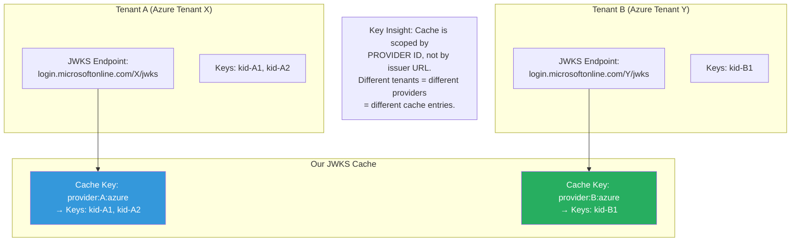
```mermaid
flowchart TD
    subgraph "Tenant A (Azure Tenant X)"
        JWKS_A["JWKS Endpoint:<br/>login.microsoftonline.com/X/jwks"]
        KEYS_A["Keys: kid-A1, kid-A2"]
    end

    subgraph "Tenant B (Azure Tenant Y)"
        JWKS_B["JWKS Endpoint:<br/>login.microsoftonline.com/Y/jwks"]
        KEYS_B["Keys: kid-B1"]
    end

    subgraph "Our JWKS Cache"
        CACHE_A["Cache Key: provider:A:azure<br/>→ Keys: kid-A1, kid-A2"]
        CACHE_B["Cache Key: provider:B:azure<br/>→ Keys: kid-B1"]
    end

    JWKS_A --> CACHE_A
    JWKS_B --> CACHE_B

    Note["Key Insight: Cache is scoped by<br/>PROVIDER ID, not by issuer URL.<br/>Different tenants = different providers<br/>= different cache entries."]

    style CACHE_A fill:#3498db,color:#fff
    style CACHE_B fill:#27ae60,color:#fff
```

Our existing `JwksService` already caches by `provider.id`, which naturally provides tenant isolation. Each provider has a unique UUID, so even if two tenants use the same IdP platform (e.g., both use Entra ID), their JWKS caches are completely separate.

---

## 8. Tenant Admin Permissions

Each tenant's administrators should only be able to configure their own IdP providers—not other tenants'.

### Mermaid Diagram: Tenant Admin Permission Flow

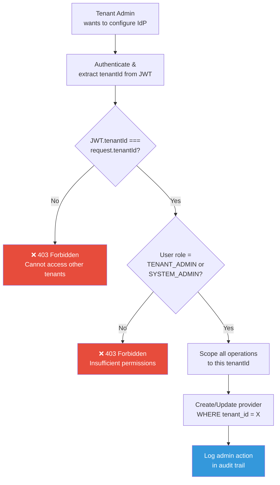
```mermaid
flowchart TD
    ADMIN["Tenant Admin<br/>wants to configure IdP"] --> AUTH["Authenticate &<br/>extract tenantId from JWT"]
    AUTH --> CHECK{"JWT.tenantId ===<br/>request.tenantId?"}
    
    CHECK -->|"No"| REJECT["❌ 403 Forbidden<br/>Cannot access other tenants"]
    CHECK -->|"Yes"| ROLE{"User role =<br/>TENANT_ADMIN or<br/>SYSTEM_ADMIN?"}
    
    ROLE -->|"No"| REJECT_ROLE["❌ 403 Forbidden<br/>Insufficient permissions"]
    ROLE -->|"Yes"| SCOPE["Scope all operations<br/>to this tenantId"]
    
    SCOPE --> CREATE["Create/Update provider<br/>WHERE tenant_id = X"]
    CREATE --> AUDIT["Log admin action<br/>in audit trail"]

    style REJECT fill:#e74c3c,color:#fff
    style REJECT_ROLE fill:#e74c3c,color:#fff
    style AUDIT fill:#3498db,color:#fff
```

### Code Implementation: Tenant-Scoped Admin Guard

```typescript
// src/sso/guards/tenant-admin.guard.ts
import { Injectable, CanActivate, ExecutionContext, ForbiddenException } from '@nestjs/common';

@Injectable()
export class TenantAdminGuard implements CanActivate {
  canActivate(context: ExecutionContext): boolean {
    const request = context.switchToHttp().getRequest();
    const user = request.user; // From JWT
    const tenantId = request.params.tenantId || request.body.tenantId;

    // System admins can access any tenant
    if (user.role === 'SYSTEM_ADMIN') {
      return true;
    }

    // Tenant admins can only access their own tenant
    if (user.role === 'TENANT_ADMIN' && user.tenantId === tenantId) {
      return true;
    }

    throw new ForbiddenException('You do not have permission to manage this tenant\'s SSO configuration.');
  }
}
```

---

## 9. Tenant Onboarding Flow

When a new enterprise customer signs up, we need to provision their tenant and guide them through IdP configuration.

### Mermaid Diagram: Tenant SSO Onboarding Flow

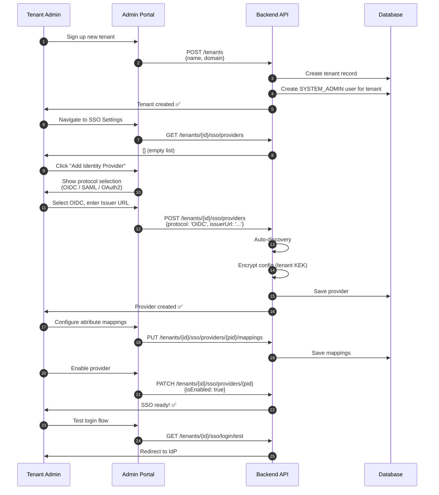
```mermaid
sequenceDiagram
    autonumber
    participant Admin as Tenant Admin
    participant UI as Admin Portal
    participant API as Backend API
    participant DB as Database

    Admin->>UI: Sign up new tenant
    UI->>API: POST /tenants<br/>{name, domain}
    API->>DB: Create tenant record
    API->>DB: Create SYSTEM_ADMIN user for tenant
    API->>Admin: Tenant created ✅

    Admin->>UI: Navigate to SSO Settings
    UI->>API: GET /tenants/{id}/sso/providers
    API->>Admin: [] (empty list)

    Admin->>UI: Click "Add Identity Provider"
    UI->>Admin: Show protocol selection<br/>(OIDC / SAML / OAuth2)

    Admin->>UI: Select OIDC, enter Issuer URL
    UI->>API: POST /tenants/{id}/sso/providers<br/>{protocol: 'OIDC', issuerUrl: '...'}
    API->>API: Auto-discovery
    API->>API: Encrypt config (tenant KEK)
    API->>DB: Save provider
    API->>Admin: Provider created ✅

    Admin->>UI: Configure attribute mappings
    UI->>API: PUT /tenants/{id}/sso/providers/{pid}/mappings
    API->>DB: Save mappings

    Admin->>UI: Enable provider
    UI->>API: PATCH /tenants/{id}/sso/providers/{pid}<br/>{isEnabled: true}
    API->>Admin: SSO ready! ✅

    Admin->>UI: Test login flow
    UI->>API: GET /tenants/{id}/sso/login/test
    API->>Admin: Redirect to IdP
```

---

## 10. Multi-Tenant Logout Challenges

Back-Channel Logout (Part 7) becomes more complex in multi-tenant: the IdP sends a logout request to a shared endpoint, but we need to identify which tenant the session belongs to.

### Mermaid Diagram: Multi-Tenant BCL Resolution

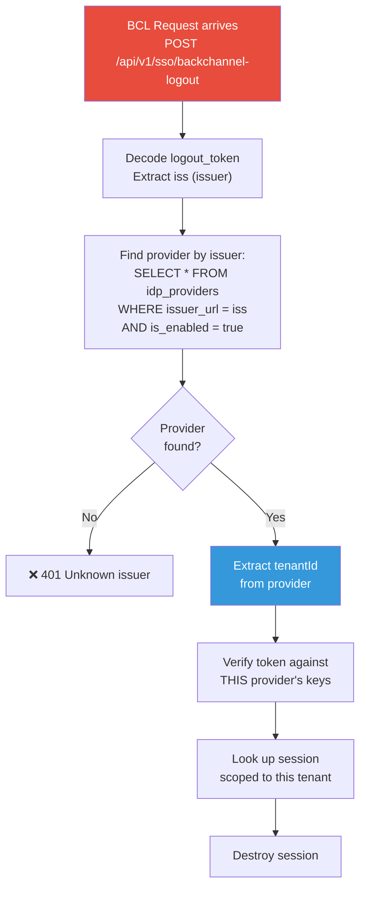
```mermaid
flowchart TD
    BCL["BCL Request arrives<br/>POST /api/v1/sso/backchannel-logout"] --> DECODE["Decode logout_token<br/>Extract iss (issuer)"]
    
    DECODE --> FIND["Find provider by issuer:<br/>SELECT * FROM idp_providers<br/>WHERE issuer_url = iss<br/>AND is_enabled = true"]
    
    FIND --> FOUND{"Provider<br/>found?"}
    FOUND -->|"No"| REJECT["❌ 401 Unknown issuer"]
    FOUND -->|"Yes"| TENANT["Extract tenantId<br/>from provider"]
    
    TENANT --> VERIFY["Verify token against<br/>THIS provider's keys"]
    VERIFY --> SESSION["Look up session<br/>scoped to this tenant"]
    SESSION --> DESTROY["Destroy session"]

    style BCL fill:#e74c3c,color:#fff
    style TENANT fill:#3498db,color:#fff
```

**Key Insight:** The `iss` (issuer) claim in the logout token uniquely identifies the IdP, which maps to exactly one provider, which belongs to exactly one tenant. This gives us automatic tenant resolution without any additional parameters.

---

## Conclusion

In Part 9, we have transformed our single-tenant SSO system into a multi-tenant platform. By adding a `tenantId` to every entity, scoping every query, and using tenant-specific encryption keys, we ensure complete isolation between customers. The `state` parameter provides tamper-proof tenant resolution during login flows, and the issuer claim provides automatic tenant resolution during back-channel logout.

The final piece of our SSO journey is visibility. In Part 10, we will build **Audit Logging & Compliance**—tracking every SSO event for security monitoring, incident response, and regulatory compliance (SOC 2, ISO 27001).

<br><br><br>

---

---

## 簡介：一個平台，多個客戶

喺第一到第八集，我哋建立咗一個單租戶嘅 SSO 系統——一個 Application 支援一組 Identity Providers。但現實嘅 SaaS 平台服務緊幾十甚至幾百個企業客戶，每個客都有自己嘅 IdP、自己嘅 Attribute Mappings、自己嘅保安要求。客 A 用 Entra ID 玩 OIDC，客 B 用 Okta SAML，客 C 用一部自己 Host 嘅 Keycloak。

挑戰好明顯：**點樣喺共享同一套 Application 基礎設施嘅同時，隔離每個客戶嘅 SSO 設定？** 客 A 嘅設定出錯，絕對唔可以影響到客 B 嘅認證流程。

喺第九集，我哋會實作 `FN/ADM/SSO/009`：**多租戶 SSO 架構**。我哋會探討租戶隔離策略、按租戶解像 Provider、防禦跨租戶攻擊，同埋喺多租戶環境入面共享 JWKS Cache 嘅獨特挑戰。

---

## 1. 租戶隔離模型

有三種常見嘅多租戶 SSO 隔離方法，各有唔同嘅 Trade-offs。

### Mermaid 圖解：租戶隔離模型

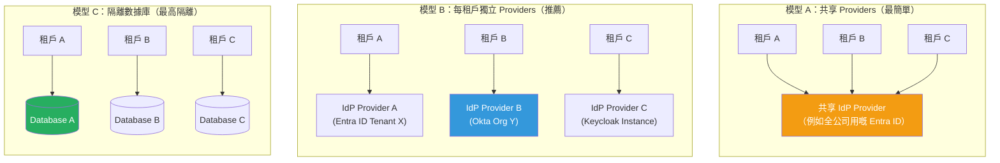
```mermaid
graph TB
    subgraph "模型 A：共享 Providers（最簡單）"
        direction TB
        TA1["租戶 A"] --> SHARED["共享 IdP Provider<br/>（例如全公司用嘅 Entra ID）"]
        TA2["租戶 B"] --> SHARED
        TA3["租戶 C"] --> SHARED
    end

    subgraph "模型 B：每租戶獨立 Providers（推薦）"
        direction TB
        TB1["租戶 A"] --> IDPA["IdP Provider A<br/>(Entra ID Tenant X)"]
        TB2["租戶 B"] --> IDPB["IdP Provider B<br/>(Okta Org Y)"]
        TB3["租戶 C"] --> IDPC["IdP Provider C<br/>(Keycloak Instance)"]
    end

    subgraph "模型 C：隔離數據庫（最高隔離）"
        direction TB
        TC1["租戶 A"] --> DBA[(Database A)]
        TC2["租戶 B"] --> DBB[(Database B)]
        TC3["租戶 C"] --> DBC[(Database C)]
    end

    style SHARED fill:#f39c12,color:#fff
    style IDPB fill:#3498db,color:#fff
    style DBA fill:#27ae60,color:#fff
```

| 模型 | 隔離度 | 複雜度 | 成本 | 最適合 |
|---|---|---|---|---|
| **A：共享 Providers** | 低 | 低 | 低 | 內部工具、單一機構 |
| **B：每租戶獨立 Providers** | 中 | 中 | 中 | SaaS（最常見） |
| **C：隔離數據庫** | 高 | 高 | 高 | 受監管行業 |

我哋會實作 **模型 B**（每租戶獨立 Providers），因為佢喺隔離度同營運簡便性之間取得最佳平衡。

---

## 2. 租戶-Provider 關係

喺模型 B 入面，每個租戶可以有多個 IdP Providers，但每個 Provider 只屬於一個租戶。呢個係一對多嘅關係。

### Mermaid 圖解：多租戶數據模型（ER 圖）

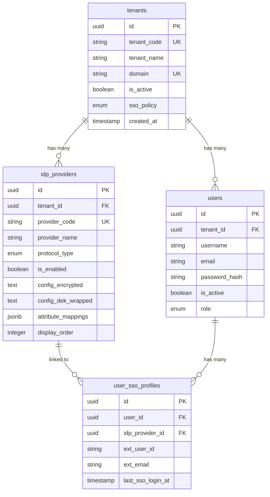
```mermaid
erDiagram
    tenants {
        uuid id PK
        string tenant_code UK
        string tenant_name
        string domain UK
        boolean is_active
        enum sso_policy
        timestamp created_at
    }

    idp_providers {
        uuid id PK
        uuid tenant_id FK
        string provider_code UK
        string provider_name
        enum protocol_type
        boolean is_enabled
        text config_encrypted
        text config_dek_wrapped
        jsonb attribute_mappings
        integer display_order
    }

    users {
        uuid id PK
        uuid tenant_id FK
        string username
        string email
        string password_hash
        boolean is_active
        enum role
    }

    user_sso_profiles {
        uuid id PK
        uuid user_id FK
        uuid idp_provider_id FK
        string ext_user_id
        string ext_email
        timestamp last_sso_login_at
    }

    tenants ||--o{ idp_providers : "has many"
    tenants ||--o{ users : "has many"
    idp_providers ||--o{ user_sso_profiles : "linked to"
    users ||--o{ user_sso_profiles : "has many"
```

### Code 實作：租戶作用域嘅 Provider Entity

```typescript
// src/sso/entities/idp-provider.entity.ts（更新版）
@Entity('idp_providers')
@Index(['tenantId', 'providerCode'], { unique: true })
export class IdpProvider {
  @PrimaryGeneratedColumn('uuid')
  id: string;

  @Column({ name: 'tenant_id' })
  tenantId: string;

  @ManyToOne(() => Tenant, { onDelete: 'CASCADE' })
  @JoinColumn({ name: 'tenant_id' })
  tenant: Tenant;

  @Column({ length: 100 })
  providerCode: string;

  @Column({ length: 255 })
  providerName: string;

  @Column({ type: 'enum', enum: ProtocolType })
  protocolType: ProtocolType;

  @Column({ default: false })
  isEnabled: boolean;

  // ... 第二集嘅其他 Fields
}
```

---

## 3. 租戶解像：點樣知道係邊個租戶？

多租戶 SSO 最關鍵嘅問題：當一個 Callback 到達 `/api/v1/sso/callback`，我哋點知係邊個租戶（因此用邊個 IdP 設定）？

### Mermaid 圖解：租戶解像策略

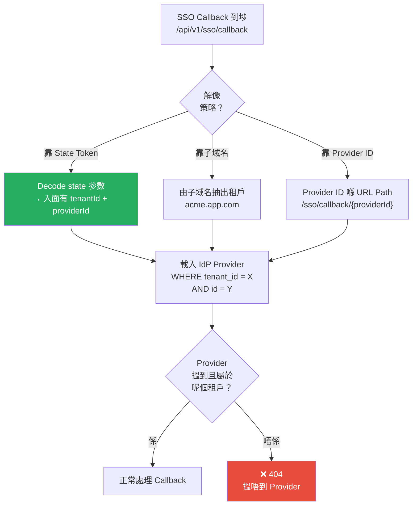
```mermaid
flowchart TD
    CALLBACK["SSO Callback 到埗<br/>/api/v1/sso/callback"] --> STRATEGY{"解像<br/>策略？"}

    STRATEGY -->|"靠 State Token"| STATE["Decode state 參數<br/>→ 入面有 tenantId + providerId"]
    STRATEGY -->|"靠子域名"| SUBDOMAIN["由子域名抽出租戶<br/>acme.app.com"]
    STRATEGY -->|"靠 Provider ID"| PROVIDER["Provider ID 喺 URL Path<br/>/sso/callback/{providerId}"]

    STATE --> LOAD["載入 IdP Provider<br/>WHERE tenant_id = X<br/>AND id = Y"]
    SUBDOMAIN --> LOAD
    PROVIDER --> LOAD

    LOAD --> VALIDATE{"Provider<br/>搵到且屬於<br/>呢個租戶？"}
    VALIDATE -->|"係"| PROCESS["正常處理 Callback"]
    VALIDATE -->|"唔係"| REJECT["❌ 404<br/>搵唔到 Provider"]

    style STATE fill:#27ae60,color:#fff
    style REJECT fill:#e74c3c,color:#fff
```

**建議：** 用 **State Token** 方法。我哋喺登入 Initiation 嗰陣 Generate 嘅 `state` 參數已經有 providerId。只要再加入 tenantId，我哋就可以透過一個防篡改嘅機制，一次過搞掂租戶同 Provider 嘅解像。

### Code 實作：租戶感知嘅 State Context

```typescript
// src/sso/services/sso-state.service.ts（更新版）
export interface SsoStateContext {
  tenantId: string;        // 新增：租戶識別符
  providerId: string;
  pkceVerifier?: string;
  nonce?: string;
  redirectUri: string;
}

@Injectable()
export class SsoStateService {
  constructor(private readonly redisClient: Redis) {}

  async createContext(context: SsoStateContext, ttlSeconds: number = 300): Promise<string> {
    const state = crypto.randomBytes(24).toString('hex');
    const cacheKey = `sso_state:${context.tenantId}:${state}`;

    await this.redisClient.set(
      cacheKey,
      JSON.stringify(context),
      'EX',
      ttlSeconds
    );

    return state;
  }

  async validateAndConsumeState(tenantId: string, state: string): Promise<SsoStateContext> {
    const cacheKey = `sso_state:${tenantId}:${state}`;
    const contextJson = await this.redisClient.getdel(cacheKey);

    if (!contextJson) {
      throw new BadRequestException('無效或過期嘅 SSO State。');
    }

    return JSON.parse(contextJson) as SsoStateContext;
  }
}
```

---

## 4. 租戶作用域嘅 Provider 解像

每個載入 IdP Provider 嘅 Service 都必須將 Query 限定喺租戶範圍內。咁先可以防止跨租戶嘅數據訪問。

### Mermaid 圖解：租戶作用域 Query 流程

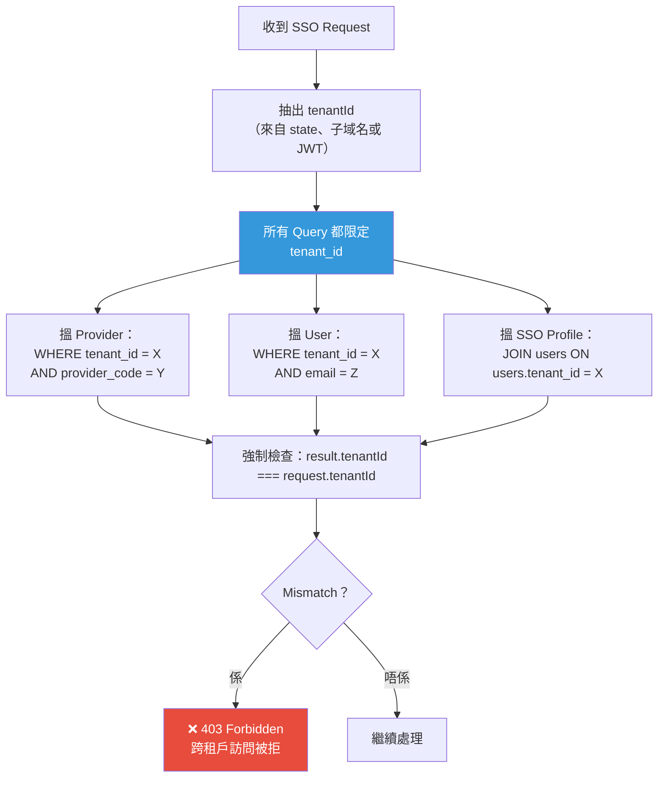
```mermaid
flowchart TD
    REQUEST["收到 SSO Request"] --> EXTRACT["抽出 tenantId<br/>（來自 state、子域名或 JWT）"]
    EXTRACT --> SCOPE["所有 Query 都限定<br/>tenant_id"]
    
    SCOPE --> Q1["搵 Provider：<br/>WHERE tenant_id = X<br/>AND provider_code = Y"]
    SCOPE --> Q2["搵 User：<br/>WHERE tenant_id = X<br/>AND email = Z"]
    SCOPE --> Q3["搵 SSO Profile：<br/>JOIN users ON users.tenant_id = X"]

    Q1 & Q2 & Q3 --> ENFORCE["強制檢查：result.tenantId === request.tenantId"]
    ENFORCE --> MISMATCH{"Mismatch？"}
    MISMATCH -->|"係"| REJECT["❌ 403 Forbidden<br/>跨租戶訪問被拒"]
    MISMATCH -->|"唔係"| ALLOW["繼續處理"]

    style SCOPE fill:#3498db,color:#fff
    style REJECT fill:#e74c3c,color:#fff
```

### Code 實作：租戶作用域嘅 Repository

```typescript
// src/sso/repositories/idp-provider.repository.ts
import { Injectable } from '@nestjs/common';
import { Repository } from 'typeorm';
import { IdpProvider } from '../entities/idp-provider.entity';

@Injectable()
export class IdpProviderRepository {
  constructor(private readonly repo: Repository<IdpProvider>) {}

  /**
   * 搵一個限定喺特定租戶嘅 Provider。
   * 絕對唔可以唔帶 tenantId 就 Call。
   */
  async findByCode(tenantId: string, providerCode: string): Promise<IdpProvider | null> {
    return this.repo.findOne({
      where: {
        tenantId,
        providerCode,
        isEnabled: true,
      },
    });
  }

  async findById(tenantId: string, providerId: string): Promise<IdpProvider | null> {
    return this.repo.findOne({
      where: {
        id: providerId,
        tenantId,  // 極度重要：永遠限定租戶
        isEnabled: true,
      },
    });
  }

  async findAllForTenant(tenantId: string): Promise<IdpProvider[]> {
    return this.repo.find({
      where: { tenantId, isEnabled: true },
      order: { displayOrder: 'ASC' },
    });
  }
}
```

---

## 5. 租戶專屬加密金鑰

喺多租戶環境入面，每個租戶嘅 IdP Secrets 應該用租戶作用域嘅金鑰加密。咁可以確保一個租戶嘅 KEK 出事，唔會連累到其他租戶嘅 Secrets。

### Mermaid 圖解：租戶作用域信封加密


```mermaid
graph TB
    subgraph "租戶 A"
        KEK_A["KEK-A<br/>（來自 TENANT_A_KEY 環境變數）"]
        DEK_A1["Provider A1 嘅 DEK"]
        DEK_A2["Provider A2 嘅 DEK"]
        KEK_A -->|"wrap"| DEK_A1
        KEK_A -->|"wrap"| DEK_A2
    end

    subgraph "租戶 B"
        KEK_B["KEK-B<br/>（來自 TENANT_B_KEY 環境變數）"]
        DEK_B1["Provider B1 嘅 DEK"]
        KEK_B -->|"wrap"| DEK_B1
    end

    subgraph "共享 Database"
        DB[(idp_providers table)]
        DB_ROW_A1["Row: tenant=A, provider=A1<br/>config_dek_wrapped: '...'<br/>config_encrypted: '...'"]
        DB_ROW_A2["Row: tenant=A, provider=A2<br/>config_dek_wrapped: '...'<br/>config_encrypted: '...'"]
        DB_ROW_B1["Row: tenant=B, provider=B1<br/>config_dek_wrapped: '...'<br/>config_encrypted: '...'"]
    end

    DEK_A1 --> DB_ROW_A1
    DEK_A2 --> DB_ROW_A2
    DEK_B1 --> DB_ROW_B1

    style KEK_A fill:#3498db,color:#fff
    style KEK_B fill:#e74c3c,color:#fff
```

### Code 實作：租戶感知嘅 KEK 管理

```typescript
// src/core/security/kek-management.service.ts（更新版）
@Injectable()
export class KekManagementService {
  private keks = new Map<string, Buffer>(); // tenantId -> KEK

  async initializeTenantKek(tenantId: string): Promise<void> {
    const envKey = process.env[`SSO_KEK_${tenantId.toUpperCase()}`];
    if (!envKey) {
      throw new Error(`搵唔到租戶 ${tenantId} 嘅 KEK 環境變數`);
    }

    const saltPath = path.join(this.configService.get('SALT_DIR'), `sso-${tenantId}.salt`);
    const salt = fs.readFileSync(saltPath);

    const kek = crypto.hkdfSync('sha256', Buffer.from(envKey), salt, 'sso-kek', 32);
    this.keks.set(tenantId, Buffer.from(kek));
  }

  getActiveKek(tenantId: string): Buffer | undefined {
    return this.keks.get(tenantId);
  }
}
```

---

## 6. 防禦跨租戶攻擊

喺多租戶系統入面，黑客可能會試圖用租戶 A 嘅有效 Token 去認證租戶 B。

### Mermaid 圖解：跨租戶攻擊防禦

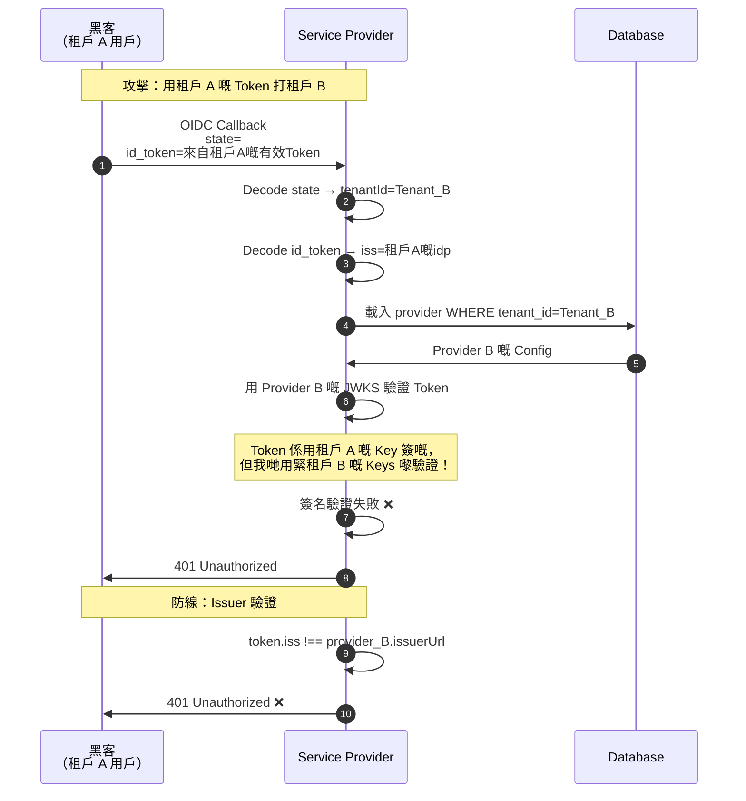
```mermaid
sequenceDiagram
    autonumber
    participant Attacker as 黑客<br/>（租戶 A 用戶）
    participant SP as Service Provider
    participant DB as Database

    Note over Attacker,SP: 攻擊：用租戶 A 嘅 Token 打租戶 B
    Attacker->>SP: OIDC Callback<br/>state=<br/>id_token=來自租戶A嘅有效Token

    SP->>SP: Decode state → tenantId=Tenant_B
    SP->>SP: Decode id_token → iss=租戶A嘅idp
    SP->>DB: 載入 provider WHERE tenant_id=Tenant_B
    DB->>SP: Provider B 嘅 Config

    SP->>SP: 用 Provider B 嘅 JWKS 驗證 Token
    Note over SP: Token 係用租戶 A 嘅 Key 簽嘅，<br/>但我哋用緊租戶 B 嘅 Keys 嚟驗證！
    SP->>SP: 簽名驗證失敗 ❌

    SP->>Attacker: 401 Unauthorized

    Note over Attacker,SP: 防線：Issuer 驗證
    SP->>SP: token.iss !== provider_B.issuerUrl
    SP->>Attacker: 401 Unauthorized ❌
```

### Code 實作：跨租戶驗證

```typescript
// src/sso/strategies/oidc.strategy.ts（多租戶更新版）

  async processCallback(
    providerConfig: IdpProviderConfig,
    payload: any,
    storedState: SsoStateContext,
  ): Promise<any> {
    // ... 現有嘅 Token 抽取同 JWKS Fetch ...

    // 極度重要：驗證 Issuer match 呢個租戶嘅 Provider
    const verifiedPayload = jwt.verify(idToken, publicKey, {
      algorithms: ['RS256'],
      issuer: providerConfig.issuerUrl,  // 必須 match 呢個特定 Provider 嘅 Issuer
      audience: providerConfig.clientId,  // 必須 match 呢個特定 Provider 嘅 Client ID
      maxAge: '5m',
      clockTolerance: 60,
    });

    // 雙重檢查：確保 State 嘅 tenantId match Provider 嘅 tenantId
    if (storedState.tenantId !== providerConfig.tenantId) {
      throw new UnauthorizedException('State 同 Provider 之間嘅 Tenant 唔 Match。');
    }

    // ... 繼續處理 ...
  }
```

---

## 7. 租戶感知嘅 JWKS Caching

喺多租戶環境入面，唔同租戶可能用唔同嘅 IdP Instances（就算全部都係 Entra ID）。每個 Instance 有自己嘅 JWKS endpoint 同 Keys。

### Mermaid 圖解：租戶作用域 JWKS Caching

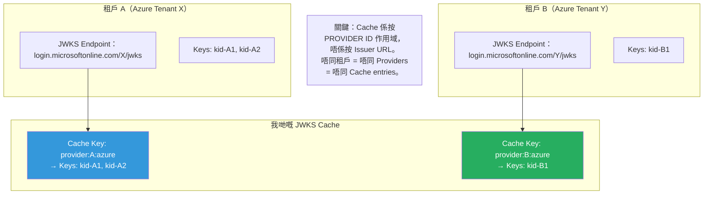
```mermaid
flowchart TD
    subgraph "租戶 A（Azure Tenant X）"
        JWKS_A["JWKS Endpoint：<br/>login.microsoftonline.com/X/jwks"]
        KEYS_A["Keys: kid-A1, kid-A2"]
    end

    subgraph "租戶 B（Azure Tenant Y）"
        JWKS_B["JWKS Endpoint：<br/>login.microsoftonline.com/Y/jwks"]
        KEYS_B["Keys: kid-B1"]
    end

    subgraph "我哋嘅 JWKS Cache"
        CACHE_A["Cache Key: provider:A:azure<br/>→ Keys: kid-A1, kid-A2"]
        CACHE_B["Cache Key: provider:B:azure<br/>→ Keys: kid-B1"]
    end

    JWKS_A --> CACHE_A
    JWKS_B --> CACHE_B

    Note["關鍵：Cache 係按<br/>PROVIDER ID 作用域，<br/>唔係按 Issuer URL。<br/>唔同租戶 = 唔同 Providers<br/>= 唔同 Cache entries。"]

    style CACHE_A fill:#3498db,color:#fff
    style CACHE_B fill:#27ae60,color:#fff
```

我哋現有嘅 `JwksService` 已經按 `provider.id` 做 Cache，自然就提供咗租戶隔離。每個 Provider 有一個獨特嘅 UUID，所以就算兩個租戶用同一個 IdP 平台（例如都係 Entra ID），佢哋嘅 JWKS Cache 都係完全分開嘅。

---

## 8. 租戶管理員權限

每個租戶嘅管理員應該只能 Config 自己嘅 IdP Providers——唔係其他租戶嘅。

### Mermaid 圖解：租戶管理員權限流程

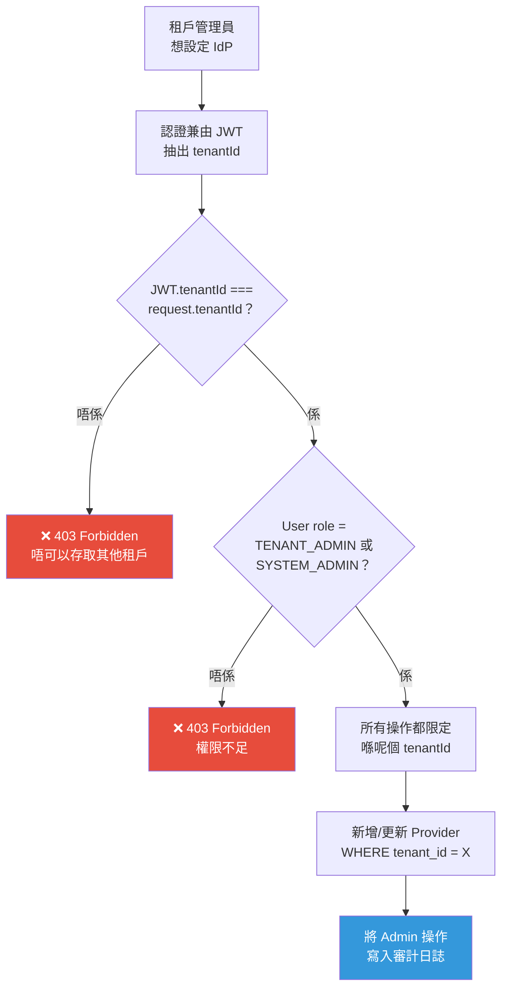
```mermaid
flowchart TD
    ADMIN["租戶管理員<br/>想設定 IdP"] --> AUTH["認證兼由 JWT<br/>抽出 tenantId"]
    AUTH --> CHECK{"JWT.tenantId ===<br/>request.tenantId？"}
    
    CHECK -->|"唔係"| REJECT["❌ 403 Forbidden<br/>唔可以存取其他租戶"]
    CHECK -->|"係"| ROLE{"User role =<br/>TENANT_ADMIN 或<br/>SYSTEM_ADMIN？"}
    
    ROLE -->|"唔係"| REJECT_ROLE["❌ 403 Forbidden<br/>權限不足"]
    ROLE -->|"係"| SCOPE["所有操作都限定<br/>喺呢個 tenantId"]
    
    SCOPE --> CREATE["新增/更新 Provider<br/>WHERE tenant_id = X"]
    CREATE --> AUDIT["將 Admin 操作<br/>寫入審計日誌"]

    style REJECT fill:#e74c3c,color:#fff
    style REJECT_ROLE fill:#e74c3c,color:#fff
    style AUDIT fill:#3498db,color:#fff
```

### Code 實作：租戶作用域嘅 Admin Guard

```typescript
// src/sso/guards/tenant-admin.guard.ts
import { Injectable, CanActivate, ExecutionContext, ForbiddenException } from '@nestjs/common';

@Injectable()
export class TenantAdminGuard implements CanActivate {
  canActivate(context: ExecutionContext): boolean {
    const request = context.switchToHttp().getRequest();
    const user = request.user; // 由 JWT 攞
    const tenantId = request.params.tenantId || request.body.tenantId;

    // System Admin 可以存取任何租戶
    if (user.role === 'SYSTEM_ADMIN') {
      return true;
    }

    // Tenant Admin 只可以存取自己嘅租戶
    if (user.role === 'TENANT_ADMIN' && user.tenantId === tenantId) {
      return true;
    }

    throw new ForbiddenException('你冇權限管理呢個租戶嘅 SSO 設定。');
  }
}
```

---

## 9. 租戶入門流程

當一個新企業客戶 Sign up，我哋需要開通佢哋嘅租戶同引導佢哋設定 IdP。

### Mermaid 圖解：租戶 SSO 入門流程

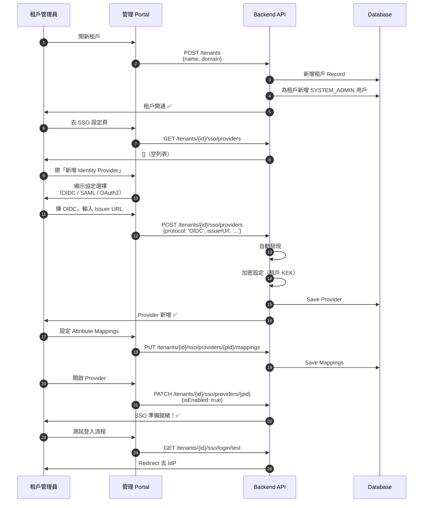
```mermaid
sequenceDiagram
    autonumber
    participant Admin as 租戶管理員
    participant UI as 管理 Portal
    participant API as Backend API
    participant DB as Database

    Admin->>UI: 開新租戶
    UI->>API: POST /tenants<br/>{name, domain}
    API->>DB: 新增租戶 Record
    API->>DB: 為租戶新增 SYSTEM_ADMIN 用戶
    API->>Admin: 租戶開通 ✅

    Admin->>UI: 去 SSO 設定頁
    UI->>API: GET /tenants/{id}/sso/providers
    API->>Admin: []（空列表）

    Admin->>UI: 撳「新增 Identity Provider」
    UI->>Admin: 顯示協定選擇<br/>（OIDC / SAML / OAuth2）

    Admin->>UI: 揀 OIDC，輸入 Issuer URL
    UI->>API: POST /tenants/{id}/sso/providers<br/>{protocol: 'OIDC', issuerUrl: '...'}
    API->>API: 自動發現
    API->>API: 加密設定（租戶 KEK）
    API->>DB: Save Provider
    API->>Admin: Provider 新增 ✅

    Admin->>UI: 設定 Attribute Mappings
    UI->>API: PUT /tenants/{id}/sso/providers/{pid}/mappings
    API->>DB: Save Mappings

    Admin->>UI: 開啟 Provider
    UI->>API: PATCH /tenants/{id}/sso/providers/{pid}<br/>{isEnabled: true}
    API->>Admin: SSO 準備就緒！✅

    Admin->>UI: 測試登入流程
    UI->>API: GET /tenants/{id}/sso/login/test
    API->>Admin: Redirect 去 IdP
```

---

## 10. 多租戶登出挑戰

Back-Channel Logout（第七集）喺多租戶環境入面變得更複雜：IdP 發一個 Logout Request 去一個共享嘅 Endpoint，但我哋需要知道係邊個租戶嘅 Session。

### Mermaid 圖解：多租戶 BCL 解像

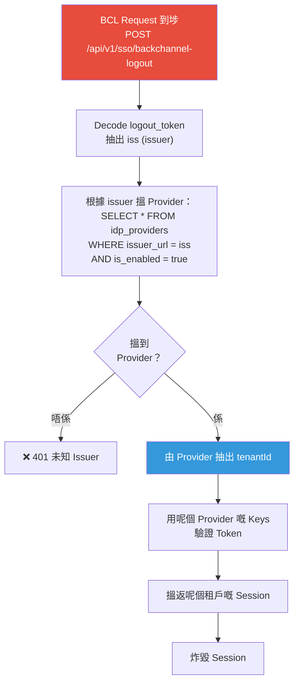
```mermaid
flowchart TD
    BCL["BCL Request 到埗<br/>POST /api/v1/sso/backchannel-logout"] --> DECODE["Decode logout_token<br/>抽出 iss (issuer)"]
    
    DECODE --> FIND["根據 issuer 搵 Provider：<br/>SELECT * FROM idp_providers<br/>WHERE issuer_url = iss<br/>AND is_enabled = true"]
    
    FIND --> FOUND{"搵到<br/>Provider？"}
    FOUND -->|"唔係"| REJECT["❌ 401 未知 Issuer"]
    FOUND -->|"係"| TENANT["由 Provider 抽出 tenantId"]
    
    TENANT --> VERIFY["用呢個 Provider 嘅 Keys<br/>驗證 Token"]
    VERIFY --> SESSION["搵返呢個租戶嘅 Session"]
    SESSION --> DESTROY["炸毀 Session"]

    style BCL fill:#e74c3c,color:#fff
    style TENANT fill:#3498db,color:#fff
```

**關鍵洞察：** Logout Token 入面嘅 `iss`（Issuer）Claim 獨特地識別咗個 IdP，而佢 Map 到恰好一個 Provider，而呢個 Provider 又屬於恰好一個租戶。咁我哋就自動搞掂咗租戶解像，完全唔使額外嘅 Parameters。

---

## 結語

喺第九集，我哋將單租戶嘅 SSO 系統變身成為一個多租戶平台。透過喺每個 Entity 加 `tenantId`、將每個 Query 限定租戶範圍、同埋用租戶專屬嘅加密金鑰，我哋確保咗客戶之間嘅完全隔離。`state` 參數喺 Login 流程入面提供防篡改嘅租戶解像，而 Issuer Claim 喺 Back-channel Logout 入面提供自動嘅租戶解像。

我哋 SSO 旅程嘅最後一塊拼圖就係可見度。喺第十集，我哋會建立 **審計日誌與合規（Audit Logging & Compliance）**——追蹤每一個 SSO 事件，用於保安監控、事故回應同埋法規遵從（SOC 2、ISO 27001）。

<br><br><br>
