## Introduction: If You Didn't Log It, It Didn't Happen

In enterprise security, an event that isn't logged is an event that never occurred. When a security incident happens—whether it's a compromised account, a suspicious login from an unusual location, or an unauthorized configuration change—the first question investigators ask is: "What happened?" If your system cannot answer that question with precise, timestamped, tamper-proof logs, you are flying blind.

Regulatory frameworks like **SOC 2 Type II**, **ISO 27001**, **HIPAA**, and **GDPR** all mandate comprehensive audit logging for authentication events. Enterprise customers will not sign a contract unless you can prove that every SSO login, logout, configuration change, and failure is recorded with sufficient detail for forensic analysis.

In Part 10, we will implement `FN/ADM/SSO/010`: **Audit Logging & Compliance**. We will design an immutable audit log system, define the event taxonomy for SSO operations, build alerting rules for suspicious patterns, and prepare the data structures needed for compliance reports.

---

## 1. The Audit Log Architecture

An audit log is fundamentally different from application logs. Application logs are for developers (debugging, monitoring). Audit logs are for security teams and compliance officers (forensics, evidence). They must be:

1. **Immutable** — Once written, never modified or deleted
2. **Append-only** — New events are added, never inserted
3. **Tamper-evident** — Any modification is detectable
4. **Complete** — Every relevant event is captured
5. **Queryable** — Security teams can search and filter efficiently

### Mermaid Diagram: Audit Log Architecture


---

## 2. SSO Event Taxonomy

We need a comprehensive, standardized set of event types that covers every SSO operation.

### Mermaid Diagram: SSO Event Taxonomy Tree

```mermaid
graph TD
    ROOT["SSO Audit Events"]

    ROOT --> AUTH["Authentication Events"]
    AUTH --> AUTH_01["SSO_LOGIN_INITIATED"]
    AUTH --> AUTH_02["SSO_LOGIN_SUCCESS"]
    AUTH --> AUTH_03["SSO_LOGIN_FAILED"]
    AUTH --> AUTH_04["SSO_LOGIN_BLOCKED"]
    AUTH --> AUTH_05["TOKEN_VALIDATION_FAILED"]

    ROOT --> SESSION["Session Events"]
    SESSION --> SESS_01["SESSION_CREATED"]
    SESSION --> SESS_02["SESSION_DESTROYED"]
    SESSION --> SESS_03["SESSION_EXPIRED"]
    SESSION --> SESS_04["SESSION_TERMINATED_BCL"]

    ROOT --> LOGOUT["Logout Events"]
    LOGOUT --> LOG_01["LOGOUT_INITIATED_SP"]
    LOGOUT --> LOG_02["LOGOUT_SUCCESS_SP"]
    LOGOUT --> LOG_03["LOGOUT_INITIATED_IDP"]
    LOGOUT --> LOG_04["LOGOUT_FAILED"]

    ROOT --> CONFIG["Configuration Events"]
    CONFIG --> CFG_01["PROVIDER_CREATED"]
    CONFIG --> CFG_02["PROVIDER_UPDATED"]
    CONFIG --> CFG_03["PROVIDER_ENABLED"]
    CONFIG --> CFG_04["PROVIDER_DISABLED"]
    CONFIG --> CFG_05["MAPPINGS_UPDATED"]
    CONFIG --> CFG_06["CERTIFICATE_ROTATED"]

    ROOT --> SECURITY["Security Events"]
    SECURITY --> SEC_01["REPLAY_ATTACK_DETECTED"]
    SECURITY --> SEC_02["CSRF_ATTACK_DETECTED"]
    SECURITY --> SEC_03["XSW_ATTACK_DETECTED"]
    SECURITY --> SEC_04["CROSS_TENANT_ATTEMPT"]
    SECURITY --> SEC_05["EMERGENCY_KEY_REFRESH"]

    style ROOT fill:#2c3e50,color:#fff
    style SECURITY fill:#e74c3c,color:#fff
```

---

## 3. The Audit Log Entity

### Code Implementation: Audit Log Entity

```typescript
// src/audit/entities/audit-log.entity.ts
import { Entity, Column, PrimaryGeneratedColumn, CreateDateColumn, Index } from 'typeorm';

export enum AuditEventType {
  // Authentication
  SSO_LOGIN_INITIATED = 'SSO_LOGIN_INITIATED',
  SSO_LOGIN_SUCCESS = 'SSO_LOGIN_SUCCESS',
  SSO_LOGIN_FAILED = 'SSO_LOGIN_FAILED',
  SSO_LOGIN_BLOCKED = 'SSO_LOGIN_BLOCKED',
  TOKEN_VALIDATION_FAILED = 'TOKEN_VALIDATION_FAILED',

  // Session
  SESSION_CREATED = 'SESSION_CREATED',
  SESSION_DESTROYED = 'SESSION_DESTROYED',
  SESSION_EXPIRED = 'SESSION_EXPIRED',
  SESSION_TERMINATED_BCL = 'SESSION_TERMINATED_BCL',

  // Logout
  LOGOUT_INITIATED_SP = 'LOGOUT_INITIATED_SP',
  LOGOUT_SUCCESS_SP = 'LOGOUT_SUCCESS_SP',
  LOGOUT_INITIATED_IDP = 'LOGOUT_INITIATED_IDP',
  LOGOUT_FAILED = 'LOGOUT_FAILED',

  // Configuration
  PROVIDER_CREATED = 'PROVIDER_CREATED',
  PROVIDER_UPDATED = 'PROVIDER_UPDATED',
  PROVIDER_ENABLED = 'PROVIDER_ENABLED',
  PROVIDER_DISABLED = 'PROVIDER_DISABLED',
  MAPPINGS_UPDATED = 'MAPPINGS_UPDATED',
  CERTIFICATE_ROTATED = 'CERTIFICATE_ROTATED',

  // Security
  REPLAY_ATTACK_DETECTED = 'REPLAY_ATTACK_DETECTED',
  CSRF_ATTACK_DETECTED = 'CSRF_ATTACK_DETECTED',
  CROSS_TENANT_ATTEMPT = 'CROSS_TENANT_ATTEMPT',
  EMERGENCY_KEY_REFRESH = 'EMERGENCY_KEY_REFRESH',
}

export enum AuditSeverity {
  INFO = 'INFO',
  WARNING = 'WARNING',
  CRITICAL = 'CRITICAL',
}

@Entity('audit_logs')
@Index(['tenantId', 'eventType', 'createdAt'])
@Index(['tenantId', 'userId', 'createdAt'])
@Index(['createdAt']) // For partition pruning
export class AuditLog {
  @PrimaryGeneratedColumn('uuid')
  id: string;

  @Column({ name: 'tenant_id' })
  tenantId: string;

  @Column({ name: 'event_type', type: 'enum', enum: AuditEventType })
  eventType: AuditEventType;

  @Column({ type: 'enum', enum: AuditSeverity, default: AuditSeverity.INFO })
  severity: AuditSeverity;

  @Column({ name: 'user_id', nullable: true })
  userId: string;

  @Column({ name: 'user_email', nullable: true })
  userEmail: string;

  @Column({ name: 'provider_id', nullable: true })
  providerId: string;

  @Column({ name: 'provider_code', nullable: true })
  providerCode: string;

  @Column({ name: 'session_id', nullable: true })
  sessionId: string;

  @Column({ name: 'ip_address', length: 45 }) // IPv6 max length
  ipAddress: string;

  @Column({ name: 'user_agent', length: 512, nullable: true })
  userAgent: string;

  @Column({ type: 'jsonb', nullable: true })
  details: Record<string, any>;

  @Column({ name: 'error_message', nullable: true })
  errorMessage: string;

  @Column({ name: 'previous_hash', length: 64, nullable: true })
  previousHash: string;

  @Column({ name: 'event_hash', length: 64 })
  eventHash: string;

  @CreateDateColumn({ name: 'created_at' })
  createdAt: Date;
}
```

---

## 4. The Audit Service

### Code Implementation: Core Audit Service

```typescript
// src/audit/services/audit.service.ts
import { Injectable, Logger } from '@nestjs/common';
import { InjectRepository } from '@nestjs/typeorm';
import { Repository } from 'typeorm';
import * as crypto from 'crypto';
import { AuditLog, AuditEventType, AuditSeverity } from '../entities/audit-log.entity';

export interface AuditEventContext {
  tenantId: string;
  userId?: string;
  userEmail?: string;
  providerId?: string;
  providerCode?: string;
  sessionId?: string;
  ipAddress?: string;
  userAgent?: string;
  details?: Record<string, any>;
  errorMessage?: string;
}

@Injectable()
export class AuditService {
  private readonly logger = new Logger(AuditService.name);

  constructor(
    @InjectRepository(AuditLog)
    private readonly auditRepo: Repository<AuditLog>,
  ) {}

  async log(
    eventType: AuditEventType,
    severity: AuditSeverity,
    context: AuditEventContext,
  ): Promise<void> {
    try {
      // 1. Get the previous hash for chain integrity
      const previousLog = await this.auditRepo.findOne({
        where: { tenantId: context.tenantId },
        order: { createdAt: 'DESC' },
        select: ['eventHash'],
      });

      // 2. Compute hash of this event
      const eventPayload = JSON.stringify({
        eventType,
        severity,
        ...context,
        timestamp: new Date().toISOString(),
      });
      const eventHash = crypto.createHash('sha256').update(eventPayload).digest('hex');

      // 3. Create the audit log entry
      const log = this.auditRepo.create({
        tenantId: context.tenantId,
        eventType,
        severity,
        userId: context.userId,
        userEmail: context.userEmail,
        providerId: context.providerId,
        providerCode: context.providerCode,
        sessionId: context.sessionId,
        ipAddress: context.ipAddress,
        userAgent: context.userAgent,
        details: context.details,
        errorMessage: context.errorMessage,
        previousHash: previousLog?.eventHash || null,
        eventHash,
      });

      await this.auditRepo.save(log);

      // 4. Check alert rules asynchronously
      this.checkAlertRules(eventType, severity, context);
    } catch (error) {
      // Audit logging must NEVER crash the main application
      this.logger.error(`Failed to write audit log: ${error.message}`, error.stack);
    }
  }

  // Convenience methods
  async logInfo(eventType: AuditEventType, context: AuditEventContext): Promise<void> {
    return this.log(eventType, AuditSeverity.INFO, context);
  }

  async logWarning(eventType: AuditEventType, context: AuditEventContext): Promise<void> {
    return this.log(eventType, AuditSeverity.WARNING, context);
  }

  async logCritical(eventType: AuditEventType, context: AuditEventContext): Promise<void> {
    return this.log(eventType, AuditSeverity.CRITICAL, context);
  }

  private checkAlertRules(
    eventType: AuditEventType,
    severity: AuditSeverity,
    context: AuditEventContext,
  ): void {
    // Async alert checking — see Section 6
    if (severity === AuditSeverity.CRITICAL) {
      // this.eventEmitter.emit('audit.critical', { eventType, context });
    }
  }
}
```

---

## 5. Instrumenting the SSO Flow

We must add audit logging calls at every critical point in the SSO flow.

### Mermaid Diagram: Audit Points in the SSO Flow

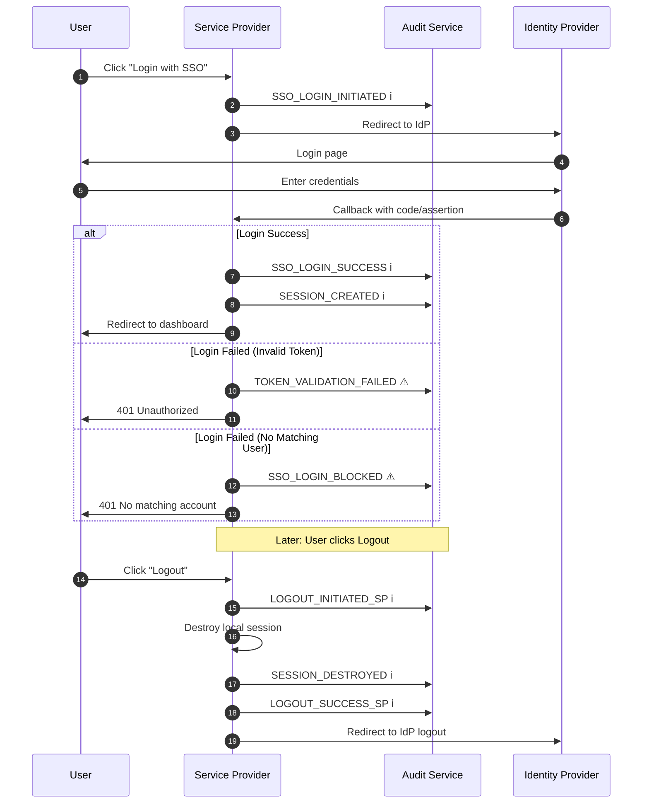

### Code Implementation: Audit Instrumentation in SSO Flow

```typescript
// src/sso/services/sso-callback.service.ts (updated with audit logging)

import { AuditService } from '../../audit/services/audit.service';
import { AuditEventType, AuditSeverity } from '../../audit/entities/audit-log.entity';

@Injectable()
export class SsoCallbackService {
  constructor(
    // ... existing dependencies
    private readonly auditService: AuditService,
  ) {}

  async handleCallback(providerId: string, payload: any, request: any): Promise<any> {
    const context = {
      tenantId: request.tenantId,
      providerId,
      ipAddress: request.ip,
      userAgent: request.headers['user-agent'],
    };

    try {
      // ... existing callback logic ...

      // Log successful login
      await this.auditService.logInfo(AuditEventType.SSO_LOGIN_SUCCESS, {
        ...context,
        userId: user.id,
        userEmail: user.email,
        sessionId: session.id,
        details: {
          protocol: provider.protocolType,
          providerCode: provider.providerCode,
        },
      });

      await this.auditService.logInfo(AuditEventType.SESSION_CREATED, {
        ...context,
        userId: user.id,
        sessionId: session.id,
      });

      return { user, session };
    } catch (error) {
      // Log failed login
      const eventType = error instanceof UnauthorizedException
        ? AuditEventType.TOKEN_VALIDATION_FAILED
        : AuditEventType.SSO_LOGIN_FAILED;

      await this.auditService.logWarning(eventType, {
        ...context,
        errorMessage: error.message,
        details: {
          errorCode: error.getStatus?.() || 500,
        },
      });

      throw error;
    }
  }
}
```

---

## 6. Alert Rules: Detecting Suspicious Patterns

Automated alerting is critical for real-time threat detection.

### Mermaid Diagram: Alert Rule Engine

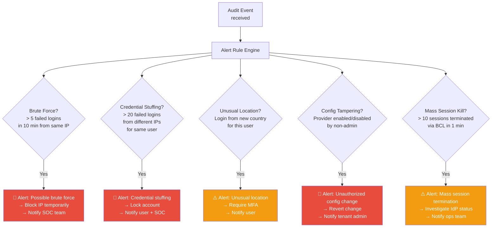

### Code Implementation: Alert Rule Service

```typescript
// src/audit/services/alert-rule.service.ts
import { Injectable, Logger } from '@nestjs/common';
import { Redis } from 'ioredis';
import { AuditEventType, AuditSeverity } from '../entities/audit-log.entity';

@Injectable()
export class AlertRuleService {
  private readonly logger = new Logger(AlertRuleService.name);

  constructor(private readonly redisClient: Redis) {}

  async checkBruteForce(
    tenantId: string,
    ipAddress: string,
    eventType: AuditEventType,
  ): Promise<boolean> {
    if (eventType !== AuditEventType.TOKEN_VALIDATION_FAILED &&
        eventType !== AuditEventType.SSO_LOGIN_FAILED) {
      return false;
    }

    const key = `alert:brute:${tenantId}:${ipAddress}`;
    const count = await this.redisClient.incr(key);
    await this.redisClient.expire(key, 600); // 10-minute window

    if (count > 5) {
      this.logger.warn(`Brute force detected: ${count} failures from IP ${ipAddress} for tenant ${tenantId}`);
      return true;
    }
    return false;
  }

  async checkCredentialStuffing(
    tenantId: string,
    userId: string,
    eventType: AuditEventType,
  ): Promise<boolean> {
    if (eventType !== AuditEventType.SSO_LOGIN_FAILED) {
      return false;
    }

    const key = `alert:stuffing:${tenantId}:${userId}`;
    const count = await this.redisClient.incr(key);
    await this.redisClient.expire(key, 600);

    if (count > 20) {
      this.logger.warn(`Credential stuffing suspected: ${count} failures for user ${userId}`);
      return true;
    }
    return false;
  }
}
```

---

## 7. Compliance Reports

SOC 2 and ISO 27001 auditors need structured reports showing that your SSO controls are operating effectively.

### Mermaid Diagram: Compliance Report Generation Flow

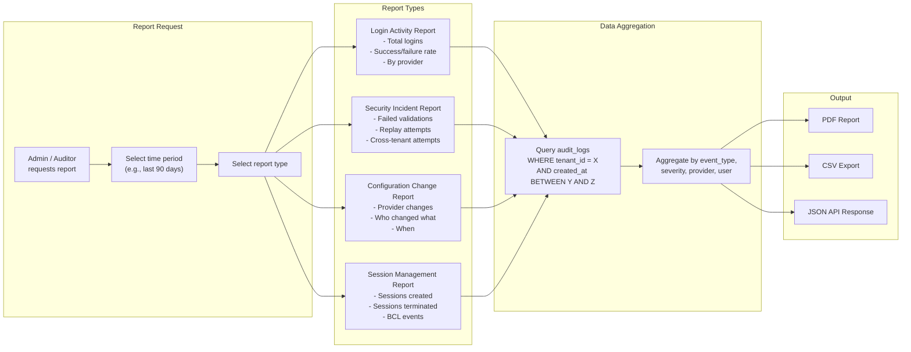

### Code Implementation: Compliance Report Generator

```typescript
// src/audit/services/compliance-report.service.ts
import { Injectable } from '@nestjs/common';
import { InjectRepository } from '@nestjs/typeorm';
import { Repository, Between } from 'typeorm';
import { AuditLog, AuditEventType, AuditSeverity } from '../entities/audit-log.entity';

export interface ComplianceReport {
  tenantId: string;
  period: { from: Date; to: Date };
  generatedAt: Date;
  summary: {
    totalLogins: number;
    successfulLogins: number;
    failedLogins: number;
    successRate: number;
    securityIncidents: number;
    configChanges: number;
    sessionsCreated: number;
    sessionsTerminated: number;
  };
  byProvider: Record<string, {
    logins: number;
    failures: number;
  }>;
  securityEvents: Array<{
    eventType: AuditEventType;
    severity: AuditSeverity;
    timestamp: Date;
    details: any;
  }>;
  configChanges: Array<{
    eventType: AuditEventType;
    userId: string;
    timestamp: Date;
    details: any;
  }>;
}

@Injectable()
export class ComplianceReportService {
  constructor(
    @InjectRepository(AuditLog)
    private readonly auditRepo: Repository<AuditLog>,
  ) {}

  async generateReport(
    tenantId: string,
    from: Date,
    to: Date,
  ): Promise<ComplianceReport> {
    const logs = await this.auditRepo.find({
      where: {
        tenantId,
        createdAt: Between(from, to),
      },
      order: { createdAt: 'ASC' },
    });

    const loginEvents = logs.filter(l =>
      [AuditEventType.SSO_LOGIN_SUCCESS, AuditEventType.SSO_LOGIN_FAILED].includes(l.eventType)
    );

    const successful = loginEvents.filter(l => l.eventType === AuditEventType.SSO_LOGIN_SUCCESS);
    const failed = loginEvents.filter(l => l.eventType === AuditEventType.SSO_LOGIN_FAILED);

    const securityEvents = logs.filter(l => l.severity === AuditSeverity.CRITICAL);
    const configChanges = logs.filter(l => l.eventType.startsWith('PROVIDER_') || l.eventType === 'MAPPINGS_UPDATED');

    const byProvider: Record<string, { logins: number; failures: number }> = {};
    for (const log of loginEvents) {
      const code = log.providerCode || 'unknown';
      if (!byProvider[code]) byProvider[code] = { logins: 0, failures: 0 };
      if (log.eventType === AuditEventType.SSO_LOGIN_SUCCESS) byProvider[code].logins++;
      else byProvider[code].failures++;
    }

    return {
      tenantId,
      period: { from, to },
      generatedAt: new Date(),
      summary: {
        totalLogins: loginEvents.length,
        successfulLogins: successful.length,
        failedLogins: failed.length,
        successRate: loginEvents.length > 0
          ? Math.round((successful.length / loginEvents.length) * 100)
          : 0,
        securityIncidents: securityEvents.length,
        configChanges: configChanges.length,
        sessionsCreated: logs.filter(l => l.eventType === AuditEventType.SESSION_CREATED).length,
        sessionsTerminated: logs.filter(l =>
          [AuditEventType.SESSION_DESTROYED, AuditEventType.SESSION_TERMINATED_BCL].includes(l.eventType)
        ).length,
      },
      byProvider,
      securityEvents: securityEvents.map(l => ({
        eventType: l.eventType,
        severity: l.severity,
        timestamp: l.createdAt,
        details: l.details,
      })),
      configChanges: configChanges.map(l => ({
        eventType: l.eventType,
        userId: l.userId,
        timestamp: l.createdAt,
        details: l.details,
      })),
    };
  }
}
```

---

## 8. Log Retention & Archival

Audit logs must be retained for specific periods depending on the compliance framework.

### Mermaid Diagram: Log Retention Lifecycle

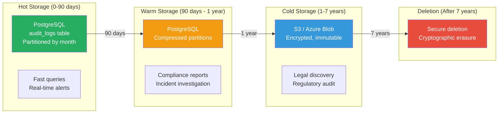

| Compliance Framework | Minimum Retention | Recommended |
|---|---|---|
| **SOC 2** | 1 year | 3 years |
| **ISO 27001** | 3 years | 5 years |
| **HIPAA** | 6 years | 7 years |
| **GDPR** | As long as needed | Minimize, then delete |

---

## 9. Data Privacy: GDPR Considerations

Audit logs contain personal data (user IDs, emails, IP addresses). Under GDPR, we must balance audit requirements with data minimization.

### Mermaid Diagram: GDPR Compliance for Audit Logs

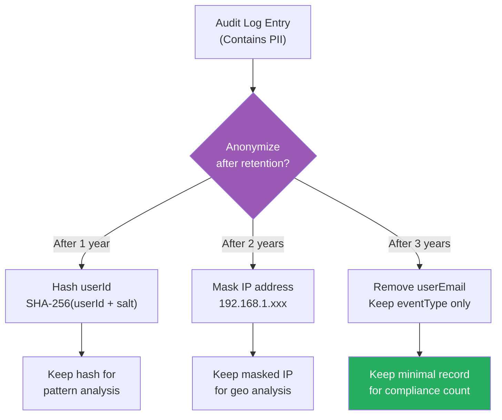

### Code Implementation: GDPR Anonymization

```typescript
// src/audit/services/audit-retention.service.ts
@Injectable()
export class AuditRetentionService {
  constructor(
    @InjectRepository(AuditLog) private readonly auditRepo: Repository<AuditLog>,
    private readonly configService: ConfigService,
  ) {}

  @Cron(CronExpression.EVERY_DAY_AT_3AM)
  async anonymizeOldLogs(): Promise<void> {
    const salt = this.configService.get('AUDIT_ANONYMIZE_SALT');
    const oneYearAgo = new Date();
    oneYearAgo.setFullYear(oneYearAgo.getFullYear() - 1);

    // Anonymize user identifiers older than 1 year
    await this.auditRepo
      .createQueryBuilder()
      .update(AuditLog)
      .set({
        userId: () => `encode(sha256((user_id || '${salt}')::bytea), 'hex')`,
        userEmail: '***@***.***',
      })
      .where('created_at < :date', { date: oneYearAgo })
      .andWhere('user_id IS NOT NULL')
      .execute();

    this.logger.log('Anonymized audit logs older than 1 year');
  }
}
```

---

## 10. The Complete SSO Audit Dashboard

### Mermaid Diagram: Audit Dashboard Data Flow

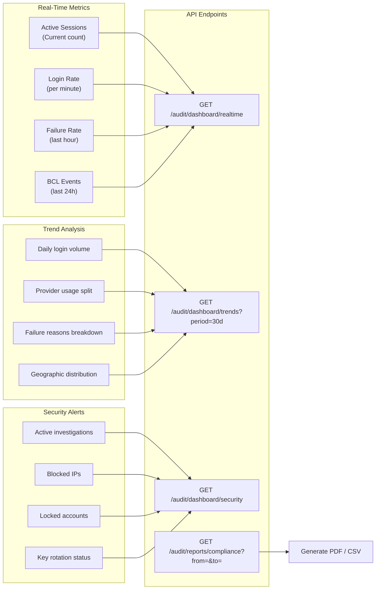

---

## Conclusion: The Complete SSO Journey

We have reached the end of our 10-part SSO series. Let's recap the complete architecture we've built:

### Mermaid Diagram: The Complete SSO Architecture (Final)

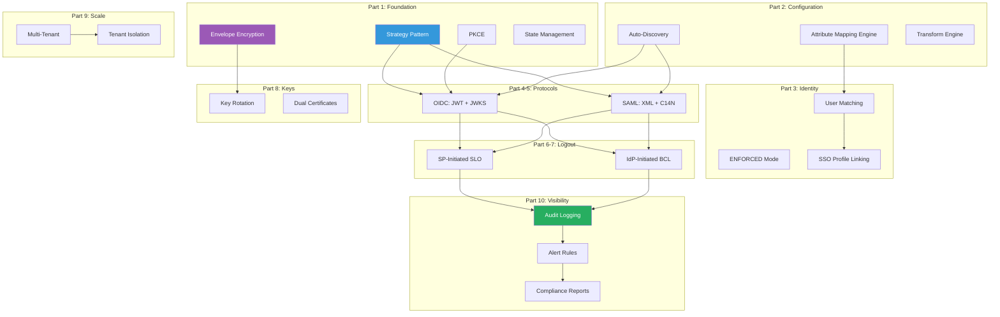

From Strategy Patterns to Envelope Encryption, from PKCE to Back-Channel Logout, from single-tenant to multi-tenant, and from raw events to compliance reports—this is the complete enterprise SSO architecture.

Thank you for following this series. Keep building securely.

<br><br><br>

---

---

## 簡介：冇 Log 就等於冇發生過

喺企業級保安入面，一個冇被記錄嘅事件就等於一個從來冇發生過嘅事件。當一件保安事故發生——無論係 Account 被入侵、可疑嘅異地登入、定係未經授權嘅設定變更——調查員第一個問嘅問題就係：「發生咗咩事？」如果你個 System 冇辦法用精準嘅、有時間戳嘅、防篡改嘅 Logs 嚟回答呢個問題，你就係盲摸摸咁飛。

好似 **SOC 2 Type II**、**ISO 27001**、**HIPAA** 同 **GDPR** 呢啲法規框架，全部都規定認證事件必須有全面嘅審計日誌。如果你冇辦法證明每一個 SSO 登入、登出、設定變更同失敗都有被記錄到足夠嘅詳情去做取證分析，企業客戶根本唔會同你簽合約。

喺第十集（最後一集！），我哋會實作 `FN/ADM/SSO/010`：**審計日誌與合規**。我哋會設計一個不可變嘅審計日誌系統、定義 SSO 操作嘅事件分類法、建立可疑模式嘅警報規則，同埋準備合規報告所需嘅數據結構。

---

## 1. 審計日誌架構

審計日誌同 Application Logs 有根本性嘅唔同。Application Logs 係俾 Developer 用（Debug、監控）。審計日誌係俾保安團隊同合規官員用（取證、證據）。佢哋必須係：

1. **不可變（Immutable）** — 寫咗之後永遠唔可以改或者 Delete
2. **僅追加（Append-only）** — 新 Events 係加落去，唔係插入
3. **防篡改（Tamper-evident）** — 任何修改都可以被偵測到
4. **完整（Complete）** — 每一個相關嘅 Event 都被捕捉
5. **可查詢（Queryable）** — 保安團隊可以有效咁 Search 同 Filter

### Mermaid 圖解：審計日誌架構

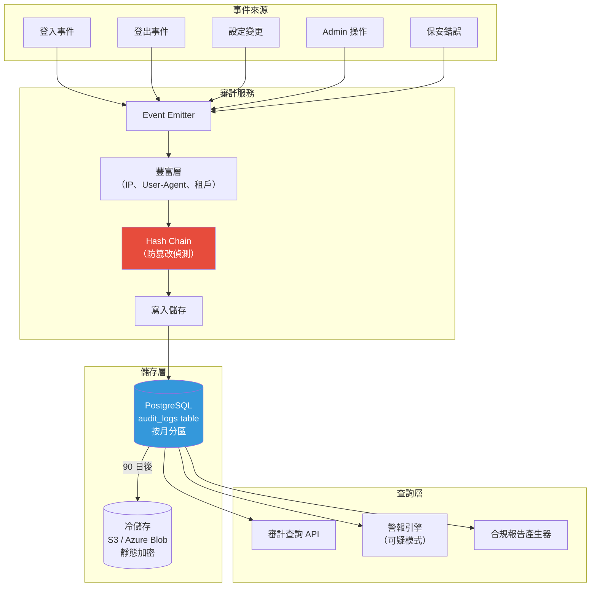

---

## 2. SSO 事件分類法

我哋需要一套全面、標準化嘅事件類型，覆蓋每一個 SSO 操作。

### Mermaid 圖解：SSO 事件分類樹


---

## 3. 審計日誌 Entity

### Code 實作：審計日誌 Entity

```typescript
// src/audit/entities/audit-log.entity.ts
import { Entity, Column, PrimaryGeneratedColumn, CreateDateColumn, Index } from 'typeorm';

export enum AuditEventType {
  // 認證
  SSO_LOGIN_INITIATED = 'SSO_LOGIN_INITIATED',
  SSO_LOGIN_SUCCESS = 'SSO_LOGIN_SUCCESS',
  SSO_LOGIN_FAILED = 'SSO_LOGIN_FAILED',
  SSO_LOGIN_BLOCKED = 'SSO_LOGIN_BLOCKED',
  TOKEN_VALIDATION_FAILED = 'TOKEN_VALIDATION_FAILED',

  // Session
  SESSION_CREATED = 'SESSION_CREATED',
  SESSION_DESTROYED = 'SESSION_DESTROYED',
  SESSION_EXPIRED = 'SESSION_EXPIRED',
  SESSION_TERMINATED_BCL = 'SESSION_TERMINATED_BCL',

  // 登出
  LOGOUT_INITIATED_SP = 'LOGOUT_INITIATED_SP',
  LOGOUT_SUCCESS_SP = 'LOGOUT_SUCCESS_SP',
  LOGOUT_INITIATED_IDP = 'LOGOUT_INITIATED_IDP',
  LOGOUT_FAILED = 'LOGOUT_FAILED',

  // 設定
  PROVIDER_CREATED = 'PROVIDER_CREATED',
  PROVIDER_UPDATED = 'PROVIDER_UPDATED',
  PROVIDER_ENABLED = 'PROVIDER_ENABLED',
  PROVIDER_DISABLED = 'PROVIDER_DISABLED',
  MAPPINGS_UPDATED = 'MAPPINGS_UPDATED',
  CERTIFICATE_ROTATED = 'CERTIFICATE_ROTATED',

  // 保安
  REPLAY_ATTACK_DETECTED = 'REPLAY_ATTACK_DETECTED',
  CSRF_ATTACK_DETECTED = 'CSRF_ATTACK_DETECTED',
  CROSS_TENANT_ATTEMPT = 'CROSS_TENANT_ATTEMPT',
  EMERGENCY_KEY_REFRESH = 'EMERGENCY_KEY_REFRESH',
}

export enum AuditSeverity {
  INFO = 'INFO',
  WARNING = 'WARNING',
  CRITICAL = 'CRITICAL',
}

@Entity('audit_logs')
@Index(['tenantId', 'eventType', 'createdAt'])
@Index(['tenantId', 'userId', 'createdAt'])
@Index(['createdAt'])
export class AuditLog {
  @PrimaryGeneratedColumn('uuid')
  id: string;

  @Column({ name: 'tenant_id' })
  tenantId: string;

  @Column({ name: 'event_type', type: 'enum', enum: AuditEventType })
  eventType: AuditEventType;

  @Column({ type: 'enum', enum: AuditSeverity, default: AuditSeverity.INFO })
  severity: AuditSeverity;

  @Column({ name: 'user_id', nullable: true })
  userId: string;

  @Column({ name: 'user_email', nullable: true })
  userEmail: string;

  @Column({ name: 'provider_id', nullable: true })
  providerId: string;

  @Column({ name: 'provider_code', nullable: true })
  providerCode: string;

  @Column({ name: 'session_id', nullable: true })
  sessionId: string;

  @Column({ name: 'ip_address', length: 45 })
  ipAddress: string;

  @Column({ name: 'user_agent', length: 512, nullable: true })
  userAgent: string;

  @Column({ type: 'jsonb', nullable: true })
  details: Record<string, any>;

  @Column({ name: 'error_message', nullable: true })
  errorMessage: string;

  @Column({ name: 'previous_hash', length: 64, nullable: true })
  previousHash: string;

  @Column({ name: 'event_hash', length: 64 })
  eventHash: string;

  @CreateDateColumn({ name: 'created_at' })
  createdAt: Date;
}
```

---

## 4. 審計服務

### Code 實作：核心審計服務

```typescript
// src/audit/services/audit.service.ts
import { Injectable, Logger } from '@nestjs/common';
import { InjectRepository } from '@nestjs/typeorm';
import { Repository } from 'typeorm';
import * as crypto from 'crypto';
import { AuditLog, AuditEventType, AuditSeverity } from '../entities/audit-log.entity';

export interface AuditEventContext {
  tenantId: string;
  userId?: string;
  userEmail?: string;
  providerId?: string;
  providerCode?: string;
  sessionId?: string;
  ipAddress?: string;
  userAgent?: string;
  details?: Record<string, any>;
  errorMessage?: string;
}

@Injectable()
export class AuditService {
  private readonly logger = new Logger(AuditService.name);

  constructor(
    @InjectRepository(AuditLog)
    private readonly auditRepo: Repository<AuditLog>,
  ) {}

  async log(
    eventType: AuditEventType,
    severity: AuditSeverity,
    context: AuditEventContext,
  ): Promise<void> {
    try {
      // 1. 攞上一條 Hash 嚟維持 Chain 完整性
      const previousLog = await this.auditRepo.findOne({
        where: { tenantId: context.tenantId },
        order: { createdAt: 'DESC' },
        select: ['eventHash'],
      });

      // 2. 計算呢個 Event 嘅 Hash
      const eventPayload = JSON.stringify({
        eventType,
        severity,
        ...context,
        timestamp: new Date().toISOString(),
      });
      const eventHash = crypto.createHash('sha256').update(eventPayload).digest('hex');

      // 3. 新增審計日誌記錄
      const log = this.auditRepo.create({
        tenantId: context.tenantId,
        eventType,
        severity,
        userId: context.userId,
        userEmail: context.userEmail,
        providerId: context.providerId,
        providerCode: context.providerCode,
        sessionId: context.sessionId,
        ipAddress: context.ipAddress,
        userAgent: context.userAgent,
        details: context.details,
        errorMessage: context.errorMessage,
        previousHash: previousLog?.eventHash || null,
        eventHash,
      });

      await this.auditRepo.save(log);

      // 4. 非同步咁 Check 警報規則
      this.checkAlertRules(eventType, severity, context);
    } catch (error) {
      // 審計日誌絕對唔可以搞死主應用
      this.logger.error(`寫審計日誌失敗：${error.message}`, error.stack);
    }
  }

  // 便捷方法
  async logInfo(eventType: AuditEventType, context: AuditEventContext): Promise<void> {
    return this.log(eventType, AuditSeverity.INFO, context);
  }

  async logWarning(eventType: AuditEventType, context: AuditEventContext): Promise<void> {
    return this.log(eventType, AuditSeverity.WARNING, context);
  }

  async logCritical(eventType: AuditEventType, context: AuditEventContext): Promise<void> {
    return this.log(eventType, AuditSeverity.CRITICAL, context);
  }

  private checkAlertRules(
    eventType: AuditEventType,
    severity: AuditSeverity,
    context: AuditEventContext,
  ): void {
    // 非同步警報 Check — 見第六節
    if (severity === AuditSeverity.CRITICAL) {
      // this.eventEmitter.emit('audit.critical', { eventType, context });
    }
  }
}
```

---

## 5. 喺 SSO 流程加入審計

我哋必須喺 SSO 流程嘅每一個關鍵位加入審計日誌嘅 Call。

### Mermaid 圖解：SSO 流程入面嘅審計點

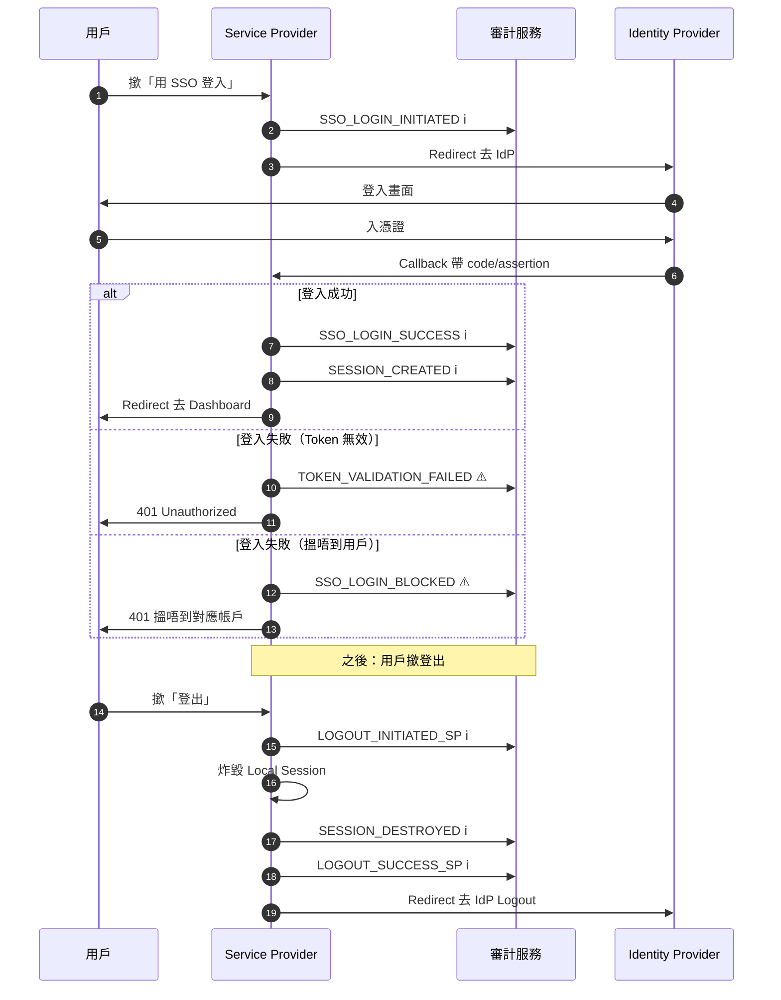

### Code 實作：喺 SSO 流程加入審計

```typescript
// src/sso/services/sso-callback.service.ts（更新版，加入審計）

import { AuditService } from '../../audit/services/audit.service';
import { AuditEventType, AuditSeverity } from '../../audit/entities/audit-log.entity';

@Injectable()
export class SsoCallbackService {
  constructor(
    // ... 現有嘅 Dependencies
    private readonly auditService: AuditService,
  ) {}

  async handleCallback(providerId: string, payload: any, request: any): Promise<any> {
    const context = {
      tenantId: request.tenantId,
      providerId,
      ipAddress: request.ip,
      userAgent: request.headers['user-agent'],
    };

    try {
      // ... 現有嘅 Callback 邏輯 ...

      // 記錄成功登入
      await this.auditService.logInfo(AuditEventType.SSO_LOGIN_SUCCESS, {
        ...context,
        userId: user.id,
        userEmail: user.email,
        sessionId: session.id,
        details: {
          protocol: provider.protocolType,
          providerCode: provider.providerCode,
        },
      });

      await this.auditService.logInfo(AuditEventType.SESSION_CREATED, {
        ...context,
        userId: user.id,
        sessionId: session.id,
      });

      return { user, session };
    } catch (error) {
      // 記錄失敗登入
      const eventType = error instanceof UnauthorizedException
        ? AuditEventType.TOKEN_VALIDATION_FAILED
        : AuditEventType.SSO_LOGIN_FAILED;

      await this.auditService.logWarning(eventType, {
        ...context,
        errorMessage: error.message,
        details: {
          errorCode: error.getStatus?.() || 500,
        },
      });

      throw error;
    }
  }
}
```

---

## 6. 警報規則：偵測可疑模式

自動化警報對即時威脅偵測至關重要。

### Mermaid 圖解：警報規則引擎

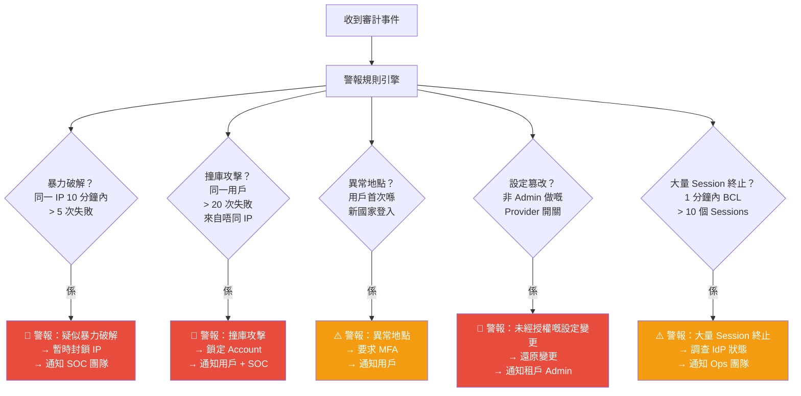

### Code 實作：警報規則服務

```typescript
// src/audit/services/alert-rule.service.ts
import { Injectable, Logger } from '@nestjs/common';
import { Redis } from 'ioredis';
import { AuditEventType, AuditSeverity } from '../entities/audit-log.entity';

@Injectable()
export class AlertRuleService {
  private readonly logger = new Logger(AlertRuleService.name);

  constructor(private readonly redisClient: Redis) {}

  async checkBruteForce(
    tenantId: string,
    ipAddress: string,
    eventType: AuditEventType,
  ): Promise<boolean> {
    if (eventType !== AuditEventType.TOKEN_VALIDATION_FAILED &&
        eventType !== AuditEventType.SSO_LOGIN_FAILED) {
      return false;
    }

    const key = `alert:brute:${tenantId}:${ipAddress}`;
    const count = await this.redisClient.incr(key);
    await this.redisClient.expire(key, 600); // 10 分鐘窗口

    if (count > 5) {
      this.logger.warn(`偵測到暴力破解：IP ${ipAddress} 喺租戶 ${tenantId} 失敗咗 ${count} 次`);
      return true;
    }
    return false;
  }

  async checkCredentialStuffing(
    tenantId: string,
    userId: string,
    eventType: AuditEventType,
  ): Promise<boolean> {
    if (eventType !== AuditEventType.SSO_LOGIN_FAILED) {
      return false;
    }

    const key = `alert:stuffing:${tenantId}:${userId}`;
    const count = await this.redisClient.incr(key);
    await this.redisClient.expire(key, 600);

    if (count > 20) {
      this.logger.warn(`疑似撞庫攻擊：用戶 ${userId} 失敗咗 ${count} 次`);
      return true;
    }
    return false;
  }
}
```

---

## 7. 合規報告

SOC 2 同 ISO 27001 嘅審計員需要結構化嘅報告，展示你嘅 SSO 控制措施係有效運作緊。

### Mermaid 圖解：合規報告產生流程

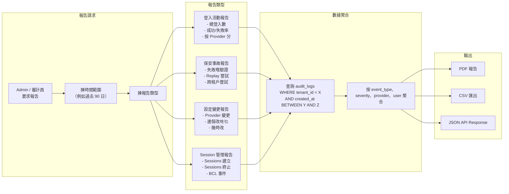

### Code 實作：合規報告產生器

```typescript
// src/audit/services/compliance-report.service.ts
import { Injectable } from '@nestjs/common';
import { InjectRepository } from '@nestjs/typeorm';
import { Repository, Between } from 'typeorm';
import { AuditLog, AuditEventType, AuditSeverity } from '../entities/audit-log.entity';

export interface ComplianceReport {
  tenantId: string;
  period: { from: Date; to: Date };
  generatedAt: Date;
  summary: {
    totalLogins: number;
    successfulLogins: number;
    failedLogins: number;
    successRate: number;
    securityIncidents: number;
    configChanges: number;
    sessionsCreated: number;
    sessionsTerminated: number;
  };
  byProvider: Record<string, { logins: number; failures: number }>;
  securityEvents: Array<{
    eventType: AuditEventType;
    severity: AuditSeverity;
    timestamp: Date;
    details: any;
  }>;
  configChanges: Array<{
    eventType: AuditEventType;
    userId: string;
    timestamp: Date;
    details: any;
  }>;
}

@Injectable()
export class ComplianceReportService {
  constructor(
    @InjectRepository(AuditLog)
    private readonly auditRepo: Repository<AuditLog>,
  ) {}

  async generateReport(tenantId: string, from: Date, to: Date): Promise<ComplianceReport> {
    const logs = await this.auditRepo.find({
      where: { tenantId, createdAt: Between(from, to) },
      order: { createdAt: 'ASC' },
    });

    const loginEvents = logs.filter(l =>
      [AuditEventType.SSO_LOGIN_SUCCESS, AuditEventType.SSO_LOGIN_FAILED].includes(l.eventType)
    );
    const successful = loginEvents.filter(l => l.eventType === AuditEventType.SSO_LOGIN_SUCCESS);
    const failed = loginEvents.filter(l => l.eventType === AuditEventType.SSO_LOGIN_FAILED);
    const securityEvents = logs.filter(l => l.severity === AuditSeverity.CRITICAL);
    const configChanges = logs.filter(l => l.eventType.startsWith('PROVIDER_') || l.eventType === 'MAPPINGS_UPDATED');

    const byProvider: Record<string, { logins: number; failures: number }> = {};
    for (const log of loginEvents) {
      const code = log.providerCode || 'unknown';
      if (!byProvider[code]) byProvider[code] = { logins: 0, failures: 0 };
      if (log.eventType === AuditEventType.SSO_LOGIN_SUCCESS) byProvider[code].logins++;
      else byProvider[code].failures++;
    }

    return {
      tenantId,
      period: { from, to },
      generatedAt: new Date(),
      summary: {
        totalLogins: loginEvents.length,
        successfulLogins: successful.length,
        failedLogins: failed.length,
        successRate: loginEvents.length > 0
          ? Math.round((successful.length / loginEvents.length) * 100) : 0,
        securityIncidents: securityEvents.length,
        configChanges: configChanges.length,
        sessionsCreated: logs.filter(l => l.eventType === AuditEventType.SESSION_CREATED).length,
        sessionsTerminated: logs.filter(l =>
          [AuditEventType.SESSION_DESTROYED, AuditEventType.SESSION_TERMINATED_BCL].includes(l.eventType)
        ).length,
      },
      byProvider,
      securityEvents: securityEvents.map(l => ({
        eventType: l.eventType, severity: l.severity, timestamp: l.createdAt, details: l.details,
      })),
      configChanges: configChanges.map(l => ({
        eventType: l.eventType, userId: l.userId, timestamp: l.createdAt, details: l.details,
      })),
    };
  }
}
```

---

## 8. 日誌保留與歸檔

審計日誌必須根據合規框架保留特定嘅期限。

### Mermaid 圖解：日誌保留生命週期

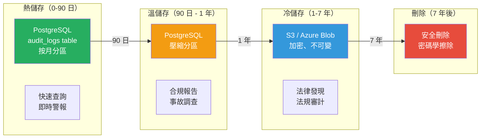

| 合規框架 | 最低保留期 | 建議保留期 |
|---|---|---|
| **SOC 2** | 1 年 | 3 年 |
| **ISO 27001** | 3 年 | 5 年 |
| **HIPAA** | 6 年 | 7 年 |
| **GDPR** | 需要幾耐就幾耐 | 最小化，然後刪除 |

---

## 9. 數據私隱：GDPR 考量

審計日誌包含個人數據（User ID、Email、IP 地址）。喺 GDPR 之下，我哋必須喺審計要求同數據最小化之間取得平衡。

### Mermaid 圖解：審計日誌嘅 GDPR 合規

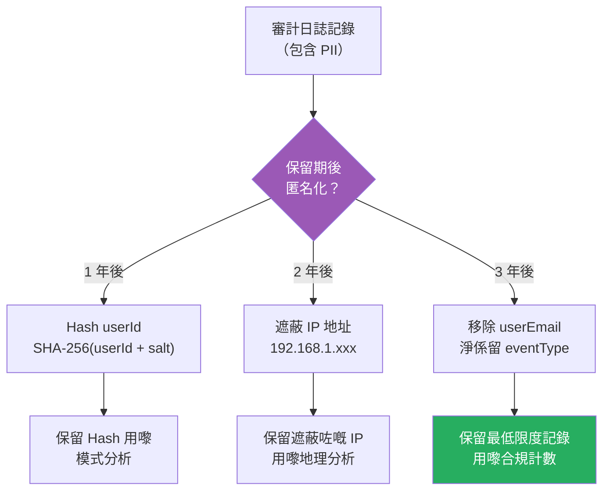

### Code 實作：GDPR 匿名化

```typescript
// src/audit/services/audit-retention.service.ts
@Injectable()
export class AuditRetentionService {
  constructor(
    @InjectRepository(AuditLog) private readonly auditRepo: Repository<AuditLog>,
    private readonly configService: ConfigService,
  ) {}

  @Cron(CronExpression.EVERY_DAY_AT_3AM)
  async anonymizeOldLogs(): Promise<void> {
    const salt = this.configService.get('AUDIT_ANONYMIZE_SALT');
    const oneYearAgo = new Date();
    oneYearAgo.setFullYear(oneYearAgo.getFullYear() - 1);

    // 匿名化超過 1 年嘅用戶識別符
    await this.auditRepo
      .createQueryBuilder()
      .update(AuditLog)
      .set({
        userId: () => `encode(sha256((user_id || '${salt}')::bytea), 'hex')`,
        userEmail: '***@***.***',
      })
      .where('created_at < :date', { date: oneYearAgo })
      .andWhere('user_id IS NOT NULL')
      .execute();

    this.logger.log('已匿名化超過 1 年嘅審計日誌');
  }
}
```

---

## 10. 完整 SSO 審計 Dashboard

### Mermaid 圖解：審計 Dashboard 數據流

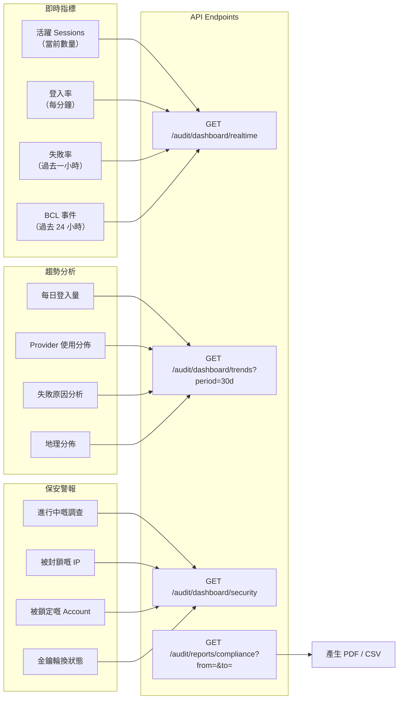

---

## 結語：完整嘅 SSO 旅程

我哋已經到達 10 集 SSO 系列嘅終點。等我哋回顧一下我哋建立嘅完整架構：

### Mermaid 圖解：完整 SSO 架構（最終版）

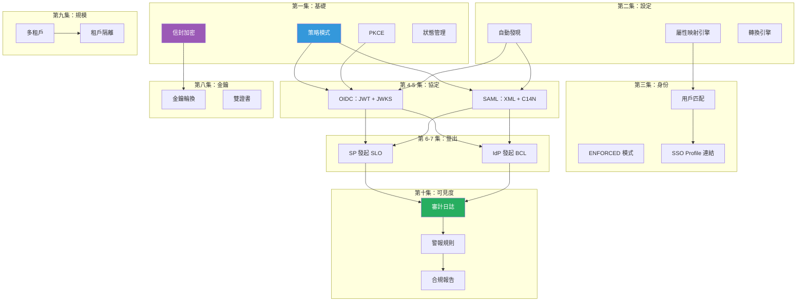

由策略模式到信封加密，由 PKCE 到 Back-Channel Logout，由單租戶到多租戶，再由原始事件到合規報告——呢個就係完整嘅企業級 SSO 架構。

多謝你跟晒成個系列。繼續安全寫 Code！

<br><br><br>
