## Introduction: What Is This Post About?

If you are new to the SSO world, you probably feel like you are drowning in a sea of acronyms: OIDC, SAML, PKCE, JWKS, DEK, KEK... It is overwhelming. This post is your lifebuoy.

In our previous **Beginner's Guide**, we covered the absolute basics: what SSO is, how OAuth 2.0 and OIDC work, and why SAML still matters. If you have not read that one yet, go check it out first -- this post builds on top of those fundamentals.

This post goes deeper. We are going to explain the **real-world concepts** that every developer needs to understand when building or maintaining an enterprise SSO system. Think of it as the "things your senior developer assumes you already know but nobody actually taught you" compilation.

We will use plain language, plenty of diagrams, and relatable analogies. No prior SSO experience required -- just an open mind.

---

## Part 1: Why Is SSO So Complicated? (The Big Picture)

### The Problem with "Just Add SSO"

When a junior developer first hears "we need to implement SSO," they think: "Sure, I'll add a 'Login with Google' button and we're done."

Wrong. Real enterprise SSO is a whole system. Here is why:

- **Multiple protocols**: Some companies use OIDC (modern), some use SAML 2.0 (enterprise legacy), some use plain OAuth 2.0. Your system has to handle ALL of them.
- **Security everywhere**: Every step of the flow has attack vectors. If you miss even one, you are vulnerable.
- **Configuration chaos**: Every Identity Provider (IdP) speaks a different "dialect." Azure AD returns `upn`, Okta returns `preferred_username`, ADFS returns `http://schemas.xmlsoap.org/ws/2005/05/identity/claims/emailaddress`. Your system has to understand all of them.
- **Secret management**: Your app has secrets (client secrets, private keys) that unlock the ability to impersonate your app to the IdP. These must be encrypted.

### How a Real SSO System Is Structured

A production SSO system is not one big piece of code. It is a collection of specialized components, each doing one thing well.

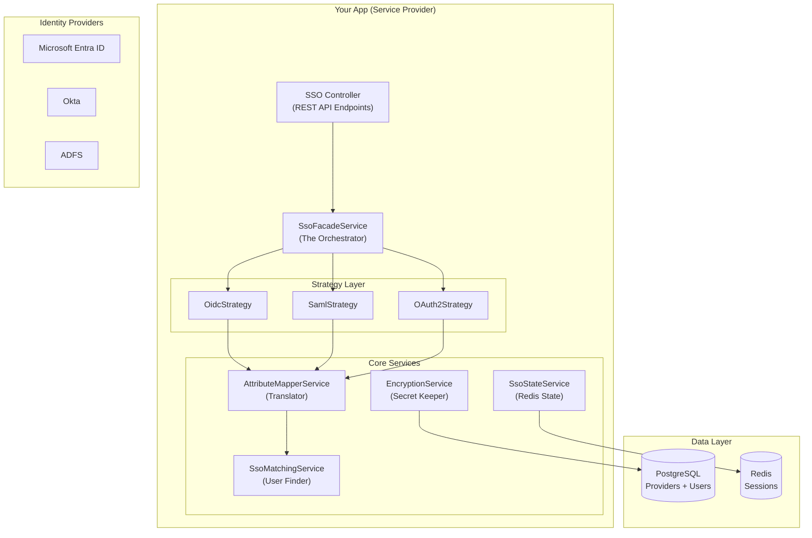

Each box in this diagram is a separate code module with a specific job. This separation is what makes the system maintainable and testable.

---

## Part 2: The Strategy Pattern -- One Interface, Three Implementations

### Why You Cannot Just Use If/Else

Imagine writing code like this:

```typescript
if (protocol === 'OIDC') {
    // 500 lines of OIDC logic
} else if (protocol === 'SAML') {
    // 500 lines of SAML logic
} else if (protocol === 'OAUTH2') {
    // 500 lines of OAuth2 logic
}
```

This is a nightmare. What happens when you need to add a fourth protocol? You cram more code into the same file. What happens when you need to test OIDC without involving SAML? You cannot.

### The Strategy Pattern Solution

The **Strategy Pattern** solves this by defining ONE common interface, and writing THREE separate classes that each implement that interface in their own way.

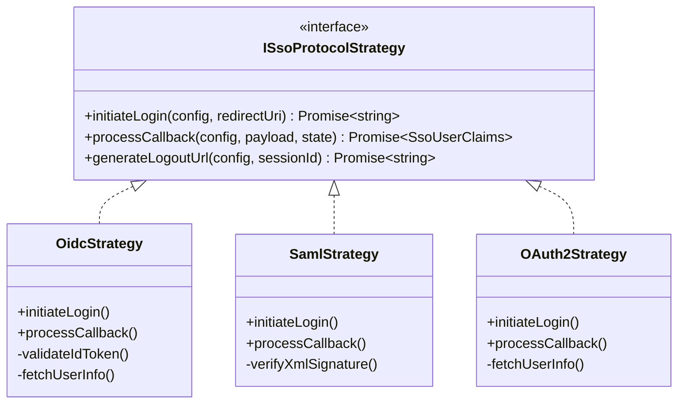

The **Factory** simply picks the right strategy based on the protocol type:

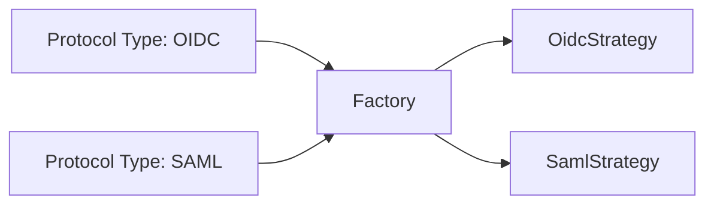

Now, adding a new protocol (like WS-Federation) means writing ONE new class -- zero changes to existing code.

---

## Part 3: Envelope Encryption -- Keeping Secrets Safe

### The Threat Model

Your database stores sensitive configuration for each IdP:
- **OAuth client secrets**: Your app's "password" to the IdP
- **SAML private keys**: Used to sign requests to the IdP
- **mTLS certificates**: Client-side certificates for secure token exchange

If a hacker dumps your database, these secrets would let them **impersonate your application** to any IdP. That is a catastrophic breach.

The solution is **Envelope Encryption** -- a three-layer encryption system that ensures even a database dump is useless.

### Layer 1: The Master Key (KEK)

The **Key Encryption Key (KEK)** is derived at application startup from:
- An environment variable (the master secret)
- A salt file on disk
- A key derivation function (HKDF-SHA256)

This KEK **never leaves memory** and **never gets written to disk**. It exists only in the running process.

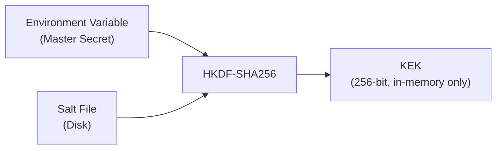

### Layer 2: Per-Provider Keys (DEK)

Each IdP provider gets its own **Data Encryption Key (DEK)** -- a random 256-bit key generated specifically for that provider.

The DEK itself is encrypted (wrapped) by the KEK, and this wrapped DEK is stored in the database.

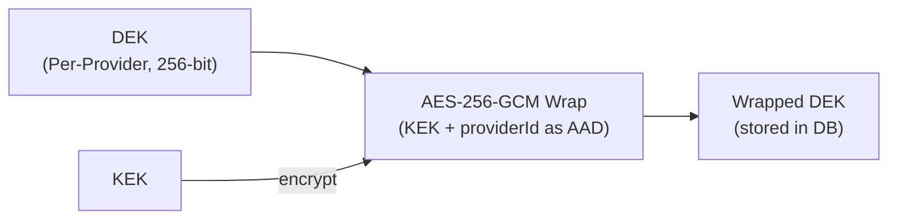

Using the `providerId` as **Additional Authenticated Data (AAD)** is critical -- it binds the DEK to that specific row. If an attacker tries to copy a DEK from one row to another, decryption will fail.

### Layer 3: The Actual Secrets

The real configuration (client_secret, certificates, etc.) is encrypted with the DEK and stored alongside the wrapped DEK.

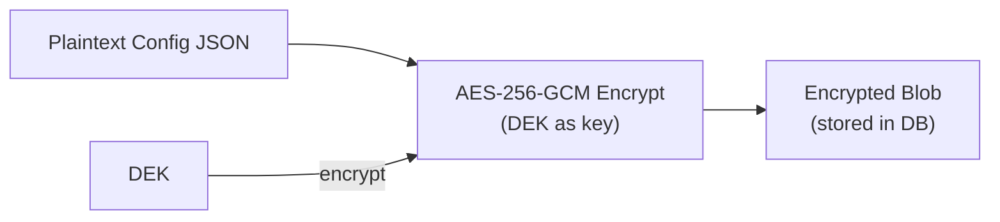

### Why Three Layers?

| Layer | Purpose |
|---|---|
| **KEK** | Master key; if compromised, only re-wrap DEKs (not re-encrypt all data) |
| **DEK** | Per-provider isolation; compromising one DEK doesn't expose others |
| **AAD** | Binds DEK to specific row; prevents moving DEK between rows |

**Bottom line**: Even if an attacker steals your entire database, they get only encrypted blobs. Without the in-memory KEK, the data is mathematically unbreakable.

---

## Part 4: PKCE -- Defeating Code Interception

### The Attack

In the OIDC Authorization Code flow, the user is redirected to the IdP, logs in, and is redirected back with an `authorization_code` in the URL.

A malicious app on the user's phone could intercept this redirect and steal the code. With the code, the attacker could exchange it for tokens -- gaining full access to the user's account.

### The PKCE Solution

**PKCE (Proof Key for Code Exchange)** adds a cryptographic challenge to prevent this.

Here is how it works:

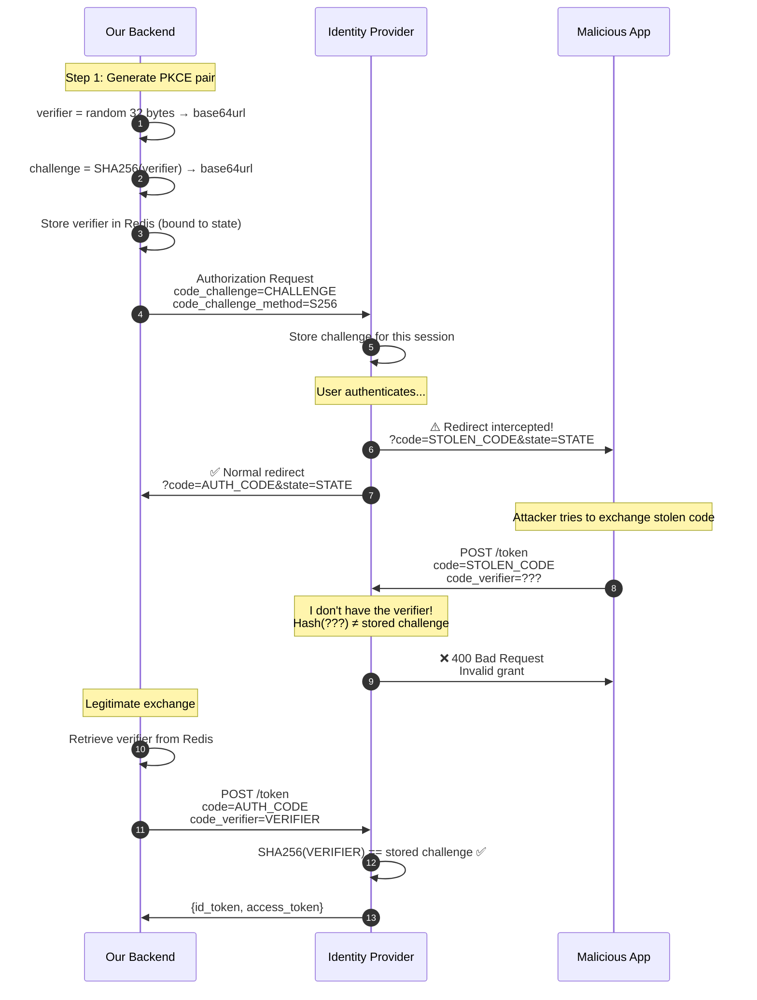

**Key insight**: The attacker has the code but NOT the verifier. Without the verifier, they cannot exchange the code for tokens. The verifier stays on the server and is never sent to the browser.

**Bonus**: Originally PKCE was for mobile/SPA apps only. Now RFC 9700 recommends it for ALL client types -- including server-side apps. Defense in depth.

---

## Part 5: Auto-Discovery -- Let the IdP Tell You Its Endpoints

### The Manual Configuration Problem

Imagine manually configuring an OIDC IdP:
- What is the token endpoint URL?
- What is the authorization endpoint?
- Where are the public keys for JWT verification?

You could look these up in documentation... or you could let the IdP tell you automatically.

### OIDC Auto-Discovery

OIDC providers expose a standard endpoint: `/.well-known/openid-configuration`

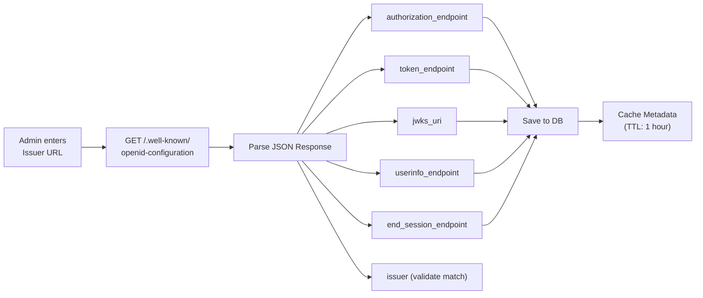

Your system fetches this JSON, parses out all the endpoint URLs, and validates that the `issuer` field matches what the admin entered. No manual URL entry needed.

### SAML Auto-Discovery

SAML works similarly -- you enter a Metadata URL, and the system fetches and parses the XML to extract:
- The `entityID` (Issuer)
- The SSO URL
- The signing certificates

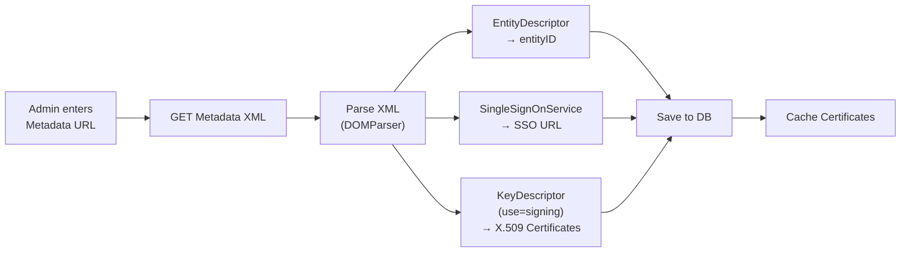

**Result**: Admin enters one URL, system gets everything it needs. Human error eliminated.

---

## Part 6: Attribute Mapping -- Translating IdP "Dialects"

### The Problem

Every IdP returns user attributes (claims) in different formats:

| IdP | User Identifier | Email | Name |
|---|---|---|---|
| **Azure AD** | `upn` (e.g., `DOMAIN\JohnDoe`) | `email` | `name` |
| **Okta** | `preferred_username` | `email` | `name` |
| **ADFS** | `http://schemas.xmlsoap.org/ws/2005/05/identity/claims/emailaddress` | (same) | (same) |

Your app wants a clean, normalized user profile: `{ email, displayName, identifier }`. The mapping engine does this translation.

### How Attribute Mapping Works

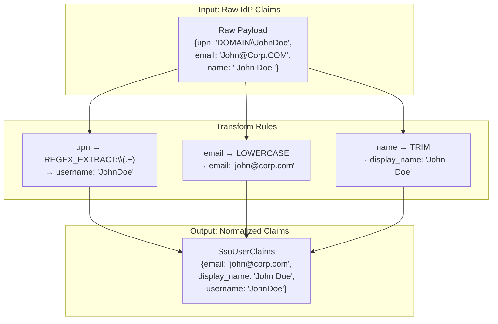

Transform types available:
- **NONE**: Keep as-is
- **LOWERCASE**: `value.toLowerCase()`
- **UPPERCASE**: `value.toUpperCase()`
- **TRIM**: Remove leading/trailing spaces
- **REGEX_EXTRACT**: Extract part of a string using regex
- **TEMPLATE**: Replace placeholders like `{value}` with the actual value

---

## Part 7: User Matching -- Finding the Right Account

### The Big Question

After normalizing the claims, the next question is: **which local user account does this SSO login belong to?**

This is where **Account Takeover (ATO)** vulnerabilities happen if you are not careful.

### The Matching Logic

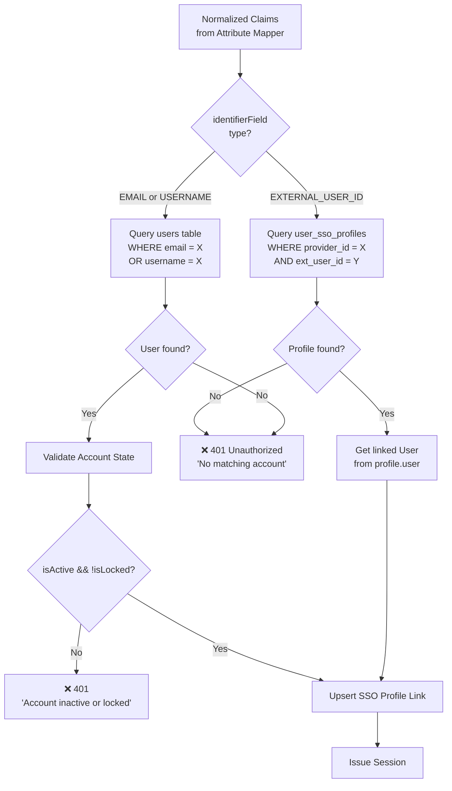

### Three Identifier Types

| Type | How It Works |
|---|---|
| **EXTERNAL_USER_ID** | The IdP gives us a unique user ID. We look up `user_sso_profiles` table directly. Most secure. |
| **EMAIL** | We look up the `users` table by email. Works for existing users. |
| **USERNAME** | We look up the `users` table by username. Works for existing users. |

### Why Not Just Create Accounts Automatically? (JIT)

Some systems use **Just-In-Time (JIT) provisioning** -- creating a new local account on first SSO login. This is risky: an attacker who manages to get a valid SSO login could trigger automatic account creation, gaining a foothold in your system.

Our system **rejects unknown users** by default. An admin must pre-provision the account first. Only then can SSO link to it.

---

## Part 8: ENFORCED Mode -- When SSO Is Mandatory

### The Enterprise Requirement

Some enterprise customers mandate: "Once SSO is configured, **no local password logins allowed**. All users MUST use SSO."

But here is the catch: a new user needs to log in **once with a password** to set up their SSO link for the first time.

### The ENFORCED Mode Decision Flow

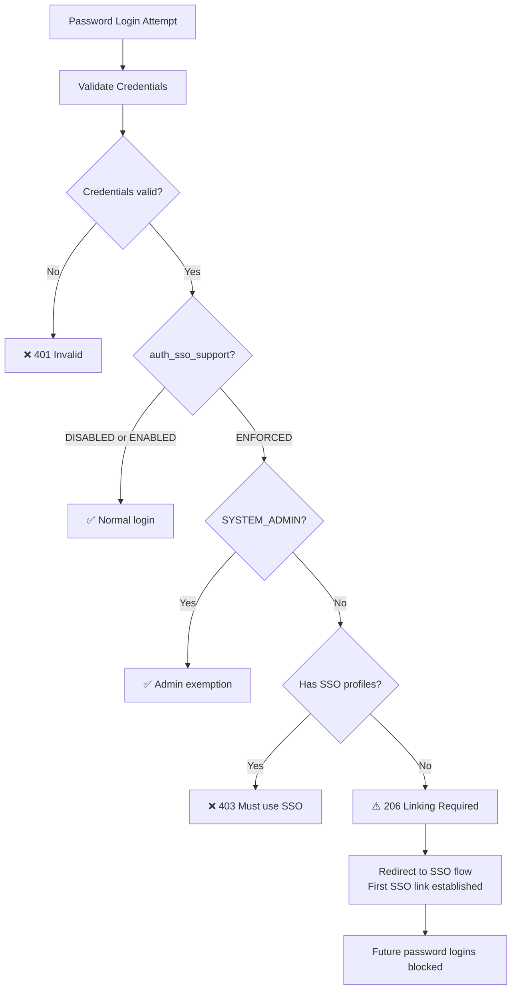

### The Admin Safety Valve

Notice the **SYSTEM_ADMIN exemption**: if the IdP goes down (outage, misconfiguration), and all users are locked to SSO-only, even the admin cannot log in to fix the problem!

The exemption ensures that a SYSTEM_ADMIN can always log in with a local password, even in ENFORCED mode. This is a critical safety valve.

---

## Part 9: Logout (SLO) -- Harder Than Login

### Why Logout Is Complex

When you log out of an SSO system, you need to:
1. Destroy the local session in your app
2. Notify the IdP to destroy the IdP session (so clicking "Login" again requires re-entering credentials)
3. Clean up any reverse session indexes

Step 1 is easy. Step 2 is tricky. Step 3 is often forgotten.

### SP-Initiated Single Logout (SLO)

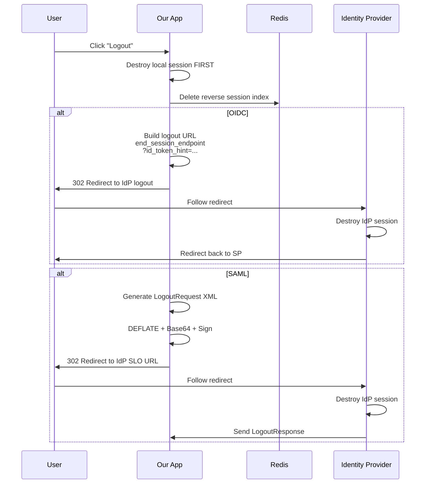

**Critical rule**: Always destroy the local session FIRST. If you notify the IdP first and something fails, the user might still have an active local session.

### The Reverse Session Index

When a user logs in via SSO, we store a mapping: `idpSessionId → localSessionId`

This mapping is needed for **IdP-Initiated Logout** (when the IdP tells our app "this user logged out from your app"). Without this index, we would have no way to look up which local session to destroy.

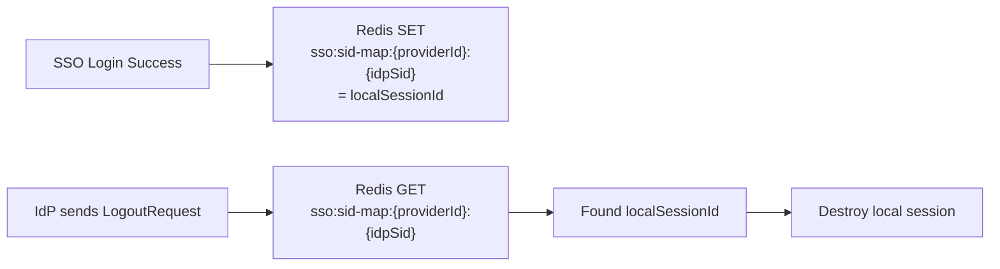

---

## Part 10: Session States -- From No Session to Full Access

### The Session State Machine

A user session goes through well-defined states. Understanding these is critical for implementing logout and access control correctly.

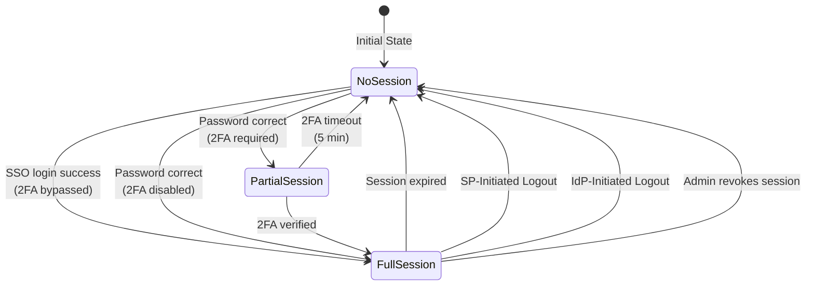

**Key insight**: SSO sessions are different from password sessions. An SSO session stores additional metadata: `idpProviderId`, `idpSessionId` (the IdP's session ID), and `originalIdToken`. This metadata is needed for logout to work correctly.

---

## Part 11: Security Defense Summary -- What Stops What

Here is a table of every attack vector and how our system defends against it:

| Attack | Defense |
|---|---|
| **Database breach** | Envelope Encryption (AES-256-GCM + HKDF-SHA256) |
| **Authorization Code theft** | PKCE (code_challenge) |
| **CSRF attack** | state / RelayState (single-use, Redis) |
| **Token replay** | nonce validation against Redis state |
| **Token forgery** | JWT signature + JWKS verification |
| **XML Signature Wrapping (XSW)** | node-saml C14N + signature binding |
| **Account Takeover (ATO)** | Pre-provisioning only (no JIT); identifier validation |
| **Session hijacking** | Reverse session index + fail-safe logout |

---

## Part 12: The Complete SSO Lifecycle -- End to End

Here is the big picture of everything we covered:

```mermaid
flowchart TB
    subgraph "Phase 1: Admin Configuration"
        A1["Admin creates IdP provider"] --> A2["Enter Issuer URL"]
        A2 --> A3["Auto-Discovery fetches endpoints"]
        A3 --> A4["Configure attribute mappings"]
        A4 --> A5["Encrypt config (Envelope Encryption)"]
        A5 --> A6["Save to DB"]
    end
    
    subgraph "Phase 2: User Login"
        B1["User clicks 'Login with SSO'"] --> B2["Generate PKCE + state + nonce"]
        B2 --> B3["Redirect to IdP"]
        B3 --> B4["User authenticates at IdP"]
        B4 --> B5["IdP redirects back with code/assertion"]
        B5 --> B6["Validate response (Signature, claims, nonce)"]
        B6 --> B7["Attribute Mapper normalizes claims"]
        B7 --> B8["User Matcher finds local user"]
        B8 --> B9["Upsert SSO Profile link"]
        B9 --> B10["Issue session tokens"]
    end
    
    subgraph "Phase 3: Session Active"
        B10 --> C1["User accesses protected resources"]
        C1 --> C2["Session valid until expiry"]
    end
    
    subgraph "Phase 4: Logout"
        C2 --> D1["User clicks Logout"]
        D1 --> D2["Destroy local session FIRST"]
        D2 --> D3["Clean reverse session index"]
        D3 --> D4["Generate IdP logout URL"]
        D4 --> D5["Redirect to IdP"]
        D5 --> D6["IdP destroys global session"]
        D6 --> D7["Redirect back to login page"]
    end
    
    A6 --> B1
```

---

## Summary: Key Takeaways for Every Developer

| Concept | What You Need to Know |
|---|---|
| **Strategy Pattern** | One interface, multiple protocol implementations. Adding a new protocol = new class, no existing code changes. |
| **Envelope Encryption** | Three-layer encryption. KEK never persists, DEK per-provider, AAD binds DEK to row. |
| **PKCE** | Cryptographic challenge that prevents authorization code theft. Always use it. |
| **Auto-Discovery** | IdP tells you its endpoints via standard metadata. No manual URL entry. |
| **Attribute Mapping** | Translates IdP "dialects" into normalized claims. Configurable per-provider. |
| **User Matching** | Links SSO identity to local account. Never auto-create accounts (no JIT). |
| **ENFORCED Mode** | SSO-mandatory mode with admin safety valve. |
| **Fail-Safe Logout** | Always destroy local session first, then notify IdP. |
| **Reverse Session Index** | Redis mapping of IdP session ID → local session ID. Enables proper logout. |
| **Session State Machine** | Sessions have well-defined states. SSO sessions carry IdP metadata. |

---

## Conclusion: SSO Is Complex, But Not Magic

After reading this post, you might think SSO is impossibly complex. It is not magic -- it is just **lots of small, well-understood pieces that fit together**.

The key insight is that **every piece has a specific job**:
- Strategy Pattern handles multiple protocols cleanly
- Envelope Encryption keeps secrets safe
- PKCE stops code interception
- Auto-Discovery eliminates manual config
- Attribute Mapping translates IdP dialects
- User Matching links SSO to local accounts safely
- Logout tears down sessions correctly

If you ever feel lost while working on SSO code, come back to the lifecycle diagram above. It shows where your code fits in the bigger picture.

Now go build something secure!

<br><br><br>

---

---

## 導言：呢篇文係關於啲乜？

如果你是 SSO 世界嘅新手，你可能覺得自己淹没喺一堆縮寫詞入面：OIDC、SAML、PKCE、JWKS、DEK、KEK... 真係令人頭暈眼花。呢篇文就係你嘅救生圈。

喺之前嘅 **新手入門文章** 入面，我哋已經涵蓋咗最基本嘅概念：咩係 SSO、OAuth 2.0 同 OIDC 點運作、以及點解 SAML 依然重要。如果你未讀過嗰篇，建議你先睇——呢篇係喺嗰啲基礎上建立嘅。

呢篇會深入啲。我哋會解釋每個 developer 喺構建或維護企業級 SSO 系統時都需要理解嘅 **真實世界概念**。可以話係「你 senior developer 默認你已經識但冇人真正教過你」嘅概念彙編。

我哋會用淺白語言、大量圖表、同埋貼地比喻。不需要任何 SSO 經驗——净係要一顆開放嘅心。

---

## 第一部分：點解 SSO 咁複雜？（大局觀）

### 「就咁加個 SSO」嘅問題

當一個 junior developer 第一次聽到「我哋要實作 SSO」，佢會諗：「梗係啦，加個『用 Google 登入』按鈕就搞掂。」

錯。真實嘅企業級 SSO 係成個系統。原因如下：

- **多個 protocols**：有些公司用 OIDC（現代），有些用 SAML 2.0（企業 legacy），有些用純 OAuth 2.0。你嘅系統必須要支援晒。
- **處處都要保安**：流程嘅每一步都有攻擊向量。漏咗任何一個，就會有漏洞。
- **設定大混亂**：每個 Identity Provider (IdP) 都講唔同嘅「方言」。Azure AD 俾 `upn`，Okta 俾 `preferred_username`，ADFS 俾 `http://schemas.xmlsoap.org/ws/2005/05/identity/claims/emailaddress`。你嘅系統必須要理解晒。
- **Secrets 管理**：你嘅 App 有 secrets（client secrets、私鑰），呢啲可以解锁向 IdP 冒認你 App 嘅能力。呢啲必須要加密。

### 一個真實 SSO 系統點樣運作

生產級 SSO 系統唔係一大舊代碼，而係一堆專業化 components 集合，每個净係做好一樣嘢。

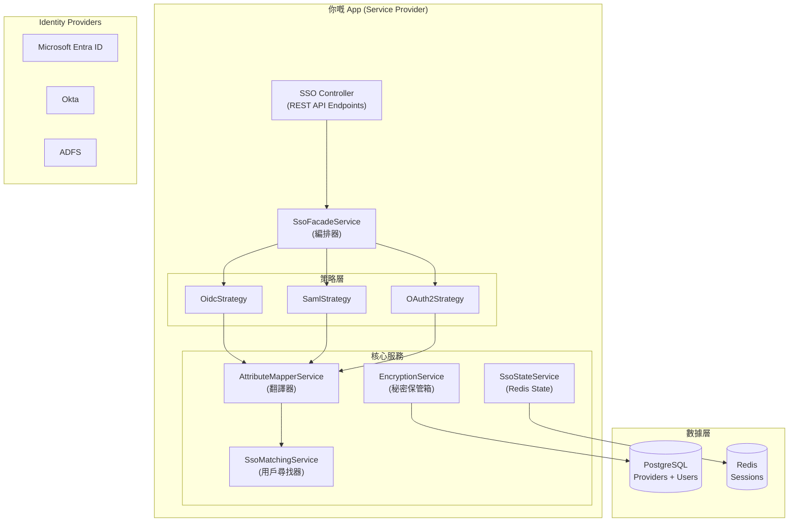

呢個圖入面每個方框都係一個獨立嘅代碼模組，有特定嘅工作。呢個分離令系統易於維護同測試。

---

## 第二部分：策略模式 -- 一個介面，三個實作

### 點解唔可以直接用 If/Else？

幻想寫嘅代碼係呢個樣：

```typescript
if (protocol === 'OIDC') {
    // 500 行 OIDC 代碼
} else if (protocol === 'SAML') {
    // 500 行 SAML 代碼
} else if (protocol === 'OAUTH2') {
    // 500 行 OAuth2 代碼
}
```

呢個係噩夢。要加第四個 protocol 點算？就要喺同一個檔案度塞更多代碼。要隔離測試 OIDC 但唔涉及 SAML 呢？做唔到。

### 策略模式解決方案

**策略模式**透過定義一個共同介面，然後寫三個獨立類別，每個用自己的方式實作呢個介面來解決呢個問題。


**Factory** 只係根據 protocol 類型揀選正確嘅策略：


而家，加新 protocol（例如 WS-Federation）等於寫一個新類別——現有代碼完全唔使掂。

---

## 第三部分：信封加密 -- 保護秘密嘅安全

### 威脅模型

你嘅數據庫儲存住每個 IdP 嘅敏感配置：
- **OAuth client secrets**: 你嘅 App 向 IdP 證明自己身份嘅「密碼」
- **SAML 私鑰**: 用來簽名向 IdP 發出嘅requests
- **mTLS 證書**: Token  exchange 時客戶端驗證用嘅證書

如果黑客偷走你嘅數據庫，呢啲 secrets 會令佢可以**冒認你嘅應用程式**向任何 IdP。呢個係災難性嘅漏洞。

解決方案係**信封加密**——三層加密系統，確保就算數據庫被偷都係廢紙。

### 第一層：主金鑰 (KEK)

**金鑰加密金鑰 (KEK)** 係喺應用啟動時從以下嘢衍生出嚟：
- 一個環境變數（主秘密）
- 磁碟上嘅鹽檔案
- 一個金鑰衍生函數（HKDF-SHA256）

呢個 KEK **永遠唔離開記憶體**而且**永遠唔寫入磁碟**。佢净係存在於運行中嘅程序入面。

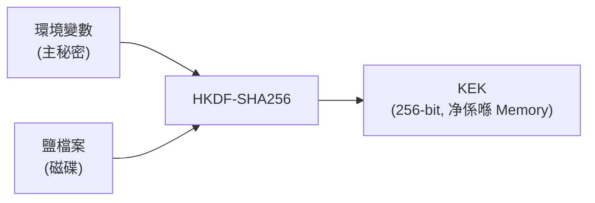

### 第二層：每個 Provider 嘅金鑰 (DEK)

每個 IdP provider 都會得到自己嘅**資料加密金鑰 (DEK)**——專門為嗰個 provider 生成嘅隨機 256-bit 金鑰。

條 DEK 本身會被 KEK 加密（Wrap），然後 save 落數據庫。

```mermaid
graph LR
    DEK["DEK<br/>(每個 Provider, 256-bit)"]
    WRAP["AES-256-GCM Wrap<br/>(KEK + providerId 做 AAD)"]
    WRAPPED["Wrapped DEK<br/>(save 落 DB)"]
    
    DEK --> WRAP
    KEK -->|"encrypt"| WRAP
    WRAP --> WRAPPED
```

用 `providerId` 做**額外認證數據 (AAD)** 係關鍵——佢將 DEK 綁死喺嗰一行記錄。就算黑客試圖將 DEK 由一行複製去另一行，解密都會失敗。

### 第三層：真正嘅秘密

真正嘅配置（client_secret、證書等）係用 DEK 加密，然後同 wrapped DEK 一齊儲存。

```mermaid
graph LR
    CONFIG["明文 Config JSON"]
    ENCRYPT["AES-256-GCM 加密<br/>(用 DEK 做 key)"]
    CIPHER["加密 Blob<br/>(save 落 DB)"]
    
    CONFIG --> ENCRYPT
    DEK -->|"encrypt"| ENCRYPT
    ENCRYPT --> CIPHER
```

### 點解要三層？

| 層 | 目的 |
|---|---|
| **KEK** | 主金鑰；如果洩露，只係要重新 Wrap DEKs（唔使重新加密所有數據） |
| **DEK** | 每個 Provider 隔離；爆咗一個 DEK 唔會連累其他 |
| **AAD** | 將 DEK 綁定到特定行；防止 DEK 被搬去其他行 |

**底線**：就算黑客偷走你成個數據庫，佢攞到嘅都只係一堆加密 Blob。冇咗記憶體入面嘅 KEK，喺數學上係破解唔到嘅。

---

## 第四部分：PKCE -- 擊敗代碼攔截

### 攻擊方式

喺 OIDC Authorization Code flow 入面，用戶會被 Redirect 去 IdP，登入，然後被 Redirect 返轉頭，URL 入面帶住一個 `authorization_code`。

用戶手機上面嘅惡意 App 可能會攔截呢條 Redirect URL，偷走個 Code，然後自己攞去換 Token——獲得完整嘅用戶帳戶訪問權。

### PKCE 解決方案

**PKCE (Proof Key for Code Exchange)** 加入密碼學挑戰嚟防止呢個。

運作方式如下：

```mermaid
sequenceDiagram
    autonumber
    participant App as 我哋嘅 Backend
    participant IdP as Identity Provider
    participant Evil as 惡意 App
    
    Note over App: Step 1: Generate PKCE pair
    App->>App: verifier = random 32 bytes → base64url
    App->>App: challenge = SHA256(verifier) → base64url
    App->>App: 將 verifier save 入 Redis（綁住 state）
    
    App->>IdP: Authorization Request<br/>code_challenge=CHALLENGE<br/>code_challenge_method=S256
    IdP->>IdP: 為呢個 session 儲存 challenge
    
    Note over IdP: 用戶認證中...
    IdP->>Evil: ⚠️ Redirect 被攔截！<br/>?code=STOLEN_CODE&state=STATE
    IdP->>App: ✅ 正常 Redirect<br/>?code=AUTH_CODE&state=STATE
    
    Note over Evil: 黑客試圖交換被偷嘅 Code
    Evil->>IdP: POST /token<br/>code=STOLEN_CODE<br/>code_verifier=???
    
    Note over IdP: 我冇你個 verifier！<br/>Hash(???) ≠ stored challenge
    IdP->>Evil: ❌ 400 Bad Request<br/>Invalid grant
    
    Note over App: 正當交換
    App->>App: 由 Redis 拎返 verifier
    App->>IdP: POST /token<br/>code=AUTH_CODE<br/>code_verifier=VERIFIER
    IdP->>IdP: SHA256(VERIFIER) == stored challenge ✅
    IdP->>App: {id_token, access_token}
```

**關鍵洞察**：黑客有 Code 但**冇** Verifier。冇咗 Verifier，佢就換唔到 Token。Verifier 净係留喺伺服器，永遠唔會發送到瀏覽器。

**Bonus**：本嚟 PKCE 只係為 mobile/SPA apps 設計嘅。而家 RFC 9700 建議**所有**客戶端類型都用——包括 server-side apps。縱深防禦。

---

## 第五部分：自動發現 -- 讓 IdP 告訴你佢嘅 Endpoints

### 人手配置嘅問題

幻想人手配置 OIDC IdP：
- Token endpoint URL 係咩？
- Authorization endpoint 係咩？
- JWT 驗證用嘅公鑰喺邊？

你可以睇文檔搵... 或者你可以讓 IdP 自動告訴你。

### OIDC 自動發現

OIDC providers 暴露一個標準 endpoint：`/.well-known/openid-configuration`

```mermaid
flowchart LR
    A["Admin 輸入<br/>Issuer URL"] --> B["GET /.well-known/<br/>openid-configuration"]
    B --> C["Parse JSON Response"]
    
    C --> D["authorization_endpoint"]
    C --> E["token_endpoint"]
    C --> F["jwks_uri"]
    C --> G["userinfo_endpoint"]
    C --> H["end_session_endpoint"]
    C --> I["issuer（驗證 match）"]
    
    D & E & F & G & H --> J["Save 落 DB"]
    J --> K["Cache Metadata<br/>(TTL: 1 個鐘)"]
```

你嘅系統 fetch 呢個 JSON，parse 出所有 endpoint URLs，然後驗證 `issuer` 欄位符合 admin 輸入嘅嘢。唔使人手輸入 URL。

### SAML 自動發現

SAML 運作相似——你輸入一個 Metadata URL，系統 fetch 然後 parse XML 嚟抽出：
- `entityID`（Issuer）
- SSO URL
- 簽名證書

```mermaid
flowchart LR
    A["Admin 輸入<br/>Metadata URL"] --> B["GET Metadata XML"]
    B --> C["Parse XML<br/>(DOMParser)"]
    
    C --> D["EntityDescriptor<br/>→ entityID"]
    C --> E["SingleSignOnService<br/>→ SSO URL"]
    C --> F["KeyDescriptor<br/>(use=signing)<br/>→ X.509 證書"]
    
    D & E & F --> G["Save 落 DB"]
    G --> H["Cache 證書"]
```

**結果**：Admin 輸入一個 URL，系統獲取所需要嘅嘢。人為錯誤消滅。

---

## 第六部分：屬性映射 -- 翻譯 IdP 嘅「方言」

### 問題所在

每個 IdP 返回嘅用戶屬性（claims）格式都唔同：

| IdP | 用戶標識 | 電郵 | 姓名 |
|---|---|---|---|
| **Azure AD** | `upn`（例如 `DOMAIN\JohnDoe`） | `email` | `name` |
| **Okta** | `preferred_username` | `email` | `name` |
| **ADFS** | `http://schemas.xmlsoap.org/ws/2005/05/identity/claims/emailaddress` | (同一個) | (同一個) |

你嘅 App 要一個乾淨、標準化嘅用戶 profile：`{ email, displayName, identifier }`。 Mapping engine 就係做呢個翻譯。

### 屬性映射點運作

```mermaid
flowchart TD
    subgraph "輸入：原始 IdP Claims"
        RAW["原始 Payload<br/>{upn: 'DOMAIN\\JohnDoe',<br/>email: 'John@Corp.COM',<br/>name: '  John Doe  '}"]
    end
    
    subgraph "轉換規則"
        T1["upn → REGEX_EXTRACT:\\(.+)<br/>→ username: 'JohnDoe'"]
        T2["email → LOWERCASE<br/>→ email: 'john@corp.com'"]
        T3["name → TRIM<br/>→ display_name: 'John Doe'"]
    end
    
    subgraph "輸出：標準化 Claims"
        RESULT["SsoUserClaims<br/>{email: 'john@corp.com',<br/>display_name: 'John Doe',<br/>username: 'JohnDoe'}"]
    end
    
    RAW --> T1 & T2 & T3
    T1 & T2 & T3 --> RESULT
```

可用嘅轉換類型：
- **NONE**: 保持原樣
- **LOWERCASE**: `value.toLowerCase()`
- **UPPERCASE**: `value.toUpperCase()`
- **TRIM**: 移除前後空格
- **REGEX_EXTRACT**: 用正則表達式提取部分字串
- **TEMPLATE**: 用實際值替換 `{value}` 等佔位符

---

## 第七部分：用戶匹配 -- 搵啱帳戶

### 大問題

標準化 claims 之後，下一個問題係：**呢個 SSO 登入屬於邊個本地用戶帳戶？**

如果處理唔小心，**帳戶接管 (ATO)** 漏洞就會喺呢度出現。

### 匹配邏輯

```mermaid
flowchart TD
    START["標準化 Claims<br/>（來自 Attribute Mapper）"] --> CHECK_ID{"identifierField<br/>類型？"}
    
    CHECK_ID -->|"EXTERNAL_USER_ID"| SSO_LOOKUP["查 user_sso_profiles<br/>WHERE provider_id = X<br/>AND ext_user_id = Y"]
    CHECK_ID -->|"EMAIL 或 USERNAME"| USER_LOOKUP["查 users table<br/>WHERE email = X<br/>OR username = X"]
    
    SSO_LOOKUP --> FOUND_SSO{"搵到 Profile？"}
    FOUND_SSO -->|"係"| USER_FROM_PROFILE["拎返關聯嘅 User"]
    FOUND_SSO -->|"唔係"| REJECT["❌ 401 Unauthorized<br/>'搵唔到對應帳戶'"]
    
    USER_LOOKUP --> FOUND_USER{"搵到 User？"}
    FOUND_USER -->|"係"| VALIDATE["驗證帳戶狀態"]
    FOUND_USER -->|"唔係"| REJECT
    
    VALIDATE --> IS_ACTIVE{"isActive && !isLocked?"}
    IS_ACTIVE -->|"唔係"| REJECT_LOCKED["❌ 401<br/>'帳戶停用或鎖定'"]
    IS_ACTIVE -->|"係"| UPSERT["Upsert SSO Profile Link"]
    
    USER_FROM_PROFILE --> UPSERT
    
    UPSERT --> SESSION["發行 Session"]
```

### 三種標識類型

| 類型 | 點運作 |
|---|---|
| **EXTERNAL_USER_ID** | IdP 俾我哋一個唯一用戶 ID。我哋直接查 `user_sso_profiles` table。最安全。 |
| **EMAIL** | 我哋用電郵查 `users` table。適用於現有用户。 |
| **USERNAME** | 我哋用用戶名查 `users` table。適用於現有用户。 |

### 點解唔自動建立帳戶？（JIT）

有些系統用 **即時配置 (JIT)** ——喺第一次 SSO 登入時自動建立新本地帳戶。呢個有風險：一個成功獲得有效 SSO 登入嘅黑客可以觸發自動帳戶建立，喺你嘅系統入面獲得一個據點。

我哋嘅系統**默認拒絕未知用戶**。Admin 必須先預先配置帳戶。只有咁 SSO 先可以連結到佢。

---

## 第八部分：ENFORCED 模式 -- 當 SSO 係強制

### 企業需求

有些企業客戶強制要求：「一旦設定咗 SSO，**禁止所有本地密碼登入**。所有用戶**必須**用 SSO。」

但係問題係：新用戶需要**用密碼登入一次**才能建立第一條 SSO 連結。

### ENFORCED 模式決策流程

```mermaid
flowchart TD
    LOGIN["密碼登入嘗試"] --> VALIDATE["驗證憑證"]
    
    VALIDATE --> BAD_CREDS{"憑證有效？"}
    BAD_CREDS -->|"唔係"| REJECT["❌ 401 無效"]
    BAD_CREDS -->|"係"| CHECK_POLICY{"auth_sso_support?"}
    
    CHECK_POLICY -->|"DISABLED 或 ENABLED"| ALLOW["✅ 正常登入"]
    CHECK_POLICY -->|"ENFORCED"| CHECK_ADMIN{"SYSTEM_ADMIN？"}
    
    CHECK_ADMIN -->|"係"| ALLOW_ADMIN["✅ Admin 豁免"]
    CHECK_ADMIN -->|"唔係"| CHECK_SSO{"有 SSO profiles？"}
    
    CHECK_SSO -->|"有"| BLOCK["❌ 403 必須用 SSO"]
    CHECK_SSO -->|"冇"| LINKING["⚠️ 206 需要連結"]
    
    LINKING --> REDIRECT["Redirect 去 SSO 流程<br/>建立第一條連結"]
    REDIRECT --> FUTURE_BLOCK["之後嘅密碼登入被 Block"]
```

### Admin 安全閥

注意 **SYSTEM_ADMIN 豁免**：如果 IdP 死機（ outage、misconfiguration），而所有用戶都被鎖死喺 SSO-only，連 admin 都入唔到去修嘢！

豁免權確保 SYSTEM_ADMIN 就算喺 ENFORCED 模式都可以用本地密碼登入。呢個係關鍵嘅安全閥。

---

## 第九部分：登出 (SLO) -- 難過登入

### 點解登出咁複雜

當你喺 SSO 系統登出時，你需要：
1. 摧毀你 App 入面嘅本地 session
2. 通知 IdP 摧毀 IdP session（令再次點擊「登入」時需要重新輸入憑證）
3. 清理任何反向 session 索引

第一步係容易嘅。第二步係棘手嘅。第三步經常被遺忘。

### SP 發起嘅單一登出 (SLO)

```mermaid
sequenceDiagram
    participant U as 用戶
    participant SP as 我哋嘅 App
    participant Redis as Redis
    participant IdP as Identity Provider
    
    U->>SP: 撳「登出」
    SP->>SP: 首先摧毀本地 session
    SP->>Redis: 刪除反向 session 索引
    
    alt OIDC
        SP->>SP: 砌 logout URL<br/>end_session_endpoint<br/>?id_token_hint=...
        SP->>U: 302 Redirect 去 IdP logout
        U->>IdP: 跟住 Redirect
        IdP->>IdP: 摧毀 IdP session
        IdP->>U: Redirect 返 SP
    end
    
    alt SAML
        SP->>SP: Generate LogoutRequest XML
        SP->>SP: DEFLATE + Base64 + 簽名
        SP->>U: 302 Redirect 去 IdP SLO URL
        U->>IdP: 跟住 Redirect
        IdP->>IdP: 摧毀 IdP session
        IdP->>SP: 發送 LogoutResponse
    end
```

**關鍵規則**：永遠首先摧毀本地 session。如果你首先通知 IdP 但有任何嘢失敗，用戶可能依然有活躍嘅本地 session。

### 反向 Session 索引

當用戶透過 SSO 登入，我哋儲存一個映射：`idpSessionId → localSessionId`

呢個映射係為**IdP 發起嘅登出**所需要嘅（當 IdP 告訴我哋 App「呢個用戶已經喺你嘅 App 登出」）。冇呢個索引，我哋就冇辦法搵到要摧毀邊個本地 session。

```mermaid
graph LR
    LOGIN["SSO 登入成功"] --> STORE["Redis SET<br/>sso:sid-map:{providerId}:{idpSid}<br/>= localSessionId"]
    
    IDP_LOGOUT["IdP 發送 LogoutRequest"] --> LOOKUP["Redis GET<br/>sso:sid-map:{providerId}:{idpSid}"]
    LOOKUP --> FOUND["搵到 localSessionId"]
    FOUND --> DESTROY["摧毀本地 session"]
```

---

## 第十部分：Session 狀態 -- 由無 Session 到完全訪問

### Session 狀態機

用戶 session 會經歷定義清晰嘅狀態。理解呢啲狀態對於正確實作登出同訪問控制至關重要。

```mermaid
stateDiagram-v2
    [*] --> NoSession: 初始狀態
    
    NoSession --> PartialSession: 密碼正確<br/>(需要 2FA)
    NoSession --> FullSession: SSO 登入成功<br/>(2FA 豁免)
    NoSession --> FullSession: 密碼正確<br/>(冇開 2FA)
    
    PartialSession --> FullSession: 2FA 驗證通過
    PartialSession --> NoSession: 2FA 超時<br/>(5 分鐘)
    
    FullSession --> NoSession: Session 過期
    FullSession --> NoSession: SP 發起登出
    FullSession --> NoSession: IdP 發起登出
    FullSession --> NoSession: Admin 撤銷 session
```

**關鍵洞察**：SSO sessions 同密碼 sessions 係唔同嘅。SSO session 儲存額外 metadata：`idpProviderId`、`idpSessionId`（IdP 嘅 session ID）、同 `originalIdToken`。呢個 metadata 係為咗令登出正常運作所必須嘅。

---

## 第十一部分：保安防禦摘要 -- 乜嘢阻止啲咩

呢度係每個攻擊向量以及我哋系統點樣防禦嘅表：

| 攻擊 | 防禦 |
|---|---|
| **數據庫被爆** | 信封加密 (AES-256-GCM + HKDF-SHA256) |
| **Authorization Code 被盜** | PKCE (code_challenge) |
| **CSRF 攻擊** | state / RelayState（即用即棄，Redis） |
| **Token 重放** | nonce 驗證 + Redis state |
| **Token 偽造** | JWT 簽名 + JWKS 驗證 |
| **XML 簽名包裝 (XSW)** | node-saml C14N + 簽名綁定 |
| **帳戶接管 (ATO)** | 必須預先配置（嚴禁 JIT）；標識符驗證 |
| **Session 劫持** | 反向 session 索引 + 安全優先登出 |

---

## 第十二部分：完整 SSO 生命週期 -- 端到端

呢度係涵蓋嘅所有嘢嘅大局圖：

```mermaid
flowchart TB
    subgraph "第一階段：Admin 配置"
        A1["Admin 創建 IdP provider"] --> A2["輸入 Issuer URL"]
        A2 --> A3["自動發現 Endpoint"]
        A3 --> A4["配置屬性映射"]
        A4 --> A5["加密配置（信封加密）"]
        A5 --> A6["Save 落 DB"]
    end
    
    subgraph "第二階段：用戶登入"
        B1["用戶撳『用 SSO 登入』"] --> B2["Generate PKCE + state + nonce"]
        B2 --> B3["Redirect 去 IdP"]
        B3 --> B4["用戶喺 IdP 認證"]
        B4 --> B5["IdP Redirect 返<br/>帶 code/assertion"]
        B5 --> B6["驗證 response（簽名、claims、nonce）"]
        B6 --> B7["Attribute Mapper 標準化 claims"]
        B7 --> B8["User Matcher 搵返本地用戶"]
        B8 --> B9["Upsert SSO Profile link"]
        B9 --> B10["發行 session tokens"]
    end
    
    subgraph "第三階段：Session 運作中"
        B10 --> C1["用戶訪問受保護資源"]
        C1 --> C2["Session 有效直到過期"]
    end
    
    subgraph "第四階段：登出"
        C2 --> D1["用戶撳『登出』"]
        D1 --> D2["首先摧毀本地 session"]
        D2 --> D3["清理反向 session 索引"]
        D3 --> D4["Generate IdP logout URL"]
        D4 --> D5["Redirect 去 IdP"]
        D5 --> D6["IdP 摧毀 global session"]
        D6 --> D7["Redirect 返登入頁"]
    end
    
    A6 --> B1
```

---

## 概要：每個 Developer 都要知嘅關鍵要點

| 概念 | 你需要知嘅嘢 |
|---|---|
| **策略模式** | 一個介面，多個 protocol 實作。加新 protocol = 新類別，現有代碼唔使掂。 |
| **信封加密** | 三層加密。KEK 永遠唔 persist，每個 provider 有自己嘅 DEK，AAD 將 DEK 綁死喺行。 |
| **PKCE** | 密碼學挑戰，防止 authorization code 被盜。永遠要用。 |
| **自動發現** | IdP 透過標準 metadata 告訴你佢嘅 endpoints。唔需要人手輸入 URL。 |
| **屬性映射** | 翻譯 IdP 嘅「方言」變成標準化 claims。每個 provider 可配置。 |
| **用戶匹配** | 將 SSO 身份連結到本地帳戶。永遠唔自動建立帳戶（嚴禁 JIT）。 |
| **ENFORCED 模式** | SSO 強制模式，配有 admin 安全閥。 |
| **安全優先登出** | 永遠首先摧毀本地 session，然後先通知 IdP。 |
| **反向 Session 索引** | IdP session ID → local session ID 嘅 Redis 映射。令正確登出成為可能。 |
| **Session 狀態機** | Sessions 有定義清晰嘅狀態。SSO sessions 攜帶 IdP metadata。 |

---

## 結論：SSO 複雜，但唔係魔術

睇完呢篇文，你可能觉得 SSO 複雜到不可能嘅地步。佢唔係魔術——只係**好多細小、容易理解嘅部件巧妙地拼埋一齊**。

關鍵洞察係**每個部件都有特定嘅工作**：
- 策略模式令多個 protocols 處理起來乾淨利落
- 信封加密保護秘密
- PKCE 阻止 code 攔截
- 自動發現消除人手配置
- 屬性映射翻譯 IdP 方言
- 用戶匹配安全地將 SSO 連結到本地帳戶
- 登出正確地拆解 sessions

如果喺做 SSO 代碼時感到迷失，就回來睇上面嘅生命週期圖。佢展示你嘅代碼喺大局入面嘅位置。

而家去整啲安全嘅嘢啦！

<br><br><br>
